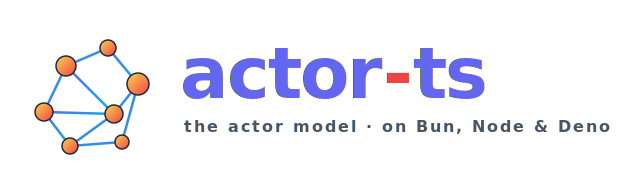

<p align="center">
  
</p>

<p align="center">
  <a href="https://github.com/pathosDev/actor-ts/actions/workflows/build.yml"></a>
  <a href="https://github.com/pathosDev/actor-ts/actions/workflows/test.yml"></a>
  <a href="#"></a>
  <a href="#"></a>
</p>

<p align="center">
  <a href="#"></a>
  <a href="#"></a>
  <a href="#"></a>
  <a href="#"></a>
</p>

<p align="center">
  <a href="#"></a>
  <a href="#"></a>
</p>

---

> ⚠️ **Disclaimer — please read before using.**
> This is a **complex, AI-assisted hobby project** — a from-scratch port of
> the actor-model stack (actors, supervision, cluster, sharding, persistence,
> HTTP) to TypeScript, running on Bun, Node.js, and Deno.  Large parts were
> written with AI pair-programming and **have not been battle-tested in
> production**.  Test coverage is good (~1739 tests, ~85 % line) but the
> surface area is enormous.  **Do not deploy this to anything that matters
> yet.**  Use it to learn, to prototype, to benchmark ideas — not to handle
> real money, users, or data.

---

## What is this?

`actor-ts` is a **batteries-included actor-model runtime** for TypeScript —
messages, mailboxes, supervisors, location-transparent refs, the whole
Erlang/Akka mental model — running natively on **Bun**, **Node.js 22+**, and
**Deno 2+**.

A short tour of what's in the box:

- **Actors** — single-threaded per-mailbox processing, lifecycle hooks, stash,
  timers, become/unbecome, supervision (restart / resume / stop / escalate).
- **Cluster** — gossip membership, φ-accrual failure detection, split-brain
  resolvers, weakly-up, multiple transports (TCP, MessageChannel, in-memory).
- **Cluster sharding + singleton + pub-sub + reliable delivery + receptionist**
  — production patterns from the Akka playbook.
- **Distributed Data** — eight CRDTs (counters, registers, sets, maps) with
  durable-storage backend, quorum reads/writes, automatic gossip.
- **Persistence** — `PersistentActor`, `DurableState`, snapshots, projections,
  persistence-query, replicated event sourcing.  Journals for in-memory,
  SQLite (via Bun-SQLite + better-sqlite3), Cassandra / ScyllaDB.
- **Object storage** — S3 / MinIO / R2 / filesystem with optional gzip/zstd
  compression and client-side AES-256-GCM encryption (per-tenant subkeys via
  HKDF).
- **HTTP** — directive-style routing DSL with Fastify default, Express + Hono
  backends, response caching, rate-limiting, idempotency-key dedup.
- **Message brokers** — single `BrokerActor` base with Kafka, MQTT, AMQP,
  NATS, Redis-Streams, gRPC, WebSocket, SSE, raw TCP/UDP integrations.
  Reconnect-with-backoff, outbound buffer, subscriber fan-out are baked in.
- **Caching** — pluggable Cache with in-memory, Redis, Memcached backends.
- **Observability** — Prometheus exporter, OTel tracing + metrics, management
  HTTP endpoints (`/health`, `/ready`, `/cluster/members`, `/sharding/regions`),
  out-of-the-box stock metrics.
- **TestKit** — `TestProbe`, `ManualScheduler`, `MultiNodeSpec` for
  deterministic tests including cluster scenarios.

Everything works under any of the three runtimes — runtime-specific backends
(TCP sockets, worker threads, SQLite, HTTP serve) live behind small
abstractions in [`src/runtime/`](./src/runtime/) and auto-detect at startup.

---

## Quick start

```bash
bun add actor-ts                                  # Bun
npm install actor-ts                              # Node 22+
# Deno 2+: no install — import via `npm:actor-ts`
```

```ts
import { Actor, ActorSystem, Props } from 'actor-ts';

class Greeter extends Actor<string> {
  override onReceive(name: string): void {
    console.log(`hello, ${name}!`);
  }
}

const system = ActorSystem.create('hello');
const ref    = system.actorOf(Props.create(() => new Greeter()), 'greeter');

ref.tell('world');

await new Promise(r => setTimeout(r, 20));
await system.terminate();
```

The same file runs unchanged under `bun run`, `node` and `deno run`.

---

## Documentation

> 📚 **[pathosDev.github.io/actor-ts](https://pathosDev.github.io/actor-ts/)** —
> full documentation site with concept guides, runnable examples, and an
> auto-generated API reference.

The docs site is the canonical entry point.  Highlights:

- **[Quickstart](https://pathosDev.github.io/actor-ts/intro/quickstart/)** —
  hello-actor in five minutes.
- **[Why actors?](https://pathosDev.github.io/actor-ts/intro/why-actors/)** —
  what the actor model gives you that Promise/Worker code doesn't.
- **[Migrating from Akka / Pekko / Orleans](https://pathosDev.github.io/actor-ts/migration/overview/)** —
  for people coming from another actor framework.
- **[API reference](https://pathosDev.github.io/actor-ts/api/)** —
  every public class, function, type generated from JSDoc.

---

## Examples

Two end-to-end sample apps that exercise the framework comprehensively, each
with six interchangeable frontends (Plain HTML, Lit, Angular, React, Next.js,
SvelteKit) talking the same WebSocket protocol to a clustered backend:

- **[`examples/chat/`](./examples/chat/)** — multi-room chat with sharding,
  persistence, DMs, typing indicators, read receipts, production-realistic
  auth.  Demonstrates `ClusterSharding`, `DistributedPubSub`, `PersistentActor`,
  `DistributedData` (ORSet, LWWMap), `ClusterSingleton`, failover.
- **[`examples/voice/`](./examples/voice/)** — voice rooms with PCM-encoded
  audio streaming over WebSocket.  Same cluster infrastructure, different
  protocol shape.

Run either with `bun examples/chat/backend/main.ts --port 2551` (then
`--seeds localhost:2551` on additional terminals), open
`http://localhost:8080`, pick a frontend, and poke.

---

## Roadmap & status

See [`ROADMAP.md`](./ROADMAP.md) for what's done and what's planned.  The
[`CHANGELOG.md`](./CHANGELOG.md) tracks per-version changes — pre-1.0 minor
bumps are potentially breaking; check the changelog before upgrading.

Issues and feature requests live on
[GitHub](https://github.com/pathosDev/actor-ts/issues).

---

## License

[MIT](./LICENSE).
