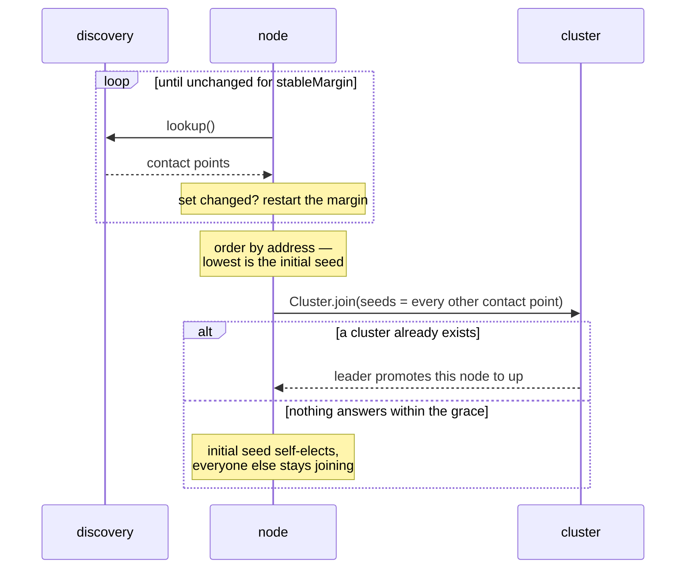

import { Aside } from '@astrojs/starlight/components';

A cold start asks every node the same question at the same moment —
*"is there a cluster yet?"* — and discovery answers it differently on
each of them.  DNS has not fully propagated; a pod is `Ready` before
its IP is in the headless service; the Kubernetes API returns a partial
pod list.  Act on the first answer and each node forms a cluster out of
the subset it happened to see.

Gossip never repairs that.  The results are separate clusters with the
same name, each with its own leader, its own singletons and its own
shard allocations.

**Cluster bootstrap** is the phase that runs *before* `Cluster.join` and
makes sure at most one cluster comes out of a simultaneous start.

## The two rules



**1 — Stable observation.**  Poll the seed provider on
`pollIntervalMs` and require the returned set (plus this node) to be
*byte-identical* for `stableMarginMs` before acting on it.  Any change
restarts the margin.  A failed lookup is *not* an empty set — it does
not count as an observation at all, so a DNS outage can never be
mistaken for "I am alone".

**2 — Deferred self-election.**  Order the settled set by address.  The
lowest is the **initial seed** — but it does not form a cluster on the
spot.  Every node, winner included, joins with the *other* contact
points as its seeds; only the winner also gets a deadline
(`selfElectionGraceMs`) after which it will form a cluster if nobody
has promoted it.

<Aside type="tip" title="Why the winner still dials its seeds">
  Addresses are handed out by the platform, so a node that starts
  *later* can perfectly well sort *first* — a scaled-up pod, or a
  restarted one with a recycled IP.  Letting the election winner
  self-elect immediately would have it form a second cluster beside the
  running one.  Because self-election is only a deadline, the running
  cluster's leader promotes it within a gossip round or two and the
  deadline never fires.
</Aside>

## Turning it on

The one-line path — `bootstrapCluster` runs the phase for you:

```ts
import { bootstrapCluster, ClusterBootstrapOptions } from 'actor-ts';

const bootstrapOptions = ClusterBootstrapOptions.create('my-app')
  .withHost(process.env.POD_IP!)
  .withPort(2552)
  .withDiscovery('kubernetes')
  .withStableObservation(true);
const { cluster, shutdown } = await bootstrapCluster(bootstrapOptions);
```

Pass an object instead of `true` to override the timings:

```ts
const bootstrapOptions = ClusterBootstrapOptions.create('my-app')
  .withHost(process.env.POD_IP!)
  .withDiscovery('kubernetes')
  .withStableObservation({ requiredContactPoints: 3, stableMarginMs: 8_000 });
```

## Driving it yourself

If you call `Cluster.join` directly, run the observation and feed both
of its outputs into the options — the seed list **and** the
`selfElection` policy:

```ts
import {
  Cluster,
  ClusterOptions,
  NodeAddress,
  StableObservation,
  StableObservationOptions,
} from 'actor-ts';

const selfAddress = new NodeAddress('my-app', process.env.POD_IP!, 2552);

const observationOptions = StableObservationOptions.create()
  .withSeedProvider(seedProvider)
  .withSelfAddress(selfAddress)
  .withRequiredContactPoints(3);
const observation = new StableObservation(observationOptions);
const targets = await observation.resolveJoinTargets();

const clusterOptions = ClusterOptions.create()
  .withHost(selfAddress.host)
  .withPort(selfAddress.port)
  .withSeeds(targets.seeds.map((address) => address.toString()))
  .withSelfElection(targets.selfElection);
const cluster = await Cluster.join(system, clusterOptions);
```

`resolveJoinTargets()` returns the settled set, whether this node won
(`isInitialSeed`), and the `selfElection` value to pass on.  Deriving
that value yourself is the one mistake that reintroduces the split
brain, so the observation does it for you.

## Settings

| Setting | Default | What |
| --- | --- | --- |
| `stableMarginMs` | 5000 | How long the contact-point set must stay unchanged. |
| `pollIntervalMs` | 1000 | How often the seed provider is polled. |
| `maxWaitMs` | 60000 | Total budget; exceeding it throws. |
| `requiredContactPoints` | 1 | Fewest contact points a settled observation may contain. |
| `selfElectionGraceMs` | 10000 | How long the elected node waits before forming a cluster. |

Same keys under `actor-ts.cluster.bootstrap.*`, with the usual
precedence — **explicit options > HOCON > built-in defaults**:

```hocon
actor-ts.cluster.bootstrap {
  stable-margin           = 5s
  poll-interval           = 1s
  max-wait                = 60s
  required-contact-points = 3
  self-election-grace     = 10s
}
```

`requiredContactPoints` is the one worth changing.  The margin catches
discovery that is *slow*; only a required count catches discovery that
is **stably wrong** — a resolver that consistently returns two of your
three pods will settle happily on the wrong set.  The default of `1`
exists so single-node development needs no configuration; in production
set it to the replica count you expect.

## What it refuses to do

<Aside type="caution" title="It throws rather than joining anyway">
  If the set never settles within `maxWaitMs`, `resolveJoinTargets()`
  rejects with a `StableObservationError` naming the last observation
  and this node's advertised address.  There is no degraded fallback to
  a direct join: that would be indistinguishable from the failure the
  phase exists to prevent — a node that could not agree with anyone
  about who is out there, joining anyway.  A start that fails loudly is
  recoverable by a restart or an operator; a second cluster is not.
</Aside>

<Aside type="caution" title="It refuses a wildcard advertised host">
  The election is ordered on this node's address, so that address has
  to be the one peers dial.  `0.0.0.0` (and `::`, and an empty string)
  is a *bind* address: every node that fell back to it sorts
  identically, every node believes it won, and every node forms its own
  cluster.  The phase rejects it up front.  Set `withHost(...)`
  explicitly, or the `CLUSTER_HOST` / `POD_IP` environment variable.
</Aside>

## Bootstrap or a plain seed join?

| Situation | Use |
| --- | --- |
| Fixed, known addresses; one designated first node | Plain [seed join](/cluster/joining-and-seeds/). |
| Local development, single node | Plain seed join — the empty seed list already means "I am first". |
| Nodes start simultaneously with dynamic addresses (K8s Deployment, autoscaling group) | **Bootstrap.** |
| Every node is given the same seed list | **Bootstrap** — see below. |

That last row is easy to miss.  `Cluster` filters this node out of its
own seed list, so if every node lists every node then **no** node is
left with the empty list that ordinary self-election needs.  Nobody
becomes `up`, nobody becomes leader, and nobody is ever promoted — the
cluster deadlocks in `joining`.  The election is what breaks the
symmetry.

## Costs

- **Startup latency.**  At least `stableMarginMs`, plus
  `selfElectionGraceMs` on a genuine cold start (paid once, by one
  node).  Joining an *existing* cluster is unaffected — the grace never
  fires.
- **Discovery load.**  One `lookup()` per `pollIntervalMs` per node
  until the set settles.  The poll cadence is deliberately constant
  rather than backing off: a growing interval would sample the stable
  margin at drifting points, and the load it saves — at most a few
  dozen lookups per node — is not worth weakening the guarantee.

## Where to next

- **[Joining and seeds](/cluster/joining-and-seeds/)** — the join
  handshake this phase feeds.
- **[Discovery overview](/discovery/overview/)** — the seed providers
  the observation polls.
- **[Downing strategies](/cluster/downing-strategies/)** — split-brain
  resolution *after* the cluster has formed.
- **[Weakly-up](/cluster/weakly-up/)** — partial progress while
  convergence is pending.
