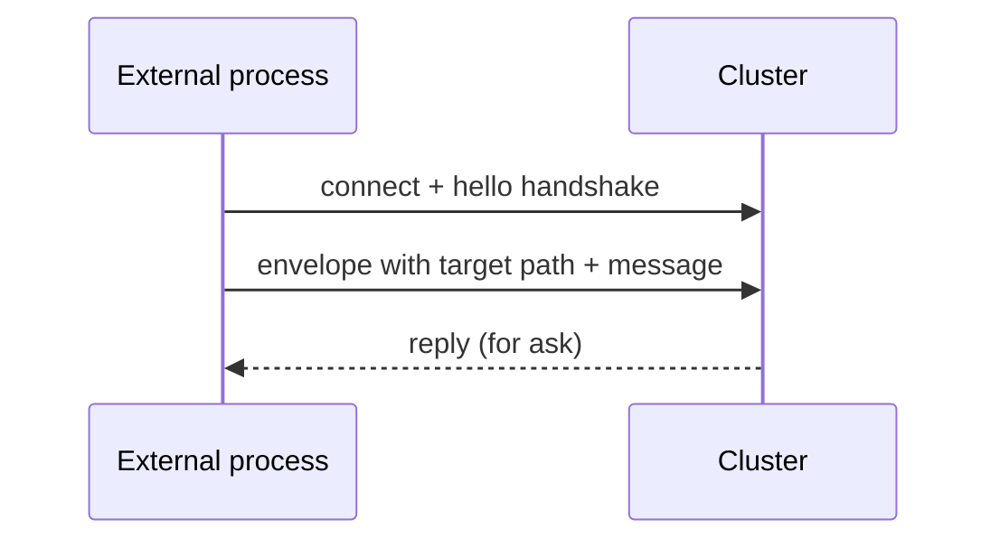

`ClusterClient` lets a **process outside the cluster** talk to
actors inside.  The external process isn't a cluster member —
no gossip, no membership state — but it can `tell` and `ask`
cluster-internal actors via known **receptionist contacts**.

```ts
import { ClusterClient, ClusterClientOptions } from 'actor-ts/cluster';

const clusterClientOptions = ClusterClientOptions.create().withContactPoints(['actor-ts://my-app@10.0.0.5:2552/system/cluster/receptionist']);
const client = new ClusterClient(
  clusterClientOptions,
);

// Send to a well-known cluster actor:
client.send('/user/api/orders', { kind: 'place', ... });

// Or ask and await the reply:
const orders = await client.ask('/user/api/orders', { kind: 'list-orders' });
```

## When to use it

Three legitimate use cases:

1. **External services** that don't belong in the actor cluster
   but need to talk to it — a Python ML service that posts to
   a Kafka actor inside the cluster.
2. **Mobile / desktop clients via a bridge** — a server-side
   bridge holds a ClusterClient + exposes a REST/WS API
   externally.
3. **Cross-cluster federation** — two clusters where one needs
   to talk to specific actors in the other without merging.

For typical setups, **everything is part of the cluster** —
ClusterClient is the escape hatch for cases where it can't be.

## How it works



The client:

1. Connects to one or more **contact points** (cluster nodes
   running a `ClusterClientReceptionist`).
2. Sends each message in an envelope addressed to a target
   actor **path** — `send` for fire-and-forget, `ask` for
   request/reply.
3. The receptionist on the contact node resolves that path in
   its local actor tree and delivers the message.
4. Handles failover when a contact point becomes unreachable —
   reconnects to another.

## Configuration

```ts
type ClusterClientOptionsType = {
  contactPoints: ReadonlyArray<string>;            // at least one node: host:port or <system>@host:port
  systemName?: string;                             // synthetic system name in the client's hello
  clientIdentity?: { host: string; port: number }; // identity announced in the client's hello
  askTimeoutMs?: number;                           // default ask timeout (ms; default 5000)
  connectTimeoutMs?: number;                       // per-contact-point wait for hello-ack (ms; default 5000)
  tls?: TlsTransportOptionsType;                   // must match the cluster's
  logger?: Logger;                                 // default: ConsoleLogger at WARN
};
```

`contactPoints` is the list of cluster nodes to dial — each a
`host:port` or `<system>@host:port` string.  The client tries
them in order; on failure, it falls back to the next.
`connectTimeoutMs` bounds how long **one** of them gets to answer
the `hello` handshake before the client moves on.

For **stable contact addresses**, the cluster side typically
runs a `ClusterClientReceptionist` on a fixed set of nodes,
whose addresses become the client's contact points.

### From a config file

Everything above except `clientIdentity`, `tls` and `logger` can
come from HOCON instead:

```hocon
actor-ts.cluster.client {
  contact-points  = ["orders@10.0.0.1:2552", "orders@10.0.0.2:2552"]
  system-name     = "checkout-client"
  ask-timeout     = 5s
  connect-timeout = 5s

  receptionist {
    ask-timeout = 5s
  }
}
```

With that on disk, a client built with **no options at all**
connects:

```ts
const client = new ClusterClient({});
```

This block is loaded differently from the rest of the framework's
configuration, and the client's own nature is why: it is by
definition *outside* the cluster, so it holds no `ActorSystem`
and there is no `system.config` above it to read.  The
constructor therefore loads the config itself — the same chain
`ActorSystem.create` uses, honouring `ACTOR_TS_CONFIG` and
`./application.conf`.  Precedence is the usual one: explicit
options beat the file, the file beats the built-in defaults.

Pass a `Config` as the second argument to pin what it reads, so
the client is independent of whatever `application.conf` happens
to sit in the working directory:

```ts
const client = new ClusterClient({ contactPoints: ['orders@10.0.0.1:2552'] }, Config.empty());
```

`contact-points` ships **commented out** in `reference.conf`.
The list is per-deployment identity that no default could state,
and an empty list is not the absence of one — it is refused, so a
shipped value could only be one that stops every client.

`clientIdentity` stays code-only on purpose, and that is a
security decision rather than a packaging one.  A client's
synthetic port is drawn from the CSPRNG so that no peer can
predict, address or pre-claim its slot; a fleet sharing one
configured value would have every client announce the same wire
address, which is precisely what the draw prevents.  `tls`
carries certificate material and `logger` is an object, so
neither has a HOCON spelling either.

## Server side — ClusterClientReceptionist

```ts
import { ClusterClientReceptionistId } from 'actor-ts/cluster';

// The receptionist is a per-system extension — start it on each
// node that should accept outside-in client connections:
system.extension(ClusterClientReceptionistId).start(cluster);
```

There's no service registry to populate.  The receptionist
resolves each envelope's target path against the local actor
tree and delivers the message — any actor already running under
`/user` is reachable by the path the client sends to (e.g.
`client.send('/user/api/orders', ...)`).

Its one option, `askTimeoutMs`, bounds the wait when a client
envelope carries an ask; set it via
`ClusterClientReceptionistOptions`, or from the file:

```hocon
actor-ts.cluster.client.receptionist.ask-timeout = 3s
```

That leaf nests under `cluster.client` rather than under
`actor-ts.cluster.receptionist`, which belongs to the discovery
`Receptionist` — a different actor with a different protocol.
And unlike the client half above, this one reads the config of
the system it was started in; it never loads one of its own,
because it always has one.

## Who the reply goes to

An ask is answered down the **connection the envelope arrived
on** — never to an address the envelope names.  A client says
who it is once, in the `hello` handshake; the transport binds
that claim to the socket, and every reply, redaction and
path-not-found follows the binding.

That is why the envelope has no sender field at all.  It used
to carry one, and the receptionist used to route on it, which
let any connected party choose the address this node replied
to — and opened a connection to.  Deleting the field rather
than checking it leaves nothing to get wrong the next time
someone reaches for the cheaper of two answers to the same
question.

A client old enough to still send the field is served
normally; the value is ignored.  If it names something *other*
than the connection, the node counts it on
`cluster_envelope_from_mismatch_total{frame="cluster-client-envelope"}`
and carries on.  That is either a client wrong about its own
address or someone testing whether this node routes on
payload — worth a number, not a refusal, because the envelope
itself is fine.

:::caution[This is not client authentication]
The connection's peer is whatever the socket claimed in its
`hello`.  Routing on it removes the free-for-all — a reply can
no longer be steered from the payload — but it does not make
the party on the other end who they say they are.  Only peer
certificates do: under mTLS the claimed address has to match
the certificate.  See
[Cluster security](/operations/security/cluster-security/).
:::

## What a failure tells the client

**A ClusterClient is not a peer.**  It speaks the same wire as a
cluster member, which is exactly why the distinction is worth
stating: it never joined the membership ring, carries no gossip
or heartbeat duty, and a contact point is by design reachable
from outside whatever boundary protects the cluster's own links.
Completing a `hello` does not entitle the party on the other end
to the cluster's internals.

So when an ask fails inside the cluster, the receptionist does
**not** forward the rejection text.  That text is written by
whatever actor happened to fail — the same class of string as an
HTTP 500's, carrying file paths, SQL fragments or a stack.  The
client gets a fixed sentence and a correlation id instead:

```
ask failed on the cluster node (correlationId=6f1c…-…) — the reason is in that node's log
```

The full text is logged on the node that ran the ask, under the
same id, at `warn`.  An outside caller quotes the id; an operator
greps for it.  Nothing carries the reason over the wire.

An unknown path is reported differently, because there the client
only learns about its own request:

```
path not found: user/api/orders
```

Note what is *not* in it — the node's own address.  A contact
point is often behind a load balancer or NAT, so the address it
binds on is not the one the client dialled, and there is no
reason to hand it out.

If a client genuinely needs to act on a specific failure, model
it as a **reply the actor authors** rather than as a throw:

```ts
class OrderActor extends Actor<OrderCommand> {
  override onReceive(message: OrderCommand): void {
    if (!this.stock.has(message.sku)) {
      // A deliberate, authored answer — it reaches the client verbatim.
      this.sender.forEach((s) => s.tell({ kind: 'rejected', reason: 'out-of-stock' }));
      return;
    }
    // …
  }
}
```

A successful reply is passed through untouched; only failures are
redacted.  That keeps the domain contract explicit instead of
turning whatever an exception happened to say into an API.

## Comparison with cluster-aware ActorRef

```ts
// Inside the cluster — actors talk directly:
const ref = await system.actorSelection('actor-ts://my-app@host:2552/user/api').resolveOne();
ref.tell(...);

// Outside the cluster — ClusterClient:
const clusterClientOptions = ClusterClientOptions.create().withContactPoints([...]);
const client = new ClusterClient(clusterClientOptions);
client.send('/user/api', ...);
```

Differences:

- **Inside**: requires cluster membership.  Refs propagate via
  gossip; you can hold long-lived refs.
- **ClusterClient**: no membership; refs are resolved per
  message via the receptionist.

## When NOT to use it

import { Aside } from '@astrojs/starlight/components';

<Aside type="caution" title="HTTP / gRPC is usually simpler">
  ```
  External service → ClusterClient → cluster
  ```
  Setting up ClusterClient + a serialization-compatible client
  is work.  For most external-facing APIs, **HTTP or gRPC**
  inside the cluster (with the cluster running an HTTP server)
  is simpler — external clients use standard HTTP libraries,
  not actor-ts-specific clients.
</Aside>

<Aside type="caution" title="Browser / mobile direct connections">
  ```ts
  // Browser → ClusterClient → cluster
  ```
  ClusterClient needs **TCP from the client**.  Browsers don't
  do TCP; mobile apps usually shouldn't.  Use a server-side
  bridge that fronts the cluster with HTTP/WS.
</Aside>

## Where to next

- **[Refs across nodes](/cluster/refs-across-nodes/)** —
  in-cluster ref semantics for comparison.
- **[Receptionist](/discovery/receptionist/)** — the
  in-cluster service registry (a distinct component with a
  similar name).
- **[HTTP overview](/http/overview/)** — the more
  common external-facing alternative.
