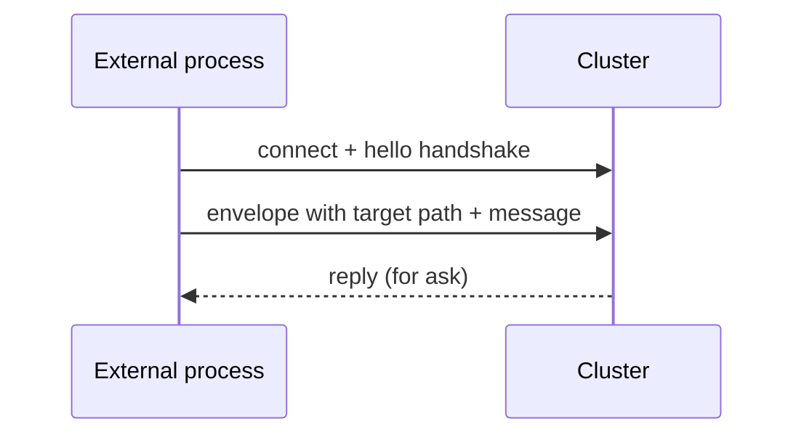

`ClusterClient` lets a **process outside the cluster** talk to
actors inside.  The external process isn't a cluster member —
no gossip, no membership state — but it can `tell` and `ask`
cluster-internal actors via known **receptionist contacts**.

```ts
import { ClusterClient, ClusterClientOptions } from 'actor-ts';

const clusterClientOptions = ClusterClientOptions.create().withContactPoints(['actor-ts://my-app@10.0.0.5:2552/system/cluster/receptionist']);
const client = new ClusterClient(
  clusterClientOptions,
);

// Send to a well-known cluster actor:
client.send('/user/api/orders', { kind: 'place', ... });

// Or ask and await the reply:
const orders = await client.ask('/user/api/orders', { kind: 'list-orders' });
```

## When to use it

Three legitimate use cases:

1. **External services** that don't belong in the actor cluster
   but need to talk to it — a Python ML service that posts to
   a Kafka actor inside the cluster.
2. **Mobile / desktop clients via a bridge** — a server-side
   bridge holds a ClusterClient + exposes a REST/WS API
   externally.
3. **Cross-cluster federation** — two clusters where one needs
   to talk to specific actors in the other without merging.

For typical setups, **everything is part of the cluster** —
ClusterClient is the escape hatch for cases where it can't be.

## How it works



The client:

1. Connects to one or more **contact points** (cluster nodes
   running a `ClusterClientReceptionist`).
2. Sends each message in an envelope addressed to a target
   actor **path** — `send` for fire-and-forget, `ask` for
   request/reply.
3. The receptionist on the contact node resolves that path in
   its local actor tree and delivers the message.
4. Handles failover when a contact point becomes unreachable —
   reconnects to another.

## Configuration

```ts
type ClusterClientOptionsType = {
  contactPoints: ReadonlyArray<string>;            // at least one node: host:port or <system>@host:port
  systemName?: string;                             // synthetic system name in the client's hello
  clientIdentity?: { host: string; port: number }; // identity used for reply routing
  askTimeoutMs?: number;                           // default ask timeout (ms; default 5000)
  tls?: TlsTransportOptionsType;                   // must match the cluster's
  logger?: Logger;                                 // default: ConsoleLogger at WARN
};
```

`contactPoints` is the list of cluster nodes to dial — each a
`host:port` or `<system>@host:port` string.  The client tries
them in order; on failure, it falls back to the next.

For **stable contact addresses**, the cluster side typically
runs a `ClusterClientReceptionist` on a fixed set of nodes,
whose addresses become the client's contact points.

## Server side — ClusterClientReceptionist

```ts
import { ClusterClientReceptionistId } from 'actor-ts';

// The receptionist is a per-system extension — start it on each
// node that should accept outside-in client connections:
system.extension(ClusterClientReceptionistId).start(cluster);
```

There's no service registry to populate.  The receptionist
resolves each envelope's target path against the local actor
tree and delivers the message — any actor already running under
`/user` is reachable by the path the client sends to (e.g.
`client.send('/user/api/orders', ...)`).

Its one option, `askTimeoutMs`, bounds the wait when a client
envelope carries an ask; set it via
`ClusterClientReceptionistOptions`.

## Comparison with cluster-aware ActorRef

```ts
// Inside the cluster — actors talk directly:
const ref = await system.actorSelection('actor-ts://my-app@host:2552/user/api').resolveOne();
ref.tell(...);

// Outside the cluster — ClusterClient:
const clusterClientOptions = ClusterClientOptions.create().withContactPoints([...]);
const client = new ClusterClient(clusterClientOptions);
client.send('/user/api', ...);
```

Differences:

- **Inside**: requires cluster membership.  Refs propagate via
  gossip; you can hold long-lived refs.
- **ClusterClient**: no membership; refs are resolved per
  message via the receptionist.

## When NOT to use it

import { Aside } from '@astrojs/starlight/components';

<Aside type="caution" title="HTTP / gRPC is usually simpler">
  ```
  External service → ClusterClient → cluster
  ```
  Setting up ClusterClient + a serialization-compatible client
  is work.  For most external-facing APIs, **HTTP or gRPC**
  inside the cluster (with the cluster running an HTTP server)
  is simpler — external clients use standard HTTP libraries,
  not actor-ts-specific clients.
</Aside>

<Aside type="caution" title="Browser / mobile direct connections">
  ```ts
  // Browser → ClusterClient → cluster
  ```
  ClusterClient needs **TCP from the client**.  Browsers don't
  do TCP; mobile apps usually shouldn't.  Use a server-side
  bridge that fronts the cluster with HTTP/WS.
</Aside>

## Where to next

- **[Refs across nodes](/cluster/refs-across-nodes/)** —
  in-cluster ref semantics for comparison.
- **[Receptionist](/discovery/receptionist/)** — the
  in-cluster service registry (a distinct component with a
  similar name).
- **[HTTP overview](/http/overview/)** — the more
  common external-facing alternative.
