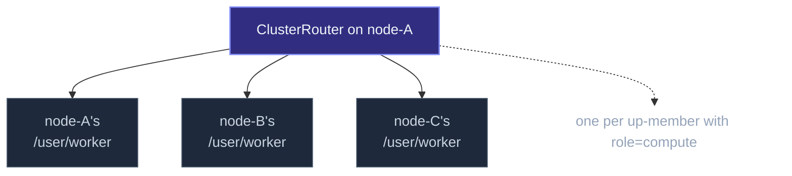
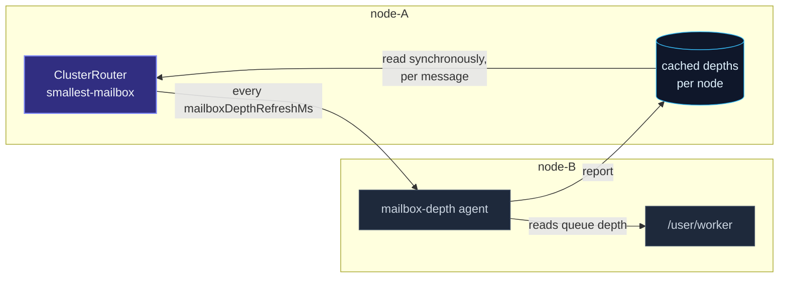

The local [`Router`](/routing/router/) creates its routees
as its own children — a fixed pool on one node.  The
**`ClusterRouter`** is different: its routees are **other nodes'
actors at a well-known path**, and the routee set changes as
cluster membership changes.



Every up-member with role `compute` (configurable) has a worker
at `/user/worker`; the router routes incoming messages across them
per a strategy.  Add a node, the router picks it up; remove a node,
the router stops sending to it — no restart needed.

See [Pool vs group](/routing/pool-vs-group/) for the
distinction between local pools and cluster groups.

## A minimal example

```ts
import { ActorSystem, Actor } from 'actor-ts';
import { Cluster, ClusterOptions, ClusterRouter, ClusterRouterOptions } from 'actor-ts/cluster';

class Worker extends Actor<{ payload: string }> {
  override onReceive(message: { payload: string }): void {
    this.log.info(`worked on ${message.payload}`);
  }
}

const system  = ActorSystem.create('my-app');
const clusterOptions = ClusterOptions.create()
  .withHost(host)
  .withPort(port)
  .withSeeds(seeds)
  .withRoles(['compute']);
const cluster = await Cluster.join(
  system,
  clusterOptions,
);

// 1. Every node spawns its own worker at /user/worker
system.spawn(Worker, 'worker');

// 2. Any node can build a cluster router targeting these workers
const clusterRouterOptions = ClusterRouterOptions.create()
  .withCluster(cluster)
  .withRouterType('round-robin')
  .withRouteePath('/user/worker')
  .withRole('compute');
const router = system.spawn(
  ClusterRouter.factory(
    clusterRouterOptions,
  ),
  'compute-router',
);

// 3. Tell the router — message gets routed to one node's worker
router.tell({ payload: 'work-1' });
```

The pattern: each node deploys the routee actors locally; one (or
more) nodes spawn a `ClusterRouter` that targets them.  The
router's strategy decides which node's worker handles each message.

## Configuration

```ts
type ClusterRouterOptions<TMessage> = {
  cluster:                    Cluster;
  routerType:                 'round-robin' | 'random' | 'consistent-hashing'
                            | 'smallest-mailbox' | 'broadcast';
  routeePath:                 string;
  role?:                      string;
  extractKey?:                (message: TMessage) => string;
  mailboxDepthRefreshMs?:     number;
  mailboxDepthStaleAfterMs?:  number;
};
```

| Field | Required | What |
| --- | --- | --- |
| `cluster` | Yes | The cluster — used for membership tracking + the wire transport. |
| `routerType` | Yes | One of the five strategies. |
| `routeePath` | Yes | The path the routee actor lives at on each node (typically `/user/<actorName>`). |
| `role` | No | If set, only members carrying this role are routees. |
| `extractKey` | When `routerType: 'consistent-hashing'` | Extracts the routing key from a message. |
| `mailboxDepthRefreshMs` | No (default `200`) | `smallest-mailbox` only — how often the cached depths are refreshed. |
| `mailboxDepthStaleAfterMs` | No (default `1000`) | `smallest-mailbox` only — how long a cached depth counts.  `0` turns the expiry off. |

## The five strategies

| Strategy | What it does |
| --- | --- |
| `'round-robin'` | One routee per message, cycling. |
| `'random'` | One routee per message, uniformly random. |
| `'consistent-hashing'` | Pin same `extractKey` to same routee via rendezvous hashing. |
| `'smallest-mailbox'` | One routee per message, the node with the shortest reported queue. |
| `'broadcast'` | Send to every routee. |

The first four are 1-of-N routing; broadcast is fan-out.  See
[Strategies](/routing/strategies/) for the picking
guidance — same trade-offs apply, just spread across cluster nodes
instead of pool members.

### Consistent-hashing

```ts
const clusterRouterOptions = ClusterRouterOptions.create()
  .withCluster(cluster)
  .withRouterType('consistent-hashing')
  .withRouteePath('/user/cache')
  .withExtractKey((message) => message.userId);
ClusterRouter.factory(
  clusterRouterOptions,
);
```

Required for `'consistent-hashing'`.  The function pulls a string
key out of each message; the router pins messages with the same
key to the same node via rendezvous hashing.

Useful when each routee maintains **per-key state**: a cache of
that user's data, a session, an in-progress workflow.  Topology
changes shuffle a fraction of keys (proportional to the
add/remove), not all of them.

If `extractKey` returns the same value forever, every message goes
to the same routee (effectively a singleton).  Make sure it varies
across your actual workload.

### Smallest mailbox

```ts
const clusterRouterOptions = ClusterRouterOptions.create()
  .withCluster(cluster)
  .withRouterType('smallest-mailbox')
  .withRouteePath('/user/worker')
  .withRole('compute');
ClusterRouter.factory(
  clusterRouterOptions,
);
```

Routes each message to the node whose routee last reported the
shortest queue — the cluster counterpart of the local
[`Router.smallestMailbox`](/routing/strategies/).  Same reason
to reach for it: when per-message cost varies widely, round-robin
keeps handing a node its next turn while it is still behind, and
this one does not.

**It never asks on the routing path.**  A router routes
synchronously, so a query-per-message would park the router's whole
mailbox behind a network round-trip and reorder everything behind
it.  Instead each node's depth is **cached** and refreshed on a
background tick:



The routee is an ordinary actor of yours and never learns it is
being measured: a small **framework agent** on each node answers
for it, reading the queue depth from inside the runtime.

What that buys, and what it costs:

- **The routing decision stays as cheap as round-robin's** — a scan
  over a local map, no `await`.
- **The picture lags by up to one refresh interval.**  A node can be
  chosen just after it filled up.  That is a worse decision than the
  local strategy's, never a wrong one: the message is delivered, and
  the next tick corrects the view.
- **A node that has not answered is skipped, not assumed idle** — the
  silent node may be the struggling one.  If *no* node has answered
  yet, the router falls back to round-robin order, so a cold cache is
  a degraded router and never a dropped message.

#### Nodes that host routees but no router

A `smallest-mailbox` router starts the agent on **its own node**,
which covers a single node and the common homogeneous deployment
(every node runs both the router and the routees).  On a node that
hosts routees but no router, start it yourself:

```ts
import { ClusterMailboxDepthAgent } from 'actor-ts/cluster';

const stopServingDepths = ClusterMailboxDepthAgent.serve(cluster);
```

Forget it and nothing breaks: that node simply never reports, so
routers skip it while every other node is answering, and fall back
to round-robin order when none is.

#### Tuning the two knobs

`mailboxDepthRefreshMs` is the lag on the router's picture and the
rate at which it costs one small envelope per routee.
`mailboxDepthStaleAfterMs` is how long a reading survives without a
replacement — set it to `0` to keep readings forever, which is only
sensible when you would rather route on an old number than on the
rotation.  A window **shorter** than the refresh that refills it is
rejected at construction: every reading would expire before its
replacement arrived, leaving the cache permanently cold.

## Routee discovery

Every gossip round, the router re-derives its routee set from the
cluster's up-members.  Triggers a rebuild on:

- `MemberUp` — a new up-member matching the role.  Add it.
- `MemberRemoved` — a removed member.  Drop it.

The set is **ordered deterministically** (by address), so
round-robin counters stay sane across rebuilds.

## When the routee set is empty

```ts
router.tell({ payload: 'a' });
// → if no up-members match `role`, message is dropped with a warning log
```

**Important:** an empty routee set means **messages drop to dead
letters**.  The framework doesn't queue while waiting for routees
— that would silently grow without bound.

For "start serving once the pool has at least N routees,"
subscribe to `MemberUp` and gate request handling on a counter.

## Role-filtering

```ts
const clusterRouterOptions = ClusterRouterOptions.create()
  .withCluster(cluster)
  .withRole('compute');
ClusterRouter.factory(
  clusterRouterOptions
    // ...
);
```

Only up-members carrying the `compute` role are candidates.
Useful for asymmetric clusters:

- Nodes with `compute` role do heavy work.
- Nodes with `gateway` role handle HTTP traffic.
- Nodes with `coordinator` role host singletons.

The role is declared at `Cluster.join` time per node.  The router's
`role` field filters; without it, **every up-member is a candidate**.

## Self-routing

If the local node is a candidate (matches the role), the router
*may* route to a worker on the same node.  The transport handles
loopback the same as any cross-node delivery — through the
transport's local-loopback path.

This means the router's load distribution is symmetric — no
preference for local routees, no penalty either.  Round-robin
puts you in the cycle like every other node.

## Stopping

```ts
router.stop();
// or: router.tell(PoisonPill.instance);
```

Stops the router actor.  **Routees are unaffected** — they're on
other nodes; they keep running.  This is the group-router model:
the router owns *the routing*, not the routees themselves.

For comparison, a local pool router cascade-stops its routees on
stop.  See [Pool vs group](/routing/pool-vs-group/).

import { Aside } from '@astrojs/starlight/components';

<Aside type="caution" title="Routee actors must exist on every targeted node">
  ```ts
  // Some nodes spawn /user/worker, others don't
  ```
  The cluster router doesn't probe for liveness beyond membership —
  if a node matches the role but doesn't have `/user/worker`, the
  `tell` arrives at a dead path on that node and dead-letters.
  Make routee deployment uniform across role-carrying nodes.
</Aside>

<Aside type="caution" title="`broadcast` + reply-to refs">
  ```ts
  router.tell({ kind: 'get', replyTo: client });
  // ↑ broadcast → every routee replies → caller gets N replies
  ```
  Same trap as the local `Router.broadcast`.  Useful for
  consensus-style reads (count replies); usually a bug otherwise.
</Aside>

<Aside type="caution" title="Consistent-hashing with skewed keys">
  ```ts
  extractKey: (message) => message.userId,
  // ↑ if 80 % of traffic is for one user, one routee handles 80 %
  ```
  Same problem as any hash-based scheme — skewed keys produce
  hot spots.  If the key distribution isn't roughly uniform,
  consider [sharding](/cluster/sharding/overview/) (one
  actor per key, all isolated) or aggregating before routing.
</Aside>

## Where to next

- **[Routing overview](/routing/overview/)** — the
  bigger routing picture.
- **[Pool vs group](/routing/pool-vs-group/)** — the
  conceptual difference from local `Router`.
- **[Strategies](/routing/strategies/)** — round-robin /
  random / smallest-mailbox / consistent-hashing in detail.
- **[Sharding overview](/cluster/sharding/overview/)** —
  for per-key actors with stronger placement guarantees.
- **[Cluster overview](/cluster/overview/)** — the
  membership the router reads.

The [`ClusterRouter`](/api/classes/clusterrouter/) API
reference covers the full options.
