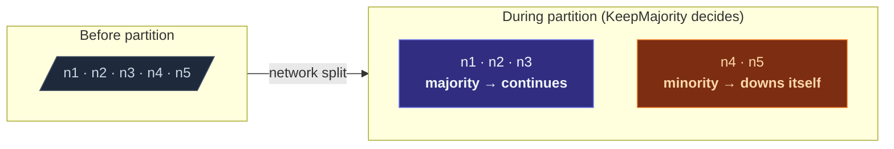

When the cluster partitions, both halves stay running — and both
think the other half has failed.  Without intervention:

- Two singletons would exist (one per side).
- Sharded entities for the same key could spawn on both sides.
- DistributedData replicas would diverge until reconciliation.

A **downing strategy** picks a winning side and forcibly downs the
losing side.  The losing nodes' actors stop; the winning side
continues as the cluster.



Without a strategy: both halves keep running.  When the partition
heals, you have two separate clusters with the same name and no
automatic merge.  **Always configure a strategy for production.**

## The five built-in strategies

| Strategy | Wins on... | Trade-off |
| --- | --- | --- |
| **`KeepMajority`** | The side with `> N/2` members. | Simple; ties (exactly N/2-N/2 split) means both sides down. |
| **`KeepOldest`** | The side containing the oldest member. | Works for even-sized clusters where majority is undefined. |
| **`KeepReferee`** | The side containing a designated *referee* node. | Predictable but creates a single point of failure (the referee). |
| **`StaticQuorum`** | The side that meets a configured quorum size. | Stricter than majority; the quorum-size config is the operator's choice. |
| **`LeaseMajority`** | Majority + must hold a coordination lease. | Paranoid safety; requires a Lease provider (K8s, etc.). |

Pick by your cluster's topology and operational constraints (see
the picking section below).

## Configuration

```ts
import { Cluster, ClusterOptions, KeepMajority } from 'actor-ts';

const cluster = await Cluster.join(
  system,
  ClusterOptions.create()
    .withHost(host)
    .withPort(port)
    .withSeeds(seeds)
    .withDowning(new KeepMajority()),
);
```

Pass the provider as `downingProvider`.  Every cluster event
(member unreachable, member reachable, etc.) re-runs the provider
with the current view; it returns the set of addresses to forcibly
down.  Returning an empty set means "no decision yet — wait."

## KeepMajority

```ts
import { KeepMajority } from 'actor-ts';

new KeepMajority();
```

The classic strategy.  Counts members; the side with more wins.

**Picks:**

- Most general default.
- No external dependencies.
- Predictable when N is odd.

**Doesn't:**

- Handle exact N/2-N/2 splits — both sides down themselves.
- Distinguish between "5 members healthy" and "5 members all
  on the same machine, the rack burns" — majority by count is
  blind to physical topology.

Right for clusters with an **odd number of nodes** and no
special-purpose deployments.

## KeepOldest

```ts
import { KeepOldest, KeepOldestOptions } from 'actor-ts';

new KeepOldest(KeepOldestOptions.create().withDownIfAlone(true));
```

The side containing the **oldest member** (longest in the cluster)
wins.  Useful when:

- You have an even number of nodes, where `KeepMajority` is
  ambiguous on 50/50 splits.
- The cluster has a long-running "stable" node (a coordinator
  pod) that's almost always the oldest, making the strategy
  deterministic.

`downIfAlone: true` means "if I'm the oldest but everyone else is
unreachable, I down myself" — prevents a one-node "winner"
declaring itself the cluster after a total split.

## KeepReferee

```ts
import { KeepReferee, KeepRefereeOptions } from 'actor-ts';

new KeepReferee(
  KeepRefereeOptions.create()
    .withRefereeAddress('actor-ts://my-app@10.0.0.1:2552')
    .withDownAllIfBelowQuorum(3),
);
```

A designated **referee node** is the deciding member.  The side
containing the referee wins; the other side downs itself.

**Picks:**

- Most predictable strategy — there's no ambiguity about which
  side wins.
- Works for any cluster size, including even-sized.

**Doesn't:**

- Survive the referee itself going down.  If the referee
  disappears, neither side has it, and the strategy can't
  decide.  Hence `downAllIfLessThanNodes` — "if the cluster is
  below this size, down everyone and let operators rebuild."

Useful for **two-DC clusters** with a tie-breaker node in a
neutral location (a third DC, a control-plane K8s namespace).

## StaticQuorum

```ts
import { StaticQuorum, StaticQuorumOptions } from 'actor-ts';

new StaticQuorum(StaticQuorumOptions.create().withQuorumSize(3));
```

A side wins only if it has at least `quorumSize` reachable members.
Below the quorum, the side downs itself.

**Picks:**

- Stricter than majority — protects against minority-survivor
  scenarios where the minority would otherwise continue.
- Configurable based on your operator's confidence threshold.

**Doesn't:**

- Recover automatically.  If multiple sub-quorum partitions form,
  none wins; the operator has to manually rebuild.

Right when you'd rather **fail-stop** than risk wrong-side
survival.

## LeaseMajority

```ts
import { LeaseMajority, LeaseMajorityOptions } from 'actor-ts';

new LeaseMajority(
  LeaseMajorityOptions.create()
    .withLease(someLeaseImpl),
);
```

Majority **plus** a coordination lease.  Wrap any other strategy:
the winning side must additionally acquire a lease (e.g. a K8s
Lease resource) before considering itself authoritative.

**Picks:**

- Belt-and-braces safety.  Two-fold check.
- Useful when the network is unpredictable (e.g. cloud
  cross-zone).

**Doesn't:**

- Help if the lease provider itself is partitioned away.

Right for paranoid production scenarios where you'd rather
**double the cost** of split-brain protection.

## Picking a strategy

Three questions in order:

1. **Odd or even cluster size?**
   - Odd → `KeepMajority`.
   - Even → `KeepOldest` or `KeepReferee` (avoid ties).

2. **Do you have a stable tie-breaker node?**
   - Yes → `KeepReferee` (most predictable).
   - No → `KeepMajority` or `KeepOldest`.

3. **Is fail-stop preferable to potential wrong-winner?**
   - Yes → `StaticQuorum` (errs on the side of stopping).
   - No → one of the above.

For a typical 3-node K8s deployment: **`KeepMajority`**.  For a
2-DC setup with a third-region tie-breaker: **`KeepReferee`**.
For a 5-node cluster that should never go below 3: **`StaticQuorum(3)`**.

## Custom strategies

The provider interface is tiny:

```ts
interface DowningProvider {
  decide(view: ClusterPartitionView): DowningDecision;
}

interface ClusterPartitionView {
  allMembers: ReadonlyArray<Member>;
  unreachable: ReadonlySet<string>;   // address strings
  self: NodeAddress;
}
```

Implement `decide(view) => Set<string>` and return the address
strings to down.  Empty set means "no decision."

Useful for app-specific rules — e.g. "always keep the node
hosting role=primary," or "if the partition includes the
DB-master node, that side wins."

import { Aside } from '@astrojs/starlight/components';

<Aside type="caution" title="No strategy = manual operations">
  Without a `downingProvider`, the cluster sees unreachable
  members forever (or until they recover).  Operators have to
  call `cluster.down(addr)` manually.  Acceptable for managed
  clusters with on-call humans; not acceptable for auto-scaled
  / unattended deployments.
</Aside>

<Aside type="caution" title="Stable stretched clusters need leases">
  ```ts
  // 2 nodes in DC-A, 2 nodes in DC-B, no tie-breaker
  new KeepMajority();   // ✗ both sides down on a 2-2 split
  ```
  Even-split clusters need a tie-breaker.  Without one, every
  partition kills the whole cluster.  Add a referee node or a
  lease.
</Aside>

<Aside type="caution" title="`StaticQuorum` blocks scale-up">
  ```ts
  new StaticQuorum(StaticQuorumOptions.create().withQuorumSize(5));
  // Starting up with 3 nodes → cluster downs itself (no quorum)
  ```
  Quorum is checked at every membership change, including the
  initial join.  Either start with the quorum already met, or use
  a quorum equal to or below your minimum runtime size.
</Aside>

## Where to next

- **[Cluster overview](/cluster/overview/)** — the
  membership model the strategy works against.
- **[Failure detector](/cluster/failure-detector/)** —
  what flags members as unreachable in the first place.
- **[Singleton with lease](/cluster/singleton/with-lease/)** —
  per-singleton lease protection, complementary to a downing
  strategy.
- **[Coordination](/coordination/overview/)** — the
  lease abstraction.
- **[Cluster security](/operations/security/cluster-security/)** —
  TLS + auth around the cluster transport.

The [`DowningProvider`](/api/interfaces/downingprovider/)
API reference covers the strategy interface.
