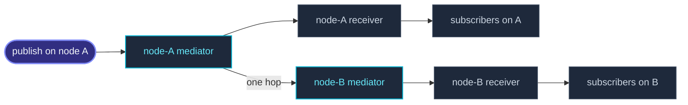

import { Aside } from '@astrojs/starlight/components';

`system.eventStream` is scoped to one `ActorSystem`, which is one **node**:
publishing there walks an in-process list and never touches the network.
`cluster.eventStream` is the other half — the same channels, reaching
subscribers on **every** node.

The owner carries the scope, so the two are told apart at the call site
rather than by a convention you have to remember:

```ts
system.eventStream.publish(event);    // this node only
cluster.eventStream.publish(event);   // every node
```



It rides on the same mediator [DistributedPubSub](/cluster/pubsub/) uses —
one channel becomes one topic — so it inherits that machinery's bounded
gossip, its at-most-one-hop delivery and its caps, and it adds no new frame
to the wire protocol.

## A minimal example

```ts
import { ActorSystem, Actor } from 'actor-ts';
import { Cluster, ClusterOptions } from 'actor-ts/cluster';

type OrderPlacedEvent = { readonly kind: 'order-placed'; readonly sku: string };

class Auditor extends Actor<OrderPlacedEvent> {
  override onReceive(message: OrderPlacedEvent): void {
    this.log.info(`[audit] ${message.sku}`);
  }
}

const system = ActorSystem.create('shop');
const clusterOptions = ClusterOptions.create()
  .withHost(host)
  .withPort(port)
  .withSeeds(seeds);
const cluster = await Cluster.join(system, clusterOptions);

const auditor = system.spawn(Auditor, 'auditor');
cluster.eventStream.subscribe(auditor, 'order-placed');

// On any node in the cluster — every auditor sees it.
cluster.eventStream.publish({ kind: 'order-placed', sku: 'XYZ-1' });
```

## Two channel forms, and only one is free

A **`kind`-discriminated** event needs nothing. It is already valid JSON and
its discriminant survives the wire untouched, so subscribing by kind string
or by an `EventKey` works across nodes out of the box — which is also the
shape the project's own [message conventions](/fundamentals/messages/) ask
for.

A **class** channel cannot travel on its own. Only the value's tag crosses
the wire, so an instance arrives on the far side as a plain object that
matches no `instanceof`. Name it first:

```ts
class ShipmentEvent {
  constructor(public readonly trackingId: string) {}
  static fromJSON(body: Record<string, unknown>): ShipmentEvent {
    return new ShipmentEvent(String(body.trackingId));
  }
}

cluster.eventStream.register('ShipmentEvent', ShipmentEvent);
cluster.eventStream.subscribe(auditor, ShipmentEvent);
cluster.eventStream.publish(new ShipmentEvent('TRK-1'));
```

`register` takes an optional third argument if the class has no static
`fromJSON`, and one of the two must exist. That is deliberate rather than a
missing convenience: rebuilding an arbitrary class generically means writing
peer-supplied keys onto a fresh prototype, which is a prototype-pollution
hazard this project has already had to remove once. Making the class say how
it is rebuilt keeps that door shut.

<Aside type="note" title="Register the concrete class">
  Publishing routes by the event's **exact** constructor, so a subclass is
  not published under its base class's name — that would deliver a base
  instance where a subclass was published and lose the difference silently.
  Subscribing still works the other way round: `subscribe(ref, BaseEvent)`
  collects every registered subclass, because the local half of the delivery
  matches with `instanceof` exactly as `system.eventStream` does.

  Registration is setup. A class registered *after* a subscription is not
  retro-subscribed.
</Aside>

## Bridging a node-local channel

`bridge` mirrors a channel of the node-local bus onto the cluster bus. It is
where "cluster-wide instead of local" gets decided, and the decision is
yours rather than the framework's:

```ts
cluster.eventStream.bridge('cache-flushed');
const stop = cluster.eventStream.bridge(ShipmentEvent);  // returns an off switch
```

A bridge mirrors; it does not divert. Everything already subscribed on
`system.eventStream` keeps its delivery, which is what lets an existing
deployment turn one on without auditing what already listens.

<Aside type="caution" title="Bridge only single-origin events">
  Bridge an event that is **produced on one node**. An event that every node
  derives for itself — the cluster membership events are the ones to watch
  for — becomes N copies cluster-wide, one per node that derived it. That is
  not a defect to be worked around; it follows directly from how such an
  event comes to exist.
</Aside>

## Why the framework's own events stay local

Nothing the framework publishes is on the cluster bus by default, and each
has its own reason:

| Event | Why it stays node-local |
| --- | --- |
| `ActorStarted` / `ActorStopped` / `ActorRestarted` | `publish` runs on every actor start, stop and restart — the hottest path in the system, and one whose empty case is optimised down to a single length check. |
| `DeadLetter` | Undeliverable messages arrive in floods, and there is no storm suppression yet. Cluster-wide, a local storm becomes a cluster-wide one. |
| `MemberUp`, `MemberRemoved`, … | Every node derives these from its own gossip merge, so publishing them cluster-wide would show each subscriber N copies of one membership change. |
| Broker lifecycle events | Their `cause` can still carry a credential-bearing driver error, and this bus has no authorization concept. |
| `DispatcherError`, `SchedulerError` | Node diagnostics, and they carry a `cause` with the same exposure. |

If you want one of them cluster-wide anyway, `bridge` it deliberately —
subject to the single-origin rule above, which rules the membership events
out.

## Not synchronous

`system.eventStream.publish` delivers inside the call.
`cluster.eventStream.publish` does not: it goes through the mediator's
mailbox even for a subscriber on the publishing node. Nothing about crossing a node boundary
could have been synchronous, and putting both origins on one path is what
keeps local and remote delivery in one order rather than racing each other.

A test therefore waits for the delivery instead of asserting straight after
the publish.

## Which bus, and which subscribe

Three things on this page look alike and are not:

| API | Scope | Carries | Replays |
| --- | --- | --- | --- |
| [`system.eventStream`](/fundamentals/event-stream/) | One node | Any class or `kind` | No |
| `cluster.eventStream` | Cluster-wide | Any class or `kind` | No |
| [`cluster.subscribe`](/cluster/overview/) | One node, from cluster-wide state | Membership events only, to a callback | Yes |
| [`DistributedPubSub`](/cluster/pubsub/) | Cluster-wide | String topics, with anycast | No |

`cluster.subscribe` is the one most easily mistaken for `cluster.eventStream`
because they sit on the same object. It takes a callback rather than a ref,
carries only membership events, and replays the current membership when you
subscribe — that replay is why it exists as its own thing.

Reach for `DistributedPubSub` instead when you want string topics chosen at
runtime, or anycast — one subscriber cluster-wide rather than all of them.

## Where to next

- **[Event stream](/fundamentals/event-stream/)** — the node-local bus, its
  channel forms and the events the framework publishes on it.
- **[DistributedPubSub](/cluster/pubsub/)** — topic-based pub/sub, and the
  mediator this bus is built on.
- **[Cluster overview](/cluster/overview/)** — membership, `cluster.subscribe`
  and the events it delivers.
