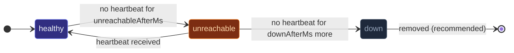
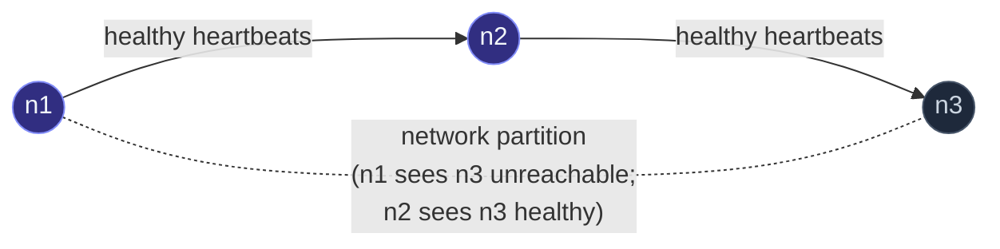

A clustered actor system needs to **agree on who's alive**.
The failure detector is the per-peer state machine that decides:



- **`healthy`** — heartbeats arriving normally.
- **`unreachable`** — past the threshold; the cluster avoids
  routing here.  Still officially a member; can recover.
- **`down`** — past the longer threshold; the cluster considers
  the peer permanently gone.  Triggers downing.

The detector is **per-peer** — different peers can be in
different states at once.  The cluster's overall behavior
(routing, sharding, singleton election) reads these states to
decide what to do.

## The defaults

```ts
{
  heartbeatIntervalMs: 500,    // send a heartbeat every 500ms
  unreachableAfterMs:  2_000,  // mark unreachable after 2s of silence
  downAfterMs:         5_000,  // mark down after 5s of silence
}
```

For typical LAN clusters (1-10 nodes, sub-millisecond latency), these
defaults work fine.  They give:

- **2-second detection window** for "this peer might be having
  trouble."
- **5-second decision window** for "this peer is definitively
  gone."

## Tuning

Override via the `failureDetector` field in the cluster settings:

```ts
const clusterOptions = ClusterOptions.create()
  .withHost(host)
  .withPort(port)
  .withSeeds(seeds)
  .withFailureDetector({
    heartbeatIntervalMs: 1_000,
    unreachableAfterMs:  5_000,
    downAfterMs:         15_000,
  });
Cluster.join(
  system,
  clusterOptions,
);
```

When to tune:

| Workload | Direction |
| --- | --- |
| Cross-region cluster (high RTT) | Increase all three.  100ms RTT means a single missed heartbeat is normal noise. |
| Local Docker compose (sub-ms RTT) | Decrease for faster failover tests.  Production-tune up before deploying. |
| Network with periodic blips | Increase `unreachableAfterMs` to avoid false positives, but keep `downAfterMs` larger so a real failure still gets detected. |
| Cost-sensitive (chatty heartbeats) | Increase `heartbeatIntervalMs` — at 5s intervals, gossip + heartbeat is < 1KB/sec per peer. |

The ratio `downAfterMs / unreachableAfterMs` (default ~2.5x) is the
**flap-tolerance window**: a peer that's marked unreachable can
recover to healthy without being downed, as long as a heartbeat
arrives within the difference.

## Heartbeats are implicit

```
Every gossip exchange counts as a heartbeat.
Every direct message that travels over the cluster transport counts.
```

The framework doesn't send separate "ping" messages — any cluster
traffic from a peer resets that peer's last-seen timestamp.
Gossip is the most reliable source (regular interval), but
application messages contribute too.

This means: a cluster with very chatty actors gets *better*
failure detection (more heartbeats); an idle cluster relies
entirely on gossip.

## What the detector decides — and doesn't

The detector returns `'healthy'` / `'unreachable'` / `'down'`.
What the cluster *does* with that:

| Decision | Cluster behavior |
| --- | --- |
| `healthy` | Normal routing.  No effect. |
| `unreachable` | Mark the member `unreachable` in the membership table.  Routers skip them; sharding doesn't allocate new shards to them.  Singleton manager won't elect a leader from an unreachable side. |
| `down` | Trigger downing.  If a [downing strategy](/cluster/downing-strategies/) is configured, it decides which addresses to forcibly evict; the cluster announces those nodes as `removed`. |

**Crucially:** the detector deciding `down` doesn't automatically
remove the peer.  Removal goes through the downing strategy — the
detector is the *signal*, not the action.  Without a downing
strategy, a `down` decision stays advisory.

## The view from the local node

Every node runs its own detector, watching its own peers.  This
means **two nodes can disagree** about whether a third is
reachable:



The cluster gossip propagates these per-node observations.  A
member is considered globally unreachable when *enough* peers
report it that way — the threshold is configurable in some
downing strategies (see KeepMajority, KeepReferee).

## Custom failure detector

The framework's detector is intentionally simple — plain elapsed-time
thresholds, no statistical variance tracking.  For LAN scale this
is sufficient.  If your network needs Phi-accrual (variance-aware,
adaptive thresholds), you'd implement the `FailureDetector` interface
yourself and inject it via `Cluster.join`'s `failureDetector`
override — but this isn't documented as a public extension point
yet; opening an issue describes the use case.

## Diagnosing failure-detector decisions

```ts
import { MemberUnreachable, MemberReachable } from 'actor-ts';

cluster.subscribe(MemberUnreachable, (evt) => {
  console.log(`${evt.member.address} marked unreachable`);
});

cluster.subscribe(MemberReachable, (evt) => {
  console.log(`${evt.member.address} marked reachable again`);
});
```

Subscribe to the cluster events for visibility.  In production,
wire these into metrics — a histogram of "unreachable durations"
shows whether the threshold matches your network's actual blip
profile.

import { Aside } from '@astrojs/starlight/components';

<Aside type="caution" title="Defaults are LAN defaults">
  ```ts
  // ✗ unreachable in 2s — too aggressive over 100ms-RTT WAN
  const clusterOptions = ClusterOptions.create()
    .withHost(host)
    .withPort(port)
    .withSeeds(seeds);
  Cluster.join(system, clusterOptions);   // uses defaults
  ```
  Cross-region clusters need at least 5-10 seconds for
  `unreachableAfterMs`; a 100ms-RTT link with normal jitter
  produces "missed" heartbeats that cross the 2s threshold.
  Tune up for any non-LAN deployment.
</Aside>

<Aside type="caution" title="`down` is not the same as definitely-gone">
  The detector's `down` decision is statistical — based on
  elapsed silence.  A peer that's slow but recovering can be
  marked `down` and then come back.  Without a downing strategy
  that actually evicts them, you get **flapping members** that
  drift between `unreachable` and `down`.  Configure a downing
  strategy.
</Aside>

<Aside type="caution" title="Tight thresholds in noisy networks">
  ```ts
  failureDetector: { unreachableAfterMs: 200, downAfterMs: 500 }
  ```
  Aggressive thresholds detect failures quickly but produce false
  positives on transient delays — a peer that's briefly busy GCing
  gets marked unreachable, the cluster reacts, by the time the GC
  finishes routing has shifted.  For most production clusters, the
  defaults (2s/5s) are already aggressive enough.
</Aside>

## Where to next

- **[Cluster overview](/cluster/overview/)** — the
  membership state machine the detector feeds.
- **[Downing strategies](/cluster/downing-strategies/)** —
  what happens *after* the detector decides `down`.
- **[Joining and seeds](/cluster/joining-and-seeds/)** —
  how peers first appear in the membership table.
- **[Configuration](/reference/configuration/)** — the
  HOCON keys (`actor-ts.cluster.failure-detector.*`).
- **[Failure-detector tuning](/operations/tuning/failure-detector/)** —
  the operations-focused tuning page.

The [`FailureDetector`](/api/classes/failuredetector/) API
reference covers the full surface.
