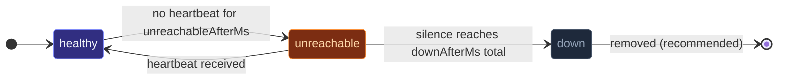
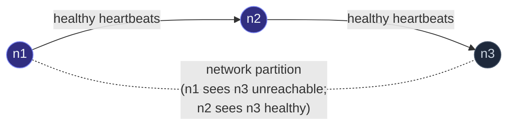

A clustered actor system needs to **agree on who's alive**.
The failure detector is the per-peer state machine that decides:


```mermaid
stateDiagram-v2
  direction LR
  [*] --> healthy
  healthy --> unreachable: no heartbeat for unreachableAfterMs
  unreachable --> healthy: heartbeat received
  unreachable --> down: silence reaches downAfterMs total
  down --> [*]: removed (recommended)
  classDef ok   fill:#312e81,stroke:#818cf8,color:#f1f5f9;
  classDef warn fill:#7c2d12,stroke:#fb923c,color:#fed7aa;
  classDef gone fill:#1e293b,stroke:#475569,color:#94a3b8;
  class healthy ok
  class unreachable warn
  class down gone
```

- **`healthy`** — heartbeats arriving normally.
- **`unreachable`** — past the threshold; the cluster avoids
  routing here.  Still officially a member; can recover.
- **`down`** — past the longer threshold; the cluster considers
  the peer permanently gone.  Triggers downing.

The detector is **per-peer** — different peers can be in
different states at once.  The cluster's overall behavior
(routing, sharding, singleton election) reads these states to
decide what to do.

## The defaults

```ts
{
  heartbeatIntervalMs: 500,    // send a heartbeat every 500ms
  unreachableAfterMs:  2_000,  // mark unreachable after 2s of silence
  downAfterMs:         5_000,  // mark down after 5s of silence
}
```

For typical LAN clusters (1-10 nodes, sub-millisecond latency), these
defaults work fine.  They give:

- **2-second detection window** for "this peer might be having
  trouble."
- **5-second decision window** for "this peer is definitively
  gone."

## Tuning

Override via the `failureDetector` field in the cluster settings:

```ts
const clusterOptions = ClusterOptions.create()
  .withHost(host)
  .withPort(port)
  .withSeeds(seeds)
  .withFailureDetector({
    heartbeatIntervalMs: 1_000,
    unreachableAfterMs:  5_000,
    downAfterMs:         15_000,
  });
Cluster.join(
  system,
  clusterOptions,
);
```

When to tune:

| Workload | Direction |
| --- | --- |
| Cross-region cluster (high RTT) | Increase all three.  100ms RTT means a single missed heartbeat is normal noise. |
| Local Docker compose (sub-ms RTT) | Decrease for faster failover tests.  Production-tune up before deploying. |
| Network with periodic blips | Increase `unreachableAfterMs` to avoid false positives, but keep `downAfterMs` larger so a real failure still gets detected. |
| Cost-sensitive (chatty heartbeats) | Increase `heartbeatIntervalMs` — at 5s intervals, gossip + heartbeat is < 1KB/sec per peer. |

The ratio `downAfterMs / unreachableAfterMs` (default ~2.5x) is the
**flap-tolerance window**: a peer that's marked unreachable can
recover to healthy without being downed, as long as a heartbeat
arrives within the difference.

## Heartbeats are implicit

```
Every gossip exchange counts as a heartbeat.
Every direct message that travels over the cluster transport counts.
```

The framework doesn't send separate "ping" messages — any cluster
traffic from a peer resets that peer's last-seen timestamp.
Gossip is the most reliable source (regular interval), but
application messages contribute too.

This means: a cluster with very chatty actors gets *better*
failure detection (more heartbeats); an idle cluster relies
entirely on gossip.

## What the detector decides — and doesn't

The detector returns `'healthy'` / `'unreachable'` / `'down'`.
What the cluster *does* with that:

| Decision | Cluster behavior |
| --- | --- |
| `healthy` | Normal routing.  No effect. |
| `unreachable` | Mark the member `unreachable` in the membership table.  Routers skip them; sharding doesn't allocate new shards to them.  Singleton manager won't elect a leader from an unreachable side. |
| `down`, [downing strategy](/cluster/downing-strategies/) configured | Mark the member `unreachable` and stop.  The strategy decides which addresses to evict; the cluster announces those nodes as `removed`.  The detector removes nothing itself. |
| `down`, no strategy configured | The detector evicts the peer itself: `down`, then straight out of the membership table as `removed`. |

**The two rows are the whole story, and which one you get is
decided by whether you configured a strategy.**  With one, the
detector is the *signal*, not the action — it parks the peer at
`unreachable` and the strategy owns the eviction.  Without one,
nothing arbitrates, and the detector evicting the peer at
`down-after` is the only failover you have: it is what lets shards
reallocate and a singleton hand over after a crash.  That is
convenient for a single crashed node and wrong for a partition,
where both halves evict the other and keep running.  Configuring a
strategy is how you replace one with the other.

### A parked member stays parked

With a strategy configured, a member the strategy never reaches a
verdict about stays `unreachable` **indefinitely**.  There is no
detector backstop behind it, deliberately: a backstop is the bypass
the strategy exists to prevent, and one that fires at some multiple
of `down-after` only makes the bypass later.

That has consequences worth planning for.  The member keeps its
slot against `max-members`.  `ClusterSingletonManager` does not
hand over, because it reconciles on `MemberDown` / `MemberLeft` /
`MemberRemoved` and deliberately not on `MemberUnreachable` — one
node's detector is not a membership fact the cluster agrees on.
`ShardCoordinator` does not reallocate, because it listens for
`MemberRemoved` only.  And a healed partition does not currently
bring the member back to `up`: gossip and heartbeats are sent to
reachable members only, so neither side addresses the other again.

This is integrity over availability, chosen on purpose.  Pick a
strategy that always reaches a verdict on your cluster shape — an
odd member count for `KeepMajority`, a referee or a lease for an
even one — rather than one that can answer "pending" forever.

## The view from the local node

Every node runs its own detector, watching its own peers.  This
means **two nodes can disagree** about whether a third is
reachable:


```mermaid
flowchart LR
  N1((n1))
  N2((n2))
  N3((n3))
  N1 -- "healthy heartbeats" --> N2
  N2 -- "healthy heartbeats" --> N3
  N1 -. "network partition<br/>(n1 sees n3 unreachable;<br/>n2 sees n3 healthy)" .- N3
  classDef ok  fill:#312e81,stroke:#818cf8,color:#f1f5f9;
  classDef mid fill:#1e293b,stroke:#475569,color:#cbd5e1;
  class N1,N2 ok
  class N3 mid
```

The cluster gossip propagates these per-node observations.  A
member is considered globally unreachable when *enough* peers
report it that way — the threshold is configurable in some
downing strategies (see KeepMajority, KeepReferee).

## Custom failure detector

The cluster's built-in detector is intentionally simple — plain
elapsed-time thresholds, no statistical variance tracking.  For LAN
scale this is sufficient.  The `failureDetector` cluster option tunes
its thresholds only — it takes `Partial<FailureDetectorOptionsType>`
(the three `*Ms` knobs above), not a detector instance, so there's no
"swap in your own detector" hook on `Cluster.join`.

If your network needs Phi-accrual (variance-aware, adaptive
thresholds), the framework already ships one: `PhiAccrualFailureDetector`
(with `PhiAccrualOptions`) is a public, exported class that tracks the
distribution of recent inter-arrival times and produces a continuous
suspicion value.  It's not yet wired into the cluster as a selectable
detector — the cluster always runs the simple `FailureDetector` — so
for now you use it standalone.

## Diagnosing failure-detector decisions

```ts
import { MemberUnreachable, MemberReachable } from 'actor-ts/cluster';

cluster.subscribe((evt) => {
  if (evt instanceof MemberUnreachable) {
    console.log(`${evt.member.address} marked unreachable`);
  } else if (evt instanceof MemberReachable) {
    console.log(`${evt.member.address} marked reachable again`);
  }
});
```

Subscribe to the cluster events for visibility.  In production,
wire these into metrics — a histogram of "unreachable durations"
shows whether the threshold matches your network's actual blip
profile.

### `ReachabilityChanged` — what *this* node can see

`MemberUnreachable` is a membership transition, and that makes it the
wrong signal for two questions it looks like it answers:

- **It may not be this node's observation.**  Member status travels in
  gossip, so `MemberUnreachable` also fires for a peer that *someone
  else* has stopped hearing from while this node's heartbeats to it
  arrive normally.
- **It only fires for a member that was `up`.**  A peer that falls
  silent while `joining`, `weakly-up` or `leaving` produces no
  reachability event at all — the next thing you hear about it is the
  eviction.

`ReachabilityChanged` is the local detector's own verdict, without
either caveat:

```ts
import { ReachabilityChanged } from 'actor-ts/cluster';

cluster.subscribe((evt) => {
  if (evt instanceof ReachabilityChanged) {
    peerHealth.gauge({ peer: evt.address.toString() }).set(evt.reachable ? 1 : 0);
  }
});
```

It fires **on transition only** — once when the detector stops seeing
a peer, once when it sees it again — and never for a peer that has been
healthy since this node first met it.  The verdict is recomputed once
per `heartbeatIntervalMs` and turns negative at `unreachableAfterMs`,
so it is the earliest warning the detector produces, well ahead of any
downing decision.

Comparing this against the member's gossiped `status` is how you tell a
partition from a dead peer: a node that everyone else can still reach
is a link problem, not a host problem.  The event carries no observer
set — *"which other nodes also cannot reach X"* would need an
observer-to-subject table on the wire, and gossip carries a flat member
list.

import { Aside } from '@astrojs/starlight/components';

<Aside type="caution" title="Defaults are LAN defaults">
  ```ts
  // ✗ unreachable in 2s — too aggressive over 100ms-RTT WAN
  const clusterOptions = ClusterOptions.create()
    .withHost(host)
    .withPort(port)
    .withSeeds(seeds);
  Cluster.join(system, clusterOptions);   // uses defaults
  ```
  Cross-region clusters need at least 5-10 seconds for
  `unreachableAfterMs`; a 100ms-RTT link with normal jitter
  produces "missed" heartbeats that cross the 2s threshold.
  Tune up for any non-LAN deployment.
</Aside>

<Aside type="caution" title="`down` is not the same as definitely-gone">
  The detector's `down` decision is statistical — based on
  elapsed silence.  A peer that's slow but recovering can be
  marked `down` and then come back.  Without a downing strategy
  the detector acts on that guess by itself and evicts the peer,
  so a GC pause long enough to cross `down-after` costs you a node.
  With one, the guess is only an input: the strategy weighs it
  against the rest of the cluster's view before anything is
  evicted.  Configure a downing strategy.
</Aside>

<Aside type="caution" title="Tight thresholds in noisy networks">
  ```ts
  failureDetector: { unreachableAfterMs: 200, downAfterMs: 500 }
  ```
  Aggressive thresholds detect failures quickly but produce false
  positives on transient delays — a peer that's briefly busy GCing
  gets marked unreachable, the cluster reacts, by the time the GC
  finishes routing has shifted.  For most production clusters, the
  defaults (2s/5s) are already aggressive enough.
</Aside>

## Where to next

- **[Cluster overview](/cluster/overview/)** — the
  membership state machine the detector feeds.
- **[Downing strategies](/cluster/downing-strategies/)** —
  what happens *after* the detector decides `down`.
- **[Joining and seeds](/cluster/joining-and-seeds/)** —
  how peers first appear in the membership table.
- **[Configuration](/reference/configuration/)** — the
  HOCON keys (`actor-ts.cluster.failure-detector.*`).
- **[Failure-detector tuning](/operations/tuning/failure-detector/)** —
  the operations-focused tuning page.

The [`FailureDetector`](/api/classes/failuredetector/) API
reference covers the full surface.
