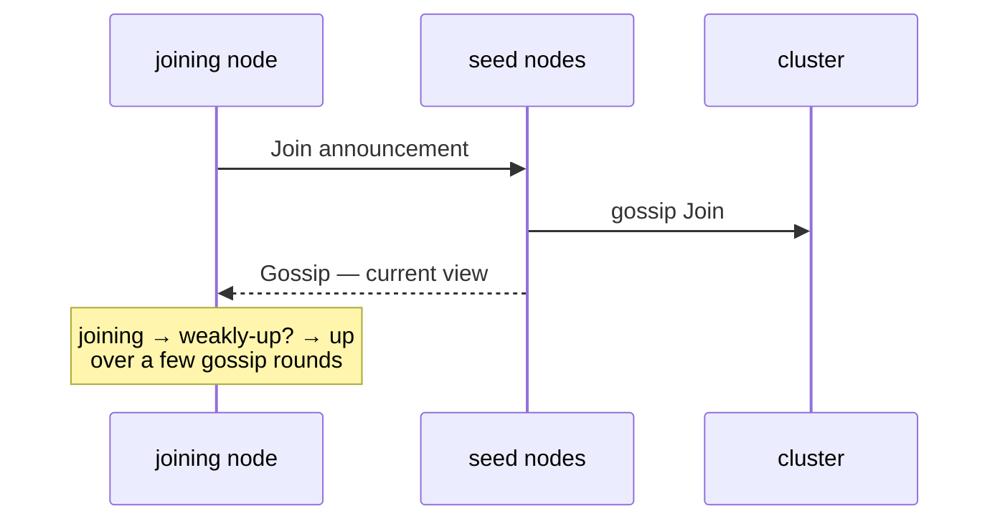
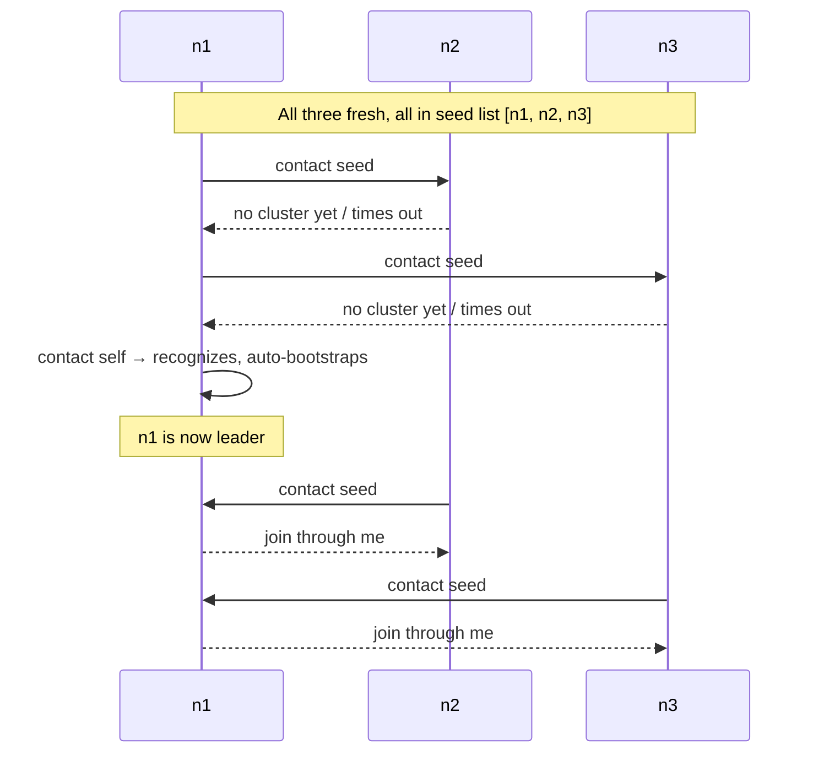

A node enters a cluster by **contacting a seed node**.  The seed
gossips back its current membership view; the joiner is added as
`joining`, propagates through gossip, and once the leader sees it
(plus convergence), transitions to `up`.



This page covers the **mechanics** of that handshake, plus the
seed-discovery layer on top.

## The simplest case — explicit seeds

```ts
import { ActorSystem, Cluster, ClusterOptions } from 'actor-ts';

const system = ActorSystem.create('my-app');

const clusterOptions = ClusterOptions.create()
  .withHost('10.0.0.5')
  .withPort(2552)
  .withSeeds(['10.0.0.5:2552', '10.0.0.6:2552', '10.0.0.7:2552']);
const cluster = await Cluster.join(
  system,
  clusterOptions,
);
```

Three seeds.  The joiner contacts each in order until one
responds.  Once any seed accepts, the cluster's gossip propagates
the new member; convergence to `up` happens within a few seconds
on a healthy network.

The seed list is just a **bootstrap hint** — once joined, the
node learns about every other peer via gossip.  Seeds don't have
to be special after the join.

## Configuration

```ts
interface ClusterOptionsType {
  host:                       string;       // this node's address
  port:                       number;       // this node's TCP port
  seeds?:                     string[];     // peer addresses for bootstrap
  roles?:                     string[];     // role tags
  failureDetector?:           Partial<...>;
  transport?:                 Transport;
  gossipIntervalMs?:          number;
  seedRetryIntervalMs?:       number;       // retry interval if no seed responds
  // ...
}
```

The seed-related knobs:

| Setting | Default | What |
| --- | --- | --- |
| `seeds` | `[]` | List of `"host:port"` strings.  Empty = "I'm the first." |
| `seedRetryIntervalMs` | 3000 | If no seed responds, retry the list this often until one does. |

## The first node

```ts
const clusterOptions = ClusterOptions.create()
  .withHost('0.0.0.0')
  .withPort(2552)
  .withSeeds([]);
const cluster = await Cluster.join(
  system,
  clusterOptions,
);
```

An empty `seeds` list (or one that's all-unreachable) means **this
node bootstraps the cluster by itself**.  It auto-promotes to
leader; future joiners contact *it*.

This makes single-node development trivial — no seed list to
maintain.  Add a second node later by giving it the first's
address as a seed.

**For production**, give every node the same seed list (3-5
addresses, ideally well-known nodes you don't expect to churn).
Order doesn't matter; the joiner tries each.

## Self-seeded nodes — the bootstrap race



When a cluster cold-starts (all nodes coming up simultaneously),
the joiners race.  The framework's seed-retry logic handles this:

- Each node retries its seed list at `seedRetryIntervalMs`.
- One node eventually contacts itself first; that's the
  bootstrap.
- The rest converge on the now-existing cluster.

The default 3-second retry makes cold-start convergence reliable
in a few rounds.

## Seed discovery — beyond a static list

A hard-coded seed list works for tests and small clusters.  For
production where nodes have dynamic IPs (containers, K8s pods),
use a **seed provider**:

| Provider | When |
| --- | --- |
| **[Config](/discovery/seed-providers/config/)** | Static list (the case above). |
| **[DNS](/discovery/seed-providers/dns/)** | Resolves `_actor-ts._tcp.example.com` SRV records. |
| **[Kubernetes API](/discovery/seed-providers/kubernetes-api/)** | Lists pods matching a label selector. |
| **[Aggregate](/discovery/seed-providers/aggregate/)** | Falls through multiple providers (e.g. K8s, then DNS). |

```ts
import { KubernetesApiSeedProvider, KubernetesApiSeedProviderOptions } from 'actor-ts/discovery';

const kubernetesApiSeedProviderOptions = KubernetesApiSeedProviderOptions.create()
  .withNamespace('default')
  .withServiceName('actor-ts')
  .withPort(2552);
const seedProvider = new KubernetesApiSeedProvider(
  kubernetesApiSeedProviderOptions,
);

const seeds = await seedProvider.discover();

const clusterOptions = ClusterOptions.create()
  .withHost(process.env.POD_IP!)
  .withPort(2552)
  .withSeeds(seeds);
const cluster = await Cluster.join(
  system,
  clusterOptions,
);
```

The provider returns a snapshot of seed addresses; the framework
uses them to bootstrap the join.  See
[Discovery overview](/discovery/overview/) for the seed
provider model.

## Watching the join progress

```ts
import { SelfUp, MemberUp } from 'actor-ts';

cluster.subscribe(SelfUp, (evt) => {
  console.log(`this node is now Up`);
});

cluster.subscribe(MemberUp, (evt) => {
  console.log(`peer ${evt.member.address} reached Up`);
});
```

Two key events:

- **`SelfUp`** fires once when *this* node transitions to `up`.
  Useful gate for starting work that requires cluster
  membership.
- **`MemberUp`** fires every time *any* member reaches `up`.

For startup logic that needs other members ("wait until at least 3
nodes are up before serving traffic"), count `MemberUp`s after
`SelfUp`.

## What can go wrong

import { Aside } from '@astrojs/starlight/components';

<Aside type="caution" title="Seeds unreachable, no self in list">
  ```ts
  // ✗ this node isn't a seed, no other seed responds
  const clusterOptions = ClusterOptions.create()
    .withHost('n4')
    .withPort(2552)
    .withSeeds(['n1', 'n2', 'n3']);
  Cluster.join(system, clusterOptions);
  ```
  The join retries forever (silent at default log level).  If
  the seed list is genuinely unreachable, the node never joins.
  Either include this node in the seed list (everyone is a
  seed) or implement health checks that surface "no cluster
  joined" as an alert.
</Aside>

<Aside type="caution" title="Two clusters forming with the same name">
  ```ts
  // Network partition right at startup:
  // - n1, n2 reach each other → form cluster
  // - n3 can't reach them → bootstraps its own cluster
  // - Partition heals → two clusters with the same name now exist
  ```
  Once the partition heals, the gossip protocol *doesn't* merge
  the two clusters automatically — they're independent.  Mitigate
  with a downing strategy ([downing-strategies](/cluster/downing-strategies/))
  and **don't bootstrap during partition** if you can help it
  (use a seed strategy that fails fast rather than self-bootstrapping
  on no-seed-response — see weakly-up).
</Aside>

<Aside type="caution" title="Hostname vs IP mismatch">
  ```ts
  // Joiner sees seed as `pod-abc-123.cluster.local`
  // Seed sees itself as `10.244.1.5`
  // → gossip's address comparison treats them as different members
  ```
  Member identity uses the **address the node advertised at
  join**.  If different peers see different addresses for the
  same node (typical in K8s with hostnames), the cluster forms
  but each node sees the peer as a stranger.  Use the K8s seed
  provider, which resolves to pod IPs consistently, or set
  `host` to the IP rather than the hostname.
</Aside>

## Where to next

- **[Cluster overview](/cluster/overview/)** — the
  bigger picture.
- **[Weakly-up](/cluster/weakly-up/)** — gradual-join
  semantics for slow convergence.
- **[Failure detector](/cluster/failure-detector/)** —
  how heartbeats keep the membership view fresh after join.
- **[Discovery overview](/discovery/overview/)** — seed
  providers for dynamic environments.
- **[Downing strategies](/cluster/downing-strategies/)** —
  split-brain resolution after the cluster forms.
