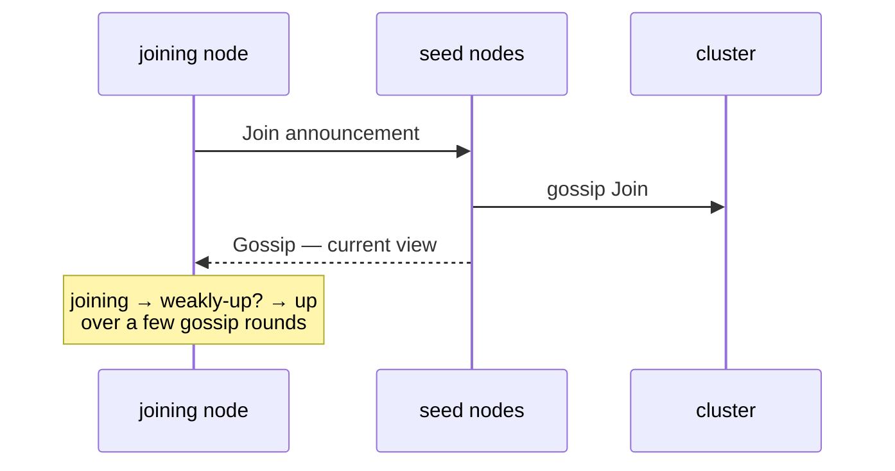
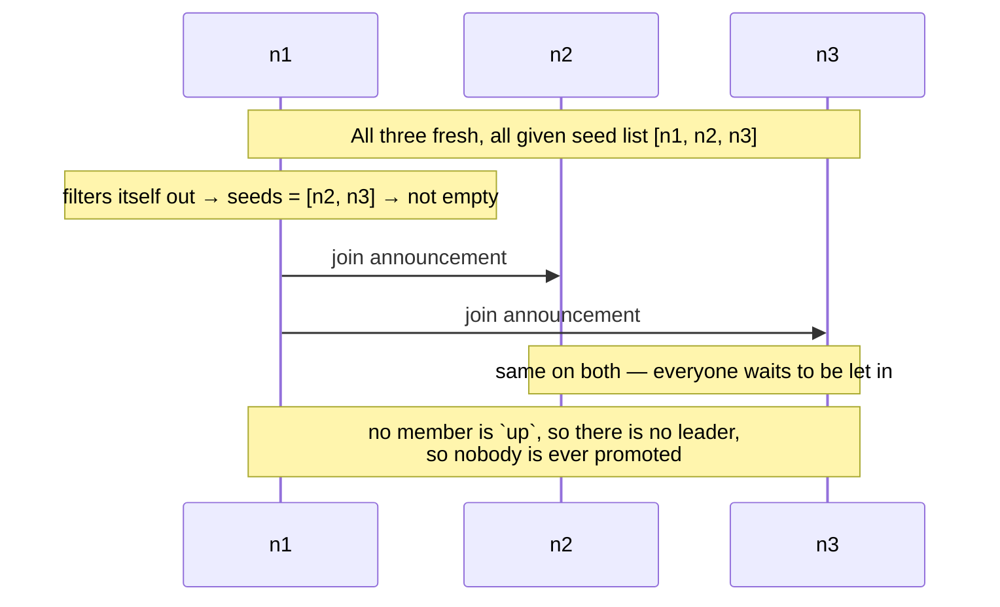

A node enters a cluster by **contacting a seed node**.  The seed
gossips back its current membership view; the joiner is added as
`joining`, propagates through gossip, and once the leader sees it
(plus convergence), transitions to `up`.


```mermaid
sequenceDiagram
  participant J as joining node
  participant S as seed nodes
  participant C as cluster
  J->>S: Join announcement
  S->>C: gossip Join
  S-->>J: Gossip — current view
  Note over J: joining → weakly-up? → up<br/>over a few gossip rounds
```

This page covers the **mechanics** of that handshake, plus the
seed-discovery layer on top.

## The simplest case — explicit seeds

```ts
import { ActorSystem } from 'actor-ts';
import { Cluster, ClusterOptions } from 'actor-ts/cluster';

const system = ActorSystem.create('my-app');

const clusterOptions = ClusterOptions.create()
  .withHost('10.0.0.5')
  .withPort(2552)
  .withSeeds(['10.0.0.5:2552', '10.0.0.6:2552', '10.0.0.7:2552']);
const cluster = await Cluster.join(
  system,
  clusterOptions,
);
```

Three seeds.  The joiner contacts each in order until one
responds.  Once any seed accepts, the cluster's gossip propagates
the new member; convergence to `up` happens within a few seconds
on a healthy network.

The seed list is just a **bootstrap hint** — once joined, the
node learns about every other peer via gossip.  Seeds don't have
to be special after the join.

## Configuration

```ts
type ClusterOptionsType = {
  host:                       string;       // interface to bind (wildcard ok)
  advertisedHost?:            string;       // address peers dial (never a wildcard)
  port:                       number;       // port to bind
  advertisedPort?:            number;       // port peers dial (defaults to port)
  seeds?:                     string[];     // peer addresses for bootstrap
  roles?:                     string[];     // role tags
  failureDetector?:           Partial<...>;
  transport?:                 Transport;
  gossipIntervalMs?:          number;
  seedRetryIntervalMs?:       number;       // retry interval if no seed responds
  // ...
};
```

The seed-related knobs:

| Setting | Default | What |
| --- | --- | --- |
| `seeds` | `[]` | List of `"host:port"` strings.  Empty = "I'm the first." |
| `seedRetryIntervalMs` | 3000 | If no seed responds, retry the list this often until one does. |
| `selfElection` | `'immediate'` | When this node may form a cluster alone: `'immediate'` (only on an empty seed list), `'never'`, or a millisecond grace.  Set by [cluster bootstrap](/cluster/cluster-bootstrap/). |

## The first node

```ts
const clusterOptions = ClusterOptions.create()
  .withHost('0.0.0.0')
  .withPort(2552)
  .withSeeds([]);
const cluster = await Cluster.join(
  system,
  clusterOptions,
);
```

`0.0.0.0` there is the *bind* address.  What this node gossips is
resolved separately and is never a wildcard — with nothing else
configured it advertises `127.0.0.1`, which is exactly right for a
single-node development run and is why the pair needs no attention
until there is a second machine.  See
[Cluster overview](/cluster/overview/).

An empty `seeds` list (or one that's all-unreachable) means **this
node bootstraps the cluster by itself**.  It auto-promotes to
leader; future joiners contact *it*.

This makes single-node development trivial — no seed list to
maintain.  Add a second node later by giving it the first's
address as a seed.

**For production**, designate one node with an empty seed list and
give the rest that node's address — or, better, use
[cluster bootstrap](/cluster/cluster-bootstrap/), which removes the
need for a designated first node entirely.

## The symmetric seed list does not cold-start

It is tempting to hand every node the same list containing every
node.  That configuration **never forms a cluster**:


```mermaid
sequenceDiagram
  participant N1 as n1
  participant N2 as n2
  participant N3 as n3
  Note over N1,N3: All three fresh, all given seed list [n1, n2, n3]
  Note over N1: filters itself out → seeds = [n2, n3] → not empty
  N1->>N2: join announcement
  N1->>N3: join announcement
  Note over N2,N3: same on both — everyone waits to be let in
  Note over N1,N3: no member is `up`, so there is no leader,<br/>so nobody is ever promoted
```

`Cluster` removes this node's own address from its seed list, so a
symmetric list leaves **no** node with the empty list that
`selfElection: 'immediate'` requires.  Every node stays `joining`
forever; there is no leader, and the leader is what promotes
`joining → up`.

Two ways out:

- **One designated first node** with `seeds: []`, the rest pointing at
  it.  Simple, but that node is special at start-up, which containers
  and autoscalers make awkward.
- **[Cluster bootstrap](/cluster/cluster-bootstrap/)** — every node
  gets the same configuration and the framework elects exactly one to
  break the tie.  This is the option to reach for whenever nodes start
  simultaneously.

The `seedRetryIntervalMs` retry loop still matters, but it solves a
different problem: a seed that is reachable *eventually*.  It cannot
manufacture a first member.

It does, however, carry the diagnosis.  A node still `joining` after a
few contact rounds, with no `up` member in sight and no self-election
due, logs one WARN naming what it can see and what to change — the
unanswered seed addresses when nothing has replied, or the seed list and
`selfElection` pairing above when the peers are all present and all
waiting.  It is reported once, not per round.

That line is worth knowing about because the *symptom* is nowhere near
the cause: a cluster stuck this way has no `up` member, a
[cluster singleton](/cluster/singleton/overview/) picks its host from
the `up` members, and so the first thing most applications notice is
an `AskTimeoutError` from a singleton proxy.

## Seed discovery — beyond a static list

A hard-coded seed list works for tests and small clusters.  For
production where nodes have dynamic IPs (containers, K8s pods),
use a **seed provider**:

| Provider | When |
| --- | --- |
| **[Config](/discovery/seed-providers/config/)** | Static list (the case above). |
| **[DNS](/discovery/seed-providers/dns/)** | Resolves `_actor-ts._tcp.example.com` SRV records. |
| **[Kubernetes API](/discovery/seed-providers/kubernetes-api/)** | Lists pods matching a label selector. |
| **[Aggregate](/discovery/seed-providers/aggregate/)** | Falls through multiple providers (e.g. K8s, then DNS). |

```ts
import { KubernetesApiSeedProvider, KubernetesApiSeedProviderOptions } from 'actor-ts/discovery';

const kubernetesApiSeedProviderOptions = KubernetesApiSeedProviderOptions.create()
  .withNamespace('default')
  .withServiceName('actor-ts')
  .withPort(2552);
const seedProvider = new KubernetesApiSeedProvider(
  kubernetesApiSeedProviderOptions,
);

const seeds = await seedProvider.discover();

const clusterOptions = ClusterOptions.create()
  .withHost(process.env.POD_IP!)
  .withPort(2552)
  .withSeeds(seeds);
const cluster = await Cluster.join(
  system,
  clusterOptions,
);
```

The provider returns a snapshot of seed addresses; the framework
uses them to bootstrap the join.  See
[Discovery overview](/discovery/overview/) for the seed
provider model.

## Watching the join progress

The one-call gate first — `awaitReady` resolves once this node is `up`
and, with `minimumMembers`, once the cluster has reached its expected
size; `isReady` is the synchronous probe:

```ts
await cluster.awaitReady({ minimumMembers: 3, timeoutMs: 30_000 });
cluster.isReady();     // probe the same predicate without waiting
cluster.selfMember();  // this node's own record — status included
```

With `timeoutMs` set it rejects with `ClusterReadyTimeoutError` instead
of leaving you to guess; without it, it waits indefinitely.  See
[Cluster bootstrap → Waiting for readiness](/cluster/cluster-bootstrap/#waiting-for-readiness)
for how `Cluster.bootstrap` applies the same wait by default.

For logic that reacts to *individual* transitions, subscribe to the
events:

```ts
import { SelfUp, MemberUp } from 'actor-ts/cluster';

cluster.subscribe((evt) => {
  if (evt instanceof SelfUp) {
    console.log(`this node is now Up`);
  } else if (evt instanceof MemberUp) {
    console.log(`peer ${evt.member.address} reached Up`);
  }
});
```

Two key events:

- **`SelfUp`** fires once when *this* node transitions to `up`.
- **`MemberUp`** fires every time *any* member reaches `up`.

Counting `MemberUp`s by hand to answer "are at least 3 nodes up?" is
exactly what `awaitReady({ minimumMembers: 3 })` replaces — the
subscription is for reacting to changes, not for gating startup.

## What can go wrong

import { Aside } from '@astrojs/starlight/components';

<Aside type="caution" title="Seeds unreachable, no self in list">
  ```ts
  // ✗ this node isn't a seed, no other seed responds
  const clusterOptions = ClusterOptions.create()
    .withHost('n4')
    .withPort(2552)
    .withSeeds(['n1', 'n2', 'n3']);
  Cluster.join(system, clusterOptions);
  ```
  The join retries forever (silent at default log level).  If
  the seed list is genuinely unreachable, the node never joins.
  Either include this node in the seed list (everyone is a
  seed) or implement health checks that surface "no cluster
  joined" as an alert.
</Aside>

<Aside type="caution" title="Two clusters forming with the same name">
  ```ts
  // Network partition right at startup:
  // - n1, n2 reach each other → form cluster
  // - n3 can't reach them → bootstraps its own cluster
  // - Partition heals → two clusters with the same name now exist
  ```
  Once the partition heals, the gossip protocol *doesn't* merge
  the two clusters automatically — they're independent.  Mitigate
  with a downing strategy ([downing-strategies](/cluster/downing-strategies/))
  and with [cluster bootstrap](/cluster/cluster-bootstrap/), which
  makes exactly one node eligible to form a cluster and refuses to
  decide at all while discovery keeps changing its mind.
</Aside>

<Aside type="caution" title="Hostname vs IP mismatch">
  ```ts
  // Joiner sees seed as `pod-abc-123.cluster.local`
  // Seed sees itself as `10.244.1.5`
  // → gossip's address comparison treats them as different members
  ```
  Member identity uses the **address the node advertised at
  join**.  If different peers see different addresses for the
  same node (typical in K8s with hostnames), the cluster forms
  but each node sees the peer as a stranger.  Use the K8s seed
  provider, which resolves to pod IPs consistently, or set
  `host` to the IP rather than the hostname.
</Aside>

## Where to next

- **[Cluster overview](/cluster/overview/)** — the
  bigger picture.
- **[Cluster bootstrap](/cluster/cluster-bootstrap/)** —
  stable observation and initial-seed election for simultaneous starts.
- **[Weakly-up](/cluster/weakly-up/)** — gradual-join
  semantics for slow convergence.
- **[Failure detector](/cluster/failure-detector/)** —
  how heartbeats keep the membership view fresh after join.
- **[Discovery overview](/discovery/overview/)** — seed
  providers for dynamic environments.
- **[Downing strategies](/cluster/downing-strategies/)** —
  split-brain resolution after the cluster forms.
