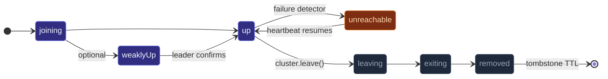

A **cluster** is a group of `ActorSystem`s — typically one per node —
that know about each other.  Nodes gossip their membership state,
detect each other's failures, and route messages across the network.
Once joined, code on any node can `tell` an actor on any other node;
the cluster transport hides the wire.

Two ways to think about it:

- **From the application's perspective**: one logical actor system
  spread across N nodes.  An `ActorRef` can point at an actor on
  any node; the same code that worked single-node still works.
- **From the runtime's perspective**: N independent systems
  exchanging gossip + heartbeats, each tracking who's alive,
  routing messages through a chosen transport.

## A minimal example

`Cluster.bootstrap` packages the four steps you'd otherwise wire by
hand — create the `ActorSystem`, resolve seeds, `Cluster.join`,
hook up `SIGTERM`/`SIGINT` — into a single call:

```ts
import { Cluster, ClusterBootstrapOptions } from 'actor-ts';

// Local dev — no env vars, no seeds: single-node cluster.
const { system, cluster, shutdown } = await Cluster.bootstrap(ClusterBootstrapOptions.create('my-app'));

// With explicit overrides:
const { system, cluster } = await Cluster.bootstrap(
  ClusterBootstrapOptions.create('my-app')
    .withHost('0.0.0.0')
    .withPort(2552)
    .withSeeds(['node-a:2552', 'node-b:2552'])
    .withRoles(['compute']),
);

// Once joined:
cluster.upMembers();                 // → ReadonlyArray<Member> of up-status nodes
cluster.subscribe((evt) => { /* MemberUp, MemberDown, ... */ });
```

For full control (custom dispatcher, manual signal handling,
own discovery loop) the lower-level pair still works:

```ts
import { ActorSystem, Cluster, ClusterOptions } from 'actor-ts';

const system  = ActorSystem.create('my-app');
const clusterOptions = ClusterOptions.create()
  .withHost('0.0.0.0')
  .withPort(2552)
  .withSeeds(['node-a:2552', 'node-b:2552']);
const cluster = await Cluster.join(
  system,
  clusterOptions,
);
```

Three settings are doing most of the work:

| Setting | Purpose |
| --- | --- |
| `host` + `port` | This node's external address.  Peers contact it here. |
| `seeds` | Other nodes' addresses.  At startup, this node contacts them to join the existing cluster.  An empty list = "I'm the first one" (auto-promotes to leader). |
| `roles` | Tags this node carries.  Routers and shard regions can filter on these (`role: 'compute'` skips nodes without the tag). |

After `Cluster.join` resolves, the node is in the cluster
(though possibly still in `joining` state for a few seconds until
convergence).

## The membership states

Every member goes through a small state machine:



- **`joining`** — just announced itself.  Other peers know about it
  but it isn't routable yet.
- **`weakly-up`** *(optional)* — gossip-visible to peers but the
  leader hasn't confirmed it.  Useful for partition-tolerant joins;
  see [Weakly-up](/cluster/weakly-up/).
- **`up`** — fully in the cluster, routable.  This is the
  steady-state status.
- **`unreachable`** — the failure detector flagged this peer as
  not heartbeating.  Still officially a member, but routing avoids
  it.  Transient; flips back to `reachable` if heartbeats resume.
- **`leaving` / `exiting`** — the member is gracefully leaving (via
  `cluster.leave()`).
- **`removed`** — formally evicted.  Kept as a tombstone for a TTL
  (default 24 h) so stale gossip from a slow peer can't accidentally
  resurrect it.

The cluster's events stream surfaces every transition — subscribe
to `MemberUp` / `MemberRemoved` / `UnreachableMember` etc. and
react.

## What gossip does

Gossip is how members agree on who's in the cluster.  Every
`gossipIntervalMs` (default 500 ms), each member picks a random
reachable peer and exchanges its view of the cluster.  Over a few
rounds, every peer converges on the same state — without any
central coordinator.

The protocol carries:

- **Membership table** — every member's address, status, roles,
  and version vector.
- **Reachability observations** — "I haven't heard from X recently."

Two peers exchanging gossip merge their tables by picking the
**higher version** for each member.  This is what makes convergence
work without a leader-elected coordinator: every concurrent update
is eventually seen by every peer.

For the deep dive, see
[Joining and seeds](/cluster/joining-and-seeds/).

## What the failure detector does

The framework uses a **phi accrual** failure detector.  Each
member maintains a per-peer heartbeat history; if a peer's
heartbeats stop arriving within a statistical window, the
detector flags it as suspect.

- **`unreachableAfterMs`** — once suspicion exceeds the threshold
  for this long, the member is marked `unreachable`.
- **`downAfterMs`** — if the suspicion persists *this* long, the
  member is downed (split-brain resolution).

Adaptive — the detector accommodates variable network latency,
not just a fixed timeout.  See
[Failure detector](/cluster/failure-detector/) for the
phi math.

## Split-brain and downing

When the network partitions, two halves of the cluster may both
remain operational but lose contact with each other.  Without
intervention, both sides keep running and accept conflicting
writes — the classic split-brain problem.

actor-ts ships several **downing strategies**:

| Strategy | What it does |
| --- | --- |
| `KeepMajority` | The side with more nodes wins; the smaller side downs itself. |
| `KeepOldest` | The side containing the oldest member wins. |
| `KeepReferee` | A designated referee node's view wins. |
| `KeepQuorum` | Requires a configured quorum size; failures below it down the cluster. |

See [Downing strategies](/cluster/downing-strategies/) for
the full set.  Pick deliberately — the default (no downing
strategy) requires manual intervention during a partition.

## Cross-node messaging

Once two nodes share a cluster, `ref.tell(message)` to a foreign-node
ref **just works**:

```ts
const remote = await system.actorSelection(
  'actor-ts://my-app@10.0.0.5:2552/user/api/sessions/user-42',
).resolveOne();

remote.tell({ kind: 'whatever' });
// → serialized, sent over the transport, delivered to the foreign actor's mailbox
```

The cluster transport serializes the message (JSON by default),
includes the routing path, and the destination's transport
delivers it.  Reply-to refs serialize cleanly — the receiving node
re-attaches a remote-routable handle so replies flow back over
the same transport.

See [Refs across nodes](/cluster/refs-across-nodes/) for
the wire-format details.

## What sits on top

The cluster module is the foundation; everything *interesting*
about distributed actor systems comes from the extensions that
build on it:

| Extension | What it adds |
| --- | --- |
| **[Sharding](/cluster/sharding/overview/)** | One actor per "entity key," distributed across nodes, with automatic rebalancing on membership changes. |
| **[Singleton](/cluster/singleton/overview/)** | One actor cluster-wide.  Re-spawned elsewhere if the host node leaves. |
| **[DistributedPubSub](/cluster/pubsub/)** | Topic-based fan-out across the cluster. |
| **[DistributedData](/distributed-data/overview/)** | CRDT-based shared state with eventual consistency. |
| **[Cluster router](/cluster/cluster-router/)** | Routes messages across cluster-up-members at a well-known path. |
| **[Receptionist](/discovery/receptionist/)** | Service registry — actors register, others look up by key. |

You don't enable these by default; you reach for them when needed.
This page covers the foundation they all share — once you
understand membership, gossip, and failure detection, the
extensions follow.

## Single-node mode

A "cluster" of one node is **valid**.  Calling `Cluster.join` with
no seeds (or seeds that are unreachable) gives you a singleton
cluster — the local node auto-promotes to leader, becomes `up`,
and every extension that depends on cluster (sharding, singleton,
pubsub) works as if it were in a larger cluster.

This means cluster code can be developed and tested with a single
node; you don't need a Docker Compose setup to get started.  Add
more nodes later by giving them seeds pointing at the first.

## When to use the cluster

Three primary motivations:

1. **Scale-out**: more actors than one node's memory or CPU can
   handle.  Sharding distributes them.
2. **Fault tolerance**: if one node dies, the work moves to
   another.  Singleton and sharding handle the failover.
3. **Geographic distribution**: actors near their users or data,
   coordinating with the rest of the cluster over the WAN.

For a single-process app, you don't need the cluster module.  For
a multi-process app where each process holds independent state,
you don't need it either — just use process boundaries.  Reach for
it when you genuinely need **shared logical state across multiple
machines**.

import { Aside } from '@astrojs/starlight/components';

<Aside type="caution" title="Cluster joining isn't instant">
  ```ts
  const cluster = await Cluster.join(system, options);
  someActor.tell({ kind: 'broadcast' });
  // ↑ broadcast might race ahead of MemberUp for some peers
  ```
  `Cluster.join` resolves once *this node* has finished joining,
  but peers' views converge over the next few gossip rounds (a
  few hundred milliseconds at default cadence).  If startup logic
  needs every peer to know about this node, subscribe to
  `SelfUp` and act in its handler.
</Aside>

<Aside type="caution" title="Don't run two clusters with the same name in conflict">
  Two `ActorSystem`s with the same name + overlapping seeds will
  join each other.  Use distinct system names for unrelated
  clusters running in the same network, or run separate
  transports with different ports.
</Aside>

## Where to next

- **[Joining and seeds](/cluster/joining-and-seeds/)** —
  the join protocol, seed-node configuration, what happens if all
  seeds are unreachable.
- **[Sharding overview](/cluster/sharding/overview/)** —
  one-actor-per-entity-key with automatic rebalancing.
- **[Singleton overview](/cluster/singleton/overview/)** —
  exactly-one cluster-wide.
- **[Distributed data overview](/distributed-data/overview/)** —
  shared state via CRDTs.
- **[Failure detector](/cluster/failure-detector/)** — the
  phi-accrual mechanism.
- **[Downing strategies](/cluster/downing-strategies/)** —
  resolving split-brain.

The [`Cluster`](/api/classes/cluster/) API reference covers
the join/leave/subscribe surface.
