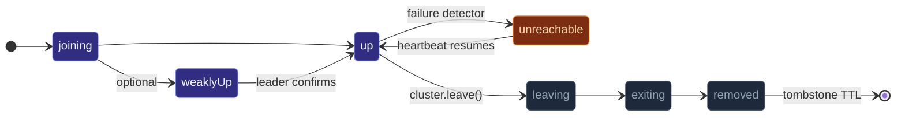

import { Aside } from '@astrojs/starlight/components';

A **cluster** is a group of `ActorSystem`s — typically one per node —
that know about each other.  Nodes gossip their membership state,
detect each other's failures, and route messages across the network.
Once joined, code on any node can `tell` an actor on any other node;
the cluster transport hides the wire.

Two ways to think about it:

- **From the application's perspective**: one logical actor system
  spread across N nodes.  An `ActorRef` can point at an actor on
  any node; the same code that worked single-node still works.
- **From the runtime's perspective**: N independent systems
  exchanging gossip + heartbeats, each tracking who's alive,
  routing messages through a chosen transport.

## A minimal example

`Cluster.bootstrap` packages the four steps you'd otherwise wire by
hand — create the `ActorSystem`, resolve seeds, `Cluster.join`,
hook up `SIGTERM`/`SIGINT` — into a single call:

```ts
import { Cluster, ClusterBootstrapOptions } from 'actor-ts/cluster';

// Local dev — no env vars, no seeds: single-node cluster.
const { system, cluster, shutdown } = await Cluster.bootstrap(ClusterBootstrapOptions.create('my-app'));

// With explicit overrides:
const { system, cluster } = await Cluster.bootstrap(
  ClusterBootstrapOptions.create('my-app')
    .withHost('0.0.0.0')
    .withPort(2552)
    .withSeeds(['node-a:2552', 'node-b:2552'])
    .withRoles(['compute']),
);

// Once joined:
cluster.upMembers();                 // → ReadonlyArray<Member> of up-status nodes
cluster.subscribe((evt) => { /* MemberUp, MemberDown, ... */ });
```

For full control (custom dispatcher, manual signal handling,
own discovery loop) the lower-level pair still works:

```ts
import { ActorSystem } from 'actor-ts';
import { Cluster, ClusterOptions } from 'actor-ts/cluster';

const system  = ActorSystem.create('my-app');
const clusterOptions = ClusterOptions.create()
  .withHost('0.0.0.0')
  .withPort(2552)
  .withSeeds(['node-a:2552', 'node-b:2552']);
const cluster = await Cluster.join(
  system,
  clusterOptions,
);
```

A few settings are doing most of the work:

| Setting | Purpose |
| --- | --- |
| `host` + `port` | The interface and port this node **binds**.  `0.0.0.0` means "every interface" and is the default. |
| `advertisedHost` + `advertisedPort` | The address peers **dial** — this node's identity.  Unset, the host is derived from `host` when that is routable, then from `CLUSTER_HOST` / `POD_IP` / `HOSTNAME`, then loopback; the port is simply `port`. |
| `seeds` | Other nodes' addresses.  At startup, this node contacts them to join the existing cluster.  An empty list = "I'm the first one" (auto-promotes to leader). |
| `roles` | Tags this node carries.  Routers and shard regions can filter on these (`role: 'compute'` skips nodes without the tag). |

<Aside type="tip" title="Bind and advertise are two different addresses">
  Binding `0.0.0.0` is right for a container: it accepts traffic on an
  address it does not know at start-up.  But a wildcard cannot be an
  *identity* — it names every interface, which is to say none of them, so
  every node claiming it would claim the same string.  That is why what
  a node gossips is resolved separately, and never comes out as a
  wildcard.

  On a single machine you can ignore this — naming one routable `host`
  still covers both jobs, and an unconfigured node advertises
  `127.0.0.1`.  In Kubernetes, set the pair: bind `0.0.0.0`, advertise
  `POD_IP`.

  The port splits the same way and almost never needs to.  `advertisedPort`
  is `port` unless something *remapped* it — a published container port,
  where `docker run -p 3000:2552` means peers must dial `3000` while the
  listener opens `2552`.  Kubernetes does not remap: pod-to-pod gossip
  dials the container port directly.
</Aside>

After `Cluster.join` resolves, the node is in the cluster
(though possibly still in `joining` state for a few seconds until
convergence).

## Reaching the cluster from an actor

`Cluster.join` also publishes the instance onto the `ActorSystem`, so
you do not have to thread the handle through every actor that needs it:

```ts
system.cluster;          // Option<Cluster> — None if this system never joined
this.context.cluster;    // the same Option, inside an actor
this.cluster;            // unwrapped, inside an actor — throws if there is none
```

The unwrapped form is the one to use in code that only ever runs
clustered, which includes every sharded entity and every singleton —
those are constructed by the framework, so there is no call site to
inject a cluster at:

```ts
class CartEntity extends Actor<CartMessage> {
  override preStart(): void {
    // No constructor argument, no closure, no options field.
    this.log.info(`cart ${this.entityId} on ${this.cluster.selfAddress}`);
  }

  private onCheckout(): void {
    if (this.cluster.isLeader()) { /* ... */ }
  }
}
```

`this.cluster.sharding` and `this.cluster.singleton` come along with it,
so an actor can start a region or a singleton from the inside.

Reach for `this.context.cluster` instead when the actor must also run on
a plain, unclustered system — it answers `None` rather than throwing.
Both read through to `system.cluster` on each access, so an actor that
outlived the join, or a system that rejoined after `leave()`, always
sees the current instance.


<Aside type="note" title="It stays an Option on purpose">
  A cluster binds a transport and starts gossip, heartbeat and
  failure-detection timers.  `system.cluster` therefore never creates
  one on demand the way a lazily-initialised extension would — a
  local-only system must not grow a cluster just because something
  asked for it.
</Aside>

## The membership states

Every member goes through a small state machine:


```mermaid
stateDiagram-v2
  direction LR
  [*] --> joining
  joining --> weaklyUp: optional
  joining --> up
  weaklyUp --> up: leader confirms
  up --> unreachable: failure detector
  unreachable --> up: heartbeat resumes
  up --> leaving: cluster.leave()
  leaving --> exiting
  exiting --> removed
  removed --> [*]: tombstone TTL
  classDef happy   fill:#312e81,stroke:#818cf8,color:#f1f5f9;
  classDef warn    fill:#7c2d12,stroke:#fb923c,color:#fed7aa;
  classDef gone    fill:#1e293b,stroke:#475569,color:#94a3b8;
  class joining,weaklyUp,up happy
  class unreachable warn
  class leaving,exiting,removed gone
```

- **`joining`** — just announced itself.  Other peers know about it
  but it isn't routable yet.
- **`weakly-up`** *(optional)* — gossip-visible to peers but the
  leader hasn't confirmed it.  Useful for partition-tolerant joins;
  see [Weakly-up](/cluster/weakly-up/).
- **`up`** — fully in the cluster, routable.  This is the
  steady-state status.
- **`unreachable`** — the failure detector flagged this peer as
  not heartbeating.  Still officially a member, but routing avoids
  it.  Transient; flips back to `reachable` if heartbeats resume.
- **`leaving` / `exiting`** — the member is gracefully leaving (via
  `cluster.leave()`).
- **`removed`** — formally evicted.  Kept as a tombstone for a TTL
  (default 24 h) so stale gossip from a slow peer can't accidentally
  resurrect it.

The cluster's events stream surfaces every transition — subscribe
to `MemberUp` / `MemberRemoved` / `MemberUnreachable` etc. and
react.

### Subscribing, and what the replay tells you

`cluster.subscribe(listener)` starts by **replaying the membership
that already exists**, so a listener that attaches ten minutes into a
run still learns the world it joined instead of waiting for the next
change.  Two forms, chosen per subscription:

```ts
import { CurrentClusterState } from 'actor-ts/cluster';

// 'events' (the default) — the membership as the events that built it:
// MemberJoined per member, then the status event that member has reached,
// then LeaderChanged.  The live stream's own handler covers the replay.
cluster.subscribe((evt) => { /* … */ });

// 'snapshot' — one CurrentClusterState, whatever the cluster's size.
cluster.subscribe(
  (evt) => {
    if (evt instanceof CurrentClusterState) {
      console.log(`${evt.members.length} members, ${evt.unreachable.length} unreachable`);
    }
  },
  { replayMode: 'snapshot' },
);
```

Pick `'snapshot'` when the listener wants to know **where things
stand** rather than to re-live how they got there: it is one callback
instead of one per member, and it marks where the replay ends — which
the event form cannot.  `unreachable` is a subset of `members`, not a
set beside it, and `CurrentClusterState` is never published on the
event stream: it describes one subscriber's starting point, not
something that happened to the cluster.

The replay always reflects `getMembers()`: tombstones are excluded,
and every member is announced in the status it actually holds — an
`unreachable` peer replays as unreachable, not as a fresh join.

### The leader

`cluster.leader()` returns the **lowest-addressed** `up` member —
whichever member's `host:port` sorts first.  It is emphatically *not*
the oldest member: address order and join order are unrelated, so a
node that joins last leads immediately if its address sorts lowest, and
it takes over whatever the leader hosts (a cluster singleton, shard
allocation).

That is deliberate.  The one property the leader has to have is that
every node names the same one, and address order gives that from gossip
every node already has — no monotonic join sequence has to travel on
the wire.  The cost is that "who leads" is decided by addressing rather
than uptime: stable across a restart of the same pod, not stable across
a re-address.

## What gossip does

Gossip is how members agree on who's in the cluster.  Every
`gossipIntervalMs` (default 1000 ms), each member picks a random
reachable peer and exchanges its view of the cluster.  Over a few
rounds, every peer converges on the same state — without any
central coordinator.

The protocol carries:

- **Membership table** — every member's address, status, roles,
  and version vector.
- **Reachability observations** — "I haven't heard from X recently."

Two peers exchanging gossip merge their tables by picking the
**higher version** for each member.  This is what makes convergence
work without a leader-elected coordinator: every concurrent update
is eventually seen by every peer.

For the deep dive, see
[Joining and seeds](/cluster/joining-and-seeds/).

## What the failure detector does

The framework uses a simple, deterministic failure detector based
on **elapsed-time thresholds**.  Each member tracks a per-peer
last-seen timestamp — any message counts as a heartbeat; if a
peer goes silent past a threshold, the detector flags it.

- **`unreachableAfterMs`** — once a peer has been silent this
  long, the member is marked `unreachable`.
- **`downAfterMs`** — if the silence persists *this* long, the
  member is downed (split-brain resolution).

Plain elapsed-time limits, no statistical variance tracking —
sufficient for LAN-scale clusters.  See
[Failure detector](/cluster/failure-detector/) for tuning and
the WAN caveats.

## Split-brain and downing

When the network partitions, two halves of the cluster may both
remain operational but lose contact with each other.  Without
intervention, both sides keep running and accept conflicting
writes — the classic split-brain problem.

actor-ts ships several **downing strategies**:

| Strategy | What it does |
| --- | --- |
| `KeepMajority` | The side with more nodes wins; the smaller side downs itself. |
| `KeepOldest` | The side containing the lowest-addressed member wins — "oldest" is address order, not join order. |
| `KeepReferee` | A designated referee node's view wins. |
| `StaticQuorum` | The side that meets a configured quorum size wins; a side below it downs itself. |
| `LeaseMajority` | The majority side wins, but only while it holds a coordination lease. |

See [Downing strategies](/cluster/downing-strategies/) for
the full set.  Pick deliberately — the default (no downing
strategy) requires manual intervention during a partition.

## Cross-node messaging

Once two nodes share a cluster, `ref.tell(message)` to a foreign-node
ref **just works**:

```ts
const remote = await system.actorSelection(
  'actor-ts://my-app@10.0.0.5:2552/user/api/sessions/user-42',
).resolveOne();

remote.tell({ kind: 'whatever' });
// → serialized, sent over the transport, delivered to the foreign actor's mailbox
```

The cluster transport frames the message as a **tagged JSON tree** —
the same format the persistence stores write, so a `Date`, `Map`,
`Set`, `bigint` or `Uint8Array` in the body arrives as itself
(#450) — includes the routing path, and the destination's transport
delivers it.  Reply-to refs serialize cleanly — the receiving node
re-attaches a remote-routable handle so replies flow back over
the same transport.

See [Refs across nodes](/cluster/refs-across-nodes/) for
the wire-format details.

## What sits on top

The cluster module is the foundation; everything *interesting*
about distributed actor systems comes from the extensions that
build on it:

| Extension | What it adds |
| --- | --- |
| **[Sharding](/cluster/sharding/overview/)** | One actor per "entity key," distributed across nodes, with automatic rebalancing on membership changes. |
| **[Singleton](/cluster/singleton/overview/)** | One actor cluster-wide.  Re-spawned elsewhere if the host node leaves. |
| **[DistributedPubSub](/cluster/pubsub/)** | Topic-based fan-out across the cluster. |
| **[DistributedData](/distributed-data/overview/)** | CRDT-based shared state with eventual consistency. |
| **[Cluster router](/cluster/cluster-router/)** | Routes messages across cluster-up-members at a well-known path. |
| **[Receptionist](/discovery/receptionist/)** | Service registry — actors register, others look up by key. |

You don't enable these by default; you reach for them when needed.
This page covers the foundation they all share — once you
understand membership, gossip, and failure detection, the
extensions follow.

## Single-node mode

A "cluster" of one node is **valid**.  Calling `Cluster.join` with
no seeds (or seeds that are unreachable) gives you a singleton
cluster — the local node auto-promotes to leader, becomes `up`,
and every extension that depends on cluster (sharding, singleton,
pubsub) works as if it were in a larger cluster.

This means cluster code can be developed and tested with a single
node; you don't need a Docker Compose setup to get started.  Add
more nodes later by giving them seeds pointing at the first.

## When to use the cluster

Three primary motivations:

1. **Scale-out**: more actors than one node's memory or CPU can
   handle.  Sharding distributes them.
2. **Fault tolerance**: if one node dies, the work moves to
   another.  Singleton and sharding handle the failover.
3. **Geographic distribution**: actors near their users or data,
   coordinating with the rest of the cluster over the WAN.

For a single-process app, you don't need the cluster module.  For
a multi-process app where each process holds independent state,
you don't need it either — just use process boundaries.  Reach for
it when you genuinely need **shared logical state across multiple
machines**.

<Aside type="caution" title="Cluster joining isn't instant">
  ```ts
  const cluster = await Cluster.join(system, options);
  someActor.tell({ kind: 'broadcast' });
  // ↑ broadcast might race ahead of MemberUp for some peers
  ```
  `Cluster.join` resolves once *this node* has finished joining,
  but peers' views converge over the next few gossip rounds (a
  few hundred milliseconds at default cadence).  If startup logic
  needs every peer to know about this node, subscribe to
  `SelfUp` and act in its handler.
</Aside>

<Aside type="caution" title="Don't run two clusters with the same name in conflict">
  Two `ActorSystem`s with the same name + overlapping seeds will
  join each other.  Use distinct system names for unrelated
  clusters running in the same network, or run separate
  transports with different ports.
</Aside>

## Where to next

- **[Joining and seeds](/cluster/joining-and-seeds/)** —
  the join protocol, seed-node configuration, what happens if all
  seeds are unreachable.
- **[Sharding overview](/cluster/sharding/overview/)** —
  one-actor-per-entity-key with automatic rebalancing.
- **[Singleton overview](/cluster/singleton/overview/)** —
  exactly-one cluster-wide.
- **[Distributed data overview](/distributed-data/overview/)** —
  shared state via CRDTs.
- **[Failure detector](/cluster/failure-detector/)** — the
  elapsed-time heartbeat mechanism.
- **[Downing strategies](/cluster/downing-strategies/)** —
  resolving split-brain.

The [`Cluster`](/api/classes/cluster/) API reference covers
the join/leave/subscribe surface.
