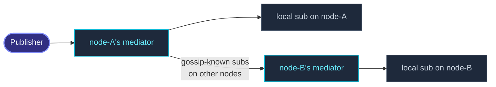

`DistributedPubSub` is the **cluster-wide** version of the local
event stream — pub/sub by topic name, working across nodes.



Each node hosts a **mediator** at a well-known path
(`/user/pubsub-mediator`).  Subscribers register with their local
mediator; mediators gossip the topic→node map.  Publishing sends
the message to the local mediator, which fans out to every node
that has subscribers for that topic.

## A minimal example

```ts
import { ActorSystem, Cluster, Props, Actor } from 'actor-ts';
import { DistributedPubSub, type DistributedPubSubMediator, Publish, Subscribe } from 'actor-ts/cluster/pubsub';

class ChatMessage {
  constructor(public readonly user: string, public readonly text: string) {}
}

class ChatRoom extends Actor<ChatMessage> {
  override onReceive(msg: ChatMessage): void {
    this.log.info(`[chat] ${msg.user}: ${msg.text}`);
  }
}

const system  = ActorSystem.create('my-app');
const cluster = await Cluster.join(system, { host, port, seeds });
const ps      = DistributedPubSub.start(system, { cluster });

// Subscribe (typically in an actor's preStart):
const room = system.actorOf(Props.create(() => new ChatRoom()));
ps.mediator.tell(new Subscribe('chat.room.general', room));

// Publish (anywhere — from any node, in or out of an actor):
ps.mediator.tell(new Publish('chat.room.general', new ChatMessage('alice', 'hi')));
```

The publish reaches every subscriber, on every node — the alice
message arrives at `room` regardless of which node hosted the
publisher.

## The four operations

| Message | What |
| --- | --- |
| `Subscribe(topic, ref)` | Register `ref` as a subscriber to `topic`.  Replies with `SubscribeAck`. |
| `Unsubscribe(topic, ref)` | Remove `ref` from `topic`'s subscribers. |
| `UnsubscribeAll(ref)` | Remove `ref` from every topic. |
| `Publish(topic, message)` | Send `message` to every subscriber of `topic`. |

Send these to `ps.mediator` (an `ActorRef`).  Use `ask` if you
need the ack:

```ts
import { ask } from 'actor-ts';

await ask(ps.mediator, new Subscribe('chat.room.general', room));
```

## Topics

Topic names are **arbitrary strings**.  The framework doesn't
impose structure — `chat.room.general`, `user-42.events`,
`metrics-tier-1` all work.

For organization, a dot-segmented convention works well
(`<domain>.<scope>.<resource>`), but the framework doesn't
interpret the segments — it's just string matching.

## How fan-out works

On `Publish(topic, msg)`:

1. The local mediator looks up the topic in its `Map<topic,
   { local, remoteNodes }>`.
2. **Local subscribers** receive directly — `local.values()`,
   each gets a `tell`.
3. **Remote nodes** with subscribers get one envelope per node
   (not per subscriber) — the mediator on the destination node
   fans out to its locals.

This gives **at-most-one-remote-hop** delivery: a publish never
chains through multiple nodes to reach a subscriber.

## Topic→node gossip

The mediator keeps its `Map<topic, SubscriberSet>` local, but
**gossips deltas** to peers:

- "Node X now has subscribers for topic Y."
- "Node X no longer has subscribers for topic Y."

Default gossip interval is the cluster's `gossipIntervalMs` (1
second).  Override per-mediator:

```ts
DistributedPubSub.start(system, { cluster, gossipIntervalMs: 500 });
```

Lower intervals → faster convergence after subscribe / unsubscribe,
more chatter.  500 ms is reasonable for chat-style use cases.

## When subscribers stop

The mediator **doesn't automatically unsubscribe** stopped refs.
If a subscriber actor stops without sending `Unsubscribe`, the
mediator keeps trying to `tell` it — messages go to dead letters,
the system logs warnings.

Best practice: in the subscriber's `postStop`, send `Unsubscribe`
or `UnsubscribeAll`:

```ts
class Subscriber extends Actor<...> {
  override preStart(): void {
    this.system.extension(...).mediator.tell(new Subscribe('topic', this.self));
  }
  override postStop(): void {
    this.system.extension(...).mediator.tell(new UnsubscribeAll(this.self));
  }
}
```

The cleanup isn't strictly necessary — dead-letter routing is
silent on the publishers — but it prevents log noise and unused
state in the mediator.

## When to use DistributedPubSub

Three good fits:

1. **Chat / notifications** — multiple subscribers (often on
   different nodes) interested in the same topic.
2. **System-wide announcements** — a "schema-updated" event that
   every node should react to.
3. **De-coupled fan-out across nodes** — when the publisher
   shouldn't know how many subscribers exist or where they live.

## When NOT

import { Aside } from '@astrojs/starlight/components';

<Aside type="caution" title="Single-recipient routing">
  ```ts
  ps.mediator.tell(new Publish('one-receiver', msg));
  ```
  If you know there's exactly one subscriber, just hold its ref
  and `tell` directly.  Pubsub adds an extra hop and gossip
  overhead for no benefit.
</Aside>

<Aside type="caution" title="High-frequency in-band data">
  ```ts
  // Every metric tick → publish to "metrics-stream"
  for (const metric of all)
    ps.mediator.tell(new Publish('metrics-stream', metric));
  ```
  Pubsub serializes the message into envelopes + walks the
  subscriber set per publish.  At thousands per second, the
  overhead dominates.  For metrics-style streams, use a dedicated
  metrics pipeline (Prometheus push, OTel) or DistributedData if
  the data fits a CRDT.
</Aside>

<Aside type="caution" title="Don't subscribe non-local refs">
  ```ts
  ps.mediator.tell(new Subscribe('topic', someRemoteRef));   // ✗
  ```
  Each subscriber should be on the same node as the mediator
  that handles their subscribe.  The mediator's local-fanout
  logic assumes locality; cross-node subscribers route through
  *another* mediator anyway.  Subscribe from the subscriber's
  side, not centrally.
</Aside>

<Aside type="caution" title="Gossip lag means subscribers miss messages early">
  ```ts
  ps.mediator.tell(new Subscribe('topic', sub));
  ps.mediator.tell(new Publish('topic', msg));   // ↑ same node — sub gets it
  // But: a publish on ANOTHER node right after Subscribe might miss `sub`
  ```
  The subscription has to gossip to the publisher's mediator
  before a publish on that mediator routes back.  Within 1-2
  gossip intervals (1-2 s default), convergence happens.  For
  must-not-miss messages, await `SubscribeAck` and add a small
  delay before the first publish across nodes.
</Aside>

## DistributedPubSub vs event-stream

Two pub/sub bus implementations; pick by scope:

| Bus | Scope | Topic key |
| --- | --- | --- |
| [Event stream](/fundamentals/event-stream/) | One ActorSystem | Class (`instanceof`) |
| `DistributedPubSub` | Cluster-wide | String topic |

Use the event stream for in-system dispatch; use DistributedPubSub
when topics span nodes.  Both can coexist — many apps use both for
different concerns.

## Where to next

- **[Cluster overview](/cluster/overview/)** — the
  membership underneath.
- **[Event stream](/fundamentals/event-stream/)** — the
  single-system pub/sub for comparison.
- **[Refs across nodes](/cluster/refs-across-nodes/)** —
  how the mediator's cross-node deliveries serialize.

The [`DistributedPubSubMediator`](/api/classes/distributedpubsubmediator/)
API reference covers the full protocol.
