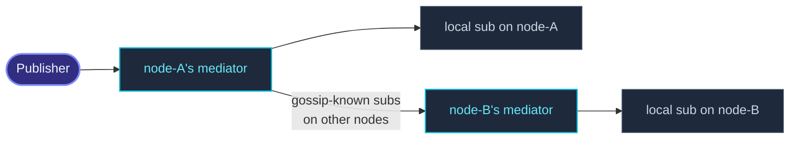

import { Aside } from '@astrojs/starlight/components';

`DistributedPubSub` is the **cluster-wide** version of the local
event stream — pub/sub by topic name, working across nodes.


```mermaid
flowchart LR
  PUB(["Publisher"])
  MA["node-A's mediator"]
  SA["local sub on node-A"]
  MB["node-B's mediator"]
  SB["local sub on node-B"]
  PUB --> MA
  MA --> SA
  MA -- "gossip-known subs<br/>on other nodes" --> MB
  MB --> SB
  classDef pub fill:#312e81,stroke:#818cf8,stroke-width:2px,color:#f1f5f9;
  classDef med fill:#1e293b,stroke:#06b6d4,stroke-width:1.5px,color:#67e8f9;
  classDef sub fill:#1e293b,stroke:#475569,color:#cbd5e1;
  class PUB pub
  class MA,MB med
  class SA,SB sub
```

Each node hosts a **mediator** at a well-known path
(`/system/cluster/pubsub/mediator`).  Subscribers register with their local
mediator; mediators gossip the topic→node map.  Publishing sends
the message to the local mediator, which fans out to every node
that has subscribers for that topic.

## A minimal example

```ts
import { ActorSystem, Cluster, ClusterOptions, Actor } from 'actor-ts';
import { DistributedPubSubId, type DistributedPubSubMediator, Publish, Subscribe } from 'actor-ts/cluster/pubsub';

class ChatMessage {
  constructor(public readonly user: string, public readonly text: string) {}
}

class ChatRoom extends Actor<ChatMessage> {
  override onReceive(message: ChatMessage): void {
    this.log.info(`[chat] ${message.user}: ${message.text}`);
  }
}

const system  = ActorSystem.create('my-app');
const clusterOptions = ClusterOptions.create()
  .withHost(host)
  .withPort(port)
  .withSeeds(seeds);
const cluster = await Cluster.join(system, clusterOptions);
const ps      = system.extension(DistributedPubSubId);
ps.start(cluster);

// Subscribe (typically in an actor's preStart):
const room = system.spawnAnonymous(ChatRoom);
ps.mediator.tell(new Subscribe('chat.room.general', room));

// Publish (anywhere — from any node, in or out of an actor):
ps.mediator.tell(new Publish('chat.room.general', new ChatMessage('alice', 'hi')));
```

The publish reaches every subscriber, on every node — the alice
message arrives at `room` regardless of which node hosted the
publisher.

## The four operations

| Message | What |
| --- | --- |
| `Subscribe(topic, ref, replyTo?)` | Register `ref` as a subscriber to `topic`.  Answers `replyTo` (or the sender) with `SubscribeAcknowledgment` — or `SubscribeRejected` when a cap is full. |
| `Unsubscribe(topic, ref)` | Remove `ref` from `topic`'s subscribers. |
| `UnsubscribeAll(ref)` | Remove `ref` from every topic. |
| `Publish(topic, message, delivery?)` | Send `message` to every subscriber of `topic` — or, with `delivery = 'one-subscriber'`, to exactly one. |

Send these to `ps.mediator` (an `ActorRef`).  Use `ask` if you
need the ack:

```ts
import {} from 'actor-ts';

await ps.mediator.ask(new Subscribe('chat.room.general', room));
```

`Subscribe` takes an optional third argument, `replyTo`, naming
where the acknowledgment or the refusal goes.  Without it the
answer follows `context.sender` — which is **empty** for the
`mediator.tell(…)` shape above, called from outside an actor.  Name
a `replyTo` whenever you want to see the answer:

```ts
ps.mediator.tell(new Subscribe('chat.room.general', room, room));
```

## Topics

Topic names are **arbitrary strings**.  The framework doesn't
impose structure — `chat.room.general`, `user-42.events`,
`metrics-tier-1` all work.

For organization, a dot-segmented convention works well
(`<domain>.<scope>.<resource>`), but the framework doesn't
interpret the segments — it's just string matching.

## How fan-out works

On `Publish(topic, message)`:

1. The local mediator looks up the topic in its `Map<topic,
   { local, remoteNodes }>`.
2. **Local subscribers** receive directly — `local.values()`,
   each gets a `tell`.
3. **Remote nodes** with subscribers get one envelope per node
   (not per subscriber) — the mediator on the destination node
   fans out to its locals.

This gives **at-most-one-remote-hop** delivery: a publish never
chains through multiple nodes to reach a subscriber.

## Anycast — one subscriber instead of all

A third argument switches `Publish` from broadcast to **anycast**:
exactly one subscriber, cluster-wide, receives the message.

```ts
// Every worker joins the same topic…
ps.mediator.tell(new Subscribe('jobs', worker));

// …and each task is handled once, by one of them.
ps.mediator.tell(new Publish('jobs', new RenderThumbnail(id), 'one-subscriber'));
```

That is the work-queue shape: N workers spread over the cluster,
every task handled exactly once, and no worker needs to know how
many others exist. The default stays `'all-subscribers'`, so a
`Publish` written without the third argument is unchanged.

**How the one is chosen.** The mediator builds a candidate list —
each local subscriber counts once, each remote node claiming the
topic counts once — and walks it in rotation, one step per publish.
Two consequences worth knowing:

- **It is a rotation, not a draw.** Ten tasks over three workers
  land 4/3/3, not "probably roughly even". Restarting the publisher
  restarts the rotation; it is per-topic state on the mediator, not
  a cluster-wide sequence.
- **Remote nodes count as one candidate each, not one per
  subscriber.** A node with ten subscribers gets the same share as
  a node with one, because the gossip frame carries topic names and
  not subscriber counts (that is what keeps it small). Within the
  chosen node, its own rotation picks the subscriber. Keep worker
  counts roughly even across nodes if the balance matters.

An anycast that finds no candidate — no local subscriber and no
remote claimant — goes to dead letters like any other unrouted
publish. So does one that crossed a hop and found the far node's
subscribers already gone: it is **not** re-routed, because a second
hop would trade the at-most-one-hop guarantee for a race against
the gossip round that is about to correct the sender anyway.

<Aside type="note" title="Anycast is not a router replacement">
  For load-balancing across a *known* actor pool, a
  [ClusterRouter](/cluster/cluster-router/) is the better fit — it
  routes at node granularity with real strategies (round-robin,
  consistent hashing, smallest-mailbox). Anycast earns its place
  when the recipient set is **dynamic**: subscribers register and
  leave at runtime and the publisher never names them.
</Aside>

## Topic→node gossip

The mediator keeps its `Map<topic, SubscriberSet>` local, but
**gossips deltas** to peers:

- "Node X now has subscribers for topic Y."
- "Node X no longer has subscribers for topic Y."

Default gossip interval is the cluster's `gossipIntervalMs` (1
second).  Override per-mediator:

```ts
const distributedPubSubOptions = DistributedPubSubOptions.create().withGossipIntervalMs(500);
system.extension(DistributedPubSubId).start(cluster, distributedPubSubOptions);
```

Lower intervals → faster convergence after subscribe / unsubscribe,
more chatter.  500 ms is reasonable for chat-style use cases.

## When subscribers stop

The mediator **watches every local subscriber**.  A subscriber that
stops without sending `Unsubscribe` — a crash, a forgotten cleanup,
an actor spawned per request — is removed as soon as the
`Terminated` lands, and the topic is dropped with its last
subscriber.

Unsubscribing explicitly is still the faster path, and it is the
only way to leave a topic without stopping:

```ts
class Subscriber extends Actor<...> {
  override preStart(): void {
    this.system.extension(...).mediator.tell(new Subscribe('topic', this.self));
  }
  override postStop(): void {
    this.system.extension(...).mediator.tell(new UnsubscribeAll(this.self));
  }
}
```

## Bounded registries

The mediator holds three things that a subscriber — or a peer's
gossip — could otherwise grow without end, and publish fan-out
walks all three.  Each has a cap:

| Option | HOCON leaf | Default | Bounds |
| --- | --- | --- | --- |
| `maxSubscribersPerTopic` | `cluster.pub-sub.max-subscribers-per-topic` | `10000` | Local subscribers on one topic |
| `maxTopics` | `cluster.pub-sub.max-topics` | `10000` | Distinct topics on this mediator |
| `maxRemoteNodesPerTopic` | `cluster.pub-sub.max-remote-nodes-per-topic` | `1000` | Peers claiming subscribers for one topic |

```ts
const distributedPubSubOptions = DistributedPubSubOptions.create()
  .withMaxSubscribersPerTopic(500)
  .withMaxTopics(1_000);
system.extension(DistributedPubSubId).start(cluster, distributedPubSubOptions);
```

A `Subscribe` over `maxSubscribersPerTopic` or `maxTopics` is
**refused, not dropped** — the reply is a `SubscribeRejected`
carrying the cap that refused it:

```ts
import { SubscribeRejected } from 'actor-ts';

// message.reason: 'maxSubscribersPerTopic' | 'maxTopics'
// message.limit:  the value that cap is set to
```

`maxTopics` and `maxRemoteNodesPerTopic` apply to **gossip** as
well, and that is the half worth knowing about: a peer announcing
100 000 topics it claims to have subscribers for used to allocate
100 000 entries on every receiving node, with no local `Subscribe`
involved anywhere.  Claims over a cap are dropped and logged; the
connection stays up, because one noisy peer should not cost a
healthy link.

## Publishes that reach nobody

A `Publish` to a topic with no local subscribers and no remote
claimants goes to `system.deadLetters` — as does one that crossed
a hop and found no subscriber at the far end.

```ts
system.eventStream.subscribe(monitor, DeadLetter);
```

This is on by default.  A mistyped topic name and a topic whose
subscribers have not gossiped in yet look identical from the
publisher's side, and this is what tells them apart.  Turn it off
for a deployment where unrouted publishes are expected and the
volume would be noise:

```hocon
actor-ts.cluster.pub-sub.send-to-dead-letters-when-no-subscribers = off
```

## When to use DistributedPubSub

Four good fits:

1. **Chat / notifications** — multiple subscribers (often on
   different nodes) interested in the same topic.
2. **System-wide announcements** — a "schema-updated" event that
   every node should react to.
3. **De-coupled fan-out across nodes** — when the publisher
   shouldn't know how many subscribers exist or where they live.
4. **Work queues over a dynamic worker set** — with
   `'one-subscriber'` delivery, workers join and leave a topic at
   runtime and every task is handled once.

## When NOT

<Aside type="caution" title="Single-recipient routing">
  ```ts
  ps.mediator.tell(new Publish('one-receiver', message));
  ```
  If you know there's exactly one subscriber, just hold its ref
  and `tell` directly.  Pubsub adds an extra hop and gossip
  overhead for no benefit.  Wanting one *of many* subscribers is
  a different thing — that's `'one-subscriber'` delivery, and it
  is a good reason to use pubsub.
</Aside>

<Aside type="caution" title="High-frequency in-band data">
  ```ts
  // Every metric tick → publish to "metrics-stream"
  for (const metric of all)
    ps.mediator.tell(new Publish('metrics-stream', metric));
  ```
  Pubsub serializes the message into envelopes + walks the
  subscriber set per publish.  At thousands per second, the
  overhead dominates.  For metrics-style streams, use a dedicated
  metrics pipeline (Prometheus push, OTel) or DistributedData if
  the data fits a CRDT.
</Aside>

<Aside type="caution" title="Don't subscribe non-local refs">
  ```ts
  ps.mediator.tell(new Subscribe('topic', someRemoteRef));   // ✗
  ```
  Each subscriber should be on the same node as the mediator
  that handles their subscribe.  The mediator's local-fanout
  logic assumes locality; cross-node subscribers route through
  *another* mediator anyway.  Subscribe from the subscriber's
  side, not centrally.
</Aside>

<Aside type="caution" title="Gossip lag means subscribers miss messages early">
  ```ts
  ps.mediator.tell(new Subscribe('topic', sub));
  ps.mediator.tell(new Publish('topic', message));   // ↑ same node — sub gets it
  // But: a publish on ANOTHER node right after Subscribe might miss `sub`
  ```
  The subscription has to gossip to the publisher's mediator
  before a publish on that mediator routes back.  Within 1-2
  gossip intervals (1-2 s default), convergence happens.  For
  must-not-miss messages, await `SubscribeAcknowledgment` and add a small
  delay before the first publish across nodes.
</Aside>

## DistributedPubSub vs event-stream

Two pub/sub bus implementations; pick by scope:

| Bus | Scope | Topic key |
| --- | --- | --- |
| [Event stream](/fundamentals/event-stream/) | One ActorSystem | Class (`instanceof`) |
| `DistributedPubSub` | Cluster-wide | String topic |

Use the event stream for in-system dispatch; use DistributedPubSub
when topics span nodes.  Both can coexist — many apps use both for
different concerns.

## Where to next

- **[Cluster overview](/cluster/overview/)** — the
  membership underneath.
- **[Event stream](/fundamentals/event-stream/)** — the
  single-system pub/sub for comparison.
- **[Refs across nodes](/cluster/refs-across-nodes/)** —
  how the mediator's cross-node deliveries serialize.

The [`DistributedPubSubMediator`](/api/classes/distributedpubsubmediator/)
API reference covers the full protocol.
