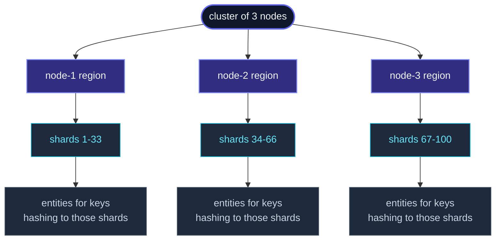

**Cluster sharding** is the framework's answer to "I have a few
million entities, each needing its own actor, scattered across N
nodes."  Examples: per-user sessions, per-IoT-device controllers,
per-order coordinators, per-game-room actors.

The user gives the framework a way to extract an **entity ID**
from each message; the framework hashes that ID to a **shard**;
the **coordinator** decides which node hosts that shard; the
node's local **region** spawns the entity actor on demand.  When
nodes come and go, the coordinator rebalances shards across the
new topology.



Each entity is **one actor**, on **one node**, at a time — just
like a singleton, but scaled to N entities at once.  Failover
happens automatically: when a node leaves, its shards move
elsewhere and the entities re-spawn there.

## A minimal example

```ts
import { Actor, ActorSystem, Cluster, ClusterSharding } from 'actor-ts';

type CartCmd =
  | { entityId: string; kind: 'add';   sku: string }
  | { entityId: string; kind: 'view';  replyTo: ActorRef<Cart> };

class CartActor extends Actor<CartCmd> {
  private items: string[] = [];

  override onReceive(cmd: CartCmd): void {
    if (cmd.kind === 'add')  this.items.push(cmd.sku);
    if (cmd.kind === 'view') cmd.replyTo.tell({ items: this.items });
  }
}

// Setup:
const system  = ActorSystem.create('my-app');
const cluster = await Cluster.join(system, { host, port, seeds });
const sharding = ClusterSharding.get(system, cluster);

// Shorthand — pass the entity class, framework wraps it in Props.create:
const cartRegion = sharding.start('cart', CartActor, {
  extractEntityId: (msg: CartCmd) => msg.entityId,
});

// Usage — `tell` to the region, with entity ID inside the message:
cartRegion.tell({ entityId: 'user-42', kind: 'add', sku: 'book-1' });
cartRegion.tell({ entityId: 'user-42', kind: 'view', replyTo: ... });
//                          ^^^^^^^^^^
// Same ID → same entity actor, every time, regardless of node.
```

`sharding.start()` accepts three calling shapes — pick whichever
fits the entity:

```ts
// 1. Class shorthand (most common):
sharding.start('cart', CartActor, { extractEntityId: (m: CartCmd) => m.entityId });

// 2. Factory shorthand — when the entity needs constructor args:
sharding.start('cart', () => new CartActor(deps), {
  extractEntityId: (m: CartCmd) => m.entityId,
});

// 3. Full-form — explicit Props + every setting:
sharding.start<CartCmd>({
  typeName:        'cart',
  entityProps:     Props.create(() => new CartActor()),
  extractEntityId: (m) => m.entityId,
  numShards:       16,
  role:            'cart-host',
});
```

The `cartRegion` is a single `ActorRef` from the caller's
perspective.  Behind the scenes:

1. The region computes a shard from `entityId` (default: hash to
   one of 100 shards).
2. It asks the coordinator "who owns this shard?"
3. If the owner is *this* node, it spawns the entity (if not
   already present) and forwards the message.
4. If the owner is *another* node, it forwards over the cluster
   transport to that node's region, which does the same.

## The three actors at play

| Actor | Role |
| --- | --- |
| **Region** | One per node.  Routes messages to the right shard's owner, hosts local entities. |
| **Coordinator** | One per cluster (singleton, on the leader).  Decides which node owns each shard.  Handles rebalancing on membership changes. |
| **Entity** | One per `entityId`.  Hosted on whichever node currently owns the shard the ID hashes to. |

Each level has its own page in the cluster section — see
[ShardRegion](/cluster/sharding/), the
[allocation strategy](/cluster/sharding/allocation-strategy/),
and [rebalance](/cluster/sharding/rebalance/) for the
mechanics.

## Configuration

`ShardingSettings<TMsg>` — the fields you'll most often touch:

```ts
interface ShardingSettings<TMsg> {
  typeName:               string;
  entityProps:            Props<TMsg>;
  extractEntityId:        (message: TMsg) => string;
  extractEntityMessage?:  (message: TMsg) => unknown;
  numShards?:             number;             // default 100
  role?:                  string;             // restrict to nodes carrying this role
  proxy?:                 boolean;            // route-only, no local entities
  rememberEntities?:      boolean;            // re-spawn entities on failover (#)
  passivationIdleMs?:     number;             // auto-stop idle entities
  maxEntities?:           number;             // LRU cap per node
}
```

| Field | What it controls |
| --- | --- |
| `typeName` | A string identifying this sharded type.  Different types can coexist in the same cluster (`cart`, `session`, `order`). |
| `extractEntityId(msg)` | Pull the entity ID from a message.  This is the key that gets hashed to a shard. |
| `extractEntityMessage(msg)` | *(Optional)* If the message envelope contains routing info plus a payload, this strips the envelope before the entity sees it.  Defaults to the message as-is. |
| `numShards` | How many shards the entity space is divided into.  100 is fine for most clusters; bump to 1000 for very large clusters (>50 nodes). |
| `role` | Only members with this role host shards of this type.  Useful for placing compute-heavy entities on dedicated nodes. |
| `proxy` | This node *forwards* messages to the region but never hosts entities locally.  Used for client nodes in an asymmetric cluster. |
| `rememberEntities` | Persist the set of *active* entity IDs.  After a coordinator failover (or full cluster restart), those IDs are spawned eagerly so messages don't have to recreate the entire fleet. |
| `passivationIdleMs` | Stop an entity after this much idle time.  Frees memory; next message for the same ID re-creates the entity. |
| `maxEntities` | Per-node cap.  When exceeded, the LRU entity is passivated. |

The defaults are sensible for small clusters.  For production, you
usually want `rememberEntities: true` and a `passivationIdleMs`
matched to your traffic pattern.

## Passivation

```ts
import { Passivate, Actor } from 'actor-ts';

class CartActor extends Actor<CartCmd | Passivate> {
  override onReceive(msg): void {
    if (msg instanceof Passivate) {
      // Optionally do shutdown work, then send the passivate ack.
      this.context.parent.forEach(p => p.tell({ kind: 'passivate-ack' }));
      return;
    }
    // ...
  }
}
```

When `passivationIdleMs` is configured (or `maxEntities` is hit),
the region sends `Passivate` to the entity.  The entity acks; the
region stops it and ensures buffered messages for the same ID are
drained to the next incarnation when it spawns.

If you want fully manual control, send the parent a
`{ kind: 'passivate' }` message yourself.

## Rebalancing

When the cluster topology changes (a node joins or leaves), the
coordinator runs a rebalance pass:

1. Compute the new shard-to-node assignment from the active
   allocation strategy (default: hash mod regions).
2. For each shard that moved, tell the *old* region to **hand
   off** the shard.
3. The old region stops its entities (which may persist their
   state), tells the coordinator "handoff complete," and stops
   routing for that shard.
4. The new region spawns entities for that shard on demand as
   messages arrive.

The handoff isn't instant — buffered messages wait for the
"handoff complete" signal before being forwarded to the new
owner.  This avoids messages racing past a half-moved entity.

See [Rebalance](/cluster/sharding/rebalance/) for the
full protocol.

## State across failover

Sharded entities are subject to the same restart semantics as
any other actor — when an entity moves to a new node, the new
instance starts with a clean slate.

For state that should survive:

- **`PersistentActor`** — the entity persists events to a
  journal; on a fresh node, it replays the journal at startup.
  See [PersistentActor](/persistence/persistent-actor/).
- **`DurableStateActor`** — simpler: persist the current state
  snapshot; restore on restart.  See
  [DurableState](/persistence/durable-state/).
- **`DistributedData`** — for state that should be readable from
  *any* node (not just the entity's current host), use a CRDT in
  the DD replicator instead.

Without one of these, sharding gives you placement and routing,
not durability.

## When to reach for sharding

Three good fits:

1. **Per-user / per-tenant state** that's too much for one node
   to hold but doesn't need to be readable from everywhere
   simultaneously.
2. **Per-entity workflows** — sagas, order processing,
   long-running coordinators — that benefit from per-key
   serialization.
3. **Hotspots that follow keys** — a streaming pipeline where
   each user's events should be processed in order on a single
   actor.

## When NOT to use sharding

import { Aside } from '@astrojs/starlight/components';

<Aside type="caution" title="No natural key">
  ```ts
  extractEntityId: () => 'singleton';   // ← all messages go to one entity
  ```
  If every message ends up routing to the same entity, you have a
  singleton, not sharding.  Use
  [ClusterSingleton](/cluster/singleton/overview/) instead
  — it's the right tool for one-actor-cluster-wide.
</Aside>

<Aside type="caution" title="Few entities, each huge">
  Sharding amortizes coordination overhead across many entities.
  For 5-10 fat-state actors, just spawn them with deterministic
  paths and use `ClusterRouter` if fan-out matters; the sharding
  coordinator's bookkeeping isn't worth it.
</Aside>

<Aside type="caution" title="Order-sensitive workloads across many entities">
  Sharding gives per-*entity* order but not global order.  If
  cross-entity ordering matters (rare), you need a different
  pattern — either one entity per ordering scope, or an explicit
  sequencer actor.
</Aside>

## Where to next

- **[ShardRegion](/cluster/sharding/) ** *(stub)* — the
  per-node region actor; configuration deep dive.
- **[Allocation strategy](/cluster/sharding/allocation-strategy/)** —
  default hash-mod-regions, custom strategies.
- **[Rebalance](/cluster/sharding/rebalance/)** — the
  handoff protocol.
- **[Remember entities](/cluster/sharding/remember-entities/)** —
  persistent entity-registry for fast recovery.
- **[Singleton overview](/cluster/singleton/overview/)** —
  for one-actor-cluster-wide.
- **[Sharded daemon process](/cluster/sharding/sharded-daemon-process/)** —
  fixed-count workers distributed by sharding.

The [`ClusterSharding`](/api/classes/clustersharding/)
API reference covers the full surface.
