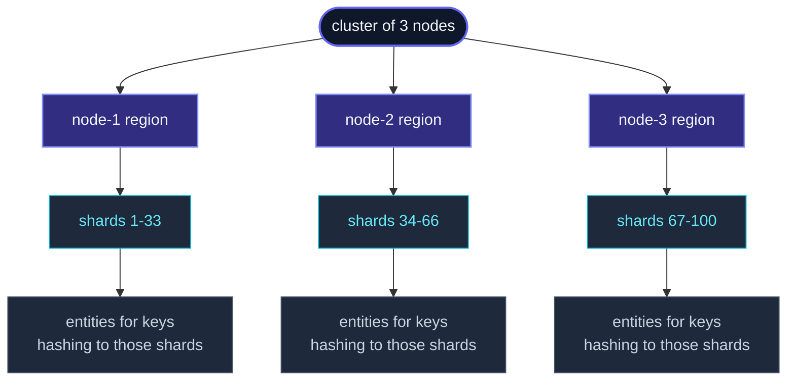

**Cluster sharding** is the framework's answer to "I have a few
million entities, each needing its own actor, scattered across N
nodes."  Examples: per-user sessions, per-IoT-device controllers,
per-order coordinators, per-game-room actors.

The user gives the framework a way to extract an **entity ID**
from each message; the framework hashes that ID to a **shard**;
the **coordinator** decides which node hosts that shard; the
node's local **region** routes to that **shard**, which spawns the
entity actor on demand.  When
nodes come and go, the coordinator rebalances shards across the
new topology.


```mermaid
flowchart TB
  CLUSTER(["cluster of 3 nodes"])
  N1["node-1 region"]
  N2["node-2 region"]
  N3["node-3 region"]
  S1["shards 1-33"]
  S2["shards 34-66"]
  S3["shards 67-100"]
  E1["entities for keys<br/>hashing to those shards"]
  E2["entities for keys<br/>hashing to those shards"]
  E3["entities for keys<br/>hashing to those shards"]
  CLUSTER --> N1
  CLUSTER --> N2
  CLUSTER --> N3
  N1 --> S1 --> E1
  N2 --> S2 --> E2
  N3 --> S3 --> E3
  classDef cluster fill:#0f172a,stroke:#6366f1,stroke-width:2px,color:#f1f5f9;
  classDef region  fill:#312e81,stroke:#818cf8,stroke-width:1.5px,color:#f1f5f9;
  classDef shard   fill:#1e293b,stroke:#06b6d4,color:#67e8f9;
  classDef entity  fill:#1e293b,stroke:#475569,color:#cbd5e1;
  class CLUSTER cluster
  class N1,N2,N3 region
  class S1,S2,S3 shard
  class E1,E2,E3 entity
```

Each entity is **one actor**, on **one node**, at a time — just
like a singleton, but scaled to N entities at once.  Failover
happens automatically: when a node leaves, its shards move
elsewhere and the entities re-spawn there.

## A minimal example

```ts
import { match } from 'ts-pattern';
import { Actor } from 'actor-ts';
import { Cluster, ClusterBootstrapOptions, StartShardingOptions } from 'actor-ts/cluster';

type AddCommand = { entityId: string; kind: 'add'; sku: string };
type ViewCommand = { entityId: string; kind: 'view'; replyTo: ActorRef<Cart> };
type CartCommand = AddCommand | ViewCommand;

class CartActor extends Actor<CartCommand> {
  private items: string[] = [];

  override onReceive(command: CartCommand): void {
    match(command)
      .with({ kind: 'add' }, (c) => this.onAdd(c))
      .with({ kind: 'view' }, (c) => this.onView(c))
      .exhaustive();
  }

  private onAdd(command: AddCommand): void { this.items.push(command.sku); }
  private onView(command: ViewCommand): void { command.replyTo.tell({ items: this.items }); }
}

// Setup — one-line cluster + sharding entry point:
const { system, cluster } = await Cluster.bootstrap(ClusterBootstrapOptions.create('my-app'));

const startShardingOptions = StartShardingOptions.create<CartCommand>().withExtractEntityId((message) => message.entityId);
const cartRegion = cluster.sharding.start('cart', CartActor,
  startShardingOptions);

// Usage — `tell` to the region, with entity ID inside the message:
cartRegion.tell({ entityId: 'user-42', kind: 'add', sku: 'book-1' });
cartRegion.tell({ entityId: 'user-42', kind: 'view', replyTo: ... });
//                          ^^^^^^^^^^
// Same ID → same entity actor, every time, regardless of node.
```

`cluster.sharding.start()` accepts several calling shapes — pick
whichever fits the entity.  The shortest is to let the entity declare
its own identity, which means neither the type name nor the entity-id
extractor is repeated at the call site:

```ts
class CartActor extends Actor<CartCommand> {
  static readonly shard = ShardKey.of<CartCommand>('cart', (command) => command.entityId);
  // ...
}

const cartRegion = cluster.sharding.start(CartActor);
const cart = cluster.sharding.entityRefFor(CartActor, 'user-42');
```

:::caution[The explicit type argument is load-bearing]
`ShardKey.of('cart', ...)` — without `<CartCommand>` — infers
`ShardKey<unknown>`, and every ref taken from it degrades to
`ActorRef<unknown>`.
:::

A `ShardKey`'s identity is its `typeName` alone; the extractor rides
along so the declaring class is the single source of truth, but a node
that only looks entities up can name the same type with
`ShardKey.of<CartCommand>('cart')` and no extractor.  An
`extractEntityId` passed in options overrides the one on the key.

The remaining shapes are unchanged:

```ts
// 1. Class shorthand:
const startShardingOptions = StartShardingOptions.create<CartCommand>().withExtractEntityId((m) => m.entityId);
cluster.sharding.start('cart', CartActor, startShardingOptions);

// 2. Factory shorthand — when the entity needs constructor args:
const startSharding2Options = StartShardingOptions.create<CartCommand>().withExtractEntityId((m) => m.entityId);
cluster.sharding.start('cart', () => new CartActor(deps),
  startSharding2Options);

// 3. Full-form — every setting via the builder:
const startSharding3Options = StartShardingOptions.create<CartCommand>()
  .withTypeName('cart')
  .withEntityActor(CartActor)
  .withExtractEntityId((m) => m.entityId)
  .withNumShards(16)
  .withRole('cart-host');
cluster.sharding.start(
  startSharding3Options,
);
```

`cluster.sharding` is a memoised facade — repeated reads return the
same `ClusterSharding` instance.  The explicit form
`ClusterSharding.get(system, cluster)` still works and resolves to
the same object; reach for it only when you need to reference the
class from outside a cluster handle.

The `cartRegion` is a single `ActorRef` from the caller's
perspective.  Behind the scenes:

1. The region computes a shard from `entityId` (default: hash to
   one of 64 shards).
2. It asks the coordinator "who owns this shard?"
3. If the owner is *this* node, it spawns the entity (if not
   already present) and forwards the message.
4. If the owner is *another* node, it forwards over the cluster
   transport to that node's region, which does the same.

## The four actors at play

| Actor | Role |
| --- | --- |
| **Region** | One per node.  Routes messages to the right shard's owner, and decides when local entities — and shards left empty — passivate. |
| **Shard** | One per shard hosted here, a child of the region.  Owns the entity actors: spawns them, stops them, buffers for one on its way out.  Goes away itself once it has stood empty for its window, and comes back with the next message. |
| **Coordinator** | One per cluster (singleton, on the leader).  Decides which node owns each shard.  Handles rebalancing on membership changes, and on a region shutting down. |
| **Entity** | One per `entityId`.  A child of its shard, on whichever node currently owns the shard the ID hashes to. |

That gives entities a real path —
`/system/cluster/sharding/region-counter/shard-7/entity-user-42`
— which is what makes a shard addressable at all.  See
[introspection](/cluster/sharding/introspection/) for listing shards and
getting refs to them.

The region is the subject of this page; the coordinator's decisions
have pages of their own — see the
[allocation strategy](/cluster/sharding/allocation-strategy/)
and [rebalance](/cluster/sharding/rebalance/) for the
mechanics.

## Knowing which entity you are

An entity nearly always needs the id it was routed by — to name its
journal stream, its pub/sub topic, or a row in someone else's database.
It reads that off itself:

```ts
class CartEntity extends Actor<CartCommand> {
  override preStart(): void {
    this.log.info(`cart ${this.entityId} woke up in shard ${this.entity.shardId}`);
  }
}
```

| | |
| --- | --- |
| `this.entityId` | The value `extractEntityId` returned, unchanged. |
| `this.entity` | The same id plus `typeName` and `shardId`. |
| `this.context.entity` | The `Option` form — `None` when this actor is not an entity.  Both getters above throw instead. |

The commonest use is a per-entity `persistenceId`, which is what gives a
sharded [`PersistentActor`](/persistence/persistent-actor/) one event
stream per entity rather than one per type:

```ts
class CartEntity extends PersistentActor<CartCommand, CartEvent, CartState> {
  override get persistenceId(): string { return `cart-${this.entityId}`; }
}
```

:::caution[A getter, not a field]
The actor context is attached *after* the constructor runs, so
``readonly persistenceId = `cart-${this.entityId}` `` throws.  Read the
id from a getter, or from `preStart` onwards.
:::

The identity is set on the entity and nowhere else — an entity's own
children get `None`, so `this.context.entity.nonEmpty` answers "am I the
entity?".  Pass the id down explicitly to a child that needs it.

To exercise an entity on its own, hand it an identity directly instead
of standing up a cluster around it:

```ts
import { ActorOptions } from 'actor-ts';

const cartOptions = ActorOptions.create()
  .withEntity({ entityId: 'user-42', typeName: 'cart', shardId: 3 });
const cart = system.spawn(CartEntity, 'cart-under-test', cartOptions);
```

### Why not read it off the path?

`.../shard-7/entity-user-42` looks like it carries the id, and for
simple ids slicing off the `entity-` prefix does work.  It is not the
id, though: actor names have a restricted alphabet, so the shard escapes
anything a name cannot carry when it names the child — a code unit
outside `[A-Za-z0-9_-.@:+]` becomes `~` plus four hex digits, so
`user/42` is named `entity-user~002F42`.

The escape is *injective*: two different ids never land on one name.
That is a correctness property, not a nicety — a shared name means the
second entity spawns under a name already taken, and the resulting throw
kills the shard along with every other entity living in it.

What it is not is a second way to spell the id.  Nothing decodes a path
segment, deliberately, and the escape is not part of the API.  The path
is a *label*; `entityId` is the value.

## Configuration

`ShardingOptionsType<TMessage>` — the fields you'll most often touch:

```ts
type ShardingOptionsType<TMessage> = {
  typeName:                string;
  entityActor:             ActorClassOrFactory<TMessage>;
  entityOptions?:          ActorOptions<TMessage>;
  extractEntityId:         (message: TMessage) => string;
  extractEntityMessage?:   (message: TMessage) => unknown;
  numShards?:              number;            // default 64
  role?:                   string;            // restrict to nodes carrying this role
  proxy?:                  boolean;           // route-only, no local entities
  rememberEntities?:       boolean;           // re-spawn entities on failover (#)
  passivationIdleMs?:      number;            // auto-stop idle entities, default 5 min
  shardPassivationIdleMs?: number;            // auto-stop empty shards, follows the above
  maxEntities?:            number;            // LRU cap per node
};
```

| Field | What it controls |
| --- | --- |
| `typeName` | A string identifying this sharded type.  Different types can coexist in the same cluster (`cart`, `session`, `order`). |
| `extractEntityId(message)` | Pull the entity ID from a message.  This is the key that gets hashed to a shard. |
| `extractEntityMessage(message)` | *(Optional)* If the message envelope contains routing info plus a payload, this strips the envelope before the entity sees it.  Defaults to the message as-is. |
| `numShards` | How many shards the entity space is divided into.  64 is fine for most clusters; bump to 1000 for very large clusters (>50 nodes).  **Must be the same on every node that starts or proxies this type** — see below. |
| `role` | Only members with this role host shards of this type.  Useful for placing compute-heavy entities on dedicated nodes.  Also settable node-wide as `actor-ts.sharding.role` — see [placement from the config file](#placement-from-the-config-file). |
| `proxy` | This node *forwards* messages to the region but never hosts entities locally.  Used for client nodes in an asymmetric cluster. |
| `rememberEntities` | Persist the set of *active* entity IDs.  After a coordinator failover (or full cluster restart), those IDs are spawned eagerly so messages don't have to recreate the entire fleet. |
| `passivationIdleMs` | Stop an entity after this much idle time.  Frees memory; next message for the same ID re-creates the entity.  Defaults to **5 minutes**; `0` disables it. |
| `shardPassivationIdleMs` | Stop a shard after it has stood empty this long.  Unset it follows `passivationIdleMs`; `0` keeps empty shards resident while entities still passivate. |
| `maxEntities` | Per-node cap.  When exceeded, the LRU entity is passivated. |

The defaults are sensible for small clusters.  For production, you
usually want `rememberEntities: true` and a `passivationIdleMs`
matched to your traffic pattern.

### Placement from the config file

`role` is the one placement option with a HOCON key, because *which* role
hosts a type is uniform across a deployment:

```hocon
actor-ts.sharding.role = "backend"
```

It applies to every sharded type started on the node without its own
`withRole`, and an explicit `withRole` still wins — the usual
**explicit options > HOCON > built-in defaults** order, per field.

What it does not do is give a node the role.  A node's *own* roles are
identity rather than tuning, so they have no config key and stay in code on
each hosting node:

```ts
const clusterOptions = ClusterOptions.create()
  .withHost('10.0.0.7')
  .withPort(2551)
  .withRoles(['backend']);
```

Configure only the key and no member matches: the coordinator finds no
candidate, nothing is ever allocated, and every message for the type piles up
in the region's routing buffer.  It is not silent — the coordinator warns once
with the role and the number of registered regions it excluded — but it is a
warning, not a failure to start, so read it.

`proxy` has no key on purpose: it is per-node topology, a second `start`
disagreeing about it throws, and a `proxy = on` shared by every node would
leave nothing hosting anything.

### `numShards` is a cluster-wide agreement

A shard id is `hash(entityId) % numShards`, and every node computes it
for itself.  Two nodes with different counts therefore put the *same*
entity id in different shards, each ends up owning the shard its own
arithmetic produced, and both run a live instance of the entity — at
`shard-6/entity-user-7` and `shard-50/entity-user-7`, paths that never
collide.  For a persistent entity that means two writers on one
`persistenceId`.

So the count travels in the region's registration and the coordinator
**refuses** a region that disagrees with it:

```text
ERROR [sharding] the coordinator refused to register region 'counter':
numShards must match across the cluster, but this node is configured
with 32 and the coordinator governs the type with 64.
```

A refused region stays up and keeps buffering — it is never allocated a
shard, so the misconfiguration is a stall with an error next to it
rather than a silent split.  Fix the count and restart the node.

A region that *was* already hosting shards gives them up on the spot.
That case is not exotic: it is what a rolling deploy produces the moment
leadership reaches an already-updated node.  The region was accepted by
the previous leader, so it holds real shards and real entities, and the
new coordinator refuses it.  It stops each of those shards — a proper
stop, so the entities beneath them run their `postStop` and a persistent
one flushes — and drops the ownership in the same step, which is what
turns the refusal into a stall on this node instead of one half of a
split.  Nothing comes back until the counts agree; the buffered traffic
waits.

This is asynchronous by nature: a region registers after `start(...)`
returns, retries until the coordinator answers, and re-registers on
every leader change.  There is no call to throw from, which is why the
verdict arrives as a log line rather than an exception.

Two consequences worth knowing:

- A **proxy** node counts.  `startProxy` hashes exactly like a hosting
  region, so it needs the same `numShards`; starting one from a bare key
  in a cluster that does not use the default gets it refused.
- Setting `actor-ts.sharding.number-of-shards` in a config file shared
  by every node is the least error-prone way to keep them in step.

The refusal also survives a
[`coordinatorStateStore`](/cluster/sharding/introspection/).  That store
lets an incoming leader skip the reallocation storm by adopting its
predecessor's allocation map, and every shard id in such a snapshot was
produced under the *writing* coordinator's count — so a snapshot is now
stamped with that count and one taken under a different (or, for a
snapshot written before the stamp existed, an unstated) count is dropped
whole, with a `WARN` naming both numbers.  A region the coordinator has
already refused is skipped even when the snapshot names it.  Without
either check the load path put the refused regions straight back into the
placement pool: a rolling deploy that changes the count would re-establish
the split routing through the snapshot rather than through the
registration handshake, which is the one place the counts are compared.

Dropping a snapshot costs one reallocation pass, which is exactly what
every cluster without a store already does on a leader change — and the
next allocation change under the new leader writes a stamped snapshot, so
it happens once.

Starting the same type twice on one node — `start()` after
`startProxy()`, or the reverse — throws.  The second call used to return
the region the first one made, so a node that asked for a hosting region
got the proxy, whose placeholder entity factory throws the moment a
shard lands locally.

Five of these are also HOCON keys — `number-of-shards`,
`remember-entities`, `passivation-idle`, `shard-passivation-idle` and
`max-entities` — as are the coordinator's `rebalance-interval` and
`hand-off-timeout`.  They set the node-wide baseline for every sharded
type and sit *under* whatever `start(...)` passes explicitly, so a
per-type value in the builder still wins.  See
[Configuration](/reference/configuration/#actor-tssharding).

```hocon
actor-ts.sharding {
  number-of-shards = 128
  passivation-idle = 2 minutes
  max-entities     = 50000
}
```

## Passivation

Passivation stops an idle entity to free memory; the next message
for the same ID re-creates it.  However it is triggered, the region
buffers messages that arrive while the entity is stopping and
replays them to the fresh incarnation, so nothing is lost.

The default idle window is **5 minutes**.  Set `passivationIdleMs` — in
code or via `actor-ts.sharding.passivation-idle` — to change it, or `0`
to switch it off and keep every entity resident for the lifetime of its
node.

:::caution[In-memory state does not survive it]
A passivated entity is a stopped actor, so anything it held in fields is
gone.  A [`PersistentActor`](/persistence/persistent-actor/) replays its
journal on the way back and notices nothing; a plain actor that built
state from the messages it received starts over.  Either rebuild in
`preStart`, or set `passivationIdleMs: 0` for that type.
:::

**Automatic** — when `passivationIdleMs` elapses with no traffic, or
`maxEntities` is exceeded (the least-recently-used entity is
evicted), the entity is stopped.  Nothing is sent to the entity and no
acknowledgment is involved.  The *decision* is the region's, because
only it sees traffic across every shard on this node — which is why
`maxEntities` is a per-node cap, not a per-shard one — and the shard
that owns the entity carries it out.

**Manual (graceful)** — an entity asks to be passivated by sending a
`Passivate` to its parent, which is its shard.  `Passivate` carries a
*stop-message* that gets forwarded back to the entity, so the entity
decides exactly when and how it shuts down (finish in-flight work,
flush state, then terminate).  Using `PoisonPill` as the stop-message
terminates the entity as soon as it comes back:

```ts
import { match } from 'ts-pattern';
import { PoisonPill, Actor } from 'actor-ts';
import { Passivate } from 'actor-ts/cluster';

type AddCommand = { entityId: string; kind: 'add'; sku: string };
type CheckoutCommand = { entityId: string; kind: 'checkout' };
type CartCommand = AddCommand | CheckoutCommand;

class CartActor extends Actor<CartCommand> {
  private items: string[] = [];

  override onReceive(command: CartCommand): void {
    match(command)
      .with({ kind: 'add' }, (c) => this.onAdd(c))
      .with({ kind: 'checkout' }, () => this.onCheckout())
      .exhaustive();
  }

  private onAdd(command: AddCommand): void {
    this.items.push(command.sku);
  }

  // Done with this cart — ask the region to passivate us.
  private onCheckout(): void {
    this.context.parent.forEach((parent) =>
      parent.tell(new Passivate(PoisonPill.instance, this.self), this.self));
  }
}
```

### Shards passivate too

Passivating every entity in a shard used to leave the shard itself
behind — a live actor holding an empty map.  Nothing stopped it short of
a rebalance, and because entity IDs spread over the hash space, a
long-running node eventually touched every shard and kept all of them.
With `numShards = 64` that is 64 idle actors with nothing in them.

So a shard that has stood empty for `shardPassivationIdleMs` is stopped
as well.  The region keeps *ownership* — only the actor goes — so the
shard stays routable and the next message for it re-creates the shard
and the entity together, with no coordinator round trip.  Unset, the
window follows `passivationIdleMs`, which is usually what you want: a
shard is empty precisely because its entities went idle.

```ts
const shardingOptions = StartShardingOptions.create<CartCommand>()
  .withTypeName('cart')
  .withEntityActor(CartActor)
  .withExtractEntityId((command) => command.entityId)
  .withPassivationIdleMs(120_000)
  // Shards are cheap to keep and cost a respawn to lose — outliving their
  // entities by a while is a reasonable trade on a busy node.
  .withShardPassivationIdleMs(600_000);
```

Set `shardPassivationIdleMs: 0` to keep empty shards resident while
entities still passivate.  The region and the coordinator are unaffected
either way — they run for the lifetime of the node.

Only an *empty* shard is ever stopped, so there is no entity state at
stake, and messages that arrive while a shard is stopping are buffered
and replayed exactly as they are for an entity.  A shard ref stays valid
across the gap too — see
[introspection](/cluster/sharding/introspection/), where `ShardInfo`
also reports a `resident` flag that tells a passivated shard apart from
one that is merely empty.

## Rebalancing

When the cluster topology changes (a node joins or leaves) — or a
region stops, which tells the coordinator on its way down — the
coordinator runs a rebalance pass:

1. Compute the new shard-to-node assignment from the active
   allocation strategy (default: hash mod regions).
2. For each shard that moved, tell the *old* region to **hand
   off** the shard.
3. The old region stops its entities (which may persist their
   state), tells the coordinator "handoff complete," and stops
   routing for that shard.
4. The new region spawns entities for that shard on demand as
   messages arrive.

The handoff isn't instant — buffered messages wait for the
"handoff complete" signal before being forwarded to the new
owner.  This avoids messages racing past a half-moved entity.

See [Rebalance](/cluster/sharding/rebalance/) for the
full protocol.

## State across failover

Sharded entities are subject to the same restart semantics as
any other actor — when an entity moves to a new node, the new
instance starts with a clean slate.

For state that should survive:

- **`PersistentActor`** — the entity persists events to a
  journal; on a fresh node, it replays the journal at startup.
  See [PersistentActor](/persistence/persistent-actor/).
- **`DurableStateActor`** — simpler: persist the current state
  snapshot; restore on restart.  See
  [DurableState](/persistence/durable-state/).
- **`DistributedData`** — for state that should be readable from
  *any* node (not just the entity's current host), use a CRDT in
  the DD replicator instead.

Without one of these, sharding gives you placement and routing,
not durability.

## When to reach for sharding

Three good fits:

1. **Per-user / per-tenant state** that's too much for one node
   to hold but doesn't need to be readable from everywhere
   simultaneously.
2. **Per-entity workflows** — sagas, order processing,
   long-running coordinators — that benefit from per-key
   serialization.
3. **Hotspots that follow keys** — a streaming pipeline where
   each user's events should be processed in order on a single
   actor.

## When NOT to use sharding

import { Aside } from '@astrojs/starlight/components';

<Aside type="caution" title="No natural key">
  ```ts
  extractEntityId: () => 'singleton';   // ← all messages go to one entity
  ```
  If every message ends up routing to the same entity, you have a
  singleton, not sharding.  Use
  [ClusterSingleton](/cluster/singleton/overview/) instead
  — it's the right tool for one-actor-cluster-wide.
</Aside>

<Aside type="caution" title="Few entities, each huge">
  Sharding amortizes coordination overhead across many entities.
  For 5-10 fat-state actors, just spawn them with deterministic
  paths and use `ClusterRouter` if fan-out matters; the sharding
  coordinator's bookkeeping isn't worth it.
</Aside>

<Aside type="caution" title="Order-sensitive workloads across many entities">
  Sharding gives per-*entity* order but not global order.  If
  cross-entity ordering matters (rare), you need a different
  pattern — either one entity per ordering scope, or an explicit
  sequencer actor.
</Aside>

## Where to next

- **[Introspection](/cluster/sharding/introspection/)** — list the
  shards, get a ref to one shard or one entity, follow the map.
- **[Allocation strategy](/cluster/sharding/allocation-strategy/)** —
  default hash-mod-regions, custom strategies.
- **[Rebalance](/cluster/sharding/rebalance/)** — the
  handoff protocol.
- **[Remember entities](/cluster/sharding/remember-entities/)** —
  persistent entity-registry for fast recovery.
- **[Singleton overview](/cluster/singleton/overview/)** —
  for one-actor-cluster-wide.
- **[Sharded daemon process](/cluster/sharding/sharded-daemon-process/)** —
  fixed-count workers distributed by sharding.

The [`ClusterSharding`](/api/classes/clustersharding/) and
[`ShardRegion`](/api/classes/shardregion/) API references cover
the full surface, including the per-node region actor.
