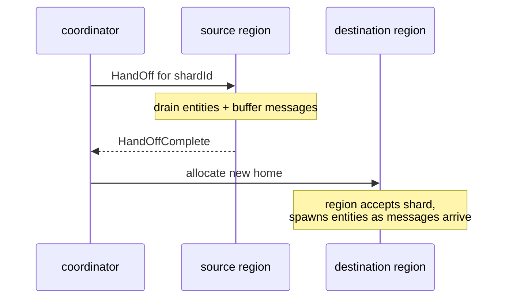

When the cluster's membership changes — a node joins or leaves —
shards need to **move** to keep the workload distributed.  The
coordinator drives the process: it picks shards to relocate, tells
the source region to hand off, and waits for confirmation before
re-allocating.



This is intentionally **conservative** — buffered messages wait
for `HandOffComplete` before forwarding to the new owner, so
nothing races past a half-moved entity.

## What triggers rebalance

Two paths:

1. **Membership-driven** — `MemberUp` (a new node), `MemberRemoved`
   (a leaving node), or any cluster transition that changes the
   candidate set.  The coordinator re-runs the allocation strategy
   for every owned shard.
2. **Strategy-driven** — every `rebalanceIntervalMs` (default 2s),
   the coordinator asks the
   [allocation strategy](/cluster/sharding/allocation-strategy/)
   for its rebalance recommendations.  `LeastShardAllocationStrategy`
   returns shards to drain off busy nodes; `HashAllocationStrategy`
   returns shards whose hash-target moved.

Both feed into the same handoff protocol.

## The handoff sequence

When the coordinator decides shard `X` should move from node A to
node B:

1. **`HandOff(X)`** is sent to node A's region.
2. Node A's region marks shard `X` as `handing-off`.  It still
   *receives* messages for entities in `X`, but **buffers** them
   instead of forwarding to entity actors.
3. Each entity in `X` is sent the framework's stop signal.  They
   run `postStop`, persist any final state, and die.
4. Once all entities in `X` are gone, node A sends
   **`HandOffComplete(X)`** to the coordinator.
5. The coordinator runs `allocate(X, ...)` to pick a new home.
   Suppose it picks node B.
6. The coordinator publishes the new owner via gossip.  Buffered
   messages on node A start forwarding to node B's region.
7. Node B's region receives messages for entities in `X` and
   spawns entities on demand (just like first-time allocation).

The whole thing usually takes **sub-second to a few seconds**,
depending on how many entities are in the shard and how long their
`postStop` work takes.

## Configuration

```ts
sharding.start(
  StartShardingOptions.create()
    // ...
    .withRebalanceIntervalMs(2_000)   // strategy-driven rebalance every 2s
    .withHandOffTimeoutMs(10_000),    // give up + force-reallocate after 10s
);
```

| Knob | Default | What |
| --- | --- | --- |
| `rebalanceIntervalMs` | 2000 | How often the strategy is consulted for rebalance recommendations. |
| `handOffTimeoutMs` | 10_000 | If the source region doesn't send `HandOffComplete` within this window, the coordinator gives up waiting and force-reallocates. |

## What buffered messages mean

While shard `X` is `handing-off`:

- Messages targeting entities in `X` arrive at node A.
- Node A's region buffers them — doesn't forward to the
  (now-stopped) entity actors.
- Once handoff completes and `X` has a new owner, buffered
  messages forward to the new region.
- The new region spawns entities and processes the messages in
  order.

This means **a message sent during handoff is delayed**, not
dropped.  The cost: latency spikes during rebalance windows.

## When entities have state

For persistent entities ([PersistentActor](/persistence/persistent-actor/)):

- `postStop` on the source side finalizes any pending persist.
- The new entity instance on the destination replays the journal
  on startup.
- The buffered message arrives at a fully-recovered entity.

For non-persistent entities, state is **lost** between
incarnations — the rebalance is equivalent to a restart with the
buffered message acting as the first command.

If state matters across rebalance, use persistence.  This isn't
optional.

## Force-reallocation

If `HandOffComplete` doesn't arrive within `handOffTimeoutMs`:

- The coordinator logs a warning ("handoff timed out").
- It force-reallocates the shard to its new owner.
- Buffered messages forward as if handoff had completed normally.
- **The old entities may still be alive** on node A — they
  receive messages locally too, leading to **split-brain
  entities** until the orphans die.

This is rare but possible.  Causes:

- A `postStop` that hangs (slow journal write, blocked external
  call).
- A network partition during handoff.

Mitigation:

- Keep `postStop` short and non-blocking.
- Tune `handOffTimeoutMs` to your worst-case persist time + buffer.
- For the split-brain risk, consider a lease on the sharding
  coordinator (see
  [sharding with-lease](/cluster/sharding/with-lease/)).

## Rebalance vs scaling

```
Node added       → coordinator allocates some shards to it
Node removed     → coordinator re-homes its shards
Node ↑ in load   → LeastShardAllocationStrategy drains shards off
Node ↓ in load   → no rebalance (only the busy direction triggers)
```

Rebalance is **work-shedding**, not work-acquiring.  An idle node
in `LeastShardAllocationStrategy`'s view receives new shards as
they're allocated, but doesn't get existing shards moved *into* it
just because it's quiet.

For an "always-balanced" effect, restart the coordinator
periodically (which re-runs allocation from scratch) — or
configure `rebalanceThreshold: 1` to react to any imbalance.

import { Aside } from '@astrojs/starlight/components';

<Aside type="caution" title="Buffered messages have a memory cost">
  ```ts
  // Shard X handing off; 10 000 messages pile up before completion
  ```
  Buffer is unbounded.  In a busy cluster where a slow handoff
  coincides with high message rate, the buffer can grow large.
  This isn't a leak — buffered messages drain on completion — but
  watch memory under load.
</Aside>

<Aside type="caution" title="Frequent rebalance is expensive">
  ```ts
  new LeastShardAllocationStrategy(1, 50);   // ✗ aggressive
  ```
  Every rebalance kills entities + replays journals on the new
  home.  For large-state actors, that's expensive.  Bias toward
  fewer moves (`rebalanceThreshold` higher, `maxSimultaneousRebalance`
  lower) when each handoff has high cost.
</Aside>

<Aside type="caution" title="Long postStop = long handoff">
  ```ts
  override async postStop(): Promise<void> {
    await this.flushHugeCache();   // 30 seconds
  }
  ```
  The coordinator waits up to `handOffTimeoutMs` for the source
  to finish.  A slow `postStop` blows past the default 10s
  timeout, triggering force-reallocation with the orphan-entity
  risk.  Either keep `postStop` fast or raise `handOffTimeoutMs`
  accordingly.
</Aside>

## Where to next

- **[Sharding overview](/cluster/sharding/overview/)** —
  the broader picture.
- **[Allocation strategy](/cluster/sharding/allocation-strategy/)** —
  what decides the new homes.
- **[Remember entities](/cluster/sharding/remember-entities/)** —
  affects what gets re-spawned after handoff.
- **[Sharding with lease](/cluster/sharding/with-lease/)** —
  split-brain protection for the coordinator.
