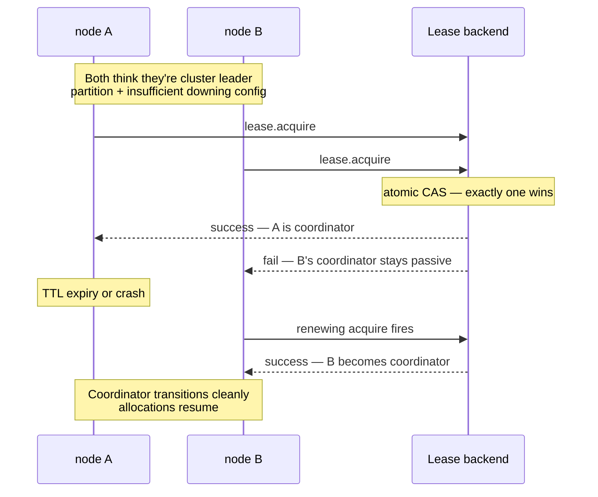

The sharding coordinator runs as a cluster singleton — only the
leader's coordinator is active.  With a
[downing strategy](/cluster/downing-strategies/) +
healthy network, that's enough.

During a network partition + buggy downing config, **both halves
might briefly think they're leader** → two coordinators →
conflicting shard allocations → entities possibly spawned on
both sides.

The **single-writer lease** prevents this:

```ts
import { ClusterSharding, KubernetesLease, KubernetesLeaseOptions, StartShardingOptions } from 'actor-ts';

const kubernetesLeaseOptions = KubernetesLeaseOptions.create()
  .withName('order-sharding-coordinator')
  .withOwner(process.env.POD_NAME!)
  .withTtlMs(30_000)
  .withNamespace(process.env.K8S_NAMESPACE!);
const startShardingOptions = StartShardingOptions.create<Command>()
  .withTypeName('order')
  .withEntityProps(Props.create(() => new OrderEntity()))
  .withExtractEntityId((message) => message.id)
  .withLease(new KubernetesLease(
    kubernetesLeaseOptions,
  ));
const sharding = cluster.sharding.start(
  startShardingOptions,
);
```

Now even if two nodes both think they're leader, **only one
holds the lease**.  Only the lease-holder's coordinator
processes shard allocations.

## How it works



The lease backend (K8s API server, etcd) provides the **atomic
exactly-one-holder guarantee** — it's the source of truth
beyond gossip.

## Configuration

```ts
interface StartShardingOptionsType<TMessage> {
  // ... base sharding settings ...
  lease?:                   Lease;
  acquireRetryIntervalMs?:  number;     // default 5000
}
```

| Field | Purpose |
| --- | --- |
| `lease` | The `Lease` instance — typically `KubernetesLease`. |
| `acquireRetryIntervalMs` | Retry cadence on failed acquire. |

Same `Lease` abstraction as
[singleton with lease](/cluster/singleton/with-lease/) —
see [Coordination](/coordination/overview/) for the
interface.

## What's protected

The lease gates **coordinator state writes**:

- **Shard allocations** — assigning shards to regions.
- **Rebalance decisions** — moving shards between regions.
- **Handoff coordination** — orchestrating shard handoffs.

The lease **doesn't gate**:

- Per-region entity hosting (regions are tied to actual cluster
  members, not the coordinator).
- Entity messaging (messages route via the coordinator's last-known
  allocation; the lease isn't in the message path).

So the worst-case during a partition is **slightly stale shard
assignments** — entities continue running, just no new
allocations until lease ownership stabilizes.

## When to enable

Three good fits:

1. **Production multi-region clusters** where partitions are
   plausible.
2. **Financial / inventory entities** where dual-allocation
   would cause real damage.
3. **Compliance** requiring "no possibility of split-brain in
   any single-tenant production system."

For **typical single-region K8s deployments** with a
[downing strategy](/cluster/downing-strategies/), the
lease is **paranoid-safe** — adds operational complexity for
protection against rare edge cases.

## Operational considerations

### Lease backend availability

```
K8s API server outage → no replica can acquire → no shard allocations
```

The lease backend becomes a SPOF.  For most setups, K8s API
availability is much higher than the cluster itself — but plan
for the rare case.

### Failover latency

```
Old coordinator loses lease (TTL expiry: 30s)
  → new coordinator acquires (typically sub-second after TTL)
  → new coordinator rebuilds state from gossip + journal
```

The failover window is **the lease TTL** — ~30 s typical.
During that window:

- **No new shard allocations** happen.
- **Existing entities continue** receiving messages.
- **New entity IDs** that need allocation queue up; processed
  after failover.

Acceptable for most workloads.

### Combining with regular downing

```ts
{
  downingProvider: new KeepMajority(),
  // + the sharding lease
  lease: ...,
}
```

Both layers active.  Downing handles normal cluster
convergence; the lease guarantees the coordinator-uniqueness
invariant.

## Reading the protection level

| Setup | Coordinator-uniqueness guarantee |
| --- | --- |
| No downing, no lease | Best-effort.  Partitions cause dual coordinators. |
| Downing strategy only | Strong on stable networks. |
| Downing + lease | Paranoid-safe.  Both invariants enforced. |

For singleton + sharding production setups in
critical-data scenarios, **both** is the recommended pattern.

import { Aside } from '@astrojs/starlight/components';

<Aside type="caution" title="Lease backend availability">
  ```
  Lease backend down → no coordinator → no new shards
  ```
  K8s API outages stall new allocations.  Existing entities
  keep running, but new ones queue.  Plan for K8s API
  reliability.
</Aside>

<Aside type="caution" title="Lease without downing">
  ```ts
  // Just the lease, no downing strategy
  ```
  Lease protects the coordinator's uniqueness, but **doesn't
  resolve partitions**.  Both sides keep running their
  pre-partition state forever.  Combine with downing.
</Aside>

## Where to next

- **[Sharding overview](/cluster/sharding/overview/)** —
  the foundation.
- **[Singleton with lease](/cluster/singleton/with-lease/)** —
  the same pattern for singletons.
- **[Coordination overview](/coordination/overview/)** —
  the lease abstraction.
- **[KubernetesLease](/coordination/kubernetes-lease/)** —
  the production backend.
- **[Downing strategies](/cluster/downing-strategies/)** —
  the complementary partition resolver.
