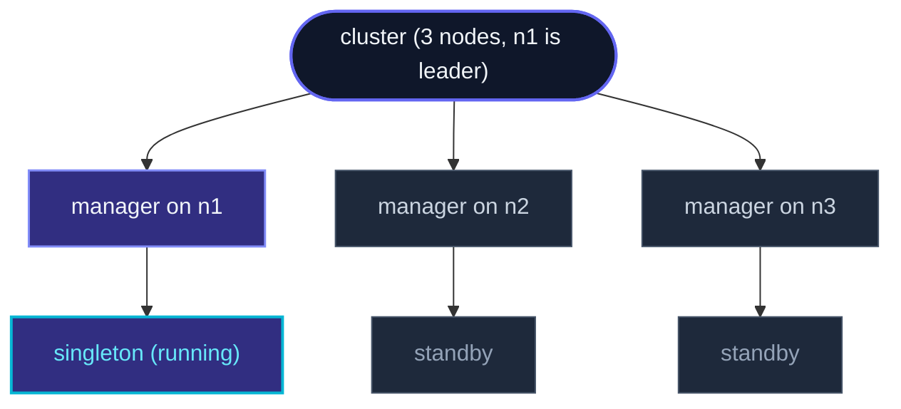
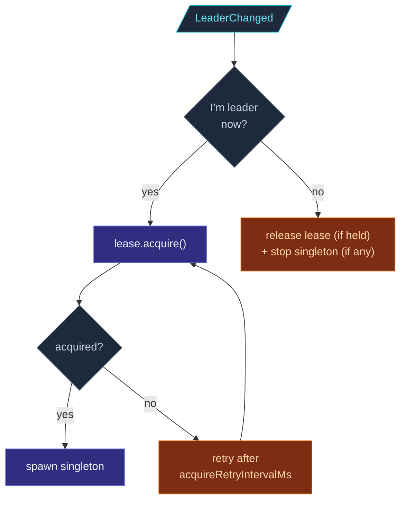

`ClusterSingletonManager` is the **per-node** actor that owns the
singleton election logic.  Every node runs one; only the leader's
manager has an active singleton child.  When leadership changes,
the old manager stops its child; the new manager spawns one.



The proxy on every node tracks "where is the leader's manager?"
and routes messages there.  When `n1` leaves, the manager on `n2`
or `n3` becomes the leader, spawns the singleton, and proxies
shift their target.

## Configuration

```ts
import { ClusterSingletonManager, Props } from 'actor-ts';

system.spawn(
  ClusterSingletonManager.props({
    cluster,
    typeName:        'job-scheduler',
    singletonProps:  Props.create(() => new JobScheduler()),
    role:            'control-plane',           // optional
    lease:           leaseImpl,                  // optional split-brain protection
    acquireRetryIntervalMs: 5_000,                // when lease acquire fails
  }),
  'singleton-manager-job-scheduler',
);
```

| Field | Required | What |
| --- | --- | --- |
| `cluster` | Yes | The cluster the manager watches. |
| `typeName` | Yes | Logical name for this singleton; the child actor's name. |
| `singletonProps` | Yes | How to construct the singleton.  Only invoked on the leader. |
| `role` | No | Restrict to nodes carrying this role.  Other nodes' managers stay passive. |
| `lease` | No | If set, the leader must acquire this lease before spawning the singleton. |
| `acquireRetryIntervalMs` | No (default 5s) | Retry cadence after a failed lease acquisition. |

## The naming convention

The manager **must** be spawned at a path matching:

```
actor-ts://<system>/user/singleton-manager-<typeName>
```

Hence the actor name `'singleton-manager-job-scheduler'` above
when `typeName = 'job-scheduler'`.  The
[ClusterSingletonProxy](/cluster/singleton/overview/) uses
this path convention to find the manager on whichever node is
currently leader.

If you misname, the proxy can't route — silent breakage.  Always:

```ts
import { singletonManagerPath } from 'actor-ts';

const path = singletonManagerPath(system.name, 'job-scheduler');
// "actor-ts://<sysName>/user/singleton-manager-job-scheduler"
```

You can use this helper if you want to assert the path matches.

## The two operational paths

### No-lease (default)

```
LeaderChanged → I'm leader now? → yes → spawn singleton
                                → no → stop my singleton (if any)
```

Synchronous reconcile.  As soon as gossip says this node is the
leader, the manager spawns its singleton child.  Simple, fast.

**Drawback**: during a **partition**, both halves can have their
own leader.  Both managers spawn their singleton.  Two
singletons exist — that's exactly the case singleton is meant
to prevent.

### With lease

```ts
ClusterSingletonManager.props({
  // ...
  lease: someLeaseImpl,
});
```

Adds an async gate on the lease.  The flow:



The lease provider — typically a Kubernetes Lease resource —
guarantees at most one holder cluster-wide.  Even if two
managers think they're leader, only one can acquire the lease,
and only that one spawns the singleton.

The framework uses **internal events** (no inline awaits) for
state transitions, so concurrent cluster events can't interleave
with an in-flight acquire.

See [Singleton with lease](/cluster/singleton/with-lease/)
for the configuration and lease-impl choices.

### Lease lost

```
lease lost (revoked, renew failed) → stop singleton immediately
```

If the lease is **revoked** (someone else acquired it, or the
provider's renew failed), the manager stops the singleton and
waits.  When `LeaderChanged` fires again (e.g., the manager
notices it's still seen as leader by gossip), it retries
`lease.acquire()`.

## Watching the child

The manager **death-watches** the singleton child.  If the child
crashes (uncaught error reaches its supervisor's escalate
directive), the framework's normal supervision applies — by
default, the child is restarted.  Manager doesn't intervene
unless leadership also changed.

If the child explicitly stops itself (`context.stopSelf()`), the
manager sees the Terminated, releases the lease (if held), and
**doesn't re-spawn**.  The singleton is gone until the next
leader change.

If you want a self-stopping singleton to be re-spawned, the
manager isn't the place — write a watchdog actor at a level
above, or have the singleton supervise its own state and never
self-stop.

## Restart semantics

When the manager itself fails (which is rare), its supervisor
(typically the user-guardian) restarts it.  On restart:

- Cluster subscriptions are re-established.
- The current leader is queried again.
- If this node is still leader, lease-acquire (if applicable) is
  retried, and the singleton is spawned afresh.

The old singleton's state is **lost** unless it persists itself.
For stateful singletons, use
[PersistentActor](/persistence/persistent-actor/).

## When you'd interact with the manager directly

You usually don't.  The proxy is the contract — `tell` to the
proxy, receive replies, never touch the manager.

Direct manager contact is useful only for:

- **Tests** verifying the election protocol works as expected.
- **Diagnostics** in production — "is the manager on this node
  active?" via the management endpoints.
- **Custom singleton patterns** that don't fit the proxy abstraction
  (rare; usually a sign the singleton model isn't right for the
  use case).

## Diagnostics

```ts
import { MemberUp, LeaderChanged } from 'actor-ts';

cluster.subscribe(LeaderChanged, (evt) => {
  console.log(`leader is now ${evt.leader}`);
});
```

The manager's behavior is driven entirely by these events.  If
you suspect the manager is misbehaving, log `LeaderChanged` +
`MemberUp` / `MemberRemoved` to see what the manager sees.

For the lease path, also log `lease.acquire()` returns — the
manager logs these by default at debug level.

import { Aside } from '@astrojs/starlight/components';

<Aside type="caution" title="Manager must be spawned on every node">
  ```ts
  // Some nodes spawn the manager, others don't
  ```
  The proxy expects the manager to exist at the well-known path
  on whichever node is currently leader.  If the leader's node
  didn't spawn the manager, the proxy can't route — messages
  dead-letter.  Either always spawn the manager, or
  role-restrict so only role-carrying nodes can be leader.
</Aside>

<Aside type="caution" title="Manager name must match the convention">
  ```ts
  system.spawn(ClusterSingletonManager.props({...}), 'whatever');
  // ✗ proxy looks for `/user/singleton-manager-<typeName>`, not /user/whatever
  ```
  Use `singletonManagerPath(...)` or just spell out the
  convention.  The framework doesn't enforce; misnamed managers
  are invisible to proxies.
</Aside>

<Aside type="caution" title="Lease failure with no retry">
  ```ts
  acquireRetryIntervalMs: 0,
  ```
  Setting to 0 disables retries — a single failed acquire leaves
  the singleton un-spawned until the next `LeaderChanged` event.
  Use a sensible value (default 5s is reasonable for most lease
  providers).
</Aside>

## Where to next

- **[Singleton overview](/cluster/singleton/overview/)** —
  the bigger picture: proxy + manager + singleton.
- **[Singleton with lease](/cluster/singleton/with-lease/)** —
  split-brain protection details.
- **[Coordination](/coordination/overview/)** — the
  lease abstraction.
- **[Cluster overview](/cluster/overview/)** — how
  leader election works at the cluster level.

The [`ClusterSingletonManager`](/api/classes/clustersingletonmanager/)
API reference covers all message types and settings.
