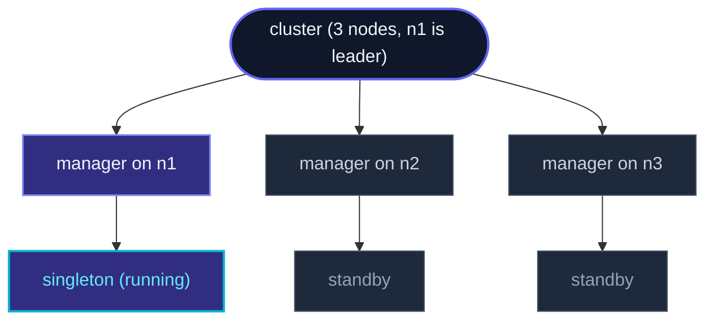
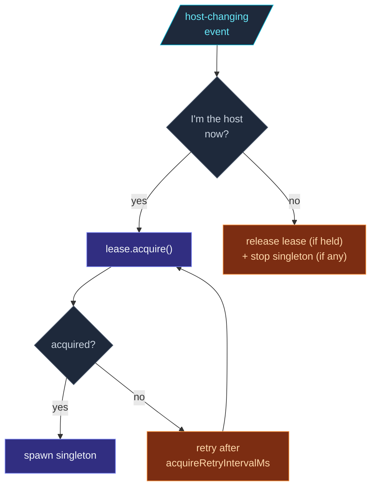

`ClusterSingletonManager` is the **per-node** actor that owns the
singleton election logic.  Every node runs one; only the leader's
manager has an active singleton child.  When leadership changes,
the old manager stops its child; the new manager spawns one.


```mermaid
flowchart TB
  CLUSTER(["cluster (3 nodes, n1 is leader)"])
  M1["manager on n1"]
  M2["manager on n2"]
  M3["manager on n3"]
  S["singleton (running)"]
  STB1["standby"]
  STB2["standby"]
  CLUSTER --> M1
  CLUSTER --> M2
  CLUSTER --> M3
  M1 --> S
  M2 --> STB1
  M3 --> STB2
  classDef cluster fill:#0f172a,stroke:#6366f1,stroke-width:2px,color:#f1f5f9;
  classDef leader  fill:#312e81,stroke:#818cf8,stroke-width:1.5px,color:#f1f5f9;
  classDef mgr     fill:#1e293b,stroke:#475569,color:#cbd5e1;
  classDef active  fill:#312e81,stroke:#06b6d4,stroke-width:2px,color:#67e8f9;
  classDef passive fill:#1e293b,stroke:#475569,color:#94a3b8;
  class CLUSTER cluster
  class M1 leader
  class M2,M3 mgr
  class S active
  class STB1,STB2 passive
```

The proxy on every node tracks "where is the leader's manager?"
and routes messages there.  When `n1` leaves, the manager on `n2`
or `n3` becomes the leader, spawns the singleton, and proxies
shift their target.

## Configuration

The manager is not spawned by hand — `cluster.singleton.start(...)`
does it, at the well-known path proxies address, and the start options
below are what it configures:

```ts
import { SingletonKey, StartSingletonOptions } from 'actor-ts/cluster';

const singletonOptions = StartSingletonOptions.create<JobCommand>()
  .withRole('control-plane')            // optional
  .withLease(leaseImpl)                 // optional split-brain protection
  .withAcquireRetryIntervalMs(5_000)    // retry cadence when lease acquire fails
  .withHandOverTimeoutMs(10_000);       // how long to wait for peers to stand down
cluster.singleton.start(JobScheduler, singletonOptions);
```

The manager's own `ClusterSingletonManagerOptions` — `cluster`,
`typeName`, `singletonActor` and the four above — are assembled from
these by the extension.  The fields are documented here because they
are what the manager acts on, not because you construct them:

| Field | Required | What |
| --- | --- | --- |
| `cluster` | Yes | The cluster the manager watches. |
| `typeName` | Yes | Logical name for this singleton; the child actor's name. |
| `singletonActor` | Yes | How to construct the singleton.  Only invoked on the host. |
| `role` | No | Restrict hosting to nodes carrying this role.  Other nodes' managers stay passive. |
| `lease` | No | If set, the host must acquire this lease before spawning the singleton. |
| `acquireRetryIntervalMs` | No (default 5s) | Retry cadence after a failed lease acquisition. |
| `handOverTimeoutMs` | No (default 10s) | How long to wait for every eligible peer to confirm it is not hosting, before hosting anyway.  See [When nobody answers](#when-nobody-answers). |
| `restartOnTermination` | No (default `true`) | Re-spawn the singleton after an unexpected instance death.  Turn off only for an actor that treats `stopSelf()` as a terminal state. |

### Which node hosts

Without a `role`, the host is the cluster leader.  With one, it is the
**first up-member carrying that role** — not "the leader, if it happens
to carry the role", which would leave the singleton hosted nowhere
whenever the elected leader lacked it.  Both forms read the same
address-ordered member list, so every node independently picks the same
node, and the proxy resolves the host exactly the way the managers do.

Same rule, but each node applies it to *its own* view of the cluster.
Those views agree once gossip has converged, which is why this works;
where they can stay apart is unreachability, and that is
[deliberately excluded from what moves the
host](#unreachability-is-deliberately-not-a-trigger).

## The naming convention

The manager **must** be spawned at a path matching:

```
actor-ts://<system>/system/cluster/singleton/manager-<typeName>
```

Hence the actor name `'singleton-manager-job-scheduler'` above
when `typeName = 'job-scheduler'`.  The
[ClusterSingletonProxy](/cluster/singleton/overview/) uses
this path convention to find the manager on whichever node is
currently leader.

If you misname, the proxy can't route — silent breakage.  Always:

```ts
import { singletonManagerPath } from 'actor-ts/cluster';

const path = singletonManagerPath(system.name, 'job-scheduler');
// "actor-ts://<sysName>/system/cluster/singleton/manager-job-scheduler"
```

You can use this helper if you want to assert the path matches.

## What the manager reacts to

The host of a singleton is the **first address-ordered up-member**:
the cluster leader, or — with a role restriction — the first member
carrying that role.  So the host moves on *every* transition into or
out of `up`, not only on a change of leader:

| Event | Why it can move the host |
| --- | --- |
| `LeaderChanged` | The unrestricted host **is** the leader. |
| `SelfUp` | This node just became eligible to host. |
| `MemberUp` | A member joined the up-set — possibly below the current host. |
| `MemberDown` / `MemberLeft` / `MemberRemoved` | The host is on its way out. |

`MemberJoined` and `MemberWeaklyUp` are deliberately not in the set:
neither `joining` nor `weakly-up` members appear in `upMembers()`, so
neither can host.

### Unreachability is deliberately not a trigger

`MemberUnreachable` and `MemberReachable` **do** move the host —
an unreachable member drops out of `upMembers()` without being removed
— and they are still not in the set.

Every event that *is* in the set states a membership fact the whole
cluster converges on, so every node computes the same host.
Unreachability is not that.  It is one node's failure detector saying
*"I cannot reach that member"*, and the member it is about cannot hear
the peers that formed the opinion — reaching it is the thing that
failed.  A manager that reconciled on it would promote itself while the
incumbent, told nothing, kept its child.  No leader moves, so nothing
resolves it: the cluster runs **two live singletons** for the length of
the outage.

The cost of leaving them out is real and is the smaller one.  While a
role host is unreachable to its peers, those peers consider the
singleton hosted nowhere, and messages they send
[go to dead letters](#messages-sent-while-no-node-is-hosting) until the
member is downed (`downAfterMs`) or comes back.  Availability is
recoverable and bounded by downing; a second live singleton is neither.
On the no-lease path you cannot have both — an unreachable node cannot
be asked to stand down.  If you need both, that is what
[the lease path](#with-lease) is for: it is arbitrated by a third party
both sides *can* reach, so exactly one of them holds it.

Nothing is lost at the edges.  The resolution of an unreachability
arrives as an event that is in the set either way: downing emits
`MemberDown`, and recovery emits `MemberUp` alongside `MemberReachable`.

**Before v0.17.0 the trigger was `LeaderChanged` alone.**  A
role-carrying member joining *below* a role-less leader moves the role
host and changes no leader — so nothing fired.  The joining node spawned
anyway (off its own `SelfUp`), the incumbent was never told to stop, and
the cluster settled on **two live singletons**.  If you are on an older
version, that is the shape to look for.

## The two operational paths

### No-lease (default)

```
host-changing event → am I the host now? → yes → ask every eligible peer to stand down
                                               → all confirmed → spawn singleton
                                         → no  → stop my singleton (if any)
```

Reconcile straight from the cluster-event subscriber, so a change of host
is visible the moment the event fires.

**The spawn is not local, though.**  Before hosting, the manager sends a
`singleton.HandOverRequest` to every node its own view says is eligible —
every `up` member, or every `up` member carrying the role — and waits for
each of them to answer `singleton.HandOverAcknowledgment`.  A node answers
only once it holds no instance *and* none of its own is still stopping, so
the answer is about a completed `postStop`, not about a `PoisonPill` having
been enqueued.

Why it asks *everyone* rather than the previous host: a node that has just
joined has no notion of a previous host at all, and joining is the common
case (a node promotes itself off its own `SelfUp`).  Every eligible node
runs a manager — that is what "call `start()` on every node that may become
the host" means — and the outgoing host is by definition the first member
of that set, so asking all of them cannot miss it.  A node that only calls
`ref(...)` answers too, immediately and truthfully: it runs no manager, so
it is certainly not hosting.

Messages that arrive while the wait is on are **held** and handed to the
instance the moment it spawns.  The wait is a window the protocol opens
itself; paying for uniqueness with message loss on every host move is not
the trade being made.

**Drawback**: during a **partition**, both halves can have their own
leader, and neither can ask the other to stand down — reaching it is the
thing that failed.  After `handOverTimeoutMs` each hosts anyway, so two
singletons exist.  That is the case the lease path is for.

### With lease

```ts
const singletonOptions = StartSingletonOptions.create<JobCommand>()
  .withLease(someLeaseImpl);
cluster.singleton.start(JobScheduler, singletonOptions);
```

Adds an async gate on the lease.  The flow:


```mermaid
flowchart TB
  EVT[/"host-changing<br/>event"/]
  ASK{"I'm the host<br/>now?"}
  ACQ["lease.acquire()"]
  GOT{"acquired?"}
  SPAWN["spawn singleton"]
  RETRY["retry after<br/>acquireRetryIntervalMs"]
  RELEASE["release lease (if held)<br/>+ stop singleton (if any)"]
  EVT --> ASK
  ASK -- "yes" --> ACQ
  ASK -- "no"  --> RELEASE
  ACQ --> GOT
  GOT -- "yes" --> SPAWN
  GOT -- "no"  --> RETRY
  RETRY --> ACQ
  classDef evt    fill:#1e293b,stroke:#06b6d4,color:#67e8f9;
  classDef ok     fill:#312e81,stroke:#818cf8,color:#f1f5f9;
  classDef warn   fill:#7c2d12,stroke:#fb923c,color:#fed7aa;
  classDef step   fill:#1e293b,stroke:#475569,color:#cbd5e1;
  class EVT evt
  class ACQ,SPAWN ok
  class RETRY,RELEASE warn
  class ASK,GOT step
```

The lease provider — typically a Kubernetes Lease resource —
guarantees at most one holder cluster-wide.  Even if two
managers think they're leader, only one can acquire the lease,
and only that one spawns the singleton.

The framework uses **internal events** (no inline awaits) for
state transitions, so concurrent cluster events can't interleave
with an in-flight acquire.

See [Singleton with lease](/cluster/singleton/with-lease/)
for the configuration and lease-impl choices.

### Lease lost

```
lease lost (revoked, renew failed) → stop singleton → wait for it to be gone
                                   → then retry acquire
```

If the lease is **revoked** (someone else acquired it, or the provider's
renew failed), the manager stops the singleton — with a `PoisonPill`, so
the instance drains its mailbox and runs `postStop` — and only re-attempts
`lease.acquire()` once that has finished.

**Before v0.17.0 it re-acquired immediately**, and the consequence was not
two instances but zero: the acquire could resolve while the old instance
was still in `postStop`, the spawn behind it was refused because a stop was
still in flight, and the reconcile that followed read "lease held" as
"already running" and did nothing.  The manager then renewed a lease over
no singleton at all, permanently, and no other node could take over either.

### Stepping down with a lease

```
host moved away → stop singleton → wait for it to be gone → release lease
```

The release is what gives a follower permission to spawn, so it happens
only once this node's instance has genuinely terminated.  **Before v0.17.0
it was released as soon as the `PoisonPill` had been enqueued** — which
says nothing about whether the instance is gone — so a follower could win
the lease and start while the previous one was still draining.  That is the
whole guarantee the lease is there to provide, given away one line early.

## When nobody answers

`handOverTimeoutMs` (default **10 s**) bounds the wait, and the wait ends
in a spawn either way:

```ts
const singletonOptions = StartSingletonOptions.create<Command>()
  .withTypeName('job-scheduler')
  .withActor(JobScheduler)
  .withHandOverTimeoutMs(30_000);
```

A healthy hand-over costs one network round trip and never reaches the
timeout — the request is re-sent every half second while it is
outstanding, because a cluster envelope is fire-and-forget and a single
frame can be dropped behind a handshake.  A peer that **leaves** while the
request is outstanding stops being waited on: it has dropped out of the
eligible set, so this node's own view already says it cannot be hosting.
Reaching the timeout means some eligible peer that is still `up` did not
answer at all: it is unreachable from here, or it still believes it is the
host and declined.

The manager then **hosts anyway** and says so at `warn`, naming the peers
that stayed silent.  This is the deliberate choice between two properties
that cannot both be had on the no-lease path.  Waiting forever would leave
the singleton hosted nowhere for the length of the outage; hosting means
the uniqueness invariant was *not proven* — which is a different statement
from "upheld", and worth reading the warning as exactly that.

Where the invariant has to survive it, use a
[lease](/cluster/singleton/with-lease/).  A third party both sides can
reach is the only arbiter available when the two cannot reach each other.

One configuration pays the timeout needlessly: a node that is an `up`
member, is eligible to host, and never mentions the singleton at all —
neither `start(...)` nor `ref(...)`.  It has nothing registered to answer
with, so it is indistinguishable from an unreachable one.  Give the
singleton a `role` and put the role only on the nodes that participate, or
call `ref(...)` on the others.

## Who may ask for a hand-over

A hand-over request stops the singleton, so an unauthenticated one would
be a remote kill switch.  Two things guard it, and both come out of the
election rule the managers already share:

- The request is honoured only from an address the **transport** verified —
  the peer whose connection the frame arrived on, never a value out of the
  payload.
- A node that believes it hosts stands down only for a peer that sorts
  **before** it.  The host is the first address-ordered member of the
  eligible set, so a legitimate incoming host always sorts before the
  outgoing one, role restriction or not.  A node that does *not* believe it
  hosts has no claim to defend and stands down for any member — that is the
  case where the previous host left and the new one sorts after it.

Neither is a substitute for authenticating the cluster wire itself, which
carries no credential today.  What they close is any *other* member being
able to restart the singleton at will.

## Watching the child

The manager **death-watches** the singleton child.  If the child
crashes (uncaught error reaches its supervisor's escalate
directive), the framework's normal supervision applies — by
default, the child is restarted.  Manager doesn't intervene
unless leadership also changed.

If the child dies **unexpectedly** — it calls `context.stopSelf()`,
or it crash-loops until its supervision budget is exhausted and its
supervisor stops it — the manager **re-spawns it** after a one-second
backoff.  The pause matters: the second kind of death means the
supervisor's own restart budget is already spent, and coming straight
back would restart that budget too, turning a crash-looping singleton
into a hot loop.

This is the default because the alternative is a silent, permanent,
cluster-wide outage of the one component whose purpose is
availability-of-one.  Before v0.17.0 the manager ignored such a
`Terminated` entirely: it kept forwarding routed messages to a dead
ref, and nothing revived the singleton until the next leader change —
which in a stable cluster may be never.  With a lease it was worse
still, because the manager went on holding and renewing a lease over a
dead child, so no other node could take over either.

If your singleton uses `stopSelf()` as a **terminal state** — done
means done — turn the restart off:

```ts
const singletonOptions = StartSingletonOptions.create<Command>()
  .withTypeName('nightly-report')
  .withActor(NightlyReport)
  .withRestartOnTermination(false);
```

With it off the manager does not re-spawn, but it does **release the
lease**, so another node could host later.  What it will never do
again is hold a lease over a child that is gone.

The opt-out takes this **node** out of rotation for good — until its
manager is restarted with `cluster.singleton.stop(...)` followed by a
fresh `start(...)`.  It has to be a latch rather than the absence of a
trigger: the manager decides to spawn from "I am the host and have no
child", which on its own cannot tell a terminal stop apart from never
having started, and *any* later membership change would reconcile
straight back into a spawn.  Other nodes are unaffected — releasing
the lease is what leaves them free to host.

## Messages sent while no node is hosting

A proxy resolves the host from *its own* node's view of the cluster and
forwards there; the manager on the far side decides from *its* view
whether it is hosting.  Those two views agree whenever membership does,
which is almost always — and not while a member is unreachable to one
side and not the other.

A message that arrives at a manager which is not hosting goes to
`system.deadLetters`, with a single latched warning naming the
singleton.  It is not dropped silently, so it shows up wherever you
already watch dead letters — metrics, DevTools, an `eventStream`
subscription on `DeadLetter`:

```ts
import { DeadLetter } from 'actor-ts';

system.eventStream.subscribe(auditRef, DeadLetter);
```

Two neighbouring cases end the same way, deliberately.  The proxy
buffers while *no* node hosts the singleton at all and dead-letters
past `bufferSize`; and it dead-letters immediately when this node is
the elected host but never called `start(...)`, which is a deployment
mistake that will not heal on its own.

**Before v0.17.0 the manager logged a warning per message and dropped
it.** Nothing reached the dead-letter stream, so the loss was invisible
to everything except the log.

## Restart semantics

When the manager itself fails (which is rare), its supervisor
(typically the user-guardian) restarts it.  On restart:

- Cluster subscriptions are re-established.
- The current host is computed again.
- If this node is still the host, lease-acquire (if applicable) is
  retried, and the singleton is spawned afresh.
- A `restartOnTermination: false` opt-out is cleared — the latch
  lives on the manager instance, so a restarted manager may host
  again.

The old singleton's state is **lost** unless it persists itself.
For stateful singletons, use
[PersistentActor](/persistence/persistent-actor/).

## When you'd interact with the manager directly

You usually don't.  The proxy is the contract — `tell` to the
proxy, receive replies, never touch the manager.

Direct manager contact is useful only for:

- **Tests** verifying the election protocol works as expected.
- **Diagnostics** in production — "is the manager on this node
  active?" via the management endpoints.
- **Custom singleton patterns** that don't fit the proxy abstraction
  (rare; usually a sign the singleton model isn't right for the
  use case).

## Diagnostics

```ts
import { MemberUp, LeaderChanged } from 'actor-ts/cluster';

cluster.subscribe((evt) => {
  if (evt instanceof LeaderChanged) {
    console.log(`leader is now ${evt.leader.map((m) => m.address).getOrElse('<none>')}`);
  }
});
```

The manager's behavior is driven entirely by these events.  If you
suspect the manager is misbehaving, log the whole trigger set from
[What the manager reacts to](#what-the-manager-reacts-to) — not just
`LeaderChanged`.  A role-restricted singleton in particular changes
host on `MemberUp` / `MemberDown` while the leader sits still, so
watching leadership alone shows you nothing happening.

If the symptom is *messages disappearing* rather than the wrong node
hosting, watch `MemberUnreachable` too — not because the manager
reacts to it ([it deliberately does
not](#unreachability-is-deliberately-not-a-trigger)) but because it is
the condition under which senders and hosts disagree about who hosts.
Pair it with a `DeadLetter` subscription; that is where those messages
go.

For the lease path, also log `lease.acquire()` returns — the
manager logs these by default at debug level.

import { Aside } from '@astrojs/starlight/components';

<Aside type="caution" title="Call start() on every node that may become leader">
  ```ts
  cluster.singleton.ref(JobScheduler);    // addresses it, never hosts it
  cluster.singleton.start(JobScheduler);  // puts this node into rotation
  ```
  A proxy routes to whichever node is currently leader and expects a
  manager there.  A node that only ever called `ref` runs no manager,
  so if it becomes leader nothing anywhere is hosting the singleton and
  messages dead-letter with a warning naming the type.  Either call
  `start` everywhere, or role-restrict so only starting nodes can host.
</Aside>

<Aside type="caution" title="Declare a role on the key, not only in the options">
  ```ts
  class Ingress extends Actor<IngressCommand> {
    static readonly singleton = SingletonKey.of<IngressCommand>('ingress', 'edge');
  }
  ```
  A node that only calls `ref` has no options object — it has the key,
  and nothing else.  A role declared *only* through
  `StartSingletonOptions.withRole` is therefore invisible to it, and
  its proxy resolves a different host than the managers do.  Put the
  role on the key and every node agrees by construction; `withRole`
  still overrides it where you need a per-deployment answer.
</Aside>

<Aside type="caution" title="acquireRetryIntervalMs must be positive">
  ```ts
  acquireRetryIntervalMs: 0,   // ✗ does not disable retries
  ```
  `0` does not disable retries — there is no disable switch.  The
  value is validated as a positive number when you start the
  singleton, so a non-positive value is rejected up front with an
  `OptionsError`.  And `0` never means "stop retrying" internally: the
  5s default applies only to an *unset* value, so `0` would just retry
  immediately.  Use a positive interval; the 5s default suits most
  lease providers.
</Aside>

## Where to next

- **[Singleton overview](/cluster/singleton/overview/)** —
  the bigger picture: proxy + manager + singleton.
- **[Singleton with lease](/cluster/singleton/with-lease/)** —
  split-brain protection details.
- **[Coordination](/coordination/overview/)** — the
  lease abstraction.
- **[Cluster overview](/cluster/overview/)** — how
  leader election works at the cluster level.

The [`ClusterSingletonManager`](/api/classes/clustersingletonmanager/)
API reference covers all message types and settings.
