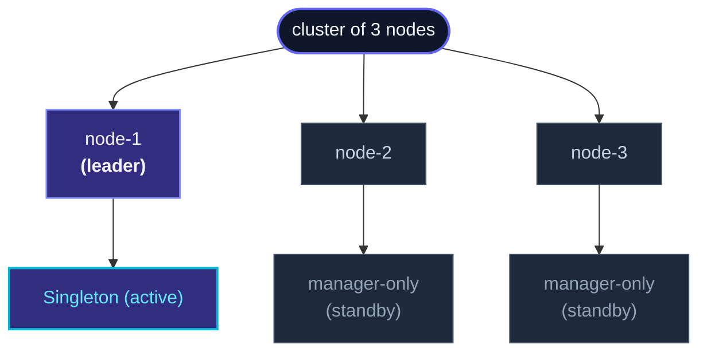

A **cluster singleton** is one actor that exists *exactly once*
across the whole cluster.  It runs on the leader node; if that
node leaves, the next-elected leader re-spawns it.  Callers on any
node send messages via a **proxy** that routes to wherever the
singleton currently lives.



Three actors per node make this work:

- **ClusterSingletonManager** — on every node.  Watches cluster
  events; spawns the singleton when this node becomes leader,
  stops it when it stops being leader.
- **ClusterSingletonProxy** — on every node that *talks* to the
  singleton.  Holds a forwarding ref that always points at the
  current leader's manager.
- **The singleton actor itself** — the user's actor, only ever
  instantiated on the leader.

## When to use a singleton

The classic use cases:

- **A coordinator** — a job scheduler, a saga orchestrator, a
  rate-limit budget tracker — that must produce **one consistent
  view** for the whole cluster.
- **An external-resource owner** — the actor that holds a
  connection to a single external system (a license server, a
  legacy DB with single-connection licensing).
- **A leader-elected service** — your own elected role for some
  cluster-wide responsibility.

If you'd write `if (!alreadyExists) spawn(...)`, a singleton is
probably what you want.

## A minimal example

```ts
import { Actor, ActorSystem, Cluster, Props } from 'actor-ts';
import { ClusterSingletonManager, ClusterSingletonProxy } from 'actor-ts';

class JobScheduler extends Actor<JobCmd> {
  override onReceive(msg: JobCmd): void { /* ... */ }
}

const system  = ActorSystem.create('my-app');
const cluster = await Cluster.join(system, { host, port, seeds });

// On every node: start the manager.
system.actorOf(
  ClusterSingletonManager.props({
    cluster,
    typeName:        'job-scheduler',
    singletonProps:  Props.create(() => new JobScheduler()),
    role:            'control-plane',   // optional: only these nodes can host
  }),
  'singleton-manager-job-scheduler',
);

// On every node: a proxy to talk to it.
const proxy = system.actorOf(
  ClusterSingletonProxy.props({
    cluster,
    typeName: 'job-scheduler',
  }),
  'singleton-proxy-job-scheduler',
);

// Anywhere in the app — same call on every node:
proxy.tell({ kind: 'schedule', jobId: '42' });
```

The proxy looks like a single `ActorRef`.  Behind the scenes it
finds the current leader's manager via the well-known path
`/user/singleton-manager-<typeName>` and forwards messages there.
When leadership changes, the proxy's target shifts automatically
within a gossip round.

## Failover

When the host node leaves the cluster:

1. **Detection**: cluster gossip propagates `MemberLeft` /
   `MemberRemoved` for the leaving node.
2. **Election**: the cluster elects a new leader (deterministic
   based on member sort order).
3. **Spawn**: the new leader's manager spawns the singleton.
4. **Routing shift**: proxies on every node see the leader
   change and update their forwarding target.

In flight messages during the transition land in dead letters
unless you've configured durability — see "State across failover"
below.

The transition window is bounded by the failure detector's
timeout (typically a few seconds for unreachable detection).
Singletons aren't a low-latency-failover tool; they trade
some unavailability during failover for the strong invariant
of "exactly one instance."

## State across failover

The new instance starts with a clean slate — same as a restarted
actor on a single node.  For state that should survive:

- **`PersistentActor`** — the singleton persists events; the new
  instance replays them from the journal.  Most production
  singletons use this.  See
  [PersistentActor](/persistence/persistent-actor/).
- **`DurableState`** — simpler: snapshot the current state;
  restore on restart.  See [DurableState](/persistence/durable-state/).
- **`DistributedData`** — for state that needs to be readable
  *before* the singleton restarts.  Most singletons don't need
  this; their state is private to the singleton.

Without one of these, every failover is a fresh start.  For a
short-lived coordinator that just routes incoming work, that's
often fine; for stateful workflows, persist.

## Split-brain and the optional lease

If the cluster partitions, two halves might each elect their own
leader — and both would spawn the singleton.  That's exactly the
case singletons exist to prevent.

Three defenses, in order of complexity:

1. **A downing strategy** that picks a winning side during
   partition (default option, no lease needed).  The losing side
   downs itself; only one half remains active.  See
   [Downing strategies](/cluster/downing-strategies/).
2. **A lease**, passed to the manager:
   ```ts
   ClusterSingletonManager.props({
     cluster,
     typeName: '...',
     singletonProps: ...,
     lease: someLeaseImpl,   // e.g. K8s lease, or in-memory for tests
   });
   ```
   The manager must successfully acquire the lease before spawning
   the singleton.  Only one side of a partition can hold the lease,
   so even with two leaders, only one singleton exists.  See
   [Singleton with lease](/cluster/singleton/with-lease/).

The combination of "downing strategy + lease" is paranoid-safe;
each alone is usually enough.

## Cost

A singleton has overhead beyond a normal actor:

- **Every node runs a manager** — they're lightweight (a state
  machine watching cluster events), but they exist on every node.
- **Every node that calls the singleton runs a proxy** — also
  lightweight, but adds a hop on every `tell`.
- **Leader-change is the cost of failover** — a singleton is
  unavailable for the few seconds it takes the cluster to converge
  on a new leader.

If exactness isn't required (you'd be happy with N replicas), use
a [cluster router](/cluster/cluster-router/) or
[sharding](/cluster/sharding/overview/) instead — both
scale horizontally with no leader-bottleneck.

## When NOT to use a singleton

import { Aside } from '@astrojs/starlight/components';

<Aside type="caution" title="High-throughput workloads">
  A singleton is a **scalar** — all traffic funnels through one
  actor.  Throughput is capped at one actor's throughput, no
  matter how many nodes are in the cluster.  For high-throughput,
  shard the work by some key; each shard scales independently.
</Aside>

<Aside type="caution" title="Per-key state that scales">
  ```ts
  // ✗ wrong shape — uses a Map inside a singleton
  class SessionRegistry extends Actor<...> {
    private sessions = new Map<string, SessionState>();
  }
  ```
  If you're tracking per-key state and the key space is large,
  this is a sharding problem.  Use
  [ClusterSharding](/cluster/sharding/overview/) instead —
  one actor *per key*, distributed across nodes.
</Aside>

<Aside type="caution" title="No specific need for exactly-one semantics">
  Singletons exist because some invariants need a single source
  of truth.  If your reason for using one is "it was easy to
  reason about with N=1," consider whether the cost (single-point
  bottleneck, failover blip) is worth it.  Often a router pool +
  a small amount of coordination is better.
</Aside>

## Where to next

- **[ClusterSingletonManager](/cluster/singleton/manager/)** —
  the per-node manager that elects + spawns the singleton.
- **[Singleton with lease](/cluster/singleton/with-lease/)** —
  split-brain protection via a coordination lease.
- **[Coordination](/coordination/overview/)** — the lease
  abstraction itself.
- **[Sharding overview](/cluster/sharding/overview/)** —
  for the per-key-actor pattern.
- **[Cluster overview](/cluster/overview/)** — the
  membership + leader-election machinery underneath.

The [`ClusterSingletonManager`](/api/classes/clustersingletonmanager/)
and [`ClusterSingletonProxy`](/api/classes/clustersingletonproxy/)
API references cover the full configuration surface.
