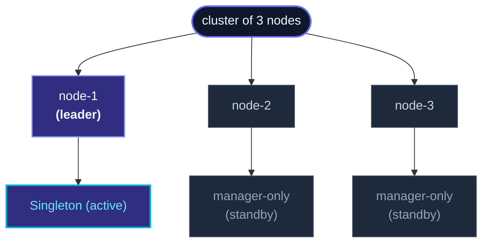

A **cluster singleton** is one actor that exists *exactly once*
across the whole cluster.  It runs on the leader node; if that
node leaves, the next-elected leader re-spawns it.  Callers on any
node send messages via a **proxy** that routes to wherever the
singleton currently lives.


```mermaid
flowchart TB
  CLUSTER(["cluster of 3 nodes"])
  N1["node-1<br/><b>(leader)</b>"]
  N2["node-2"]
  N3["node-3"]
  SING["Singleton (active)"]
  STB1["manager-only<br/>(standby)"]
  STB2["manager-only<br/>(standby)"]
  CLUSTER --> N1
  CLUSTER --> N2
  CLUSTER --> N3
  N1 --> SING
  N2 --> STB1
  N3 --> STB2
  classDef cluster fill:#0f172a,stroke:#6366f1,stroke-width:2px,color:#f1f5f9;
  classDef leader  fill:#312e81,stroke:#818cf8,stroke-width:1.5px,color:#f1f5f9;
  classDef node    fill:#1e293b,stroke:#475569,color:#cbd5e1;
  classDef active  fill:#312e81,stroke:#06b6d4,stroke-width:2px,color:#67e8f9;
  classDef passive fill:#1e293b,stroke:#475569,color:#94a3b8;
  class CLUSTER cluster
  class N1 leader
  class N2,N3 node
  class SING active
  class STB1,STB2 passive
```

Three actors per node make this work:

- **ClusterSingletonManager** — on every node.  Watches cluster
  events; spawns the singleton when this node becomes leader,
  stops it when it stops being leader.
- **ClusterSingletonProxy** — on every node that *talks* to the
  singleton.  This is what `start` and `ref` hand back: a forwarding
  `ActorRef` that always points at the current leader's manager.
- **The singleton actor itself** — the user's actor, only ever
  instantiated on the leader.

A node running only a proxy can address the singleton but never host
it — see [Getting a ref without hosting](#getting-a-ref-without-hosting).

## When to use a singleton

The classic use cases:

- **A coordinator** — a job scheduler, a saga orchestrator, a
  rate-limit budget tracker — that must produce **one consistent
  view** for the whole cluster.
- **An external-resource owner** — the actor that holds a
  connection to a single external system (a license server, a
  legacy DB with single-connection licensing).
- **A leader-elected service** — your own elected role for some
  cluster-wide responsibility.

If you'd write `if (!alreadyExists) spawn(...)`, a singleton is
probably what you want.

## A minimal example

```ts
import { Actor, ActorSystem } from 'actor-ts';
import { Cluster, ClusterOptions, SingletonKey } from 'actor-ts/cluster';

class JobScheduler extends Actor<JobCommand> {
  static readonly singleton = SingletonKey.of<JobCommand>('job-scheduler');
  override onReceive(message: JobCommand): void { /* ... */ }
}

const system  = ActorSystem.create('my-app');
const clusterOptions = ClusterOptions.create()
  .withHost(host)
  .withPort(port)
  .withSeeds(seeds);
const cluster = await Cluster.join(system, clusterOptions);

// On every node: one call spawns this node's manager and returns the ref.
// Only the leader's manager actually constructs the JobScheduler.
const scheduler = cluster.singleton.start(JobScheduler);

// Anywhere in the app — same call on every node:
scheduler.tell({ kind: 'schedule', jobId: '42' });
```

`start` returns a plain `ActorRef<JobCommand>`, so a singleton is
passed around and stored exactly like any other actor — nothing in a
consumer's signature has to know it is one.  Behind the scenes it
finds the current leader's manager via the well-known path
`/system/cluster/singleton/manager-<typeName>` and forwards messages there.
When leadership changes, the ref's target shifts automatically
within a gossip round.

## Declaring the key on the actor class

`SingletonKey.of<Command>('type-name')` ties a singleton's name to its
message type.  Declaring it as a `static readonly singleton` on the
actor means neither is repeated at the call site, and `start` / `ref`
can infer the right `ActorRef<Command>` from the class alone.

:::caution[The explicit type argument is load-bearing]
`SingletonKey.of('job-scheduler')` — without `<JobCommand>` — infers
`SingletonKey<unknown>`, and every ref taken from it degrades to
`ActorRef<unknown>`.  Write the type argument, or annotate the field:
`static readonly singleton: SingletonKey<JobCommand> = SingletonKey.of('job-scheduler')`.
:::

An actor that needs constructor dependencies passes a factory as the
second argument:

```ts
class UserRepository extends PersistentActor<UserRepositoryCommand, Event, State> {
  static readonly singleton = SingletonKey.of<UserRepositoryCommand>('user-repository');
  constructor(private readonly users: ActorRef<UserCommand>) { super(); }
}

const users = cluster.sharding.start(UserActor);
const repository = cluster.singleton.start(UserRepository, () => new UserRepository(users));
```

A **role** belongs on the key, as a second argument:

```ts
class Ingress extends Actor<IngressCommand> {
  static readonly singleton = SingletonKey.of<IngressCommand>('ingress', 'edge');
}
```

It is not part of the identity — two keys are equal iff their names
match — it rides along so that *every* node reads the same one.  That
matters for a node that only calls `ref`: it has no options object, so
a role set only through `withRole` is invisible to it and its proxy
would resolve a different host than the managers do.

For `lease`, or to override the role per deployment, pass options
alongside — or use the full builder form when there is no class to hang
a static on:

```ts
const singletonOptions = StartSingletonOptions.create<JobCommand>()
  .withRole('control-plane')    // wins over a role declared on the key
  .withBufferSize(5_000);       // messages held while no node hosts it
cluster.singleton.start(JobScheduler, singletonOptions);
```

`bufferSize` bounds what the proxy holds while the cluster has no host
— normally a gossip round, but nothing bounds it in an outage.  Past
the cap (default 1000) messages go to dead letters with a warning
rather than growing the buffer forever.

The buffer drains on the first cluster event that can have produced a
host — a leader change, but equally a member coming up, going down, or
leaving.  That full set matters for a role-restricted singleton: the
first member carrying the role can join without the leader changing at
all, and before v0.17.0 that left the buffer undrained indefinitely
while every later send routed normally.

A member going *unreachable* is deliberately not in that set, on either
side — see
[Unreachability is deliberately not a trigger](/cluster/singleton/manager/#unreachability-is-deliberately-not-a-trigger).

:::note[There is deliberately no `SingletonActor` interface]
TypeScript's `implements` clause constrains only the **instance** side
of a class — there is no `static implements`, and `abstract static` is
a compile error.  A `SingletonActor` marker interface would therefore
be structurally empty: every class would satisfy it and nothing would
be checked.  A static field is the carrier that works, and it composes
with any base class — which matters, because a singleton is frequently
also a `PersistentActor` and TypeScript has single inheritance.
Enforcement happens at the `start` call site, which infers the message
type from the key and from the actor position at once and reports a
mismatch between them.
:::

## Getting a ref without hosting

`start` puts the node into rotation: it can become the host.  A node
that only needs to *talk* to the singleton calls `ref` instead, which
is the counterpart to `ClusterSharding.startProxy`:

```ts
// No manager on this node — messages route to whoever is hosting.
const scheduler = cluster.singleton.ref(JobScheduler);
scheduler.tell({ kind: 'schedule', jobId: '42' });
```

`ref` and `start` return the same memoised ref for a given key, and the
local manager is resolved per delivery — so a node that calls `ref`
first and `start` later keeps using the same ref, which simply begins
delivering locally instead of over the wire.

:::caution[`ref` alone never hosts]
Call `start` on **every** node that may become leader.  If the elected
leader only ever called `ref`, no node is hosting the singleton and
messages dead-letter with a warning naming the type.
:::

Two more things the returned ref does not do:

- **`ref.stop()` is a warning no-op.** Everywhere else `ActorRef.stop()`
  sends a `PoisonPill` to its target; here that would kill whatever the
  current leader is hosting.  To take *this node* out of rotation, call
  `cluster.singleton.stop(key)`.
- **Stopping is asynchronous.** The manager releases its lease and its
  envelope path in `postStop`, and the actor name stays taken until
  termination settles, so starting the same singleton again in the same
  turn throws with an explanation rather than a duplicate-name error.

`cluster.singleton` also exposes `isStarted(key)` and `managerFor(key)`
for diagnostics.

## Failover

When the host node leaves the cluster:

1. **Detection**: cluster gossip propagates `MemberLeft` /
   `MemberRemoved` for the leaving node.
2. **Election**: the cluster elects a new leader (deterministic
   based on member sort order).
3. **Spawn**: the new leader's manager spawns the singleton.
4. **Routing shift**: proxies on every node see the leader
   change and update their forwarding target.

In flight messages during the transition land in dead letters
unless you've configured durability — see "State across failover"
below.

The transition window is bounded by the failure detector's
timeout (typically a few seconds for unreachable detection).
Singletons aren't a low-latency-failover tool; they trade
some unavailability during failover for the strong invariant
of "exactly one instance."

## State across failover

The new instance starts with a clean slate — same as a restarted
actor on a single node.  For state that should survive:

- **`PersistentActor`** — the singleton persists events; the new
  instance replays them from the journal.  Most production
  singletons use this.  See
  [PersistentActor](/persistence/persistent-actor/).
- **`DurableState`** — simpler: snapshot the current state;
  restore on restart.  See [DurableState](/persistence/durable-state/).
- **`DistributedData`** — for state that needs to be readable
  *before* the singleton restarts.  Most singletons don't need
  this; their state is private to the singleton.

Without one of these, every failover is a fresh start.  For a
short-lived coordinator that just routes incoming work, that's
often fine; for stateful workflows, persist.

## Split-brain and the optional lease

If the cluster partitions, two halves might each elect their own
leader — and both would spawn the singleton.  That's exactly the
case singletons exist to prevent.

Three defenses, in order of complexity:

1. **A downing strategy** that picks a winning side during
   partition (default option, no lease needed).  The losing side
   downs itself; only one half remains active.  See
   [Downing strategies](/cluster/downing-strategies/).
2. **A lease**, passed with the start options:
   ```ts
   const singletonOptions = StartSingletonOptions.create<JobCommand>()
     .withLease(someLeaseImpl);   // e.g. K8s lease, or in-memory for tests
   cluster.singleton.start(JobScheduler, singletonOptions);
   ```
   The manager must successfully acquire the lease before spawning
   the singleton.  Only one side of a partition can hold the lease,
   so even with two leaders, only one singleton exists.  See
   [Singleton with lease](/cluster/singleton/with-lease/).

The combination of "downing strategy + lease" is paranoid-safe;
each alone is usually enough.

## Cost

A singleton has overhead beyond a normal actor:

- **Every node runs a manager** — they're lightweight (a state
  machine watching cluster events), but they exist on every node.
- **Every node that calls the singleton runs a proxy** — also
  lightweight, but adds a hop on every `tell`.
- **Leader-change is the cost of failover** — a singleton is
  unavailable for the few seconds it takes the cluster to converge
  on a new leader.

If exactness isn't required (you'd be happy with N replicas), use
a [cluster router](/cluster/cluster-router/) or
[sharding](/cluster/sharding/overview/) instead — both
scale horizontally with no leader-bottleneck.

## When NOT to use a singleton

import { Aside } from '@astrojs/starlight/components';

<Aside type="caution" title="High-throughput workloads">
  A singleton is a **scalar** — all traffic funnels through one
  actor.  Throughput is capped at one actor's throughput, no
  matter how many nodes are in the cluster.  For high-throughput,
  shard the work by some key; each shard scales independently.
</Aside>

<Aside type="caution" title="Per-key state that scales">
  ```ts
  // ✗ wrong shape — uses a Map inside a singleton
  class SessionRegistry extends Actor<...> {
    private sessions = new Map<string, SessionState>();
  }
  ```
  If you're tracking per-key state and the key space is large,
  this is a sharding problem.  Use
  [ClusterSharding](/cluster/sharding/overview/) instead —
  one actor *per key*, distributed across nodes.
</Aside>

<Aside type="caution" title="No specific need for exactly-one semantics">
  Singletons exist because some invariants need a single source
  of truth.  If your reason for using one is "it was easy to
  reason about with N=1," consider whether the cost (single-point
  bottleneck, failover blip) is worth it.  Often a router pool +
  a small amount of coordination is better.
</Aside>

## Where to next

- **[ClusterSingletonManager](/cluster/singleton/manager/)** —
  the per-node manager that elects + spawns the singleton.
- **[Singleton with lease](/cluster/singleton/with-lease/)** —
  split-brain protection via a coordination lease.
- **[Coordination](/coordination/overview/)** — the lease
  abstraction itself.
- **[Sharding overview](/cluster/sharding/overview/)** —
  for the per-key-actor pattern.
- **[Cluster overview](/cluster/overview/)** — the
  membership + leader-election machinery underneath.

The [`ClusterSingletonManager`](/api/classes/clustersingletonmanager/)
and [`ClusterSingletonProxy`](/api/classes/clustersingletonproxy/)
API references cover the full configuration surface.
