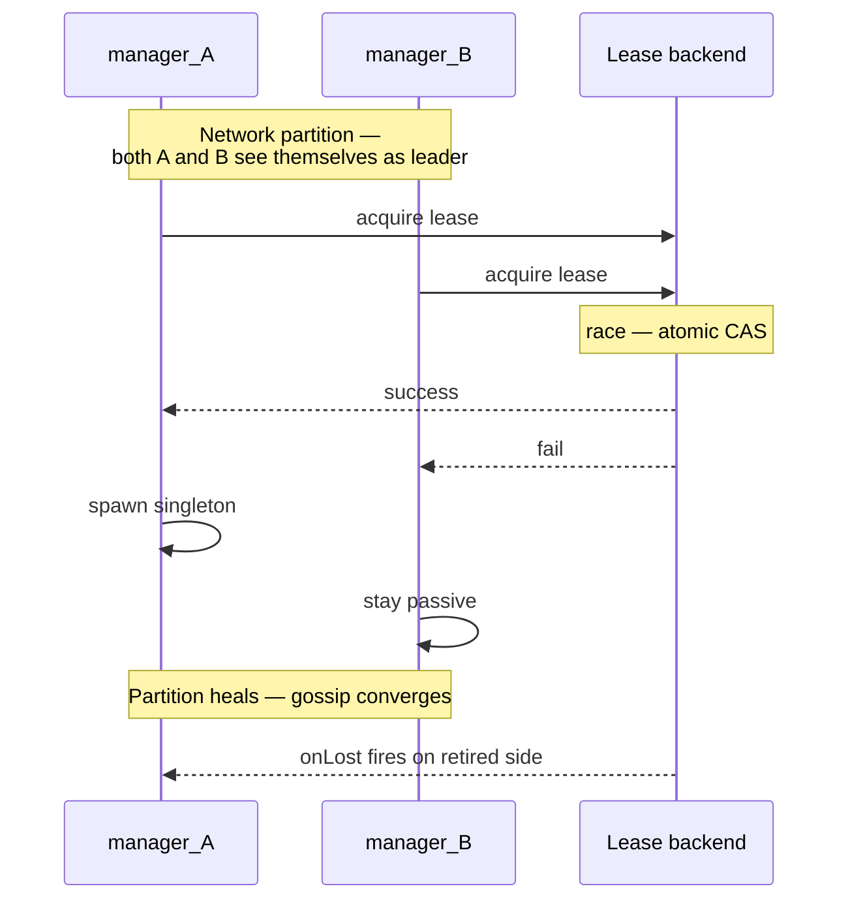

The
[singleton manager](/cluster/singleton/manager/) by
default elects a singleton based on cluster gossip alone.
During partitions + insufficient downing, **both halves can
elect their own leader** → two singletons exist.

The **single-writer lease** prevents this:

```ts
import { ClusterSingletonManager, KubernetesLease } from 'actor-ts';

system.actorOf(
  ClusterSingletonManager.props({
    cluster,
    typeName:        'job-scheduler',
    singletonProps:  Props.create(() => new JobScheduler()),
    lease:           new KubernetesLease({
      name:        'job-scheduler-singleton',
      owner:       process.env.POD_NAME!,
      ttlMs:       30_000,
      namespace:   process.env.K8S_NAMESPACE!,
    }),
  }),
  'singleton-manager-job-scheduler',
);
```

Now the manager **only spawns the singleton after acquiring
the lease**.  Two managers both claiming leadership simultaneously
race on the lease; only one wins.

## How it works



The lease backend (K8s API server) provides the **atomic
exactly-one-holder** guarantee — beyond gossip's
eventual-consistency.

## Configuration

```ts
ClusterSingletonManager.props({
  cluster,
  typeName,
  singletonProps,
  lease,                            // ← optional Lease
  acquireRetryIntervalMs: 5_000,    // default — retry after failed acquire
});
```

`Lease` is the same abstraction as
[Coordination](/coordination/overview/) — InMemoryLease
for tests, KubernetesLease for production.

## Reading the protection level

| Setup | Singleton-uniqueness guarantee |
| --- | --- |
| No downing, no lease | Best-effort.  Partitions = dual singletons. |
| Downing strategy only | Strong on stable networks. |
| Downing + lease | **Paranoid-safe**.  Both invariants enforced. |

For singletons where dual-execution would cause **real damage**
(double-charging customers, double-publishing events), use both.

## Lease loss handling

```ts
// Inside the manager (framework-managed):
lease.onLost((reason) => {
  // Stop the singleton; retry acquire after acquireRetryIntervalMs
});
```

When the lease is revoked (TTL expiry, another holder took it):

- The manager **immediately stops the singleton** — no
  graceful drain.
- The singleton's `postStop` runs.
- The manager retries acquire periodically.

Means: if the lease backend hiccups + revokes briefly, the
singleton **restarts** during the recovery — same effect as a
brief actor restart.

## Lease backend availability

```
K8s API outage → no lease renewals → singleton eventually loses lease
  → singleton stops everywhere
  → no singleton available until K8s API recovers
```

The lease backend becomes a SPOF.  For typical clusters, K8s
API uptime is much higher than the rest of the system, but
this is **a real consideration**.  Plan for the rare case.

## Failover window

```
A's lease has TTL 30s.
A crashes — no renewal happens.
After 30s, lease expires.
B acquires + spawns singleton.
```

Failover window = **lease TTL**.  Configurable via the
`ttlMs` field on the Lease.

Shorter TTL = faster failover, but more renewal traffic.
Typical: 15-30 seconds.

## What happens during the window

```
seconds 0-30:  A's lease still valid (it crashed but TTL hasn't expired)
               B can't acquire; no singleton anywhere
               Messages to singleton dead-letter

seconds 30+:   B acquires; singleton spawns
               If singleton is a PersistentActor, recovery runs
               Messages start processing again
```

During the gap, **messages to the singleton fail** — they
route to a stopped manager + dead-letter.

For workloads where this is unacceptable, consider:

- **Lower TTL** (15 s gives faster failover, more renewals).
- **Buffering at the sender** — the singleton proxy can buffer
  during gap, retry after.
- **Different architecture** — singletons are inherently
  serial-on-failover.

## Comparison with sharding-with-lease

| | Singleton + lease | Sharding + lease |
| --- | --- | --- |
| What's protected | Singleton uniqueness | Coordinator uniqueness |
| What stops on lease loss | The singleton actor | Coordinator's allocations |
| Failover window cost | Singleton unavailable | New shard allocations queue |
| Existing work during failover | Pauses | Continues for already-allocated shards |

Singleton failover is **more disruptive** — the singleton is
the workload.  Sharding failover affects only new allocations
— existing entities keep processing.

import { Aside } from '@astrojs/starlight/components';

<Aside type="caution" title="Lease in mTLS-only environments">
  ```ts
  new KubernetesLease({ /* no auth config */ })
  ```
  KubernetesLease uses the pod's service account token by
  default.  RBAC must grant Lease CRUD permissions:
  ```yaml
  rules:
    - apiGroups: ["coordination.k8s.io"]
      resources: ["leases"]
      verbs: ["get", "create", "update", "patch", "delete"]
  ```
  See [KubernetesLease](/coordination/kubernetes-lease/).
</Aside>

<Aside type="caution" title="Singleton state across failover">
  ```ts
  // Singleton with in-memory state — recovery loses it
  ```
  For state that should survive failover, the singleton must
  be a PersistentActor.  Without that, every failover is a
  fresh start.
</Aside>

## Where to next

- **[Singleton overview](/cluster/singleton/overview/)** —
  the foundation.
- **[Singleton manager](/cluster/singleton/manager/)** —
  the per-node election logic.
- **[Sharding with lease](/cluster/sharding/with-lease/)** —
  the same pattern for sharding.
- **[Coordination](/coordination/overview/)** — the
  lease abstraction.
- **[KubernetesLease](/coordination/kubernetes-lease/)** —
  production backend.
