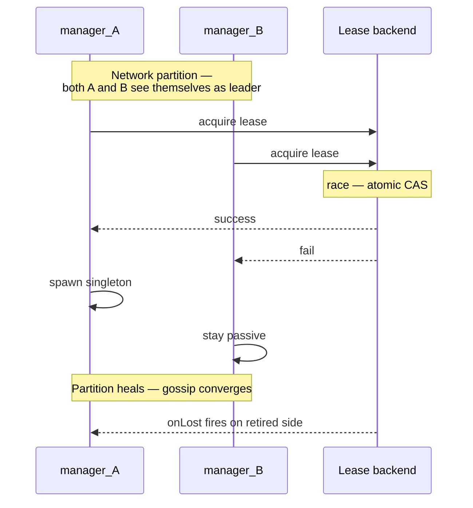

The
[singleton manager](/cluster/singleton/manager/) by
default elects a singleton based on cluster gossip alone.
During partitions + insufficient downing, **both halves can
elect their own leader** → two singletons exist.

The **single-writer lease** prevents this:

```ts
import { StartSingletonOptions } from 'actor-ts/cluster';
import { KubernetesLease, KubernetesLeaseOptions } from 'actor-ts/coordination';

const kubernetesLeaseOptions = KubernetesLeaseOptions.create()
  .withName('job-scheduler-singleton')
  .withOwner(process.env.POD_NAME!)
  .withTtlMs(30_000)
  .withNamespace(process.env.K8S_NAMESPACE!);
const startSingletonOptions = StartSingletonOptions.create()
  .withTypeName('job-scheduler')
  .withActor(JobScheduler)
  .withLease(new KubernetesLease(
    kubernetesLeaseOptions,
  ));
cluster.singleton.start(startSingletonOptions);
```

Now the manager **only spawns the singleton after acquiring
the lease**.  Two managers both claiming leadership simultaneously
race on the lease; only one wins.

## How it works


```mermaid
sequenceDiagram
  participant A as manager_A
  participant B as manager_B
  participant L as Lease backend
  Note over A,B: Network partition —<br/>both A and B see themselves as leader
  A->>L: acquire lease
  B->>L: acquire lease
  Note over L: race — atomic CAS
  L-->>A: success
  L-->>B: fail
  A->>A: spawn singleton
  B->>B: stay passive
  Note over A,B: Partition heals — gossip converges
  L-->>A: onLost fires on retired side
```

The lease backend (K8s API server) provides the **atomic
exactly-one-holder** guarantee — beyond gossip's
eventual-consistency.

## Configuration

```ts
const startSingletonOptions = StartSingletonOptions.create()
  .withTypeName(typeName)
  .withActor(singletonActor)
  .withLease(lease)                        // ← optional Lease
  .withAcquireRetryIntervalMs(5_000);      // default — retry after failed acquire
cluster.singleton.start(startSingletonOptions);
```

`Lease` is the same abstraction as
[Coordination](/coordination/overview/) — InMemoryLease
for tests, KubernetesLease for production.

## Reading the protection level

| Setup | Singleton-uniqueness guarantee |
| --- | --- |
| No downing, no lease | Holds while the outgoing host answers the hand-over.  A partition takes the timeout, and then both halves host. |
| Downing strategy only | Same, plus the partition is resolved within `downAfterMs` instead of lasting. |
| Downing + lease | The strongest available here: arbitration by a third party both sides can reach, and the lease is released only once the outgoing instance has terminated. |

For singletons where dual-execution would cause **real damage**
(double-charging customers, double-publishing events), use both.

None of these rows says "impossible", deliberately.  Without a lease the
[hand-over](/cluster/singleton/manager/#no-lease-default) makes "at most
one" hold whenever the incumbent can be reached and answers, and a peer
that cannot answer is a peer that cannot be asked to stand down — so the
incoming host takes `handOverTimeoutMs` and hosts anyway, with a warning
saying the invariant was not proven.  With a lease the arbiter is outside
both halves, which is what changes the answer; what remains is the lease
provider's own guarantee, so read the next section for how an outage of
*it* behaves.

## Lease loss handling

```ts
// Inside the manager (framework-managed):
lease.onLost((reason) => {
  // Stop the singleton; retry acquire after acquireRetryIntervalMs
});
```

When the lease is revoked (TTL expiry, another holder took it):

- The manager stops the singleton **with a `PoisonPill`** — so the
  instance finishes whatever is already in its mailbox first.  This is a
  graceful drain, not an immediate kill: how long it takes is the size of
  that backlog plus `postStop`.
- The singleton's `postStop` runs.
- Only **then** does the manager retry acquire.  Re-acquiring while the old
  instance is still draining used to leave the manager holding a lease over
  no singleton at all, permanently.

Means: if the lease backend hiccups + revokes briefly, the
singleton **restarts** during the recovery — same effect as a
brief actor restart.

Worth knowing which way the honesty cuts: on this path promptness *is* the
safety property, and a drain is not prompt.  A singleton with a long
mailbox and a slow `postStop` keeps running for that long after its lease
was revoked, which is a window in which another holder may already have
started.  Keep `postStop` short in a leased singleton, and treat the
revocation as the moment the instance is no longer authoritative rather
than the moment it stops.

## Lease backend availability

```
K8s API outage → no lease renewals → singleton eventually loses lease
  → singleton stops everywhere
  → no singleton available until K8s API recovers
```

The lease backend becomes a SPOF.  For typical clusters, K8s
API uptime is much higher than the rest of the system, but
this is **a real consideration**.  Plan for the rare case.

## Failover window

```
A's lease has TTL 30s.
A crashes — no renewal happens.
After 30s, lease expires.
B acquires + spawns singleton.
```

Failover window = **lease TTL**.  Configurable via the
`ttlMs` field on the Lease.

Shorter TTL = faster failover, but more renewal traffic.
Typical: 15-30 seconds.

## What happens during the window

```
seconds 0-30:  A's lease still valid (it crashed but TTL hasn't expired)
               B can't acquire; no singleton anywhere
               Messages to singleton dead-letter

seconds 30+:   B acquires; singleton spawns
               If singleton is a PersistentActor, recovery runs
               Messages start processing again
```

During the gap, **messages to the singleton fail** — they
route to a stopped manager + dead-letter.

For workloads where this is unacceptable, consider:

- **Lower TTL** (15 s gives faster failover, more renewals).
- **Buffering at the sender** — the singleton proxy buffers while
  the cluster has no host and drains when one appears.  The buffer
  is capped (`withBufferSize`, default 1000); past the cap messages
  go to dead letters with a warning, so a gap that never closes
  cannot grow without bound.
- **Different architecture** — singletons are inherently
  serial-on-failover.

## Comparison with sharding-with-lease

| | Singleton + lease | Sharding + lease |
| --- | --- | --- |
| What's protected | Singleton uniqueness | Coordinator uniqueness |
| What stops on lease loss | The singleton actor | Coordinator's allocations |
| Failover window cost | Singleton unavailable | New shard allocations queue |
| Existing work during failover | Pauses | Continues for already-allocated shards |

Singleton failover is **more disruptive** — the singleton is
the workload.  Sharding failover affects only new allocations
— existing entities keep processing.

import { Aside } from '@astrojs/starlight/components';

<Aside type="caution" title="Lease in mTLS-only environments">
  ```ts
  // no auth config — but name / owner / ttlMs / namespace stay required
  const leaseOptions = KubernetesLeaseOptions.create()
    .withName('job-scheduler-singleton')
    .withOwner(process.env.POD_NAME!)
    .withTtlMs(30_000)
    .withNamespace(process.env.K8S_NAMESPACE!);
  new KubernetesLease(leaseOptions);
  ```
  KubernetesLease uses the pod's service account token by
  default.  RBAC must grant Lease CRUD permissions:
  ```yaml
  rules:
    - apiGroups: ["coordination.k8s.io"]
      resources: ["leases"]
      verbs: ["get", "create", "update", "patch", "delete"]
  ```
  See [KubernetesLease](/coordination/kubernetes-lease/).
</Aside>

<Aside type="caution" title="Singleton state across failover">
  ```ts
  // Singleton with in-memory state — recovery loses it
  ```
  For state that should survive failover, the singleton must
  be a PersistentActor.  Without that, every failover is a
  fresh start.
</Aside>

## Where to next

- **[Singleton overview](/cluster/singleton/overview/)** —
  the foundation.
- **[Singleton manager](/cluster/singleton/manager/)** —
  the per-node election logic.
- **[Sharding with lease](/cluster/sharding/with-lease/)** —
  the same pattern for sharding.
- **[Coordination](/coordination/overview/)** — the
  lease abstraction.
- **[KubernetesLease](/coordination/kubernetes-lease/)** —
  production backend.
