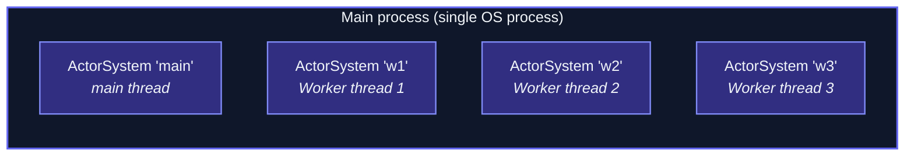

JavaScript is single-threaded per actor system.  For
**parallelism within one OS process**, the framework's
**worker mesh** runs multiple `ActorSystem`s — one per worker
thread — all participating in the same cluster via a
**MessageChannel transport**.



Each is a **separate cluster node** to the cluster's view —
gossip + membership + sharding all apply.  Communication
between them goes via in-process MessageChannel (no
serialization to bytes, no TCP).

## When to use it

Two main scenarios:

1. **CPU-bound parallelism in one process** — actor-ts is
   single-threaded per system; multi-threading needs multiple
   systems.  Worker mesh distributes them.
2. **Isolation within one process** — a "worker" failing
   doesn't take down the main system.

For **multi-process** parallelism (separate OS processes), use
regular cluster + TCP transport.  Worker mesh is specifically
for the in-process case.

## Setup

```ts
// main.ts — main thread
import { Worker } from 'node:worker_threads';
import { ActorSystem, Cluster, MessageChannelTransport } from 'actor-ts';

const channel = new MessageChannel();

const w1 = new Worker('./worker.js', {
  workerData: { mainPort: channel.port2 },
  transferList: [channel.port2],
});

const transport = new MessageChannelTransport({
  self:   'main',
  ports: [channel.port1],
});

const system = ActorSystem.create('main');
await Cluster.join(system, {
  host:      'main',
  port:      0,
  seeds:     ['main'],
  transport,
});

// worker.js — runs in the worker thread
import { parentPort, workerData } from 'node:worker_threads';
import { ActorSystem, Cluster, MessageChannelTransport } from 'actor-ts';

const transport = new MessageChannelTransport({
  self:  'w1',
  ports: [workerData.mainPort],
});

const system = ActorSystem.create('w1');
await Cluster.join(system, {
  host:      'w1',
  port:      0,
  seeds:     ['main'],
  transport,
});

// From here on, w1 is just another cluster node
```

## The mesh shape

For **multiple workers**, each pair needs a MessageChannel.  A
fully-connected mesh of 4 workers requires 6 channels (binomial(4,2)).

The framework's `MessageChannelTransport` accepts an **array of
ports**:

```ts
new MessageChannelTransport({
  self:  'main',
  ports: [
    portToW1,
    portToW2,
    portToW3,
  ],
});
```

Each port targets one peer.

For larger meshes, the **star topology** (everyone talks to
main; main relays) is simpler — only N-1 channels needed.  But
that makes main the bottleneck.

## How it differs from TCP cluster

```
TCP transport:                MessageChannelTransport:
- Sockets, framing            - postMessage between threads
- Serialized bytes            - Structured cloning (no JSON)
- Network latency             - Sub-microsecond
- Cross-host                  - Same process only
```

Messages between worker systems go through **structured clone**
— faster than JSON.stringify + parse, and preserves more types
(Map, Set, Date, etc.).

## Use cases

### Sharding across cores

```ts
// 4-worker mesh; sharding distributes entities across them:
sharding.start({
  typeName: 'order',
  entityProps: ...,
  extractEntityId: (msg) => msg.id,
  numShards: 16,
});
```

The coordinator (on main) allocates shards to the 4 workers.
CPU-bound entity work parallelizes across cores.

### Per-worker isolation

```ts
// Worker that handles GPU-bound jobs:
system.spawn(Props.create(() => new GpuJobActor()), 'gpu-jobs');

// Crashes within this worker stay isolated from main + other workers
```

A worker crashing doesn't take down the main system — separate
event loops.

## When NOT to use it

import { Aside } from '@astrojs/starlight/components';

<Aside type="caution" title="If multi-process works, use it">
  ```
  Multi-process cluster (TCP transport) is more flexible:
  - Workers can be on different machines later
  - Different runtimes per process possible
  - Standard observability + deployment tooling
  ```
  Use the worker mesh only when you specifically need
  in-process parallelism (avoiding TCP overhead, shared
  process resources, etc.).
</Aside>

<Aside type="caution" title="Worker complexity vs CPU parallelism">
  ```
  Most actor workloads are I/O-bound (HTTP, broker, DB).
  Multi-threading doesn't help — the wait is the bottleneck.
  ```
  Worker mesh only pays off for **CPU-bound** work.  Profile
  first; if your workload is I/O-bound, single-threaded is
  fine.
</Aside>

<Aside type="caution" title="Shared state between workers">
  ```ts
  // Sharing a Map across workers?
  ```
  Worker threads have isolated heap.  Sharing state requires
  the cluster machinery (DistributedData, sharded entities) or
  shared-memory primitives (SharedArrayBuffer).  Don't try to
  pass objects directly.
</Aside>

## Where to next

- **[Cluster overview](/cluster/overview/)** — the
  cluster model worker-mesh participates in.
- **[Transports](/cluster/transports/)** — the
  transport interface MessageChannelTransport implements.
- **[Sharding](/cluster/sharding/overview/)** — the
  primary consumer of mesh parallelism.
