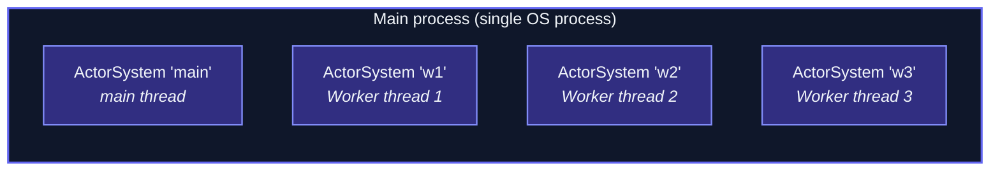

JavaScript is single-threaded per actor system.  For
**parallelism within one OS process**, the framework's
**worker mesh** runs multiple `ActorSystem`s — one per worker
thread — all participating in the same cluster via a
**MessageChannel transport**.


```mermaid
flowchart TB
  subgraph PROC["Main process (single OS process)"]
    direction TB
    MAIN["ActorSystem 'main'<br/><i>main thread</i>"]
    W1["ActorSystem 'w1'<br/><i>Worker thread 1</i>"]
    W2["ActorSystem 'w2'<br/><i>Worker thread 2</i>"]
    W3["ActorSystem 'w3'<br/><i>Worker thread 3</i>"]
  end
  classDef proc fill:#0f172a,stroke:#6366f1,stroke-width:2px,color:#f1f5f9;
  classDef sys  fill:#312e81,stroke:#818cf8,stroke-width:1.5px,color:#f1f5f9;
  class PROC proc
  class MAIN,W1,W2,W3 sys
```

Each is a **separate cluster node** to the cluster's view —
gossip + membership + sharding all apply.  Communication
between them goes via in-process MessageChannel (no
serialization to bytes, no TCP).

## When to use it

Two main scenarios:

1. **CPU-bound parallelism in one process** — actor-ts is
   single-threaded per system; multi-threading needs multiple
   systems.  Worker mesh distributes them.
2. **Isolation within one process** — a "worker" failing
   doesn't take down the main system.

For **multi-process** parallelism (separate OS processes), use
regular cluster + TCP transport.  Worker mesh is specifically
for the in-process case.

## Setup

```ts
// main.ts — main thread
import { Worker } from 'node:worker_threads';
import { ActorSystem, Cluster, ClusterOptions, MessageChannelTransport, NodeAddress } from 'actor-ts';

const channel = new MessageChannel();

const w1 = new Worker('./worker.js', {
  workerData: { mainPort: channel.port2 },
  transferList: [channel.port2],
});

const mainAddress = new NodeAddress('main', 'main', 0);
const transport = new MessageChannelTransport(mainAddress, channel.port1);

const system = ActorSystem.create('main');
const clusterOptions = ClusterOptions.create()
  .withHost('main')
  .withPort(0)
  .withSeeds(['main'])
  .withTransport(transport);
await Cluster.join(
  system,
  clusterOptions,
);

// worker.js — runs in the worker thread
import { parentPort, workerData } from 'node:worker_threads';
import { ActorSystem, Cluster, ClusterOptions, MessageChannelTransport, NodeAddress } from 'actor-ts';

const workerAddress = new NodeAddress('w1', 'w1', 0);
const transport = new MessageChannelTransport(workerAddress, workerData.mainPort);

const system = ActorSystem.create('w1');
const cluster2Options = ClusterOptions.create()
  .withHost('w1')
  .withPort(0)
  .withSeeds(['main'])
  .withTransport(transport);
await Cluster.join(
  system,
  cluster2Options,
);

// From here on, w1 is just another cluster node
```

## The mesh shape

The transport is a **star, not a full mesh**.  A single
`WorkerBroker` on the main thread is the hub: it holds one
`MessagePort` per node and forwards each frame to the node named
by the envelope's `to` address.  Every node's
`MessageChannelTransport` holds a **single port** — its own end
of one channel to the broker, never an array:

```ts
import { MessageChannelTransport, NodeAddress, WorkerBroker } from 'actor-ts';

// Main thread: one broker is the hub for every node.
const broker = new WorkerBroker();

// One MessageChannel per worker — the broker keeps one end and
// the worker receives the other (transferred via workerData).
const workerAddress = new NodeAddress('w1', 'w1', 0);
const channel = new MessageChannel();
broker.register(workerAddress, channel.port1);

// Inside that worker, its transport holds the single far end:
const transport = new MessageChannelTransport(workerAddress, channel.port2);
```

So **N workers need N channels** (one per worker) — not
binomial(N,2).  The broker relays every hop, which keeps the
wiring linear but makes the main thread the relay for all
cross-node traffic.

## How it differs from TCP cluster

```
TCP transport:                MessageChannelTransport:
- Sockets, framing            - postMessage between threads
- Serialized bytes            - Structured cloning (no JSON)
- Network latency             - Sub-microsecond
- Cross-host                  - Same process only
```

Messages between worker systems go through **structured clone**
— faster than JSON.stringify + parse, and preserves more types
(Map, Set, Date, etc.).

## Use cases

### Sharding across cores

```ts
// 4-worker mesh; sharding distributes entities across them:
const startShardingOptions = StartShardingOptions.create()
  .withTypeName('order')
  .withEntityProps(...)
  .withExtractEntityId((message) => message.id)
  .withNumShards(16);
sharding.start(
  startShardingOptions,
);
```

The coordinator (on main) allocates shards to the 4 workers.
CPU-bound entity work parallelizes across cores.

### Per-worker isolation

```ts
// Worker that handles GPU-bound jobs:
system.spawn(Props.create(() => new GpuJobActor()), 'gpu-jobs');

// Crashes within this worker stay isolated from main + other workers
```

A worker crashing doesn't take down the main system — separate
event loops.

## When NOT to use it

import { Aside } from '@astrojs/starlight/components';

<Aside type="caution" title="If multi-process works, use it">
  ```
  Multi-process cluster (TCP transport) is more flexible:
  - Workers can be on different machines later
  - Different runtimes per process possible
  - Standard observability + deployment tooling
  ```
  Use the worker mesh only when you specifically need
  in-process parallelism (avoiding TCP overhead, shared
  process resources, etc.).
</Aside>

<Aside type="caution" title="Worker complexity vs CPU parallelism">
  ```
  Most actor workloads are I/O-bound (HTTP, broker, DB).
  Multi-threading doesn't help — the wait is the bottleneck.
  ```
  Worker mesh only pays off for **CPU-bound** work.  Profile
  first; if your workload is I/O-bound, single-threaded is
  fine.
</Aside>

<Aside type="caution" title="Shared state between workers">
  ```ts
  // Sharing a Map across workers?
  ```
  Worker threads have isolated heap.  Sharing state requires
  the cluster machinery (DistributedData, sharded entities) or
  shared-memory primitives (SharedArrayBuffer).  Don't try to
  pass objects directly.
</Aside>

## Where to next

- **[Cluster overview](/cluster/overview/)** — the
  cluster model worker-mesh participates in.
- **[Transports](/cluster/transports/)** — the
  transport interface MessageChannelTransport implements.
- **[Sharding](/cluster/sharding/overview/)** — the
  primary consumer of mesh parallelism.
