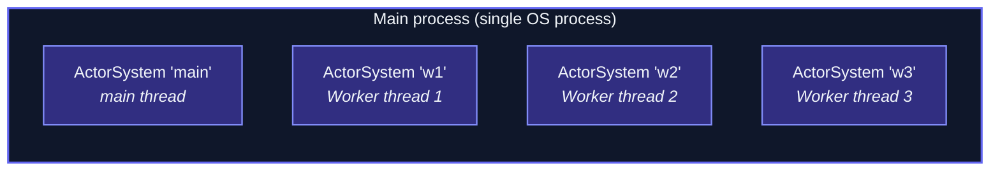

import { Aside } from '@astrojs/starlight/components';

JavaScript is single-threaded per actor system.  For
**parallelism within one OS process**, the framework's
**worker mesh** runs multiple `ActorSystem`s — one per worker
thread — all participating in the same cluster via a
**MessageChannel transport**.


```mermaid
flowchart TB
  subgraph PROC["Main process (single OS process)"]
    direction TB
    MAIN["ActorSystem 'main'<br/><i>main thread</i>"]
    W1["ActorSystem 'w1'<br/><i>Worker thread 1</i>"]
    W2["ActorSystem 'w2'<br/><i>Worker thread 2</i>"]
    W3["ActorSystem 'w3'<br/><i>Worker thread 3</i>"]
  end
  classDef proc fill:#0f172a,stroke:#6366f1,stroke-width:2px,color:#f1f5f9;
  classDef sys  fill:#312e81,stroke:#818cf8,stroke-width:1.5px,color:#f1f5f9;
  class PROC proc
  class MAIN,W1,W2,W3 sys
```

Each is a **separate cluster node** to the cluster's view —
gossip + membership + sharding all apply.  Communication
between them goes via in-process MessageChannel (no
serialization to bytes, no TCP).

## When to use it

Two main scenarios:

1. **CPU-bound parallelism in one process** — actor-ts is
   single-threaded per system; multi-threading needs multiple
   systems.  Worker mesh distributes them.
2. **Isolation within one process** — a worker failing doesn't
   take down the main system.  That covers an uncaught throw, an
   unhandled rejection, and a bootstrap that fails to load: the
   framework subscribes the worker's `error` event, so the
   failure reaches `restartPolicy` instead of the host's own
   crash path.  See [Failure containment](#failure-containment)
   for what is and isn't guaranteed per runtime.

For **multi-process** parallelism (separate OS processes), use
regular cluster + TCP transport.  Worker mesh is specifically
for the in-process case.

## Placement without code: `actor-ts.parallelism`

You may never need this page's API at all.  With
`actor-ts.parallelism.workers` above zero, `ActorSystem.create` starts a
`WorkerMesh` in the background and `system.spawn` places actors on it —
the application code does not change.  That layer, its limits and its
measured numbers are on [Parallelism](/fundamentals/parallelism/); what
follows is the mesh underneath it, for when you want to drive the threads
yourself.  And when the work is a *function* rather than an actor — hash
this, compress that — a mesh is the wrong weight altogether:
[`OffloadPool`](/fundamentals/blocking-and-cpu-bound-work/) runs it on a
worker with no actor system on the far side.

## High-level API: `WorkerMesh`

`WorkerMesh` makes the **main thread a member** of a mesh it spawns.  It
joins your `ActorSystem` to a fresh cluster over a `MessageChannel`,
spawns N workers with a bootstrap the framework ships, and hands every
worker the same actor module — so the workers host actors you wrote,
the main thread can reach them through ordinary `ActorRef`s, and no
application code runs *inside* a worker script you had to write:

```ts
// main.ts — the main thread
import { ActorSystem } from 'actor-ts';
import { WorkerMesh, WorkerMeshOptions } from 'actor-ts/worker';

const system = ActorSystem.create('my-app');
const meshOptions = WorkerMeshOptions.create()
  .withModule(new URL('./actors.js', import.meta.url))
  .withWorkers('auto');
const mesh = await WorkerMesh.start(system, meshOptions);

const encoder = mesh.refFor<EncodeCommand>(mesh.addresses[0], '/user/encoder');
const encoded = await encoder.ask<Encoded>({ kind: 'encode', bytes });

await mesh.terminate();
```

```ts
// actors.ts — imported by every worker, by URL
import { Actor } from 'actor-ts';
import type { WorkerMeshSetupContext } from 'actor-ts/worker';

export class Encoder extends Actor<EncodeCommand> {
  override onReceive(command: EncodeCommand): void { /* CPU-bound work */ }
}

// Optional: runs once per worker after its node is up.
export function setup(context: WorkerMeshSetupContext): void {
  context.system.spawn(Encoder, 'encoder');
}
```

What `start` does, in order: it registers the main thread's own port
with a `WorkerBroker` under `system.name@main:1`, joins `system` to a
cluster on it, spawns the workers with the shipped
`worker-mesh-bootstrap`, and resolves once every worker has handshaken
**and** every member is `up`.  Each worker joins the main thread as its
seed, builds its `ActorSystem` from the main system's **effective**
configuration — `system.config`, not the file it came from, so a value
set with a builder on the main thread is the value the workers run with
— imports the module(s) named by `withModule`, registers every exported
actor class by its **export name**, runs the module's `setup` if it has
one, and reports the registry back: `mesh.workers` lists each worker's
address and the classes it can spawn.  The mesh hands `system.log` to
both the worker cluster and the broker it builds, so every line listed
under [What the mesh reports](#what-the-mesh-reports) reaches the sinks
your system already logs to.

| Option | What |
| --- | --- |
| `withModule(url \| url[])` | The actor module(s) every worker imports.  **Required**, and code-only — deliberately not a config key, see below. |
| `withWorkers(n \| 'auto')` | Worker count.  `'auto'` is the machine's available parallelism **minus one** — the main thread is a working member — floored at 1.  Default `'auto'`. |
| `withMainHostname(host)` / `withWorkerHostname(host)` | Hostname components of the two sides' addresses.  Defaults `'main'` / `'worker'` — which sorts main first, so main **leads** and hosts the shard coordinator.  A worker hostname that sorts before main's (`'core'`) moves both onto a worker. |
| `withMainPort(port)` / `withBasePort(port)` | Synthetic port components; nothing binds them.  Defaults `1` / `2`. |
| `withMainRoles(roles)` / `withWorkerRoles(roles)` | Cluster roles each side joins with — what role-restricted singletons, shards and routers select on.  Default none. |
| `withReadyTimeoutMs(ms)` | Per-worker handshake deadline, and the membership deadline for the whole mesh.  Default `10000`. |
| `withMetricsRelayIntervalMs(ms)` | How often the main thread pulls every worker's metrics registry into its own `/metrics`; `0` switches the relay off.  Default `10000`.  See [Metrics](#metrics-one-scrape-for-every-thread) below. |
| `withRestartPolicy(p)` and the `withRestart…` / `withMaxRestarts` knobs | Passed through to the worker cluster underneath — see its table below. |
| `withBootstrap(url)` | Escape hatch for a bundler that moved the shipped bootstrap out of `dist/worker/`.  Default: the shipped one. |
| `withBackend(backend)` | Spawn through this `WorkerBackend` — an in-memory fake in a test, or a custom adapter for a runtime the detection does not know.  A custom one implements `WorkerBackend` and returns a `WorkerLike` (both exported from `actor-ts/worker`) and declares `containsWorkerErrors`; see [Custom backends](#custom-backends).  Default: detected. |

`refFor(address, path)` returns an ordinary `ActorRef`: `tell`, `ask`,
`watch` all work through it, and the path may be the bare `/user/name`
form.  `terminate()` takes the workers down first and then leaves the
cluster; a system that goes through coordinated shutdown takes its mesh
with it.

### Metrics: one scrape for every thread

Every worker hosts its own `ActorSystem`, so it has its own
`MetricsRegistry` — and no management endpoint of its own.  The mesh
relays them: every `metrics-relay-interval` (default `10s`) the main
thread sends each live worker a request, the worker answers with its
registry's samples, and `GET /metrics` on the main thread exports the
whole process.  The request is also what switches a worker's registry
on, so nothing has to be enabled inside a worker; enable metrics on the
main thread — before or after `start()` — and the workers follow on the
next tick.  Every exported series then carries `thread="main"` or
`thread="worker-N"`, `N` being the slot in `mesh.workers`, and
`worker_mesh_snapshot_age_seconds{worker="worker-N"}` says how long ago
each worker last answered; a slot that leaves the mesh takes its series
with it, a respawned one comes back under the same label with fresh
counters.  Set the interval to `0` and the exposition is the main
thread's alone, exactly as before.  The relay runs for a mesh started
here and for the one `actor-ts.parallelism.workers` starts alike; the
[scope of a scrape](/observability/metrics/prometheus-exporter/#scope-per-process-per-thread)
has the PromQL and the caveats.

<Aside type="note" title="Why the actor module is not a config key">
  `withModule` names code the workers will *execute*.  A config file —
  `ACTOR_TS_CONFIG`, a dropped-in `application.conf` — is a wider surface
  than the call site, and a key there would let something other than the
  application's own source decide which code runs on a thread.  The same
  rule keeps `bootstrap` out of `actor-ts.worker-cluster`.  Everything
  else about the mesh *is* configurable: see
  [the config block](#the-same-knobs-from-a-config-file).
</Aside>

<Aside type="caution" title="A message that crosses a thread is cloned">
  Everything sent to a worker actor goes through structured clone.  A
  plain-data message with a `kind` discriminant arrives intact; a class
  instance arrives as a bare object with **no prototype and no methods**,
  silently.  Write worker-bound messages as data, not objects — and keep
  the reply path in mind: `context.sender` and `replyTo` both work
  across the boundary.
</Aside>

## The manual layer: `WorkerCluster`

`WorkerMesh` is built on `WorkerCluster`, which is what you reach for
when the automatic shape does not fit — workers that run *different*
code, workers that host no actors at all, or a bootstrap you want to
write yourself.  It spawns a pool of workers from one entrypoint module,
runs the hello/init/ready handshake, registers each worker with a shared
`WorkerBroker`, and restarts crashed workers per a `restartPolicy`.  The
underlying worker primitive is picked per runtime — Web Workers on
Bun/Deno, `node:worker_threads` on Node — and the worker-side helper
`WorkerNode.join()` speaks whichever the runtime exposes: the Web Worker
globals, or Node's `parentPort`.

**The main thread is not a member of a `WorkerCluster`.**  It relays every
frame through the broker and nothing more, which has three consequences
`WorkerMesh` exists to remove: the main thread cannot address a worker
actor, an `ask` from it has nowhere to land its reply, and the cluster
leader — and with it the shard coordinator — is the lowest-addressed
*worker*.

```ts
// main.ts — main thread
import { WorkerCluster, WorkerClusterOptions } from 'actor-ts/worker';

const workerClusterOptions = WorkerClusterOptions.create()
  .withWorkers(4)
  .withBootstrap(new URL('./worker-node.js', import.meta.url))
  .withSystemName('multi-core')
  .withBasePort(2552);
const cluster = await WorkerCluster.spawn(workerClusterOptions);

console.log(`Spawned ${cluster.size} workers:`);
for (const address of cluster.addresses) console.log('  -', address.toString());

// ...later, on shutdown:
await cluster.terminate();
```

Each worker runs the **bootstrap module**.  It calls `WorkerNode.join()`
to complete the handshake and receive its address, system name,
transport, and `initData`, then joins the cluster like any other node:

```ts
// worker-node.ts — runs inside each worker
import { ActorSystem } from 'actor-ts';
import { Cluster, ClusterOptions } from 'actor-ts/cluster';
import { WorkerNode } from 'actor-ts/worker';

async function main(): Promise<void> {
  const context = await WorkerNode.join<{ seedAddress?: string }>();
  const system = ActorSystem.create(context.systemName);
  const clusterOptions = ClusterOptions.create()
    .withHost(context.self.host)
    .withPort(context.self.port)
    .withSeeds(context.initData.seedAddress ? [context.initData.seedAddress] : [])
    .withTransport(context.transport);
  await Cluster.join(system, clusterOptions);

  system.spawn(MyActor, 'worker');
  context.ready();   // tell the main thread this node is up
}

void main();
```

| Option | What |
| --- | --- |
| `withBootstrap(url)` | Worker entrypoint module.  **Required**, and must be a `file:` URL **with no host** — `new URL('./worker-node.js', import.meta.url)` produces exactly that.  A `data:`, `blob:` or remote specifier is rejected because it would hand the worker constructor code from outside the deployment, and so is a host on the `file:` URL: `file://a-server/share/worker.js` is a UNC path, so the entry module would be fetched off that server.  `file://localhost/…` stays accepted — the URL parser erases that host, on all three runtimes. |
| `withWorkers(n \| 'auto')` | Pool size; `'auto'` uses hardware concurrency.  Default `'auto'`. |
| `withSystemName(name)` | `ActorSystem` name each worker hosts.  Default `'worker-cluster'`. |
| `withHostname(host)` | Hostname component of each worker's address.  Default `'worker'`. |
| `withBasePort(port)` | Port of the first worker; each subsequent worker increments.  Default `1`. |
| `withInitData(data)` | Payload delivered to every worker's `join()` context (`initData`).  Default `null`. |
| `withRestartPolicy(p)` | `'always'` / `'on-failure'` / `'never'`.  Default `'on-failure'`. |
| `withReadyTimeoutMs(ms)` | Per-worker handshake timeout.  Default `10000`. |
| `withRestartMinBackoffMs(ms)` | Delay before the first respawn of a crashed slot.  Default `200`. |
| `withRestartMaxBackoffMs(ms)` | Ceiling for the respawn delay, which doubles per attempt.  Default `10000`. |
| `withRestartRandomFactor(f)` | ± jitter fraction on each respawn delay, in `[0, 1]`.  Default `0.2`. |
| `withMaxRestarts(n)` | Restarts granted per slot within the window before it is retired; `-1` for unlimited.  Default `10`. |
| `withRestartWindowMs(ms)` | Sliding window the restart budget counts over; `0` never resets it.  Default `60000`. |
| `withOnWorkerPermanentlyDown(fn)` | Called once per slot whose restart budget is spent.  Default: an `ERROR` line through the pool's logger. |
| `withBackend(backend)` | Spawn through this `WorkerBackend` instead of the detected one — a runtime auto-detection does not know, or an in-memory fake in a test.  A custom one implements `WorkerBackend` and returns a `WorkerLike` (both exported from `actor-ts/worker`) and declares `containsWorkerErrors`; see [Custom backends](#custom-backends).  Default: detected. |
| `withLogger(logger)` | Where the pool reports worker exits, respawns, retired slots and — when it builds its own broker — broker drops; see [What the mesh reports](#what-the-mesh-reports).  Default: a `ConsoleLogger` at `Info`. |
| `withBroker(broker)` | Route through a broker the caller owns, the way `WorkerMesh` puts the main thread's own port on it first.  A broker handed in keeps the logger it was built with.  Default: a fresh broker reporting through the pool's logger. |

The returned `WorkerCluster` exposes `size`, `addresses`
(the `NodeAddress` of each worker), the shared `broker`, and
`terminate()`.  Misconfigured options (a bad `basePort`, a
non-positive `workers`) throw `OptionsError` at `spawn`.

`spawn()` leaves no live workers behind when it fails: a worker whose
handshake times out is terminated before the rejection propagates, and
so is every sibling that did come up — the instance that owns them is
never returned, so nothing else could reach them.  `terminate()` waits
for the threads to actually go rather than firing and forgetting, within
the bound described below.


<Aside type="caution" title="Call `WorkerNode.join()` inside an async function">
  ```ts
  // ✗ top-level await in the worker module
  const context = await WorkerNode.join();
  ```
  Run it from inside an `async function main() { … }` that you invoke,
  not as a top-level `await`.  On Bun, a top-level await in a worker
  suspends the module loader so incoming messages never dispatch, and
  the handshake hangs forever.
</Aside>

## The same knobs from a config file

Nine of the options in the table above are also `actor-ts.worker-cluster`
keys, alongside `workers` and `restart-policy`, so a deployment can retune the
mesh without a rebuild:

```hocon
actor-ts.worker-cluster {
  workers               = 4
  system-name           = "ingest"
  hostname              = "ingest-worker"
  base-port             = 100
  ready-timeout         = 30s
  restart-policy        = "on-failure"
  restart-min-backoff   = 500ms
  restart-max-backoff   = 30s
  restart-random-factor = 0.3
  max-restarts          = 20
  restart-window        = 5m
}
```

The mesh has its own block for the fields that are its own — the restart
knobs stay the worker cluster's, and the actor module has no key for the
reason given above:

```hocon
actor-ts.worker-mesh {
  workers                = "auto"    # available parallelism minus the main thread
  main-hostname          = "main"
  main-port              = 1
  worker-hostname        = "worker"  # sort it before main-hostname to let a worker lead
  base-port              = 2
  main-roles             = []
  worker-roles           = ["compute"]
  metrics-relay-interval = 10s       # workers' registries pulled into the main thread's /metrics; 0 = off
}
```

Precedence is the framework's usual **explicit options > HOCON > built-in
default**, applied per field: `withWorkers(8)` in code beats `workers = 4` in
the file, while every field the call leaves unset falls through to it.  The
four duration keys drop the `Ms` suffix their builder methods carry and take a
duration literal instead.  `initData` has no key because it is per-call
identity, and `backend` and `onWorkerPermanentlyDown` because they are live
objects a file cannot express.  `bootstrap` is held back deliberately: it names
a module the runtime will *execute*, and `ACTOR_TS_CONFIG` or a dropped-in
`application.conf` is a wider surface than the call site.

`spawn` is a static with no `ActorSystem` in scope, so it loads the config
chain itself: the same one `ActorSystem.create` uses, honouring
`ACTOR_TS_CONFIG` and `./application.conf`.  A value from the file is validated
against the merged settings, so a bad one throws `OptionsError` at `spawn`
exactly as a bad one in code does.

## Under the hood: manual wiring

The `WorkerCluster` above does this wiring for you.  Reach for the
manual path only when you need full control — a custom topology, a
bespoke handshake, or extra per-node setup.

```ts
// main.ts — main thread
import { Worker } from 'node:worker_threads';
import { ActorSystem } from 'actor-ts';
import { Cluster, ClusterOptions, MessageChannelTransport, NodeAddress } from 'actor-ts/cluster';

const channel = new MessageChannel();

const w1 = new Worker('./worker.js', {
  workerData: { mainPort: channel.port2 },
  transferList: [channel.port2],
});

const mainAddress = new NodeAddress('main', 'main', 0);
const transport = new MessageChannelTransport(mainAddress, channel.port1);

const system = ActorSystem.create('main');
const clusterOptions = ClusterOptions.create()
  .withHost('main')
  .withPort(0)
  .withSeeds(['main'])
  .withTransport(transport);
await Cluster.join(
  system,
  clusterOptions,
);

// worker.js — runs in the worker thread
import { parentPort, workerData } from 'node:worker_threads';
import { ActorSystem } from 'actor-ts';
import { Cluster, ClusterOptions, MessageChannelTransport, NodeAddress } from 'actor-ts/cluster';

const workerAddress = new NodeAddress('w1', 'w1', 0);
const transport = new MessageChannelTransport(workerAddress, workerData.mainPort);

const system = ActorSystem.create('w1');
const cluster2Options = ClusterOptions.create()
  .withHost('w1')
  .withPort(0)
  .withSeeds(['main'])
  .withTransport(transport);
await Cluster.join(
  system,
  cluster2Options,
);

// From here on, w1 is just another cluster node
```

## The mesh shape

The transport is a **star, not a full mesh**.  A single
`WorkerBroker` on the main thread is the hub: it holds one
`MessagePort` per node and forwards each frame to the node named
by the envelope's `to` address.  Every node's
`MessageChannelTransport` holds a **single port** — its own end
of one channel to the broker, never an array:

```ts
import { MessageChannelTransport, NodeAddress } from 'actor-ts/cluster';
import { WorkerBroker } from 'actor-ts/worker';

// Main thread: one broker is the hub for every node.
const broker = new WorkerBroker();

// One MessageChannel per worker — the broker keeps one end and
// the worker receives the other (transferred via workerData).
const workerAddress = new NodeAddress('w1', 'w1', 0);
const channel = new MessageChannel();
broker.register(workerAddress, channel.port1);

// Inside that worker, its transport holds the single far end:
const transport = new MessageChannelTransport(workerAddress, channel.port2);
```

So **N workers need N channels** (one per worker) — not
binomial(N,2).  The broker relays every hop, which keeps the
wiring linear but makes the main thread the relay for all
cross-node traffic.

The star is the chosen shape, not a first draft: direct
worker-to-worker `MessagePort`s are on the roadmap, pending a
measurement of the relay's own share of the hop (#1576), and until
that number exists the mitigation is
sizing — give `workers` to the actors that compute, not to the ones
that chat.

A broker built with `new WorkerBroker()` reports the frames it drops
through a `ConsoleLogger` at `Info`; `new WorkerBroker(system.log)`
routes them through your system's sinks instead, which is what
`WorkerMesh` does for the broker it builds.

## How it differs from TCP cluster

```
TCP transport:                MessageChannelTransport:
- Sockets, framing            - postMessage between threads
- Serialized bytes            - Structured cloning (no JSON)
- Network latency             - Tens of microseconds per hop
- Cross-host                  - Same process only
```

Messages between worker systems go through **structured clone** —
faster than framing and re-parsing text.  It carries the same rich
types (Map, Set, Date, …) the TCP wire's tagged JSON tree carries,
without the text round-trip.  It is still a boundary, and not a cheap
one next to a local `tell`: measured on the actor path
(`benchmarks/worker/mesh-message-cost.ts`, Bun 1.4, 32 threads), a
cross-thread `tell` costs about **20 µs** against ~300 ns local, and a
cross-thread `ask` about **180 µs** against ~6 µs — the envelope, the
ref codec, the broker's relay hop and two clones.  The same two nodes on
one thread pay about **25 µs** per `tell` and **80 µs** per `ask` — the
same benchmark's in-process tier — so the protocol is the bill, not the
thread.  An actor message carries no transfer list either: a large
buffer is cloned on every hop (through the star, a move would be two
moves at best), so move it once through `context.offload` instead.  An
actor that exchanges many small messages pays that on every one and
gains nothing from the thread; an actor that does real CPU work per
message gains the core.  Place accordingly.

## Use cases

### Sharding across cores

```ts
// 4-worker mesh; sharding distributes entities across them:
const startShardingOptions = StartShardingOptions.create()
  .withTypeName('order')
  .withEntityActor(...)
  .withExtractEntityId((message) => message.id)
  .withNumShards(16);
sharding.start(
  startShardingOptions,
);
```

With `WorkerMesh` the main thread leads by default and so hosts the
coordinator, which allocates shards to the workers; role-restricted
sharding (`withRole('compute')` against `withWorkerRoles(['compute'])`)
keeps every entity off the main thread.  CPU-bound entity work
parallelizes across cores.  Under a bare `WorkerCluster` the main thread
is not a member, and the coordinator runs on the lowest-addressed
worker instead.

### Per-worker isolation

```ts
// Worker that handles GPU-bound jobs:
system.spawn(GpuJobActor, 'gpu-jobs');

// Crashes within this worker stay isolated from main + other workers
```

A worker crashing doesn't take down the main system — separate
event loops.

## Failure containment

What "a worker failing doesn't take down the main system" actually
covers, and what it costs:

- **An uncaught throw, an unhandled rejection, or a bootstrap that
  won't load** is contained.  The framework subscribes the worker's
  `error` event on every runtime; without that subscription Node
  re-raises the worker's error on the host and Deno rejects an internal
  promise, and both exit `1` before `restartPolicy` is ever consulted.
  The subscription is the framework's half; the other half is the
  *adapter* honouring it, and that is decided inside the backend that
  spawned the worker.  The two shipped backends do: the Node adapter
  forwards the subscription to `worker.on('error')`, and the Web adapter
  cancels the native `ErrorEvent` from inside the listener it installs —
  on Deno a bare listener does not stop the runtime re-raising.  A
  backend of your own has to do the same, and says whether it does; see
  [Custom backends](#custom-backends).
- **One failure produces one respawn.** Node and Bun emit `error` *and
  then* the exit event for a single throw, and Deno emits only `error` —
  whichever arrives first drives the restart and the other is dropped.
- **Respawns back off and are budgeted.** Each slot waits
  `restartMinBackoffMs`, doubling to `restartMaxBackoffMs` with
  `restartRandomFactor` jitter, and gets `maxRestarts` attempts inside
  `restartWindowMs`.  A slot that spends its budget is retired: no
  further worker is started for it, and `onWorkerPermanentlyDown` is
  called once with the slot's index, address and restart count.  A
  replacement that never becomes ready counts against the same budget,
  so a permanently broken bootstrap stops instead of looping.
- **A failed respawn degrades the mesh by one worker** rather than
  killing the host.  `size` drops, the slot's address is unregistered
  from the broker, and the failure is reported.

Two runtime asymmetries are worth knowing:

<Aside type="caution" title="Deno confirms neither exit nor shutdown">
  Deno's parent-side `Worker` emits no `close` event at all, so restarts
  there are driven entirely by `error` — a worker that exits *without*
  throwing goes unnoticed.  Deno also emits nothing after
  `terminate()`, so `terminate()` falls back to a short internal bound
  instead of a confirmation.  The thread is killed either way; the
  framework simply cannot observe it.
</Aside>

### Custom backends

`withBackend` takes anything that implements `WorkerBackend` — an
in-memory fake for a test, or an adapter for a runtime the detection
does not know.  `spawn(url, options)` returns a `WorkerLike`: the subset
of the Web Worker surface the framework uses (`postMessage`,
`addEventListener` / `removeEventListener` for `message`, `close` and
`error`, and a `terminate()` that resolves once the thread is gone).
Both types are exported from `actor-ts/worker`.

The one thing the compiler cannot check about such an adapter is
whether its `error` subscription **contains** the worker's failure.  An
adapter that stores the handler and never wires it satisfies the type
just as well, and from the parent there is no probe that can tell the
difference — so the backend declares it, and the declaration is
required:

```ts
import type { WorkerBackend, WorkerLike, WorkerSpawnOptions } from 'actor-ts/worker';

class InMemoryBackend implements WorkerBackend {
  // `true` promises that an `error` listener on the returned worker stops
  // the failure from reaching the host — the per-runtime contract is below.
  readonly containsWorkerErrors = true;

  spawn(url: URL, options?: WorkerSpawnOptions): WorkerLike {
    // Your adapter: the object whose `error` wiring the declaration is about.
    return new InMemoryWorker(url, options?.name);
  }
}
```

What `true` promises, per runtime: on **Node** the subscription is
forwarded to `worker.on('error')` — an emitter with no `error` listener
re-raises on the host, exit `1`, and `exit` never fires; on **Deno** the
listener the adapter installs calls `preventDefault()` on the native
`ErrorEvent` — a bare listener does not stop the runtime re-raising as
an unhandled rejection; on **Bun** a forwarded listener is enough.  An
in-process fake whose `error` listeners are the only thing a simulated
failure ever reaches is trivially `true`.  The scope is the `error`
event: an uncaught throw, an unhandled rejection, a bootstrap that fails
to load — not `messageerror`.

Declare `false` and the framework reports it **once per backend
instance, before the first spawn**, through the consumer's logger —
`[worker]` for a mesh or a bare `WorkerCluster`, `[offload]` for an
`OffloadPool`, the console for `ParallelMultiNodeSpec` — and continues:
the spawn is never refused, because the declaration changes nothing the
framework could do differently.  The line names the backend class and
says what will happen — an uncaught throw inside a worker terminates
the process instead of reaching the framework's error handler, and so
never reaches the restart policy either — so a host that later dies
that way has one line explaining why.

To *prove* a `true`, crash a worker and survive: spawn a bootstrap that
throws at load through your backend on Node and on Deno, subscribe
`error`, and let the process's own survival be the assertion — the
shape of the in-tree smoke case `29-worker-crash-containment`, which
says the same about itself.  Nothing short of that proves it; the
declaration is what the framework can act on.

### What the mesh reports

Every one of the events above produces a line through the pool's logger
— `system.log` in a `WorkerMesh`, `withLogger` on a bare
`WorkerCluster`, a `ConsoleLogger` at `Info` when neither is given.  The
lines all carry the `[worker]` prefix, and each carries the fact inside
the message rather than as a structured argument, so a console sink and
a log shipper see the same thing:

| Event | Level | Line |
| --- | --- | --- |
| A worker's `error` event | `ERROR` | `[worker] worker N (addr) failed: <message>` |
| A `close` event with a non-zero code, or with none | `WARN` | `[worker] worker N (addr) exited with code C` / `… exited without an exit code` |
| A `close` event with code 0 | `INFO` | `[worker] worker N (addr) exited with code 0` |
| The policy leaves the slot down | `INFO` | `[worker] worker N (addr) is not respawned — restartPolicy 'P'` |
| A restart is granted | `WARN` | `[worker] respawning worker N (addr) in D ms (restart K of M inside W ms)` — `(restart budget unlimited)` under `maxRestarts: -1`, and no `inside W ms` under `restartWindowMs: 0` |
| A replacement never became ready | `ERROR` | `[worker] respawning worker N (addr) failed: <message>` |
| The budget is spent and no `onWorkerPermanentlyDown` is set | `ERROR` | `[worker] worker N (addr) is permanently down — K restarts inside W ms exhausted its budget` — without `inside W ms` under `restartWindowMs: 0` |
| The broker refuses a frame | `WARN`; `DEBUG` for an unknown destination | `[worker] broker dropped K frame(s), most recently from <source> — <reason>` |
| The backend declares `containsWorkerErrors: false` — once per backend, before the first spawn | `ERROR` | `[worker] worker backend <Class> declares containsWorkerErrors=false — an uncaught throw inside a worker will terminate this process instead of reaching the framework's error handler; …` |
| The metrics relay refuses a worker's snapshot — once per reason per worker | `WARN` | `[worker] metrics relay dropped a snapshot from <addr> — <reason>` |

Four things about those lines are worth knowing:

- **Deno reports only the error path.** Its parent-side `Worker` emits
  no `close`, so the exit lines and the "not respawned" line never
  appear there — a worker that exits without throwing is as invisible
  to the log as it is to the restart policy.
- **Bun reports a deliberate `self.close()` as code 1**, so a worker
  that shuts itself down reads as `exited with code 1` and is respawned
  under the default `'on-failure'` policy.  The line states the code the
  runtime gave; it never says "crashed".
- **A worker the policy leaves down is reported, not removed.** The
  `INFO` line is the whole of what happens on that branch today: the
  slot's handle and its broker registration are not released, so `size`
  still counts it.
- **Broker drops fold.** The first drop of each reason is reported at
  once; later ones are counted and folded into one line per reason every
  30 seconds, carrying the count.  An unknown destination goes out at
  `DEBUG` because it is the normal shape after a crash — every sibling
  keeps gossiping to the dead address until the failure detector
  converges — while a malformed envelope or a port that refuses a frame
  is a defect somewhere and goes out at `WARN`.  The count covers every
  port since that reason last reached the log, so the line says *most
  recently from* and names the registered address of the port the last
  frame arrived on — never anything lifted from the frame itself, and for
  a refusing port only the error's name (`DataCloneError`,
  `InvalidStateError`), never its message.  `broker.dropped()` returns
  the running tallies per reason.

Malformed traffic is dropped, not fatal — and it is counted and
reported, as the *broker refuses a frame* row above says: the broker validates a frame's
`to` and `from` addresses before routing it, so one bad
`postMessage` from a worker no longer throws inside the host's message
listener.  The frame's `payload` is validated by the receiving
transport, not by the broker — it goes through the same wire checks a
TCP peer's frames do, one that fails them never reaches a handler, and
a handler that throws is contained instead of escaping the port's
callback.  The senders that transport reports through `peers()` are
bounded too, so a channel wired without a broker in front of it cannot
grow that list without limit.

## Sender identity

The broker **re-addresses every frame to the port it arrived on**.  A
frame's `from` is the address that port was registered under — not the
address the sending worker wrote into it:

```ts
// Worker 1 posts a frame claiming to be worker 2 …
port1.postMessage({ from: worker2.toJSON(), to: worker3.toJSON(), payload });

// … and worker 3's transport still reports worker 1 as the sender.
```

The host assigns those addresses — `WorkerCluster` mints one per slot,
and manual wiring hands one to `broker.register` — so a receiving
node's peer identity is derived from the channel rather than from the
payload.  That identity is what its failure detector credits, what an
envelope's sender is taken to be, and what every "may this peer say
that?" rule keys on, so without the correction one worker could keep a
dead sibling looking alive and have its own messages attributed to
that sibling.

Only the `system@host:port` slot is corrected.  The optional
`incarnation` an address may carry is passed through as the sender
wrote it, because nothing in the cluster keys on it yet.

## When NOT to use it

<Aside type="caution" title="If multi-process works, use it">
  ```
  Multi-process cluster (TCP transport) is more flexible:
  - Workers can be on different machines later
  - Different runtimes per process possible
  - Standard observability + deployment tooling
  ```
  Use the worker mesh only when you specifically need
  in-process parallelism (avoiding TCP overhead, shared
  process resources, etc.).
</Aside>

<Aside type="caution" title="Worker complexity vs CPU parallelism">
  ```
  Most actor workloads are I/O-bound (HTTP, broker, DB).
  Multi-threading doesn't help — the wait is the bottleneck.
  ```
  Worker mesh only pays off for **CPU-bound** work.  Profile
  first; if your workload is I/O-bound, single-threaded is
  fine.
</Aside>

<Aside type="caution" title="Shared state between workers">
  ```ts
  // Sharing a Map across workers?
  ```
  Worker threads have isolated heap.  Sharing state requires
  the cluster machinery (DistributedData, sharded entities) or
  shared-memory primitives (SharedArrayBuffer).  Don't try to
  pass objects directly.
</Aside>

## Where to next

- **[Parallelism](/fundamentals/parallelism/)** — actors on this mesh
  from one config number, with the application unchanged.
- **[Cluster overview](/cluster/overview/)** — the
  cluster model worker-mesh participates in.
- **[Transports](/cluster/transports/)** — the
  transport interface MessageChannelTransport implements.
- **[Sharding](/cluster/sharding/overview/)** — the
  primary consumer of mesh parallelism.
