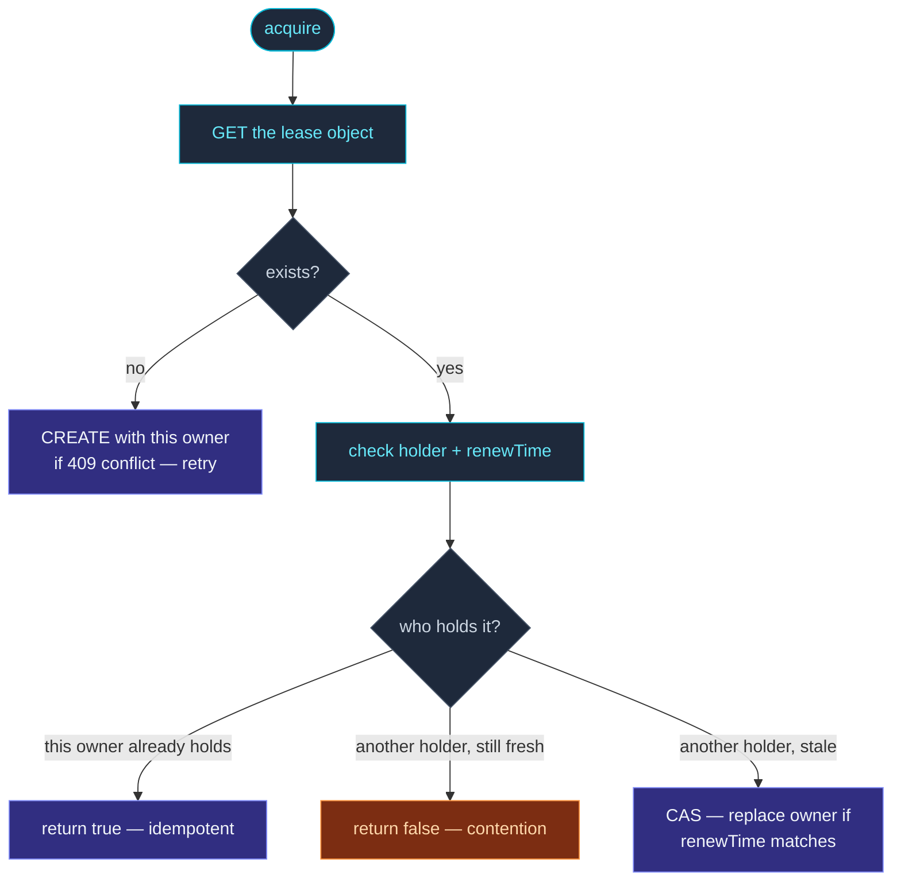

`KubernetesLease` implements the
[`Lease`](/coordination/lease-api/) interface against
Kubernetes's built-in `Lease` resource (the `coordination.k8s.io/v1`
API).  Production-grade: backed by etcd, strongly consistent,
RBAC-controlled.

```ts
import { KubernetesLease, KubernetesLeaseOptions } from 'actor-ts/coordination';

const lease = new KubernetesLease(
  KubernetesLeaseOptions.create()
    .withName('my-singleton-lease')
    .withOwner(process.env.POD_NAME!)
    .withTtlMs(30_000)
    .withRenewalIntervalMs(10_000)
    .withNamespace(process.env.K8S_NAMESPACE!),
);
```

The K8s API server's etcd-backed store provides the
single-holder guarantee.  Two pods concurrently calling
`acquire()` produce exactly one winner, regardless of pod
scheduling, network partition between pods, etc.

## Configuration

```ts
interface KubernetesLeaseSettings {
  // From LeaseSettings:
  name:                  string;
  owner:                 string;
  ttlMs:                 number;
  renewalIntervalMs?:    number;
  acquireRetries?:       number;
  acquireRetryDelayMs?:  number;

  // K8s-specific:
  namespace:             string;
  apiBaseUrl?:           string;     // override the in-cluster default
  serviceAccountToken?:  string;     // override the in-cluster default
}
```

| K8s field | Default | What |
| --- | --- | --- |
| `namespace` | required | K8s namespace where the Lease resource lives. |
| `apiBaseUrl` | in-cluster | The K8s API server URL — defaults to `https://kubernetes.default.svc`. |
| `serviceAccountToken` | in-cluster | The pod's service account token — defaults to `/var/run/secrets/kubernetes.io/serviceaccount/token`. |

For pods running in-cluster, you only need `namespace` and `name`
(+ the standard `LeaseSettings` fields).  The framework reads the
API URL and token from the standard locations.

For tests / dev pointing at a local K8s API (kind, minikube),
override `apiBaseUrl` + `serviceAccountToken`.

## RBAC

The pod's ServiceAccount needs permission to manage `Lease`
resources:

```yaml
apiVersion: rbac.authorization.k8s.io/v1
kind: Role
metadata:
  name: actor-ts-lease-holder
  namespace: my-app
rules:
  - apiGroups: ["coordination.k8s.io"]
    resources: ["leases"]
    verbs: ["get", "create", "update", "patch", "delete"]
---
apiVersion: rbac.authorization.k8s.io/v1
kind: RoleBinding
metadata:
  name: actor-ts-lease-holder
  namespace: my-app
subjects:
  - kind: ServiceAccount
    name: actor-ts
roleBinding:
  kind: Role
  name: actor-ts-lease-holder
  apiGroup: rbac.authorization.k8s.io
```

Without these, `acquire()` rejects with 403 (forbidden).

Without `delete`, `release()` works but leaves the Lease object
behind after release (harmless; the next acquire reuses it).

## What gets created

The first `acquire()` call creates a `Lease` object:

```bash
$ kubectl get lease -n my-app
NAME                      HOLDER       AGE
my-singleton-lease        pod-abc-1    30s
```

The framework writes:

- `metadata.name` — the lease name.
- `spec.holderIdentity` — the owner.
- `spec.acquireTime` — when this owner took it.
- `spec.renewTime` — last renewal (updated every
  `renewalIntervalMs`).
- `spec.leaseDurationSeconds` — derived from `ttlMs`.

Other holders check `renewTime + leaseDurationSeconds < now()`
to decide whether the current holder is stale.

## Acquire flow



The atomicity comes from K8s's optimistic-concurrency CAS via
`resourceVersion` — two simultaneous attempts to claim a stale
lease produce one winner.

## Renewal

While holding, the framework patches `spec.renewTime` every
`renewalIntervalMs`:

```
PATCH /apis/coordination.k8s.io/v1/namespaces/<ns>/leases/<name>
{ spec: { renewTime: "2025-05-13T12:00:00.000Z" } }
```

If the patch fails:

- **Transient (5xx, connection refused)** → retry, log, eventually
  give up if `ttlMs` elapses without success.
- **CAS conflict (409)** → another holder took over; fire `onLost`.

## Loss detection

`onLost` fires when:

- A renewal patch returns CAS conflict.
- The framework observes the lease was modified by someone else
  (a probe GET before some critical operation).
- Network partition prevents renewal for longer than `ttlMs`.

The handler should drop ownership state immediately — see
[Lease API](/coordination/lease-api/) for the contract.

## Cost

Each lease holder generates:

- 1 GET + (potentially) 1 CREATE on acquire.
- 1 PATCH every `renewalIntervalMs` while holding.
- 1 PATCH (or DELETE) on release.

For a 30-second TTL with 10-second renewal, that's **~6 API
calls per minute per lease**.  Pennies on any modest K8s
deployment.

For clusters with many leases (e.g., one per sharded entity type
+ one per singleton + one per coordinator), the API server load is
still negligible — K8s easily handles thousands of Lease writes
per second.

## When NOT to use it

import { Aside } from '@astrojs/starlight/components';

<Aside type="caution" title="Not on K8s">
  Obvious — but worth saying.  For non-K8s deployments, write a
  custom Lease backend (etcd, Consul, your existing
  coordination service).  The interface is small.
</Aside>

<Aside type="caution" title="API-server availability">
  ```ts
  // Holder calls acquire() but the K8s API server is down
  ```
  K8s API server outages stall lease operations.  The framework
  retries internally, but a sustained outage delays leadership
  elections.  For most setups this is fine — K8s API is
  usually more reliable than the apps depending on it.
</Aside>

<Aside type="caution" title="Token rotation">
  ```ts
  serviceAccountToken: 'eyJ...';   // ✗ static token
  ```
  In-cluster tokens are auto-rotated; using the kubelet-mounted
  token via the default path works seamlessly.  Hard-coded
  tokens expire and need manual rotation.
</Aside>

## Tests against a real K8s

For integration tests with a real K8s API (kind, minikube,
ephemeral CI clusters):

```ts
const lease = new KubernetesLease(
  KubernetesLeaseOptions.create()
    .withName('test-lease-' + crypto.randomUUID())
    .withOwner('test-runner')
    .withTtlMs(5_000)
    .withApiServerUrl('https://localhost:8443')
    .withAuthToken(fs.readFileSync('./test-token', 'utf-8'))
    .withNamespace('test'),
);

await lease.acquire();
expect(lease.checkAlive()).toBe(true);
await lease.release();
```

Use unique lease names per test (random UUID suffix) so parallel
tests don't fight.  Tear down with `release()` + a final delete
sweep in test teardown.

## Where to next

- **[Coordination overview](/coordination/overview/)** —
  the bigger picture.
- **[Lease API](/coordination/lease-api/)** — the
  contract `KubernetesLease` implements.
- **[InMemoryLease](/coordination/in-memory-lease/)** —
  the dev/test alternative.
- **[Kubernetes deployment](/operations/deployment/kubernetes/)** —
  the broader K8s recipe.
- **[Singleton with lease](/cluster/singleton/with-lease/)** —
  the main consumer.
