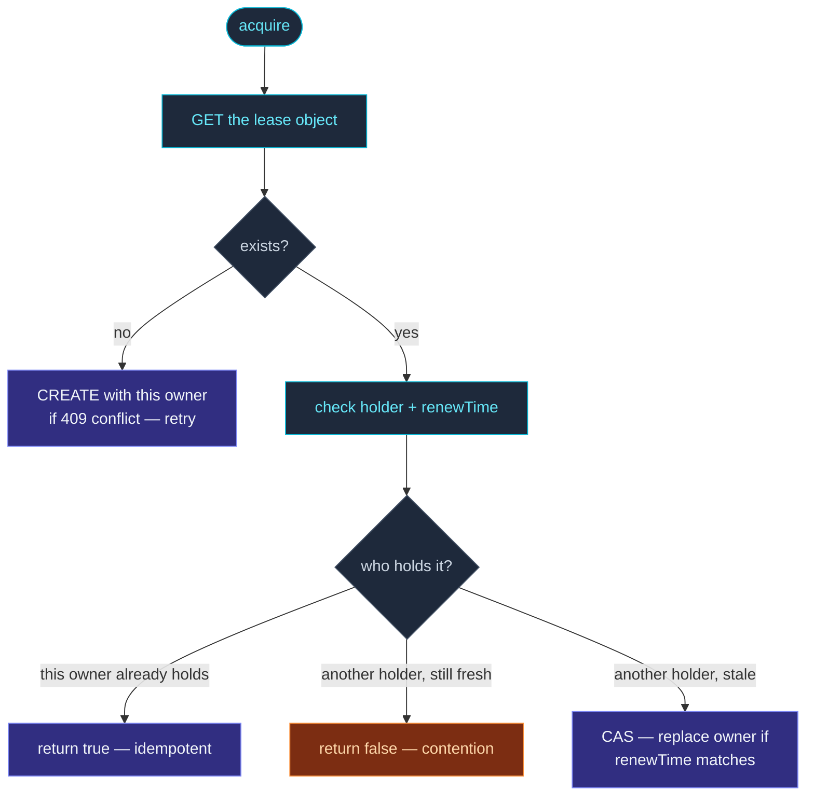

`KubernetesLease` implements the
[`Lease`](/coordination/lease-api/) interface against
Kubernetes's built-in `Lease` resource (the `coordination.k8s.io/v1`
API).  Production-grade: backed by etcd, strongly consistent,
RBAC-controlled.

```ts
import { KubernetesLease, KubernetesLeaseOptions } from 'actor-ts/coordination';

const kubernetesLeaseOptions = KubernetesLeaseOptions.create()
  .withName('my-singleton-lease')
  .withOwner(process.env.POD_NAME!)
  .withTtlMs(30_000)
  .withRenewalIntervalMs(10_000)
  .withNamespace(process.env.K8S_NAMESPACE!);
const lease = new KubernetesLease(
  kubernetesLeaseOptions,
);
```

The K8s API server's etcd-backed store provides the
single-holder guarantee.  Two pods concurrently calling
`acquire()` produce exactly one winner, regardless of pod
scheduling, network partition between pods, etc.

## Configuration

```ts
type KubernetesLeaseOptionsType = {
  // From LeaseOptionsType:
  name:                    string;
  owner:                   string;
  ttlMs:                   number;
  renewalIntervalMs?:      number;
  acquireRetries?:         number;
  acquireRetryDelayMs?:    number;

  // K8s-specific:
  namespace:               string;
  apiServerUrl?:           string;     // all three together, or none of them
  authToken?:              string;     // all three together, or none of them
  caCert?:                 string;     // all three together, or none of them
  tokenReloadIntervalMs?:  number;
};
```

| K8s field | Default | What |
| --- | --- | --- |
| `namespace` | required | K8s namespace where the Lease resource lives. |
| `apiServerUrl` | in-cluster | The K8s API server URL — `https://kubernetes.default.svc` when unset. Requires `authToken` + `caCert`. |
| `authToken` | in-cluster | Bearer token for the API server — `/var/run/secrets/kubernetes.io/serviceaccount/token` when unset. Requires `apiServerUrl` + `caCert`. |
| `caCert` | in-cluster | PEM-encoded CA cert for the API server's TLS — `/var/run/secrets/kubernetes.io/serviceaccount/ca.crt` when unset. Requires `apiServerUrl` + `authToken`. |
| `tokenReloadIntervalMs` | `60000` | How long a credential read from the ServiceAccount mount is reused before the token file is checked again. No effect on an explicit `authToken`. |

For pods running in-cluster, you only need `namespace` and `name`
(+ the standard `LeaseOptionsType` fields).  The framework reads the
API URL, token and CA cert from the standard locations.

For tests / dev pointing at a local K8s API (kind, minikube),
override `apiServerUrl` + `authToken` + `caCert`.

### The three connection fields are one credential

They are all-or-nothing: supply all three, or none of them.  A
partial set throws `OptionsError` at construction.

```ts
const partialOptions = KubernetesLeaseOptions.create()
  .withName('my-singleton-lease')
  .withOwner(process.env.POD_NAME!)
  .withTtlMs(30_000)
  .withNamespace('my-app')
  .withApiServerUrl('https://k8s.example.internal');
new KubernetesLease(partialOptions);
// OptionsError: KubernetesLeaseOptions: authToken + caCert must be supplied
// together with apiServerUrl — explicit API-server credentials are
// all-or-nothing
```

Each field used to fall back to the in-cluster mount on its own, so
naming an `apiServerUrl` and nothing else sent the **pod's own
ServiceAccount token** to that host.  The TLS pin limited the damage
— the target still had to present a chain to the cluster CA — but a
cluster credential should never travel to an address it was not
issued for.

`apiServerUrl` must use `https`.  The client dials `node:https`
regardless of what the URL says, so an `http://` URL never produced
a plaintext connection; it produced a confusing one.

### Credential lifetime depends on the source

The two sources are also treated differently *after* they are read,
because only one of them can go stale.

An explicit `authToken` is read once and reused for the process
lifetime.  There is nowhere to re-read it from — it came from the
constructor — so ageing it out would only replace it with itself.

The pod's mounted ServiceAccount token is bounded: the projected
token carries an expiry, and the kubelet rewrites the file as it
rotates.  A mounted credential is therefore reused for at most
`tokenReloadIntervalMs`, after which the token file's mtime decides
between another interval on the same bytes and a fresh read — so the
steady state costs one `stat` per interval per lease rather than
three file reads.

```ts
const kubernetesLeaseOptions = KubernetesLeaseOptions.create()
  .withName('my-singleton-lease')
  .withOwner(process.env.POD_NAME!)
  .withTtlMs(30_000)
  .withNamespace('my-app')
  .withTokenReloadIntervalMs(30_000);
```

On top of the interval, a **401 or 403 from the API server
invalidates the cached credential**: the mount is read again and the
request retried exactly once before anything is reported as lease
loss.  An explicit token is never retried that way — re-sending it
would only double the traffic on a path that is already failing.

Memoising the mounted token for the process lifetime is what this
replaces, and the failure mode was not subtle.  The first 401 fired
`onLost`, `ClusterSingleton` stopped the child and re-acquired on the
same lease instance every five seconds, and every attempt replayed
the same dead bearer token — so the singleton stayed down until the
pod was restarted, and so did every replica old enough to have hit
the same expiry.

### Required fields are enforced at construction

`name`, `owner`, `ttlMs` and `namespace` have no default.  The
constructor throws `OptionsError` when one of them is missing,
before a single request reaches the API server:

```ts
const incompleteOptions = KubernetesLeaseOptions.create()
  .withName('my-singleton-lease')
  .withNamespace('my-app');
new KubernetesLease(incompleteOptions);
// OptionsError: KubernetesLeaseOptions: owner is required
```

The check is not cosmetic.  Without `owner` the `Lease` object is
written with no `spec.holderIdentity` — the undefined key simply
drops out of the JSON body — and an unowned lease reads as free to
every pod: every `acquire()` returns `true`, and the single-holder
guarantee is gone without one error being logged.  A missing
`ttlMs` produces the same outcome by a different route, since the
expiry it computes is `NaN` and `NaN` is never later than now.

## RBAC

The pod's ServiceAccount needs permission to manage `Lease`
resources:

```yaml
apiVersion: rbac.authorization.k8s.io/v1
kind: Role
metadata:
  name: actor-ts-lease-holder
  namespace: my-app
rules:
  - apiGroups: ["coordination.k8s.io"]
    resources: ["leases"]
    verbs: ["get", "create", "update", "patch", "delete"]
---
apiVersion: rbac.authorization.k8s.io/v1
kind: RoleBinding
metadata:
  name: actor-ts-lease-holder
  namespace: my-app
subjects:
  - kind: ServiceAccount
    name: actor-ts
roleBinding:
  kind: Role
  name: actor-ts-lease-holder
  apiGroup: rbac.authorization.k8s.io
```

Without these, `acquire()` rejects with 403 (forbidden).

Without `delete`, `release()` works but leaves the Lease object
behind after release (harmless; the next acquire reuses it).

## What gets created

The first `acquire()` call creates a `Lease` object:

```bash
$ kubectl get lease -n my-app
NAME                      HOLDER       AGE
my-singleton-lease        pod-abc-1    30s
```

The framework writes:

- `metadata.name` — the lease name.
- `spec.holderIdentity` — the owner.
- `spec.acquireTime` — when this owner took it.
- `spec.renewTime` — last renewal (updated every
  `renewalIntervalMs`).
- `spec.leaseDurationSeconds` — derived from `ttlMs`.

Other holders check `renewTime + leaseDurationSeconds < now()`
to decide whether the current holder is stale — but never at face
value, because both fields were written by the holder they are
being used to judge:

- `leaseDurationSeconds` counts for at most **4 × the challenger's
  own `ttlMs`**.  The factor is deliberately generous rather than a
  straight clamp to `ttlMs`: during a rolling upgrade that raises
  the TTL, a node still running the smaller value would otherwise
  declare a live holder expired and take the lease from it.
- A `renewTime` further ahead than one `ttlMs` is not credible from
  a holder with a working clock, and counts as **expired**.
  Believing it is what lets one write wedge the lease for good.
- A missing *or* unparseable `renewTime` counts as **live**.  For an
  owned record with no usable timestamp, "someone holds this" is the
  safe reading.

So a corrupt or hostile `Lease` object costs at most
`4 × ttlMs` of unavailability instead of pinning the lease
indefinitely.  Configure the same `ttlMs` on every pod that
competes for one lease, and the tolerance never comes into play.

## Acquire flow


```mermaid
flowchart TB
  START(["acquire"])
  GET["GET the lease object"]
  EXISTS{"exists?"}
  CREATE["CREATE with this owner<br/>if 409 conflict — retry"]
  CHECK["check holder + renewTime"]
  WHO{"who holds it?"}
  SELF["return true — idempotent"]
  FRESH["return false — contention"]
  STALE["CAS — replace owner if<br/>renewTime matches"]
  START --> GET --> EXISTS
  EXISTS -- "no" --> CREATE
  EXISTS -- "yes" --> CHECK --> WHO
  WHO -- "this owner already holds" --> SELF
  WHO -- "another holder, still fresh" --> FRESH
  WHO -- "another holder, stale" --> STALE
  classDef ok    fill:#312e81,stroke:#818cf8,color:#f1f5f9;
  classDef warn  fill:#7c2d12,stroke:#fb923c,color:#fed7aa;
  classDef step  fill:#1e293b,stroke:#06b6d4,color:#67e8f9;
  classDef branch fill:#1e293b,stroke:#475569,color:#cbd5e1;
  class START,GET,CHECK step
  class SELF,STALE,CREATE ok
  class FRESH warn
  class EXISTS,WHO branch
```

The atomicity comes from K8s's optimistic-concurrency CAS via
`resourceVersion` — two simultaneous attempts to claim a stale
lease produce one winner.

## Renewal

While holding, the framework re-`PUT`s the whole `Lease` object with a
bumped `spec.renewTime` every `renewalIntervalMs`:

```
PUT /apis/coordination.k8s.io/v1/namespaces/<ns>/leases/<name>
{
  metadata: { resourceVersion: "148302", ... },  // echoed back for the CAS
  spec: { holderIdentity: "pod-abc-1", leaseDurationSeconds: 30,
          renewTime: "2025-05-13T12:00:00.000Z" }
}
```

The `resourceVersion` from the last read turns the write into an
optimistic-concurrency compare-and-set — K8s rejects with 409 if anyone
else mutated the object since.

**At most one renewal PUT is ever on the wire.**  `renewalIntervalMs`
is a wall-clock cadence, not a per-request budget: the default is
`ttlMs / 3` — 5 s at the 15 s TTL recommended above — while the HTTP
client's own timeout is 10 s, so a single request may legitimately span
two ticks.  A tick that finds one still outstanding is **skipped**, not
queued: a renewal carries nothing the next one will not carry.  Without
that guard the two writes are built from the same snapshot and carry
the same `resourceVersion`, and the API server rejects one of the
holder's *own* writes — see below (#761).

If the write fails, renewal gives up immediately and fires `onLost` —
there is no retry budget inside the loop, with two exceptions:

- **Transient (5xx, connection refused, timeout)** → fire `onLost`.
- **CAS conflict (409) or 404** → the object is re-read before
  ownership is given up, because a 409 only says the `resourceVersion`
  moved, not that anyone else took the lease.  What the re-read finds
  decides:
  - **gone** → someone deleted the object; fire `onLost`.
  - **a different `holderIdentity`** → a real takeover; fire `onLost`.
  - **still this owner** → nothing was lost.  The server's
    `resourceVersion` is adopted so the next tick's CAS matches, and
    the loop keeps holding.
- **401 / 403** → the *credential* was rejected, not the lease.  For a
  mounted ServiceAccount token the mount is read again and the PUT
  retried exactly once; only a second rejection fires `onLost`.  See
  *Credential lifetime depends on the source* above.

A re-read that itself fails falls through to the transient case and
fires `onLost`: ownership that cannot be confirmed may not be assumed.

## Loss detection

`onLost` fires when:

- A renewal PUT is rejected **and** the re-read shows a different
  `holderIdentity`, or no lease object at all.
- The framework observes the lease was modified by someone else
  (a probe GET before some critical operation).
- Network partition prevents renewal for longer than `ttlMs`.

It does **not** fire on a CAS conflict whose re-read still names this
owner.  That is the holder conflicting with one of its own writes —
another controller bumping the object, or a re-`acquire()` racing a
renewal — and the record is still ours.

The handler should drop ownership state immediately — see
[Lease API](/coordination/lease-api/) for the contract.

## Cost

Each lease holder generates:

- 1 GET + (potentially) 1 CREATE on acquire.
- 1 PUT every `renewalIntervalMs` while holding — and 1 extra GET
  on the rare tick whose PUT is rejected, to find out whether the
  lease was actually lost.
- 1 DELETE on release.

For a 30-second TTL with 10-second renewal, that's **~6 API
calls per minute per lease**.  Pennies on any modest K8s
deployment.

For clusters with many leases (e.g., one per sharded entity type
+ one per singleton + one per coordinator), the API server load is
still negligible — K8s easily handles thousands of Lease writes
per second.

## When NOT to use it

import { Aside } from '@astrojs/starlight/components';

<Aside type="caution" title="Not on K8s">
  Obvious — but worth saying.  For non-K8s deployments, write a
  custom Lease backend (etcd, Consul, your existing
  coordination service).  The interface is small.
</Aside>

<Aside type="caution" title="API-server availability">
  ```ts
  // Holder calls acquire() but the K8s API server is down
  ```
  K8s API server outages stall lease operations.  The framework
  retries internally, but a sustained outage delays leadership
  elections.  For most setups this is fine — K8s API is
  usually more reliable than the apps depending on it.
</Aside>

<Aside type="caution" title="Token rotation">
  ```ts
  authToken: 'eyJ...';   // ✗ static token
  ```
  The kubelet-mounted token is re-read every
  `tokenReloadIntervalMs`, and again immediately on a 401/403, so
  an expiry costs one retried request rather than the lease.  A
  hard-coded `authToken` gets neither: it is static by
  construction, and when it expires the lease is lost until the
  process is restarted with a new one.
</Aside>

## Tests against a real K8s

For integration tests with a real K8s API (kind, minikube,
ephemeral CI clusters):

```ts
import { randomUuid } from 'actor-ts';

const kubernetesLeaseOptions = KubernetesLeaseOptions.create()
  .withName('test-lease-' + randomUuid())
  .withOwner('test-runner')
  .withTtlMs(5_000)
  .withApiServerUrl('https://localhost:8443')
  .withAuthToken(fs.readFileSync('./test-token', 'utf-8'))
  .withCaCert(fs.readFileSync('./test-ca.crt', 'utf-8'))
  .withNamespace('test');
const lease = new KubernetesLease(
  kubernetesLeaseOptions,
);

await lease.acquire();
expect(lease.checkAlive()).toBe(true);
await lease.release();
```

Use unique lease names per test (random UUID suffix) so parallel
tests don't fight.  Tear down with `release()` + a final delete
sweep in test teardown.

## Where to next

- **[Coordination overview](/coordination/overview/)** —
  the bigger picture.
- **[Lease API](/coordination/lease-api/)** — the
  contract `KubernetesLease` implements.
- **[InMemoryLease](/coordination/in-memory-lease/)** —
  the dev/test alternative.
- **[Kubernetes deployment](/operations/deployment/kubernetes/)** —
  the broader K8s recipe.
- **[Singleton with lease](/cluster/singleton/with-lease/)** —
  the main consumer.
