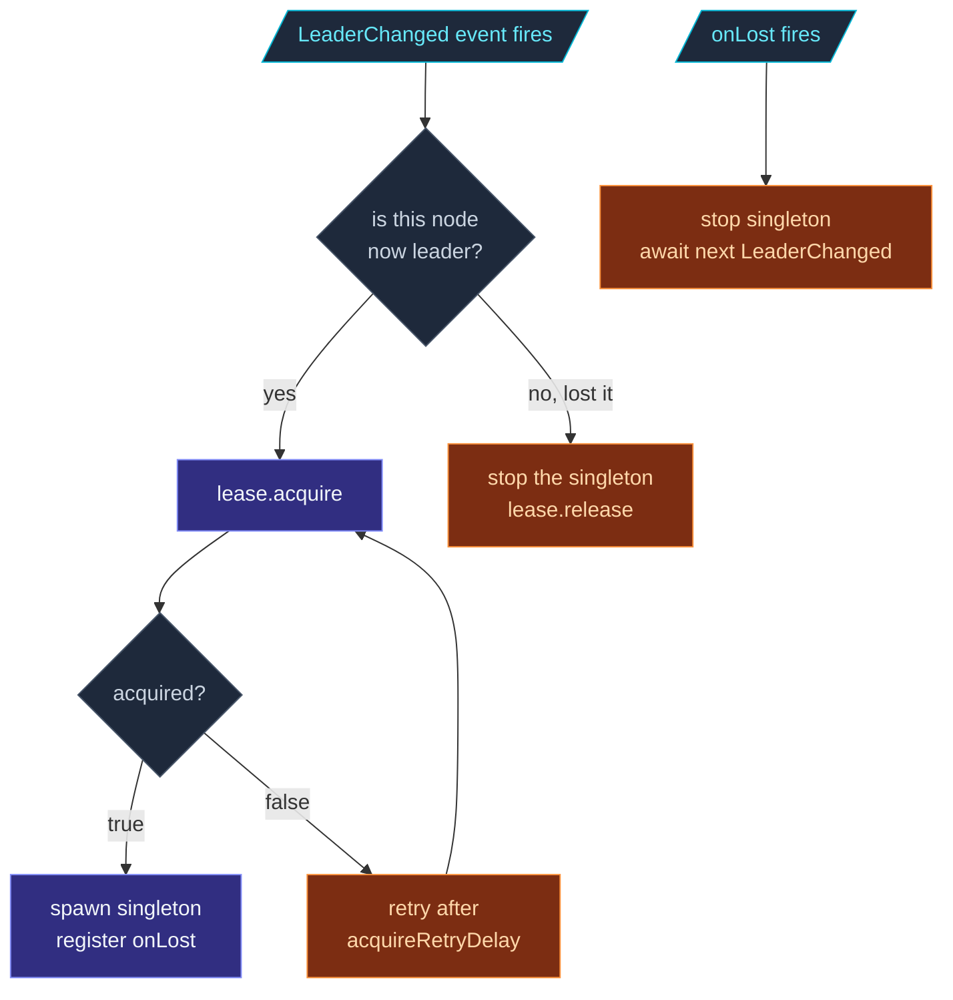

The `Lease` interface is the framework's distributed-lock
abstraction.  Implementations differ in backing store (in-memory,
K8s, etcd); the contract is identical.

```ts
interface Lease {
  acquire(): Promise<boolean>;
  acquireWithToken?(): Promise<{ readonly token: string } | null>;
  release(): Promise<void>;
  checkAlive(): boolean;
  onLost(handler: (reason: string) => void): () => void;
}
```

Three methods that do work + one that registers a callback.
`acquireWithToken` is an optional fifth method (marked `?`) —
backends implement it only when they support fencing tokens.

## `acquire(): Promise<boolean>`

```ts
const got = await lease.acquire();
if (got) {
  // We hold the lease — proceed with leader-only work
} else {
  // Someone else has it — back off and retry later
}
```

The semantics:

- **Resolves `true`** if the lease was successfully acquired.
- **Resolves `false`** if another holder owns the lease.
- **Rejects** on transient errors (network, backend unavailable).

Implementations typically retry internally up to `acquireRetries`
times before resolving `false`.  A `false` result means "another
holder definitively has it"; a rejection means "I don't know."

`acquire()` is idempotent **when this caller already holds the
lease** — calling `acquire()` twice in a row by the same owner
returns `true` both times.

## `acquireWithToken?(): Promise<{ readonly token: string } | null>`

An **optional** variant of `acquire()` that also returns a
backend-issued **fencing token** on success:

```ts
if (typeof lease.acquireWithToken === 'function') {
  const result = await lease.acquireWithToken();
  if (result) {
    // Acquired — `result.token` is the fencing token
  }
} else {
  const got = await lease.acquire();   // no fencing support — fall back
  // ...
}
```

- **Resolves `{ token }`** on success — the semantic equivalent of
  `acquire()` returning `true`, plus an opaque token.
- **Resolves `null`** on contention — equivalent to `acquire()`
  returning `false`.

A fencing token lets an external observer order two acquires
against the same lease.  It's backed by the coordination service's
own optimistic-concurrency primitive — Kubernetes `resourceVersion`,
Redis `SETNX` with a counter, etcd `revision`.  Tokens are **opaque
strings**, compared exact-string.

Because the method is optional, consumers **feature-detect** it and
fall back to plain `acquire()` when it's absent — the
[`LeaseMajority`](/cluster/downing-strategies/) split-brain strategy
does exactly this.  Both `InMemoryLease` and `KubernetesLease`
implement it.

## `release(): Promise<void>`

```ts
await lease.release();
```

Voluntarily drop ownership.  Calling without holding the lease
is a no-op — no error.  Resolves once the backend has confirmed
the release.

**It rejects if the backend could not be told.**  A `release()`
that fails leaves the record claimed on the server while this
process has already dropped it locally — the holder no longer
knows whether it owns the lease, and that is worth knowing.
Backends must propagate the failure instead of swallowing it;
callers using `release()` purely as cleanup wrap it:

```ts
await lease.release().catch(() => { /* best-effort cleanup */ });
```

Everything the framework does internally is already wrapped that
way.  The one caller that acts on the rejection is
[`LeaseMajority`](/cluster/downing-strategies/), which enters
fail-safe and stops claiming majority until the partition heals.

The framework calls `release()`:

- When the singleton manager stops being leader (graceful
  hand-off to another node).
- When the actor system shuts down via
  [coordinated shutdown](/fundamentals/coordinated-shutdown/).

For the **non-graceful case** — process crash — the backend's
TTL handles cleanup automatically; no `release` is sent.

Note the flip side of the no-op: `release()` does nothing while
an `acquire()` is still in flight, because ownership only begins
when that acquire resolves.  Undoing an acquire you stopped
waiting for means waiting for it to report back first.

## `checkAlive(): boolean`

```ts
if (lease.checkAlive()) {
  // We still own the lease — proceed
}
```

A **synchronous, local** check.  No network roundtrip.  Returns
`true` while this process holds the lease **and** its TTL has not
run out — measured from when the last write the backend accepted
was *sent*, so the local deadline is never later than the one
other holders judge the record by.

The answer rests on that deadline, not on a flag.  A flag is only
cleared by a renewal that notices the loss, and a stalled event
loop — a GC pause, a starved container — is exactly what keeps
that renewal from running, while another holder may legitimately
take the lease in the meantime.  So `checkAlive()` turns `false` at
the deadline itself, before `onLost` has had a chance to fire
(#937).

`LeaseMajority` re-validates a won arbitration with it before
acting on that win again.  The singleton manager, the sharding
coordinator and persistence fencing react to `onLost` instead.

The two answer at different moments.  `checkAlive()` turns `false`
at the deadline; `onLost(...)` fires at the first renewal after it,
up to one renewal interval later.  Gate each piece of work with
`checkAlive()`, and register `onLost(...)` to stop ongoing work
rather than polling.

## `onLost(handler): () => void`

```ts
const unsubscribe = lease.onLost((reason) => {
  console.log(`lease lost: ${reason}`);
  // Stop leader-only work immediately
});

// Later: unsubscribe();
```

Register a callback fired when ownership is lost **unexpectedly**:

- The backend reported the lease was taken over by another holder.
- The TTL ran out without a successful renewal (e.g., network
  partition, or a stalled event loop).  The first renewal tick
  after the deadline reports it, and gives the lease up rather
  than extending the lapsed record — another holder may have it
  by now.
- The backend itself reported a state inconsistency.

`onLost` fires **once per loss**.  By then `checkAlive()` already
returns `false` — on a TTL that ran out, from the deadline on — and
`acquire()` is needed before regaining ownership.

The handler should **drop ownership state immediately** — stop
work, release locks, signal interested actors.  Don't await
expensive operations; the lease is gone and any other holder may
already be acting.

Returns an unsubscribe function — call to remove the handler when
you no longer need it.

## How the framework uses each method

For a singleton with a lease:



Same pattern for sharding coordinator:

1. **`lease.acquire`** before processing allocation requests.
2. **Its own lease state** gates every allocation: the coordinator
   acts only while it holds the lease, and `onLost` is what clears
   that state.
3. **`onLost`** → step down: cancel in-flight rebalances, drop
   pending queries, then try to re-acquire while still leader.

## Writing a custom backend

```ts
import type { Lease, LeaseOptionsType } from 'actor-ts/coordination';

class EtcdLease implements Lease {
  private held = false;
  /** When the last write etcd accepted was sent, plus the TTL. */
  private expiresAt = 0;
  private onLostHandlers = new Set<(reason: string) => void>();
  private renewTimer: NodeJS.Timeout | null = null;

  constructor(private readonly settings: LeaseOptionsType & { /* etcd-specific */ }) {}

  async acquire(): Promise<boolean> {
    // Read the clock, then try to atomically CAS the etcd key from
    // empty to this owner.  On success: held = true,
    // expiresAt = that reading + ttlMs, start a renewal timer.
    // ...
  }

  async release(): Promise<void> {
    // Stop the renewal timer.
    // CAS the etcd key from this owner to empty.
    // ...
  }

  checkAlive(): boolean {
    // Never the flag alone: a stalled event loop keeps the renewal
    // that would clear it from running, while another owner takes
    // the key.
    return this.held && Date.now() < this.expiresAt;
  }

  onLost(handler: (reason: string) => void): () => void {
    this.onLostHandlers.add(handler);
    return () => this.onLostHandlers.delete(handler);
  }

  private fireOnLost(reason: string): void {
    this.held = false;
    for (const h of this.onLostHandlers) {
      try { h(reason); } catch { /* swallow */ }
    }
  }
}
```

Four things any backend needs to get right:

1. **Atomicity on `acquire`** — two concurrent `acquire()` calls
   from different owners must produce one winner.  The backend's
   own consistency model has to provide this (CAS, paxos,
   raft-backed).
2. **Periodic renewal** — keep the lease alive in the backend.
   Configurable interval, typically `ttl / 3`.  A renewal that only
   comes round after the deadline gives the lease up rather than
   extending the record: another owner may hold it by now.
3. **`onLost` accuracy** — fire when ownership truly transitions
   away, including the TTL-expiry case.
4. **`checkAlive` against the deadline** — compare against the
   expiry of the last write the backend accepted, measured from
   when it was sent.  A held flag alone stays `true` through
   exactly the stall that lost the lease, and `LeaseMajority`
   relies on the answer.

Test the implementation against:

- Two concurrent acquires from different owners.
- Network partition with both sides trying to renew.
- Holder crash + new acquire after TTL.
- Holder process pause (e.g., GC stall) longer than TTL.

import { Aside } from '@astrojs/starlight/components';

<Aside type="caution" title="`checkAlive` gates; it doesn't prove">
  ```ts
  if (lease.checkAlive()) {
    await doWork();   // could complete just after the deadline passed
  }
  ```
  `checkAlive` is right at the moment it answers, and nothing stops
  the deadline passing while the work it gated runs.  Use it to
  **gate** work, not as proof of ownership.  For irreversible
  actions (committing to an external service), also pass through a
  backend roundtrip (acquire-already-held is fast) or rely on
  `onLost` to stop new work.
</Aside>

<Aside type="caution" title="Don't sleep through TTL">
  ```ts
  // GC pause longer than ttlMs?  The lease is gone.
  ```
  TTL-based leases can't tell the difference between "holder
  crashed" and "holder paused."  A holder that pauses past its TTL
  reads `checkAlive()` as `false` when it resumes, and its first
  renewal reports the loss through `onLost` instead of extending
  the lapsed record — another holder may have taken it meanwhile.
  If your process can pause longer than the TTL (large GC,
  suspended VM), set the TTL longer than your worst-case pause.
</Aside>

<Aside type="caution" title="`release` after `onLost` is harmless">
  ```ts
  // We got onLost; now we also call release().
  ```
  `release()` is no-op when the lease isn't held.  Calling it
  defensively after `onLost` is fine.
</Aside>

## Where to next

- **[Coordination overview](/coordination/overview/)** —
  the bigger picture.
- **[InMemoryLease](/coordination/in-memory-lease/)** —
  the dev/test reference implementation.
- **[KubernetesLease](/coordination/kubernetes-lease/)** —
  the production K8s backend.
- **[Singleton with lease](/cluster/singleton/with-lease/)** —
  the main consumer.

The [`Lease`](/api/interfaces/lease/) API reference covers
the full contract.
