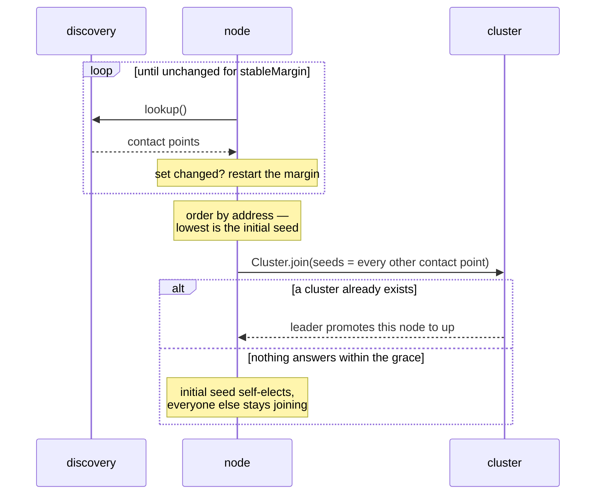

import { Aside } from '@astrojs/starlight/components';

Ein Kaltstart stellt jedem Node im selben Moment dieselbe Frage —
*„gibt es schon einen Cluster?"* — und Discovery beantwortet sie auf
jedem anders. DNS ist noch nicht propagiert; ein Pod ist `Ready`,
bevor seine IP im Headless Service steht; die Kubernetes-API liefert
eine unvollständige Pod-Liste. Wer auf die erste Antwort hin handelt,
bekommt Nodes, die je einen Cluster aus der Teilmenge bilden, die sie
zufällig gesehen haben.

Gossip repariert das nie. Das Ergebnis sind getrennte Cluster mit
demselben Namen — jeder mit eigenem Leader, eigenen Singletons und
eigener Shard-Verteilung.

**Cluster-Bootstrap** ist die Phase, die *vor* `Cluster.join` läuft und
dafür sorgt, dass aus einem gleichzeitigen Start höchstens ein Cluster
entsteht.

## Die zwei Regeln



**1 — Stable Observation.** Den Seed-Provider im Takt von
`pollIntervalMs` pollen und verlangen, dass die zurückgegebene Menge
(plus dieser Node) für `stableMarginMs` *exakt identisch* bleibt, bevor
darauf gehandelt wird. Jede Änderung startet die Margin neu. Ein
fehlgeschlagener Lookup ist *keine* leere Menge — er zählt gar nicht als
Beobachtung, damit ein DNS-Ausfall nie mit „ich bin allein" verwechselt
werden kann.

**2 — Verzögerte Selbstwahl.** Die stabile Menge nach Adresse sortieren.
Die niedrigste ist der **Initial Seed** — aber sie bildet nicht sofort
einen Cluster. Jeder Node, auch der Gewinner, joint mit den *übrigen*
Contact Points als Seeds; nur der Gewinner bekommt zusätzlich eine Frist
(`selfElectionGraceMs`), nach der er einen Cluster bildet, falls ihn bis
dahin niemand befördert hat.

<Aside type="tip" title="Warum der Gewinner trotzdem seine Seeds kontaktiert">
  Adressen vergibt die Plattform, also kann ein Node, der *später*
  startet, durchaus *zuerst* sortieren — ein hochskalierter Pod oder ein
  neu gestarteter mit recycelter IP. Würde der Wahlgewinner sofort
  selbst wählen, entstünde ein zweiter Cluster neben dem laufenden. Weil
  die Selbstwahl nur eine Frist ist, befördert ihn der Leader des
  laufenden Clusters innerhalb ein, zwei Gossip-Runden und die Frist
  läuft nie ab.
</Aside>

## Einschalten

Der Einzeiler — `bootstrapCluster` führt die Phase für dich aus:

```ts
import { bootstrapCluster, ClusterBootstrapOptions } from 'actor-ts/cluster';

const bootstrapOptions = ClusterBootstrapOptions.create('my-app')
  .withHost(process.env.POD_IP!)
  .withPort(2552)
  .withDiscovery('kubernetes')
  .withStableObservation(true);
const { cluster, shutdown } = await bootstrapCluster(bootstrapOptions);
```

Statt `true` ein Objekt übergeben, um die Zeiten zu überschreiben:

```ts
const bootstrapOptions = ClusterBootstrapOptions.create('my-app')
  .withHost(process.env.POD_IP!)
  .withDiscovery('kubernetes')
  .withStableObservation({ requiredContactPoints: 3, stableMarginMs: 8_000 });
```

## Selbst steuern

Wer `Cluster.join` direkt aufruft, führt die Beobachtung aus und gibt
**beide** Ergebnisse in die Optionen — die Seed-Liste **und** die
`selfElection`-Policy:

```ts
import {
  Cluster,
  ClusterOptions,
  NodeAddress,
  StableObservation,
  StableObservationOptions,
} from 'actor-ts/cluster';

const selfAddress = new NodeAddress('my-app', process.env.POD_IP!, 2552);

const observationOptions = StableObservationOptions.create()
  .withSeedProvider(seedProvider)
  .withSelfAddress(selfAddress)
  .withRequiredContactPoints(3);
const observation = new StableObservation(observationOptions);
const targets = await observation.resolveJoinTargets();

const clusterOptions = ClusterOptions.create()
  .withHost(selfAddress.host)
  .withPort(selfAddress.port)
  .withSeeds(targets.seeds.map((address) => address.toString()))
  .withSelfElection(targets.selfElection);
const cluster = await Cluster.join(system, clusterOptions);
```

`resolveJoinTargets()` liefert die stabile Menge, ob dieser Node
gewonnen hat (`isInitialSeed`) und den `selfElection`-Wert zum
Weiterreichen. Diesen Wert selbst herzuleiten ist der eine Fehler, der
das Split-Brain zurückbringt — deshalb macht die Beobachtung es für dich.

## Einstellungen

| Einstellung | Default | Bedeutung |
| --- | --- | --- |
| `stableMarginMs` | 5000 | Wie lange die Contact-Point-Menge unverändert bleiben muss. |
| `pollIntervalMs` | 1000 | Wie oft der Seed-Provider gepollt wird. |
| `maxWaitMs` | 60000 | Gesamtbudget; wird es überschritten, wirft die Phase. |
| `requiredContactPoints` | 1 | Wie viele Contact Points eine stabile Beobachtung mindestens enthalten muss. |
| `selfElectionGraceMs` | 10000 | Wie lange der gewählte Node wartet, bevor er einen Cluster bildet. |

Dieselben Schlüssel unter `actor-ts.cluster.bootstrap.*`, mit der
üblichen Präzedenz — **explizite Optionen > HOCON > eingebaute
Defaults**:

```hocon
actor-ts.cluster.bootstrap {
  stable-margin           = 5s
  poll-interval           = 1s
  max-wait                = 60s
  required-contact-points = 3
  self-election-grace     = 10s
}
```

`requiredContactPoints` ist der Wert, den es lohnt anzufassen. Die
Margin fängt Discovery ab, die *langsam* ist; nur eine Mindestanzahl
fängt Discovery ab, die **stabil falsch** ist — ein Resolver, der
konsequent zwei von drei Pods liefert, wird sich bereitwillig auf die
falsche Menge einpendeln. Der Default `1` existiert, damit
Einzelknoten-Entwicklung ohne Konfiguration läuft; in Produktion auf die
erwartete Replica-Anzahl setzen.

## Auf Readiness warten

Ein aufgelöstes `bootstrapCluster` bedeutet ein **bereites** Cluster:
Dieser Knoten ist volles Mitglied (`up`), und mindestens
`minimum-members` Mitglieder sind up. Wird das innerhalb des Budgets
nicht erreicht, fährt der Bootstrap die Coordinated-Shutdown-Pipeline
und lehnt mit einem `ClusterReadyTimeoutError` ab, der Self-Status,
Up-Zähler und die Messlatte nennt — er löst nie für einen Knoten auf,
der noch `joining` ist.

```ts
const bootstrapOptions = ClusterBootstrapOptions.create('my-app')
  .withHost(process.env.POD_IP!)
  .withDiscovery('kubernetes')
  .withStableObservation(true)
  .withAwaitReady({ minimumMembers: 3, timeoutMs: 30_000 });
const node = await bootstrapCluster(bootstrapOptions);
node.formedNewCluster; // false — joined an existing cluster rather than founding one
```

`awaitReady` nimmt `true` (Default — mit dem berechneten Budget warten),
`false` oder `0` (nicht warten), eine Zahl (das Budget in ms) oder das
Options-Objekt oben. Ungesetzte Felder fallen auf HOCON und dann auf das
berechnete Budget durch:

| Feld | Default | Was |
| --- | --- | --- |
| `minimumMembers` | 1 | Wenigste `up`-Mitglieder — self eingeschlossen —, bevor das Cluster als bereit gilt. Wie `requiredContactPoints` dimensionieren: auf die Replica-Anzahl. |
| `timeoutMs` | abgeleitet | `await-ready`, wenn gesetzt; sonst `self-election-grace` + 5 s hinter Stable Observation — das Budget, an dem die Readiness jedes Knotens tatsächlich hängt, Gewinner oder nicht — sonst flache 5 s. |

```hocon
actor-ts.cluster.bootstrap {
  minimum-members = 3
  # await-ready   = 30s   # unset selects the grace-aware computed default
}
```

Dasselbe Warten gibt es eigenständig — nach einem von Hand verdrahteten
`Cluster.join` oder später im Prozess, vor einem
Rebalancing-empfindlichen Schritt:

```ts
await cluster.awaitReady({ minimumMembers: 3, timeoutMs: 30_000 });
cluster.isReady();      // synchronous probe of the same predicate
cluster.selfMember();   // this node's own record, tombstone included
cluster.selfElected;    // true — this node founded its cluster
```

Ohne `timeoutMs` wartet das Promise unbegrenzt, wie
`system.whenTerminated()` — überall dort mit einer Deadline paaren, wo
das Cluster legitim ausbleiben kann; ein Knoten, der das Cluster
verlassen hat oder entfernt wurde, wird nie bereit. Readiness heißt hier
bewusst *Mitgliedschaft*: App-registrierte Readiness-Checks (das
Aggregat des `/ready`-Endpoints) können von Initialisierung abhängen,
die erst nach dem Bootstrap läuft — auf sie zu warten könnte genau den
Aufruf verklemmen, der zuerst kommt. `/ready` bleibt die Sicht des Load
Balancers; `awaitReady` ist die prozessinterne.

Das alte Fire-and-forget-Verhalten liefert `awaitReady: false` plus ein
eigenes `cluster.awaitReady().catch(…)`.

## Was die Phase verweigert

<Aside type="caution" title="Sie wirft, statt trotzdem zu joinen">
  Wird die Menge nicht innerhalb von `maxWaitMs` stabil, lehnt
  `resolveJoinTargets()` mit einem `StableObservationError` ab, der die
  letzte Beobachtung und die advertised Adresse dieses Nodes nennt. Es
  gibt keinen degradierten Fallback auf einen direkten Join: der wäre
  von genau dem Fehler nicht zu unterscheiden, den die Phase verhindern
  soll — ein Node, der sich mit niemandem darüber einigen konnte, wer da
  draußen ist, und trotzdem joint. Ein Start, der laut scheitert, lässt
  sich per Neustart oder durch einen Operator beheben; ein zweiter
  Cluster nicht.
</Aside>

<Aside type="caution" title="Sie verweigert einen Wildcard-Host">
  Die Wahl sortiert nach der Adresse dieses Nodes, also muss das die
  Adresse sein, die Peers anwählen. `0.0.0.0` (ebenso `::` und der
  leere String) ist eine *Bind*-Adresse: jeder Node, der sie
  beanspruchte, sortierte identisch, jeder hielte sich für den
  Gewinner, und jeder bildete seinen eigenen Cluster. Die Phase lehnt
  das vorab ab.

  Dorthin zu gelangen erfordert Absicht, denn ein Wildcard-Bind-Host
  wird nicht mehr zu einer Wildcard-Identität: mit `withHost('0.0.0.0')`
  und sonst nichts löst sich die verteilte Adresse über `CLUSTER_HOST` /
  `POD_IP` / `HOSTNAME` und dann auf Loopback auf. Was dieser Guard
  abfängt, ist ein bewusst geschriebenes
  `withAdvertisedHost('0.0.0.0')` — und eine handgebaute `NodeAddress`,
  die direkt an `StableObservation` geht und diese Kette nie durchläuft.

  In Produktion benenne sie: `0.0.0.0` binden, `POD_IP` verteilen.
  Loopback hält einen Single-Node-Lauf am Leben; es macht keinen
  zweiten Node erreichbar.
</Aside>

## Bootstrap oder einfacher Seed-Join?

| Situation | Wahl |
| --- | --- |
| Feste, bekannte Adressen; ein festgelegter erster Node | Einfacher [Seed-Join](/de/cluster/joining-and-seeds/). |
| Lokale Entwicklung, ein Node | Einfacher Seed-Join — die leere Seed-Liste heißt bereits „ich bin der erste". |
| Nodes starten gleichzeitig mit dynamischen Adressen (K8s Deployment, Autoscaling-Gruppe) | **Bootstrap.** |
| Jeder Node bekommt dieselbe Seed-Liste | **Bootstrap** — siehe unten. |

Die letzte Zeile übersieht man leicht. `Cluster` filtert diesen Node aus
seiner eigenen Seed-Liste, also bleibt — wenn jeder Node jeden Node
listet — **keinem** Node die leere Liste, die die gewöhnliche
Selbstwahl braucht. Niemand wird `up`, niemand wird Leader, niemand wird
je befördert: der Cluster steht in `joining` fest. Die Wahl ist das, was
die Symmetrie bricht.

## Kosten

- **Startlatenz.** Mindestens `stableMarginMs`, bei einem echten
  Kaltstart zusätzlich `selfElectionGraceMs` (einmalig, von einem
  Node). Der Beitritt zu einem *bestehenden* Cluster ist nicht
  betroffen — die Frist läuft dort nie ab.
- **Discovery-Last.** Ein `lookup()` pro `pollIntervalMs` pro Node, bis
  die Menge stabil ist. Der Takt ist bewusst konstant statt mit Backoff:
  ein wachsendes Intervall würde die Stable Margin an driftenden Punkten
  abtasten, und die eingesparte Last — höchstens ein paar Dutzend
  Lookups pro Node — wiegt die schwächere Garantie nicht auf.

## Wie geht's weiter

- **[Beitritt und Seeds](/de/cluster/joining-and-seeds/)** — der
  Join-Handshake, den diese Phase füttert.
- **[Discovery-Überblick](/de/discovery/overview/)** — die Seed-Provider,
  die die Beobachtung pollt.
- **[Downing-Strategien](/de/cluster/downing-strategies/)** —
  Split-Brain-Auflösung, *nachdem* der Cluster steht.
- **[Weakly-up](/de/cluster/weakly-up/)** — teilweiser Fortschritt,
  während die Konvergenz noch aussteht.
