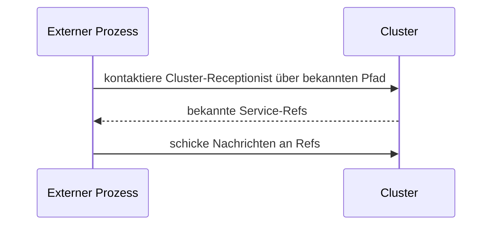

`ClusterClient` lässt einen **Prozess außerhalb des Clusters** mit
Actors innerhalb sprechen. Der externe Prozess ist kein
Cluster-Mitglied — kein Gossip, kein Mitgliedschaftsstatus — aber
er kann cluster-interne Actors per bekannten
**Receptionist-Kontakten** mit `tell` und `ask` ansprechen.

```ts
import { ClusterClient, ClusterClientOptions } from 'actor-ts';

const clusterClientOptions = ClusterClientOptions.create().withContactPoints(['actor-ts://my-app@10.0.0.5:2552/system/receptionist']);
const client = new ClusterClient(
  clusterClientOptions,
);

// Senden an einen bekannten Cluster-Actor:
client.send('/user/api/orders', { kind: 'place', ... });

// Oder über Receptionist per Service-Key:
client.sendByKey(ServiceKey.of<ApiMessage>('api'), { kind: 'list-orders' });
```

## Wann verwenden

Drei legitime Anwendungsfälle:

1. **Externe Services**, die nicht in den Actor-Cluster gehören,
   aber mit ihm reden müssen — ein Python-ML-Service, der an
   einen Kafka-Actor innerhalb des Clusters postet.
2. **Mobile-/Desktop-Clients über eine Bridge** — eine
   serverseitige Bridge hält einen ClusterClient + bietet eine
   REST/WS-API nach außen.
3. **Cross-Cluster-Föderation** — zwei Cluster, bei denen einer
   mit bestimmten Actors im anderen sprechen muss, ohne zu
   mergen.

Für typische Setups ist **alles Teil des Clusters** —
ClusterClient ist der Notausgang für Fälle, in denen das nicht
möglich ist.

## Wie es funktioniert



Der Client:

1. Verbindet sich mit einem oder mehreren **Kontakten** (bekannte
   Cluster-Nodes, auf denen ein
   `ClusterClientReceptionist` läuft).
2. Entdeckt verfügbare Services über den Receptionist.
3. Routet Nachrichten zu den richtigen Actors.
4. Behandelt Failover, wenn Kontakte unerreichbar werden —
   verbindet sich zu einem anderen.

## Konfiguration

```ts
interface ClusterClientOptionsType {
  contacts:            string[];       // mindestens ein Cluster-Node-Pfad
  reconnectIntervalMs?: number;
  acceptableHeartbeatPauseMs?: number;
}
```

`contacts` ist die Liste der Receptionist-Pfade. Der Client wählt
zufällig einen aus, um sich zu verbinden; bei Ausfall fällt er auf
andere zurück.

Für **stabile Kontaktadressen** deployt die Cluster-Seite typisch
einen `ClusterClientReceptionist` auf einem festen Pod (oder
sharded Set) an einem bekannten Pfad.

## Serverseite — ClusterClientReceptionist

```ts
import { ClusterClientReceptionist } from 'actor-ts';

system.spawn(
  ClusterClientReceptionist.props({
    cluster,
    role: 'frontend',   // optional — auf bestimmte Nodes beschränken
  }),
  'cluster-client-receptionist',
);
```

Der Receptionist legt registrierte Services für externe Clients
offen. Actors registrieren:

```ts
const receptionistRef = system.actorSelection('/user/cluster-client-receptionist');

receptionistRef.tell({
  kind:    'register-service',
  key:     ServiceKey.of<OrdersMessage>('orders'),
  ref:     ordersActor,
});
```

Externe Clients können dann `sendByKey('orders', msg)` machen.

## Vergleich mit Cluster-fähigem ActorRef

```ts
// Innerhalb des Clusters — Actors sprechen direkt:
const ref = await system.actorSelection('actor-ts://my-app@host:2552/user/api').resolveOne();
ref.tell(...);

// Außerhalb des Clusters — ClusterClient:
const clusterClientOptions = ClusterClientOptions.create().withContactPoints([...]);
const client = new ClusterClient(clusterClientOptions);
client.send('/user/api', ...);
```

Unterschiede:

- **Innen**: erfordert Cluster-Mitgliedschaft. Refs propagieren
  per Gossip; du kannst langlebige Refs halten.
- **ClusterClient**: keine Mitgliedschaft; Refs werden pro
  Nachricht über den Receptionist aufgelöst.

## Wann NICHT verwenden

import { Aside } from '@astrojs/starlight/components';

<Aside type="caution" title="HTTP / gRPC ist meist einfacher">
  ```
  Externer Service → ClusterClient → Cluster
  ```
  ClusterClient + einen serialisierungs-kompatiblen Client
  aufzusetzen, ist Arbeit. Für die meisten extern zugänglichen
  APIs ist **HTTP oder gRPC** innerhalb des Clusters (mit einem
  HTTP-Server im Cluster) einfacher — externe Clients nutzen
  Standard-HTTP-Libraries, keine actor-ts-spezifischen Clients.
</Aside>

<Aside type="caution" title="Browser-/Mobile-Direktverbindungen">
  ```ts
  // Browser → ClusterClient → Cluster
  ```
  ClusterClient braucht **TCP vom Client**. Browser machen kein
  TCP; mobile Apps sollten es meist nicht. Nutze eine
  serverseitige Bridge, die den Cluster mit HTTP/WS frontet.
</Aside>

## Wohin als Nächstes

- **[Refs über Nodes hinweg](/de/cluster/refs-across-nodes/)** —
  Cluster-interne Ref-Semantik zum Vergleich.
- **[Receptionist](/de/discovery/receptionist/)** — die
  cluster-interne Service-Registry; ClusterClient baut darauf
  auf.
- **[HTTP-Überblick](/de/http/overview/)** — die häufigere
  extern zugängliche Alternative.
