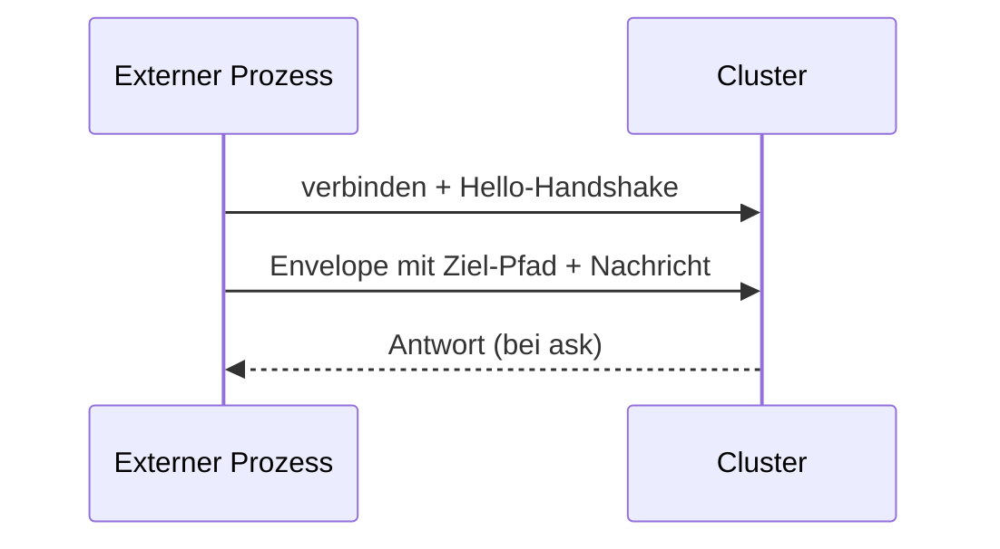

`ClusterClient` lässt einen **Prozess außerhalb des Clusters** mit
Actors innerhalb sprechen. Der externe Prozess ist kein
Cluster-Mitglied — kein Gossip, kein Mitgliedschaftsstatus — aber
er kann cluster-interne Actors per bekannten
**Receptionist-Kontakten** mit `tell` und `ask` ansprechen.

```ts
import { ClusterClient, ClusterClientOptions } from 'actor-ts/cluster';

const clusterClientOptions = ClusterClientOptions.create().withContactPoints(['actor-ts://my-app@10.0.0.5:2552/system/cluster/receptionist']);
const client = new ClusterClient(
  clusterClientOptions,
);

// Senden an einen bekannten Cluster-Actor:
client.send('/user/api/orders', { kind: 'place', ... });

// Oder fragen und auf die Antwort warten:
const orders = await client.ask('/user/api/orders', { kind: 'list-orders' });
```

## Wann verwenden

Drei legitime Anwendungsfälle:

1. **Externe Services**, die nicht in den Actor-Cluster gehören,
   aber mit ihm reden müssen — ein Python-ML-Service, der an
   einen Kafka-Actor innerhalb des Clusters postet.
2. **Mobile-/Desktop-Clients über eine Bridge** — eine
   serverseitige Bridge hält einen ClusterClient + bietet eine
   REST/WS-API nach außen.
3. **Cross-Cluster-Föderation** — zwei Cluster, bei denen einer
   mit bestimmten Actors im anderen sprechen muss, ohne zu
   mergen.

Für typische Setups ist **alles Teil des Clusters** —
ClusterClient ist der Notausgang für Fälle, in denen das nicht
möglich ist.

## Wie es funktioniert


```mermaid
sequenceDiagram
  participant Ext as Externer Prozess
  participant Cluster
  Ext->>Cluster: verbinden + Hello-Handshake
  Ext->>Cluster: Envelope mit Ziel-Pfad + Nachricht
  Cluster-->>Ext: Antwort (bei ask)
```

Der Client:

1. Verbindet sich mit einem oder mehreren **Kontaktpunkten**
   (Cluster-Nodes, auf denen ein `ClusterClientReceptionist`
   läuft).
2. Schickt jede Nachricht in einem Envelope, adressiert an einen
   Ziel-Actor-**Pfad** — `send` für Fire-and-Forget, `ask` für
   Request/Reply.
3. Der Receptionist auf dem Kontakt-Node löst diesen Pfad in
   seinem lokalen Actor-Baum auf und stellt die Nachricht zu.
4. Behandelt Failover, wenn ein Kontaktpunkt unerreichbar wird —
   verbindet sich zu einem anderen.

## Konfiguration

```ts
type ClusterClientOptionsType = {
  contactPoints: ReadonlyArray<string>;            // mindestens ein Node: host:port oder <system>@host:port
  systemName?: string;                             // synthetischer System-Name im Hello des Clients
  clientIdentity?: { host: string; port: number }; // im Hello des Clients angekündigte Identität
  askTimeoutMs?: number;                           // Standard-Ask-Timeout (ms; Standard 5000)
  connectTimeoutMs?: number;                       // Wartezeit je Kontaktpunkt auf hello-ack (ms; Standard 5000)
  tls?: TlsTransportOptionsType;                   // muss zum Cluster passen
  logger?: Logger;                                 // Standard: ConsoleLogger auf WARN
};
```

`contactPoints` ist die Liste der zu wählenden Cluster-Nodes —
jeweils ein `host:port`- oder `<system>@host:port`-String. Der
Client probiert sie der Reihe nach; bei Ausfall fällt er auf den
nächsten zurück. `connectTimeoutMs` begrenzt, wie lange **einer**
von ihnen Zeit hat, den `hello`-Handshake zu beantworten, bevor
der Client weiterzieht.

Für **stabile Kontaktadressen** betreibt die Cluster-Seite typisch
einen `ClusterClientReceptionist` auf einem festen Satz von Nodes,
deren Adressen zu den Kontaktpunkten des Clients werden.

### Aus einer Config-Datei

Alles oben außer `clientIdentity`, `tls` und `logger` kann
stattdessen aus HOCON kommen:

```hocon
actor-ts.cluster.client {
  contact-points  = ["orders@10.0.0.1:2552", "orders@10.0.0.2:2552"]
  system-name     = "checkout-client"
  ask-timeout     = 5s
  connect-timeout = 5s

  receptionist {
    ask-timeout = 5s
  }
}
```

Liegt das auf der Platte, verbindet sich ein Client, der **ganz
ohne Optionen** gebaut wurde:

```ts
const client = new ClusterClient({});
```

Dieser Block wird anders geladen als der Rest der Konfiguration
des Frameworks, und die Natur des Clients ist der Grund: er ist
per Definition *außerhalb* des Clusters, hält also kein
`ActorSystem` und hat kein `system.config` über sich, aus dem er
lesen könnte. Der Konstruktor lädt die Config deshalb selbst —
dieselbe Kette, die `ActorSystem.create` benutzt, samt
`ACTOR_TS_CONFIG` und `./application.conf`. Die Reihenfolge ist
die übliche: explizite Optionen schlagen die Datei, die Datei
schlägt die eingebauten Defaults.

Übergeben Sie ein `Config` als zweites Argument, um festzulegen,
was gelesen wird — dann ist der Client unabhängig davon, welche
`application.conf` zufällig im Arbeitsverzeichnis liegt:

```ts
const client = new ClusterClient({ contactPoints: ['orders@10.0.0.1:2552'] }, Config.empty());
```

`contact-points` wird in `reference.conf` **auskommentiert**
ausgeliefert. Die Liste ist Deployment-Identität, die kein Default
aussprechen könnte, und eine leere Liste ist nicht deren
Abwesenheit — sie wird zurückgewiesen, ein ausgelieferter Wert
könnte also nur einer sein, der jeden Client stoppt.

`clientIdentity` bleibt absichtlich reiner Code, und das ist eine
Sicherheits- und keine Verpackungsentscheidung. Der synthetische
Port eines Clients wird aus dem CSPRNG gezogen, damit kein Peer
seinen Slot vorhersagen, adressieren oder vorwegnehmen kann; eine
Flotte, die sich einen konfigurierten Wert teilt, würde jeden
Client dieselbe Wire-Adresse ankündigen lassen — genau das, was
die Ziehung verhindert. `tls` trägt Zertifikatsmaterial und
`logger` ist ein Objekt, also hat auch keines von beiden eine
HOCON-Schreibweise.

## Serverseite — ClusterClientReceptionist

```ts
import { ClusterClientReceptionistId } from 'actor-ts/cluster';

// Der Receptionist ist eine Per-System-Extension — starte ihn auf
// jedem Node, der Outside-in-Client-Verbindungen annehmen soll:
system.extension(ClusterClientReceptionistId).start(cluster);
```

Es gibt keine Service-Registry zu befüllen. Der Receptionist löst
den Ziel-Pfad jedes Envelopes im lokalen Actor-Baum auf und stellt
die Nachricht zu — jeder bereits unter `/user` laufende Actor ist
über den Pfad erreichbar, an den der Client sendet (z. B.
`client.send('/user/api/orders', ...)`).

Seine einzige Option, `askTimeoutMs`, begrenzt die Wartezeit, wenn
ein Client-Envelope ein ask trägt; setze sie über
`ClusterClientReceptionistOptions` — oder aus der Datei:

```hocon
actor-ts.cluster.client.receptionist.ask-timeout = 3s
```

Dieser Leaf liegt unter `cluster.client` statt unter
`actor-ts.cluster.receptionist`, das dem Discovery-`Receptionist`
gehört — einem anderen Actor mit einem anderen Protokoll. Und
anders als die Client-Hälfte oben liest diese hier die Config des
Systems, in dem sie gestartet wurde; sie lädt nie eine eigene,
weil sie immer eine hat.

## An wen die Antwort geht

Ein ask wird über **die Verbindung beantwortet, auf der das
Envelope ankam** — nie an eine Adresse, die das Envelope nennt.
Ein Client sagt genau einmal, wer er ist: im `hello`-Handshake.
Der Transport bindet diese Angabe an den Socket, und jede
Antwort, jede Redaktion und jedes „path not found“ folgt dieser
Bindung.

Deshalb hat das Envelope überhaupt kein Absenderfeld mehr.
Früher trug es eines, und der Receptionist routete darauf — was
jede verbundene Gegenstelle die Adresse wählen ließ, an die
dieser Node antwortete und zu der er eine Verbindung aufbaute.
Das Feld zu löschen statt es zu prüfen, lässt nichts übrig, das
beim nächsten Mal falsch gemacht werden kann, wenn jemand zur
billigeren von zwei Antworten auf dieselbe Frage greift.

Ein Client, der alt genug ist, das Feld noch zu senden, wird
normal bedient; der Wert wird ignoriert.  Nennt er etwas
*anderes* als die Verbindung, zählt der Node es auf
`cluster_envelope_from_mismatch_total{frame="cluster-client-envelope"}`
und macht weiter.  Das ist entweder ein Client, der sich über
seine eigene Adresse irrt, oder jemand, der testet, ob dieser
Node auf Payload routet — eine Zahl wert, keine Ablehnung, denn
das Envelope selbst ist in Ordnung.

:::caution[Das ist keine Client-Authentifizierung]
Der Peer der Verbindung ist das, was der Socket in seinem
`hello` behauptet hat.  Darauf zu routen nimmt die Beliebigkeit
heraus — eine Antwort lässt sich nicht mehr aus der Payload
steuern —, macht die Gegenstelle aber nicht zu dem, was sie zu
sein behauptet.  Nur Peer-Zertifikate tun das: unter mTLS muss
die behauptete Adresse zum Zertifikat passen.  Siehe
[Cluster-Sicherheit](/de/operations/security/cluster-security/).
:::

## Was ein Fehlschlag dem Client verrät

**Ein ClusterClient ist kein Peer.**  Er spricht dieselbe Leitung
wie ein Cluster-Mitglied — und genau deshalb lohnt es, die
Unterscheidung auszusprechen: Er ist nie dem Membership-Ring
beigetreten, trägt keine Gossip- oder Heartbeat-Pflicht, und ein
Kontaktpunkt ist per Entwurf von außerhalb der Grenze erreichbar,
die die clustereigenen Verbindungen schützt.  Ein abgeschlossenes
`hello` berechtigt die Gegenstelle nicht zu den Interna des
Clusters.

Schlägt ein ask im Cluster fehl, reicht der Receptionist den
Fehlertext daher **nicht** weiter.  Diesen Text schreibt der
Actor, der zufällig gescheitert ist — dieselbe Klasse von String
wie bei einem HTTP-500, mit Dateipfaden, SQL-Fragmenten oder
einem Stack.  Der Client bekommt stattdessen einen festen Satz
und eine Korrelations-Id:

```
ask failed on the cluster node (correlationId=6f1c…-…) — the reason is in that node's log
```

Der Volltext wird auf dem Node geloggt, der das ask ausgeführt
hat — unter derselben Id, auf `warn`.  Ein externer Aufrufer
nennt die Id, ein Operator greppt danach.  Der Grund geht nie
über die Leitung.

Ein unbekannter Pfad wird anders gemeldet, denn dort erfährt der
Client nur etwas über seinen eigenen Request:

```
path not found: user/api/orders
```

Beachte, was *nicht* darin steht — die Adresse des Nodes.  Ein
Kontaktpunkt steht oft hinter einem Load Balancer oder NAT, die
Bind-Adresse ist also nicht die gewählte, und es gibt keinen
Grund, sie herauszugeben.

Muss ein Client wirklich auf einen bestimmten Fehlschlag
reagieren, modelliere ihn als **Antwort, die der Actor selbst
verfasst**, statt als Wurf:

```ts
class OrderActor extends Actor<OrderCommand> {
  override onReceive(message: OrderCommand): void {
    if (!this.stock.has(message.sku)) {
      // A deliberate, authored answer — it reaches the client verbatim.
      this.sender.forEach((s) => s.tell({ kind: 'rejected', reason: 'out-of-stock' }));
      return;
    }
    // …
  }
}
```

Eine erfolgreiche Antwort wird unverändert durchgereicht;
redigiert werden nur Fehlschläge.  So bleibt der Domänenvertrag
explizit, statt das, was eine Exception zufällig sagt, zur API zu
machen.

## Vergleich mit Cluster-fähigem ActorRef

```ts
// Innerhalb des Clusters — Actors sprechen direkt:
const ref = await system.actorSelection('actor-ts://my-app@host:2552/user/api').resolveOne();
ref.tell(...);

// Außerhalb des Clusters — ClusterClient:
const clusterClientOptions = ClusterClientOptions.create().withContactPoints([...]);
const client = new ClusterClient(clusterClientOptions);
client.send('/user/api', ...);
```

Unterschiede:

- **Innen**: erfordert Cluster-Mitgliedschaft. Refs propagieren
  per Gossip; du kannst langlebige Refs halten.
- **ClusterClient**: keine Mitgliedschaft; Refs werden pro
  Nachricht über den Receptionist aufgelöst.

## Wann NICHT verwenden

import { Aside } from '@astrojs/starlight/components';

<Aside type="caution" title="HTTP / gRPC ist meist einfacher">
  ```
  Externer Service → ClusterClient → Cluster
  ```
  ClusterClient + einen serialisierungs-kompatiblen Client
  aufzusetzen, ist Arbeit. Für die meisten extern zugänglichen
  APIs ist **HTTP oder gRPC** innerhalb des Clusters (mit einem
  HTTP-Server im Cluster) einfacher — externe Clients nutzen
  Standard-HTTP-Libraries, keine actor-ts-spezifischen Clients.
</Aside>

<Aside type="caution" title="Browser-/Mobile-Direktverbindungen">
  ```ts
  // Browser → ClusterClient → Cluster
  ```
  ClusterClient braucht **TCP vom Client**. Browser machen kein
  TCP; mobile Apps sollten es meist nicht. Nutze eine
  serverseitige Bridge, die den Cluster mit HTTP/WS frontet.
</Aside>

## Wohin als Nächstes

- **[Refs über Nodes hinweg](/de/cluster/refs-across-nodes/)** —
  Cluster-interne Ref-Semantik zum Vergleich.
- **[Receptionist](/de/discovery/receptionist/)** — die
  cluster-interne Service-Registry (eine eigenständige Komponente
  mit ähnlichem Namen).
- **[HTTP-Überblick](/de/http/overview/)** — die häufigere
  extern zugängliche Alternative.
