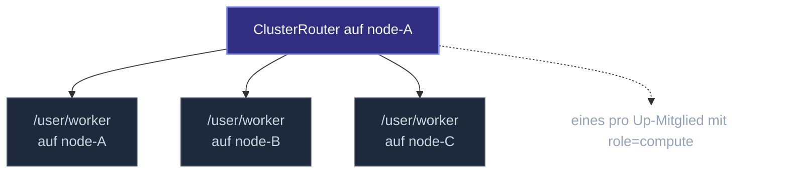

Der lokale [`Router`](/de/routing/router/) erstellt seine Routees als
eigene Kinder — ein fester Pool auf einem Node. Der
**`ClusterRouter`** ist anders: seine Routees sind **Actors anderer
Nodes an einem bekannten Pfad**, und die Menge der Routees ändert
sich mit der Cluster-Mitgliedschaft.



Jedes Up-Mitglied mit der Rolle `compute` (konfigurierbar) hat
einen Worker an `/user/worker`; der Router routet eingehende
Nachrichten gemäß einer Strategie über sie. Füge einen Node hinzu,
der Router nimmt ihn auf; entferne einen Node, der Router hört auf,
ihm zu senden — ohne Neustart.

Siehe [Pool vs. Group](/de/routing/pool-vs-group/) für die
Unterscheidung zwischen lokalen Pools und Cluster-Groups.

## Ein minimales Beispiel

```ts
import { ActorSystem, Cluster, ClusterOptions, ClusterRouter, ClusterRouterOptions, Props, Actor } from 'actor-ts';

class Worker extends Actor<{ payload: string }> {
  override onReceive(msg: { payload: string }): void {
    this.log.info(`gearbeitet an ${msg.payload}`);
  }
}

const system  = ActorSystem.create('my-app');
const clusterOptions = ClusterOptions.create()
  .withHost(host)
  .withPort(port)
  .withSeeds(seeds)
  .withRoles(['compute']);
const cluster = await Cluster.join(
  system,
  clusterOptions,
);

// 1. Jeder Node spawnt seinen eigenen Worker an /user/worker
system.spawn(Props.create(() => new Worker()), 'worker');

// 2. Jeder Node kann einen Cluster-Router bauen, der diese Worker anspricht
const clusterRouterOptions = ClusterRouterOptions.create()
  .withCluster(cluster)
  .withRouterType('round-robin')
  .withRouteePath('/user/worker')
  .withRole('compute');
const router = system.spawn(
  ClusterRouter.props(
    clusterRouterOptions,
  ),
  'compute-router',
);

// 3. Sage dem Router etwas — die Nachricht wird an den Worker eines Nodes geroutet
router.tell({ payload: 'work-1' });
```

Das Muster: jeder Node deployed die Routee-Actors lokal; einer
(oder mehrere) Nodes spawnen einen `ClusterRouter`, der auf sie
zielt. Die Strategie des Routers entscheidet, welcher Worker die
einzelne Nachricht bekommt.

## Konfiguration

```ts
interface ClusterRouterOptions<TMessage> {
  cluster:     Cluster;
  routerType:  'round-robin' | 'random' | 'consistent-hashing' | 'broadcast';
  routeePath:  string;
  role?:       string;
  extractKey?: (msg: TMessage) => string;
}
```

| Feld | Erforderlich | Was |
| --- | --- | --- |
| `cluster` | Ja | Der Cluster — für Mitgliedschaftsverfolgung + den Wire-Transport. |
| `routerType` | Ja | Eine der vier Strategien. |
| `routeePath` | Ja | Der Pfad, an dem der Routee-Actor auf jedem Node lebt (typisch `/user/<actorName>`). |
| `role` | Nein | Wenn gesetzt, sind nur Mitglieder mit dieser Rolle Routees. |
| `extractKey` | Wenn `routerType: 'consistent-hashing'` | Extrahiert den Routing-Key aus einer Nachricht. |

## Die vier Strategien

| Strategie | Was sie tut |
| --- | --- |
| `'round-robin'` | Ein Routee pro Nachricht, zyklisch. |
| `'random'` | Ein Routee pro Nachricht, gleichverteilt zufällig. |
| `'consistent-hashing'` | Pinnt gleiche `extractKey` an gleichen Routee via Rendezvous-Hashing. |
| `'broadcast'` | Schickt an jeden Routee. |

Die ersten drei sind 1-von-N-Routing; Broadcast ist Fan-out. Siehe
[Strategien](/de/routing/strategies/) für die Auswahlhilfe — gleiche
Trade-offs gelten, nur eben über Cluster-Nodes statt über
Pool-Mitglieder verteilt.

### Consistent-Hashing

```ts
const clusterRouterOptions = ClusterRouterOptions.create()
  .withCluster(cluster)
  .withRouterType('consistent-hashing')
  .withRouteePath('/user/cache')
  .withExtractKey((msg) => msg.userId);
ClusterRouter.props(
  clusterRouterOptions,
);
```

Erforderlich für `'consistent-hashing'`. Die Funktion zieht einen
String-Key aus jeder Nachricht; der Router pinnt Nachrichten mit
demselben Key per Rendezvous-Hashing an denselben Node.

Nützlich, wenn jeder Routee **per-Key-Zustand** hält: einen Cache
für die Daten dieses Users, eine Session, einen laufenden
Workflow. Topologieänderungen verschieben einen Bruchteil der
Keys (proportional zur Hinzufügung/Entfernung), nicht alle.

Wenn `extractKey` immer denselben Wert zurückgibt, geht jede
Nachricht an denselben Routee (de facto ein Singleton). Stelle
sicher, dass er über deine tatsächliche Workload variiert.

## Routee-Discovery

Bei jeder Gossip-Runde leitet der Router seine Routee-Menge aus
den Up-Mitgliedern des Clusters neu ab. Auslöser eines
Neuaufbaus:

- `MemberUp` — ein neues Up-Mitglied mit passender Rolle.
  Hinzufügen.
- `MemberRemoved` — ein entferntes Mitglied. Rauswerfen.

Die Menge ist **deterministisch geordnet** (per Adresse), sodass
Round-Robin-Counter über Neuaufbauten hinweg vernünftig bleiben.

## Wenn die Routee-Menge leer ist

```ts
router.tell({ payload: 'a' });
// → wenn kein Up-Mitglied `role` matched, wird die Nachricht mit einem Warn-Log fallengelassen
```

**Wichtig:** eine leere Routee-Menge bedeutet, dass **Nachrichten
in Dead Letters fallen**. Das Framework puffert nicht, während es
auf Routees wartet — das würde stillschweigend unbegrenzt wachsen.

Für "fang erst an zu bedienen, wenn der Pool mindestens N Routees
hat", abonniere `MemberUp` und gate die Anfragebehandlung an einem
Zähler.

## Rollenfilterung

```ts
const clusterRouterOptions = ClusterRouterOptions.create()
  .withCluster(cluster)
  .withRole('compute');
ClusterRouter.props(
  clusterRouterOptions
    // ...
);
```

Nur Up-Mitglieder mit der Rolle `compute` sind Kandidaten.
Nützlich für asymmetrische Cluster:

- Nodes mit `compute`-Rolle erledigen schwere Arbeit.
- Nodes mit `gateway`-Rolle behandeln HTTP-Traffic.
- Nodes mit `coordinator`-Rolle hosten Singletons.

Die Rolle wird zur `Cluster.join`-Zeit pro Node deklariert. Das
`role`-Feld des Routers filtert; ohne es ist **jedes Up-Mitglied
ein Kandidat**.

## Self-Routing

Wenn der lokale Node ein Kandidat ist (die Rolle passt), *kann*
der Router auf einen Worker auf demselben Node routen. Der
Transport behandelt Loopback gleich wie jede Cross-Node-Zustellung
— über den Local-Loopback-Pfad des Transports.

Das bedeutet, dass die Lastverteilung des Routers symmetrisch ist
— keine Bevorzugung lokaler Routees, kein Penalty. Round-Robin
nimmt dich wie jeden anderen Node in den Zyklus auf.

## Stoppen

```ts
router.stop();
// oder: router.tell(PoisonPill.instance);
```

Stoppt den Router-Actor. **Routees bleiben unberührt** — sie sind
auf anderen Nodes; sie laufen weiter. Das ist das
Group-Router-Modell: der Router besitzt *das Routing*, nicht die
Routees selbst.

Zum Vergleich: ein lokaler Pool-Router stoppt seine Routees
kaskadierend beim Stoppen. Siehe
[Pool vs. Group](/de/routing/pool-vs-group/).

import { Aside } from '@astrojs/starlight/components';

<Aside type="caution" title="Routee-Actors müssen auf jedem angesprochenen Node existieren">
  ```ts
  // Manche Nodes spawnen /user/worker, andere nicht
  ```
  Der Cluster-Router prüft die Lebendigkeit nicht über die
  Mitgliedschaft hinaus — wenn ein Node die Rolle hat, aber keinen
  `/user/worker`, kommt das `tell` an einem toten Pfad auf diesem
  Node an und landet in Dead Letters. Mache das
  Routee-Deployment einheitlich über alle Rollen-tragenden Nodes.
</Aside>

<Aside type="caution" title="`broadcast` + Reply-To-Refs">
  ```ts
  router.tell({ kind: 'get', replyTo: client });
  // ↑ Broadcast → jeder Routee antwortet → Aufrufer bekommt N Antworten
  ```
  Gleiche Falle wie beim lokalen `Router.broadcast`. Nützlich für
  Konsens-artige Reads (Antworten zählen); meist sonst ein Bug.
</Aside>

<Aside type="caution" title="Consistent-Hashing mit schiefen Keys">
  ```ts
  extractKey: (msg) => msg.userId,
  // ↑ wenn 80 % des Traffics für einen User ist, behandelt ein Routee 80 %
  ```
  Gleiches Problem wie bei jedem Hash-basierten Schema — schiefe
  Keys erzeugen Hotspots. Wenn die Key-Verteilung nicht ungefähr
  gleichverteilt ist, ziehe
  [Sharding](/de/cluster/sharding/overview/) in Betracht (ein
  Actor pro Key, alle isoliert) oder aggregiere vor dem Routing.
</Aside>

## Wohin als Nächstes

- **[Routing-Überblick](/de/routing/overview/)** — das größere
  Routing-Bild.
- **[Pool vs. Group](/de/routing/pool-vs-group/)** — der
  konzeptionelle Unterschied zum lokalen `Router`.
- **[Strategien](/de/routing/strategies/)** — Round-Robin /
  Random / Consistent-Hashing im Detail.
- **[Sharding-Überblick](/de/cluster/sharding/overview/)** —
  für per-Key-Actors mit stärkeren Platzierungsgarantien.
- **[Cluster-Überblick](/de/cluster/overview/)** — die
  Mitgliedschaft, die der Router liest.

Die [`ClusterRouter`](/api/classes/clusterrouter/) API-Referenz
deckt die vollständigen Optionen ab.
