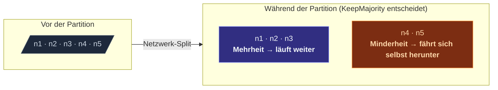

Wenn der Cluster partitioniert wird, laufen beide Hälften weiter —
und beide denken, die andere Hälfte sei ausgefallen. Ohne Eingriff:

- Es würden zwei Singletons existieren (einer pro Seite).
- Sharded Entities für denselben Key könnten auf beiden Seiten
  gespawnt werden.
- DistributedData-Replicas würden bis zur Versöhnung divergieren.

Eine **Downing-Strategie** wählt eine Gewinnerseite und fährt die
Verliererseite zwangsweise herunter. Die Actors der verlierenden
Nodes stoppen; die Gewinnerseite läuft als Cluster weiter.



Ohne Strategie: beide Hälften laufen weiter. Wenn die Partition
heilt, hast du zwei getrennte Cluster mit demselben Namen und
keinen automatischen Merge. **Konfiguriere immer eine Strategie für
Produktion.**

## Die fünf eingebauten Strategien

| Strategie | Gewinnt bei... | Trade-off |
| --- | --- | --- |
| **`KeepMajority`** | Der Seite mit `> N/2` Mitgliedern. | Einfach; Unentschieden (genau N/2-N/2-Split) bedeutet, beide Seiten gehen down. |
| **`KeepOldest`** | Der Seite mit dem ältesten Mitglied. | Funktioniert für gerade Cluster-Größen, in denen Mehrheit undefiniert ist. |
| **`KeepReferee`** | Der Seite mit einem bestimmten *Schiedsrichter*-Node. | Vorhersagbar, schafft aber einen Single Point of Failure (den Schiedsrichter). |
| **`StaticQuorum`** | Der Seite, die eine konfigurierte Quorum-Größe erreicht. | Strenger als Mehrheit; die Quorum-Größe ist die Wahl des Operators. |
| **`LeaseMajority`** | Mehrheit + muss eine Koordinations-Lease halten. | Paranoide Sicherheit; erfordert einen Lease-Provider (K8s etc.). |

Wähle nach der Topologie deines Clusters und den operativen
Randbedingungen (siehe Auswahlabschnitt unten).

## Konfiguration

```ts
import { Cluster, ClusterOptions, KeepMajority } from 'actor-ts';

const clusterOptions = ClusterOptions.create()
  .withHost(host)
  .withPort(port)
  .withSeeds(seeds)
  .withDowning(new KeepMajority());
const cluster = await Cluster.join(
  system,
  clusterOptions,
);
```

Übergib den Provider als `downingProvider`. Jedes Cluster-Event
(Mitglied unreachable, Mitglied reachable etc.) führt den Provider
mit der aktuellen Sicht erneut aus; er gibt die Menge der Adressen
zurück, die zwangsweise herabgestuft werden sollen. Eine leere
Menge bedeutet "noch keine Entscheidung — abwarten."

## KeepMajority

```ts
import { KeepMajority } from 'actor-ts';

new KeepMajority();
```

Die klassische Strategie. Zählt Mitglieder; die Seite mit mehr
gewinnt.

**Macht gut:**

- Allgemeinster Default.
- Keine externen Abhängigkeiten.
- Vorhersagbar bei ungeradem N.

**Macht nicht:**

- Exakte N/2-N/2-Splits handhaben — beide Seiten fahren sich
  selbst herunter.
- Zwischen "5 Mitglieder gesund" und "5 Mitglieder alle auf
  derselben Maschine, das Rack brennt" unterscheiden — Mehrheit
  per Zählung ist blind für physische Topologie.

Richtig für Cluster mit einer **ungeraden Zahl an Nodes** und ohne
besondere Deployments.

## KeepOldest

```ts
import { KeepOldest, KeepOldestOptions } from 'actor-ts';

const keepOldestOptions = KeepOldestOptions.create().withDownIfAlone(true);
new KeepOldest(keepOldestOptions);
```

Die Seite mit dem **ältesten Mitglied** (am längsten im Cluster)
gewinnt. Nützlich, wenn:

- Du eine gerade Zahl an Nodes hast, bei denen `KeepMajority` bei
  50/50-Splits mehrdeutig wird.
- Der Cluster einen langlebigen "stabilen" Node hat (einen
  Koordinator-Pod), der fast immer der älteste ist und die
  Strategie deterministisch macht.

`downIfAlone: true` bedeutet "wenn ich der älteste bin, aber alle
anderen unreachable sind, fahre ich mich selbst herunter" —
verhindert, dass ein Ein-Node-"Gewinner" sich nach einem
Komplett-Split selbst zum Cluster erklärt.

## KeepReferee

```ts
import { KeepReferee, KeepRefereeOptions } from 'actor-ts';

const keepRefereeOptions = KeepRefereeOptions.create()
  .withRefereeAddress('actor-ts://my-app@10.0.0.1:2552')
  .withDownAllIfBelowQuorum(3);
new KeepReferee(
  keepRefereeOptions,
);
```

Ein bestimmter **Schiedsrichter-Node** ist das entscheidende
Mitglied. Die Seite mit dem Schiedsrichter gewinnt; die andere
Seite fährt sich herunter.

**Macht gut:**

- Die vorhersagbarste Strategie — keine Mehrdeutigkeit darüber,
  welche Seite gewinnt.
- Funktioniert für jede Cluster-Größe, auch gerade.

**Macht nicht:**

- Den Schiedsrichter selbst überleben, wenn er ausfällt.
  Verschwindet der Schiedsrichter, hat ihn keine Seite, und die
  Strategie kann nicht entscheiden. Daher
  `downAllIfLessThanNodes` — "wenn der Cluster unter dieser Größe
  ist, fahre alles herunter und lass Operatoren neu aufbauen."

Nützlich für **Zwei-DC-Cluster** mit einem Tie-Breaker-Node an
einem neutralen Ort (drittes DC, eine Control-Plane-K8s-Namespace).

## StaticQuorum

```ts
import { StaticQuorum, StaticQuorumOptions } from 'actor-ts';

const staticQuorumOptions = StaticQuorumOptions.create().withQuorumSize(3);
new StaticQuorum(staticQuorumOptions);
```

Eine Seite gewinnt nur, wenn sie mindestens `quorumSize`
erreichbare Mitglieder hat. Unterhalb des Quorums fährt die Seite
sich selbst herunter.

**Macht gut:**

- Strenger als Mehrheit — schützt vor Szenarien, in denen die
  Minderheit sonst weiterlaufen würde.
- Konfigurierbar nach der Konfidenzschwelle deines Operators.

**Macht nicht:**

- Sich automatisch erholen. Bilden sich mehrere Sub-Quorum-Partitionen,
  gewinnt keine; der Operator muss manuell neu aufbauen.

Richtig, wenn du eher **Fail-Stop** willst, als ein
Falsche-Seite-Überleben zu riskieren.

## LeaseMajority

```ts
import { LeaseMajority, LeaseMajorityOptions } from 'actor-ts';

const leaseMajorityOptions = LeaseMajorityOptions.create().withLease(someLeaseImpl);
new LeaseMajority(
  leaseMajorityOptions,
);
```

Mehrheit **plus** eine Koordinations-Lease. Wrappe jede andere
Strategie: die Gewinnerseite muss zusätzlich eine Lease (z. B. eine
K8s-Lease-Ressource) erwerben, bevor sie sich als autoritativ
betrachtet.

**Macht gut:**

- Doppelt gemoppelte Sicherheit. Zweifachprüfung.
- Nützlich, wenn das Netzwerk unberechenbar ist (z. B.
  Cloud-Cross-Zone).

**Macht nicht:**

- Helfen, wenn der Lease-Provider selbst weg-partitioniert ist.

Richtig für paranoide Produktionsszenarien, in denen du eher
**doppelten Aufwand** für Split-Brain-Schutz akzeptierst.

## Eine Strategie auswählen

Drei Fragen, in dieser Reihenfolge:

1. **Gerade oder ungerade Cluster-Größe?**
   - Ungerade → `KeepMajority`.
   - Gerade → `KeepOldest` oder `KeepReferee` (Unentschieden
     vermeiden).

2. **Hast du einen stabilen Tie-Breaker-Node?**
   - Ja → `KeepReferee` (am vorhersagbarsten).
   - Nein → `KeepMajority` oder `KeepOldest`.

3. **Ist Fail-Stop besser als ein potenzieller Falsche-Seite-Gewinn?**
   - Ja → `StaticQuorum` (irrt auf der Stop-Seite).
   - Nein → eine der oben genannten.

Für ein typisches 3-Node-K8s-Deployment: **`KeepMajority`**. Für
ein 2-DC-Setup mit einem Tie-Breaker in der dritten Region:
**`KeepReferee`**. Für einen 5-Node-Cluster, der niemals unter 3
fallen soll: **`StaticQuorum(3)`**.

## Eigene Strategien

Das Provider-Interface ist winzig:

```ts
interface DowningProvider {
  decide(view: ClusterPartitionView): DowningDecision;
}

interface ClusterPartitionView {
  allMembers: ReadonlyArray<Member>;
  unreachable: ReadonlySet<string>;   // Adress-Strings
  self: NodeAddress;
}
```

Implementiere `decide(view) => Set<string>` und gib die
Adress-Strings zurück, die herabgestuft werden sollen. Leere Menge
heißt "keine Entscheidung."

Nützlich für app-spezifische Regeln — z. B. "behalte immer den
Node mit role=primary" oder "wenn die Partition den
DB-Master-Node enthält, gewinnt diese Seite."

import { Aside } from '@astrojs/starlight/components';

<Aside type="caution" title="Keine Strategie = manuelle Operationen">
  Ohne `downingProvider` sieht der Cluster unreachable Mitglieder
  für immer (oder bis sie sich erholen). Operatoren müssen
  `cluster.down(addr)` manuell aufrufen. Akzeptabel für verwaltete
  Cluster mit On-Call-Personen; nicht akzeptabel für
  Auto-Scaled-/unbeaufsichtigte Deployments.
</Aside>

<Aside type="caution" title="Stabile gestreckte Cluster brauchen Leases">
  ```ts
  // 2 Nodes in DC-A, 2 Nodes in DC-B, kein Tie-Breaker
  new KeepMajority();   // ✗ beide Seiten gehen bei 2-2-Split down
  ```
  Gerade Cluster brauchen einen Tie-Breaker. Ohne diesen tötet jede
  Partition den ganzen Cluster. Füge einen Schiedsrichter-Node oder
  eine Lease hinzu.
</Aside>

<Aside type="caution" title="`StaticQuorum` blockiert Scale-Up">
  ```ts
  const quorumOptions = StaticQuorumOptions.create().withQuorumSize(5);
  new StaticQuorum(quorumOptions);
  // Startet mit 3 Nodes → Cluster fährt sich selbst herunter (kein Quorum)
  ```
  Quorum wird bei jeder Mitgliedschaftsänderung geprüft, auch beim
  initialen Join. Starte entweder mit bereits erreichtem Quorum
  oder verwende eine Quorum-Größe gleich oder kleiner deiner
  minimalen Laufzeit-Größe.
</Aside>

## Wohin als Nächstes

- **[Cluster-Überblick](/de/cluster/overview/)** — das
  Mitgliedschaftsmodell, gegen das die Strategie arbeitet.
- **[Failure Detector](/de/cluster/failure-detector/)** —
  was Mitglieder erst als unreachable kennzeichnet.
- **[Singleton mit Lease](/de/cluster/singleton/with-lease/)** —
  Lease-Schutz pro Singleton, ergänzend zu einer Downing-Strategie.
- **[Coordination](/de/coordination/overview/)** — die
  Lease-Abstraktion.
- **[Cluster-Sicherheit](/de/operations/security/cluster-security/)** —
  TLS + Auth rund um den Cluster-Transport.

Die [`DowningProvider`](/api/interfaces/downingprovider/)
API-Referenz deckt das Strategie-Interface ab.
