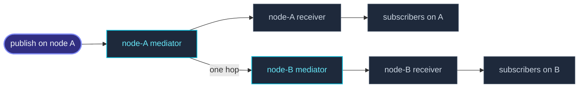

import { Aside } from '@astrojs/starlight/components';

`system.eventStream` ist auf ein `ActorSystem` gescoped, und das ist eine
**Node**: ein Publish dort läuft über eine In-Process-Liste und fasst das
Netzwerk nie an. `cluster.eventStream` ist die andere Hälfte — dieselben
Channels, aber Subscriber auf **jeder** Node.

Der Besitzer trägt die Reichweite, damit die beiden an der Aufrufstelle
auseinanderzuhalten sind und nicht über eine Konvention, die man sich
merken muss:

```ts
system.eventStream.publish(event);    // this node only
cluster.eventStream.publish(event);   // every node
```



Er setzt auf demselben Mediator auf, den auch
[DistributedPubSub](/de/cluster/pubsub/) nutzt — aus einem Channel wird ein
Topic. Damit erbt er dessen begrenztes Gossip, die Zustellung mit höchstens
einem Hop und dessen Caps, und er fügt dem Wire-Protokoll kein neues Frame
hinzu.

## Ein minimales Beispiel

```ts
import { ActorSystem, Actor } from 'actor-ts';
import { Cluster, ClusterOptions } from 'actor-ts/cluster';

type OrderPlacedEvent = { readonly kind: 'order-placed'; readonly sku: string };

class Auditor extends Actor<OrderPlacedEvent> {
  override onReceive(message: OrderPlacedEvent): void {
    this.log.info(`[audit] ${message.sku}`);
  }
}

const system = ActorSystem.create('shop');
const clusterOptions = ClusterOptions.create()
  .withHost(host)
  .withPort(port)
  .withSeeds(seeds);
const cluster = await Cluster.join(system, clusterOptions);

const auditor = system.spawn(Auditor, 'auditor');
cluster.eventStream.subscribe(auditor, 'order-placed');

// On any node in the cluster — every auditor sees it.
cluster.eventStream.publish({ kind: 'order-placed', sku: 'XYZ-1' });
```

## Zwei Channel-Formen, und nur eine ist gratis

Ein **`kind`-diskriminiertes** Event braucht nichts weiter. Es ist bereits
gültiges JSON und sein Diskriminant überlebt die Leitung unverändert — ein
Abonnement per kind-String oder per `EventKey` funktioniert also ohne
Zutun über Node-Grenzen hinweg. Das ist zugleich die Form, die die
[Message-Konventionen](/de/fundamentals/messages/) des Projekts ohnehin
vorschreiben.

Ein **Klassen**-Channel kann das nicht von allein. Über die Leitung geht nur
der Tag des Werts, eine Instanz kommt auf der Gegenseite also als Plain
Object an und matcht kein `instanceof`. Deshalb erst benennen:

```ts
class ShipmentEvent {
  constructor(public readonly trackingId: string) {}
  static fromJSON(body: Record<string, unknown>): ShipmentEvent {
    return new ShipmentEvent(String(body.trackingId));
  }
}

cluster.eventStream.register('ShipmentEvent', ShipmentEvent);
cluster.eventStream.subscribe(auditor, ShipmentEvent);
cluster.eventStream.publish(new ShipmentEvent('TRK-1'));
```

`register` nimmt ein optionales drittes Argument, falls die Klasse kein
statisches `fromJSON` hat — eines von beiden muss existieren. Das ist
Absicht und keine fehlende Bequemlichkeit: eine beliebige Klasse generisch
wiederaufzubauen hieße, vom Peer gelieferte Keys auf einen frischen
Prototyp zu schreiben, und genau diese Prototype-Pollution-Fläche musste
dieses Projekt schon einmal entfernen. Dass die Klasse selbst sagt, wie sie
rekonstruiert wird, hält die Tür zu.

<Aside type="note" title="Die konkrete Klasse registrieren">
  Publish routet über den **exakten** Konstruktor des Events, eine
  Unterklasse wird also nicht unter dem Namen ihrer Basisklasse publisht —
  das würde eine Basis-Instanz zustellen, wo eine Unterklasse publisht
  wurde, und den Unterschied still verlieren. In der Gegenrichtung
  funktioniert es weiterhin: `subscribe(ref, BaseEvent)` sammelt jede
  registrierte Unterklasse ein, weil die lokale Hälfte der Zustellung per
  `instanceof` matcht — genau wie `system.eventStream`.

  Registrierung ist Setup. Eine Klasse, die *nach* einem Abonnement
  registriert wird, wird nicht nachträglich abonniert.
</Aside>

## Einen node-lokalen Channel bridgen

`bridge` spiegelt einen Channel des node-lokalen Busses auf den
Cluster-Bus. Hier wird „clusterweit statt lokal" entschieden — und zwar von
dir, nicht vom Framework:

```ts
cluster.eventStream.bridge('cache-flushed');
const stop = cluster.eventStream.bridge(ShipmentEvent);  // returns an off switch
```

Eine Bridge spiegelt, sie leitet nicht um. Alles, was auf
`system.eventStream` bereits abonniert ist, behält seine Zustellung — und
genau das erlaubt es, in einem laufenden Deployment eine Bridge
einzuschalten, ohne vorher zu prüfen, wer dort schon zuhört.

<Aside type="caution" title="Nur Single-Origin-Events bridgen">
  Bridge ein Event, das auf **einer** Node entsteht. Ein Event, das jede
  Node für sich selbst ableitet — die Cluster-Mitgliedschaftsevents sind
  der Fall, auf den man achten muss — wird clusterweit zu N Kopien, eine
  pro ableitender Node. Das ist kein Defekt, den man umgehen müsste,
  sondern folgt direkt daraus, wie ein solches Event zustande kommt.
</Aside>

## Warum die Framework-eigenen Events lokal bleiben

Nichts, was das Framework publisht, liegt standardmäßig auf dem
Cluster-Bus, und jedes hat seinen eigenen Grund:

| Event | Warum es node-lokal bleibt |
| --- | --- |
| `ActorStarted` / `ActorStopped` / `ActorRestarted` | `publish` läuft bei jedem Actor-Start, -Stopp und -Restart — der heißeste Pfad im System, dessen Leerfall bewusst auf einen einzigen Length-Check optimiert ist. |
| `DeadLetter` | Unzustellbare Nachrichten kommen in Fluten, und eine Storm-Suppression gibt es noch nicht. Clusterweit würde aus einem lokalen Sturm ein clusterweiter. |
| `MemberUp`, `MemberRemoved`, … | Jede Node leitet diese aus ihrem eigenen Gossip-Merge ab; clusterweit publisht sähe jeder Subscriber N Kopien einer einzigen Mitgliedschaftsänderung. |
| Broker-Lifecycle-Events | Ihr `cause` kann weiterhin einen Driver-Error mit Credentials tragen, und dieser Bus hat kein Autorisierungskonzept. |
| `DispatcherError`, `SchedulerError` | Node-Diagnose, und beide tragen ein `cause` mit derselben Exposition. |

Wer eines davon trotzdem clusterweit will, bridgt es bewusst — im Rahmen
der Single-Origin-Regel oben, die die Mitgliedschaftsevents ausschließt.

## Nicht synchron

`system.eventStream.publish` stellt innerhalb des Aufrufs zu.
`cluster.eventStream.publish` nicht: es passiert die Mailbox des Mediators,
auch für einen Subscriber auf der publishenden Node. Über eine Node-Grenze
hätte ohnehin nichts synchron sein können, und beide Herkünfte auf einen
Pfad zu legen ist das, was lokale und entfernte Zustellung in einer
Reihenfolge hält, statt sie gegeneinander laufen zu lassen.

Ein Test wartet deshalb auf die Zustellung, statt direkt nach dem Publish
zu prüfen.

## Welcher Bus, und welches subscribe

Drei Dinge auf dieser Seite sehen sich ähnlich und sind es nicht:

| API | Scope | Trägt | Replay |
| --- | --- | --- | --- |
| [`system.eventStream`](/de/fundamentals/event-stream/) | Eine Node | Beliebige Klasse oder `kind` | Nein |
| `cluster.eventStream` | Clusterweit | Beliebige Klasse oder `kind` | Nein |
| [`cluster.subscribe`](/de/cluster/overview/) | Eine Node, aus clusterweitem State | Nur Mitgliedschaftsevents, an einen Callback | Ja |
| [`DistributedPubSub`](/de/cluster/pubsub/) | Clusterweit | String-Topics, mit Anycast | Nein |

`cluster.subscribe` wird am ehesten mit `cluster.eventStream` verwechselt,
weil beide auf demselben Objekt sitzen. Es nimmt einen Callback statt einer
Ref, trägt nur Mitgliedschaftsevents und spielt beim Abonnieren die
aktuelle Mitgliedschaft nach — dieser Replay ist der Grund, warum es als
eigene Sache existiert.

Greife stattdessen zu `DistributedPubSub`, wenn du zur Laufzeit gewählte
String-Topics brauchst oder Anycast — also einen Subscriber clusterweit
statt aller.

## Wie geht's weiter

- **[Event-Stream](/de/fundamentals/event-stream/)** — der node-lokale Bus,
  seine Channel-Formen und die Events, die das Framework darauf publisht.
- **[DistributedPubSub](/de/cluster/pubsub/)** — topic-basiertes Pub/Sub und
  der Mediator, auf dem dieser Bus aufsetzt.
- **[Cluster-Überblick](/de/cluster/overview/)** — Mitgliedschaft,
  `cluster.subscribe` und die Events, die es zustellt.
