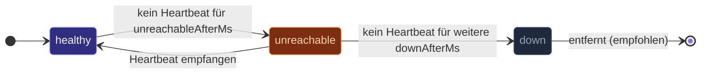
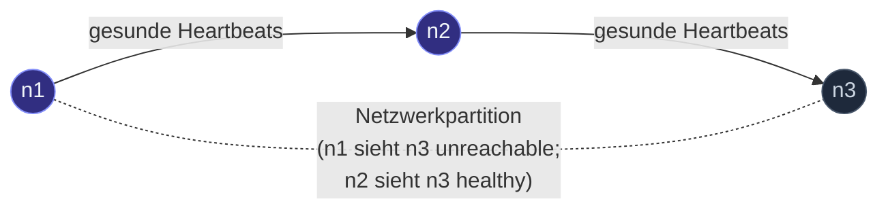

Ein geclusterter Actor-System muss sich **darauf einigen, wer
lebt**. Der Failure Detector ist die Peer-spezifische
Zustandsmaschine, die entscheidet:



- **`healthy`** — Heartbeats kommen normal an.
- **`unreachable`** — über dem Schwellwert; der Cluster vermeidet
  es, dorthin zu routen. Offiziell noch Mitglied; kann sich
  erholen.
- **`down`** — über dem längeren Schwellwert; der Cluster
  betrachtet den Peer als endgültig weg. Löst Downing aus.

Der Detector ist **pro Peer** — verschiedene Peers können
gleichzeitig in verschiedenen Zuständen sein. Das Gesamtverhalten
des Clusters (Routing, Sharding, Singleton-Wahl) liest diese
Zustände, um zu entscheiden, was zu tun ist.

## Die Defaults

```ts
{
  heartbeatIntervalMs: 500,    // alle 500ms einen Heartbeat senden
  unreachableAfterMs:  2_000,  // nach 2s Stille als unreachable markieren
  downAfterMs:         5_000,  // nach 5s Stille als down markieren
}
```

Für typische LAN-Cluster (1-10 Nodes, Sub-Millisekunden-Latenz)
funktionieren diese Defaults gut. Sie ergeben:

- **2-Sekunden-Erkennungsfenster** für "dieser Peer hat
  möglicherweise Probleme."
- **5-Sekunden-Entscheidungsfenster** für "dieser Peer ist endgültig
  weg."

## Tuning

Überschreibe über das `failureDetector`-Feld in den
Cluster-Settings:

```ts
const clusterOptions = ClusterOptions.create()
  .withHost(host)
  .withPort(port)
  .withSeeds(seeds)
  .withFailureDetector({
    heartbeatIntervalMs: 1_000,
    unreachableAfterMs:  5_000,
    downAfterMs:         15_000,
  });
Cluster.join(
  system,
  clusterOptions,
);
```

Wann tunen:

| Workload | Richtung |
| --- | --- |
| Cluster über Regionen hinweg (hohe RTT) | Alle drei erhöhen. 100 ms RTT bedeuten, dass ein einzelner verpasster Heartbeat normales Rauschen ist. |
| Lokales Docker-Compose (Sub-ms RTT) | Verringern für schnellere Failover-Tests. Vor dem Deploy für Produktion wieder hochstellen. |
| Netzwerk mit periodischen Aussetzern | `unreachableAfterMs` erhöhen, um Fehlalarme zu vermeiden, aber `downAfterMs` größer halten, damit ein echter Ausfall trotzdem erkannt wird. |
| Kostensensitiv (chatty Heartbeats) | `heartbeatIntervalMs` erhöhen — bei 5s-Intervallen sind Gossip + Heartbeat < 1KB/s pro Peer. |

Das Verhältnis `downAfterMs / unreachableAfterMs` (Standard ~2.5x)
ist das **Flap-Toleranzfenster**: ein als unreachable markierter
Peer kann sich zurück auf healthy erholen, ohne downed zu werden,
solange ein Heartbeat innerhalb der Differenz eintrifft.

## Heartbeats sind implizit

```
Jeder Gossip-Austausch zählt als Heartbeat.
Jede direkte Nachricht über den Cluster-Transport zählt ebenfalls.
```

Das Framework schickt keine separaten "Ping"-Nachrichten — jeglicher
Cluster-Verkehr von einem Peer setzt dessen Last-Seen-Timestamp
zurück. Gossip ist die zuverlässigste Quelle (regelmäßiges
Intervall), aber Anwendungsnachrichten tragen auch bei.

Das bedeutet: ein Cluster mit sehr gesprächigen Actors bekommt
*besser* Failure Detection (mehr Heartbeats); ein leerlaufender
Cluster ist ganz auf Gossip angewiesen.

## Was der Detector entscheidet — und was nicht

Der Detector gibt `'healthy'` / `'unreachable'` / `'down'` zurück.
Was der Cluster *damit* macht:

| Entscheidung | Cluster-Verhalten |
| --- | --- |
| `healthy` | Normales Routing. Kein Effekt. |
| `unreachable` | Markiere das Mitglied in der Mitgliedertabelle als `unreachable`. Router überspringen es; Sharding allokiert keine neuen Shards mehr darauf. Singleton-Manager wählt keinen Leader von einer unerreichbaren Seite. |
| `down` | Löse Downing aus. Wenn eine [Downing-Strategie](/de/cluster/downing-strategies/) konfiguriert ist, entscheidet sie, welche Adressen zwangsweise entfernt werden; der Cluster verkündet diese Nodes als `removed`. |

**Entscheidend:** dass der Detector `down` entscheidet, entfernt den
Peer nicht automatisch. Entfernung läuft durch die
Downing-Strategie — der Detector ist das *Signal*, nicht die
Aktion. Ohne Downing-Strategie bleibt eine `down`-Entscheidung
nur beratend.

## Die Sicht des lokalen Nodes

Jeder Node fährt seinen eigenen Detector und beobachtet seine
eigenen Peers. Das bedeutet, dass **zwei Nodes uneins sein
können**, ob ein dritter erreichbar ist:



Der Cluster-Gossip propagiert diese pro-Node-Beobachtungen. Ein
Mitglied gilt global als unreachable, wenn *genug* Peers es so
melden — der Schwellwert ist in manchen Downing-Strategien
konfigurierbar (siehe KeepMajority, KeepReferee).

## Eigener Failure Detector

Der Detector des Frameworks ist bewusst einfach — einfache
Zeitschwellen, kein Tracking statistischer Varianz. Für LAN-Skala
reicht das aus. Falls dein Netzwerk Phi-Accrual braucht
(varianzbewusst, adaptive Schwellwerte), würdest du das
`FailureDetector`-Interface selbst implementieren und es über die
`failureDetector`-Override in `Cluster.join` einhängen — das ist
aber noch nicht als öffentlicher Erweiterungspunkt dokumentiert;
ein Issue zu eröffnen beschreibt den Anwendungsfall.

## Failure-Detector-Entscheidungen diagnostizieren

```ts
import { MemberUnreachable, MemberReachable } from 'actor-ts';

cluster.subscribe(MemberUnreachable, (evt) => {
  console.log(`${evt.member.address} als unreachable markiert`);
});

cluster.subscribe(MemberReachable, (evt) => {
  console.log(`${evt.member.address} wieder als reachable markiert`);
});
```

Abonniere die Cluster-Events für Sichtbarkeit. In Produktion
verdrahte das in Metriken — ein Histogramm der
"unreachable-Dauern" zeigt, ob der Schwellwert dem tatsächlichen
Aussetzerprofil deines Netzwerks entspricht.

import { Aside } from '@astrojs/starlight/components';

<Aside type="caution" title="Defaults sind LAN-Defaults">
  ```ts
  // ✗ unreachable in 2s — zu aggressiv für ein WAN mit 100ms RTT
  const clusterOptions = ClusterOptions.create()
    .withHost(host)
    .withPort(port)
    .withSeeds(seeds);
  Cluster.join(system, clusterOptions);   // nutzt Defaults
  ```
  Cluster über Regionen hinweg brauchen mindestens 5-10 Sekunden für
  `unreachableAfterMs`; eine 100ms-RTT-Strecke mit normalem Jitter
  erzeugt "verpasste" Heartbeats, die den 2s-Schwellwert
  überschreiten. Für jedes Nicht-LAN-Deployment hochtunen.
</Aside>

<Aside type="caution" title="`down` ist nicht dasselbe wie endgültig-weg">
  Die `down`-Entscheidung des Detectors ist statistisch — basiert
  auf vergangener Stille. Ein Peer, der nur langsam, aber sich
  erholend ist, kann als `down` markiert werden und dann wiederkommen.
  Ohne eine Downing-Strategie, die ihn tatsächlich entfernt, bekommst
  du **flatternde Mitglieder**, die zwischen `unreachable` und
  `down` driften. Konfiguriere eine Downing-Strategie.
</Aside>

<Aside type="caution" title="Enge Schwellwerte in unruhigen Netzwerken">
  ```ts
  failureDetector: { unreachableAfterMs: 200, downAfterMs: 500 }
  ```
  Aggressive Schwellwerte erkennen Ausfälle schnell, erzeugen aber
  Fehlalarme bei kurzen Verzögerungen — ein Peer, der kurz GC macht,
  wird als unreachable markiert, der Cluster reagiert, und bis die
  GC fertig ist, hat sich das Routing schon verschoben. Für die
  meisten Produktions-Cluster sind die Defaults (2s/5s) schon
  aggressiv genug.
</Aside>

## Wohin als Nächstes

- **[Cluster-Überblick](/de/cluster/overview/)** — die
  Mitgliedschafts-Zustandsmaschine, die der Detector speist.
- **[Downing-Strategien](/de/cluster/downing-strategies/)** —
  was *nach* der `down`-Entscheidung des Detectors passiert.
- **[Joining und Seeds](/de/cluster/joining-and-seeds/)** —
  wie Peers erstmals in der Mitgliedertabelle auftauchen.
- **[Konfiguration](/de/reference/configuration/)** — die
  HOCON-Keys (`actor-ts.cluster.failure-detector.*`).
- **[Failure-Detector-Tuning](/de/operations/tuning/failure-detector/)** —
  die operativ ausgerichtete Tuning-Seite.

Die [`FailureDetector`](/api/classes/failuredetector/)
API-Referenz deckt die vollständige Oberfläche ab.
