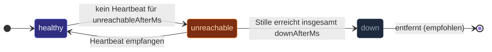
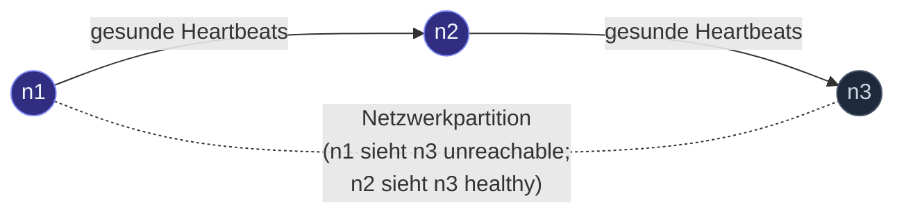

Ein geclusterter Actor-System muss sich **darauf einigen, wer
lebt**. Der Failure Detector ist die Peer-spezifische
Zustandsmaschine, die entscheidet:


```mermaid
stateDiagram-v2
  direction LR
  [*] --> healthy
  healthy --> unreachable: kein Heartbeat für unreachableAfterMs
  unreachable --> healthy: Heartbeat empfangen
  unreachable --> down: Stille erreicht insgesamt downAfterMs
  down --> [*]: entfernt (empfohlen)
  classDef ok   fill:#312e81,stroke:#818cf8,color:#f1f5f9;
  classDef warn fill:#7c2d12,stroke:#fb923c,color:#fed7aa;
  classDef gone fill:#1e293b,stroke:#475569,color:#94a3b8;
  class healthy ok
  class unreachable warn
  class down gone
```

- **`healthy`** — Heartbeats kommen normal an.
- **`unreachable`** — über dem Schwellwert; der Cluster vermeidet
  es, dorthin zu routen. Offiziell noch Mitglied; kann sich
  erholen.
- **`down`** — über dem längeren Schwellwert; der Cluster
  betrachtet den Peer als endgültig weg. Löst Downing aus.

Der Detector ist **pro Peer** — verschiedene Peers können
gleichzeitig in verschiedenen Zuständen sein. Das Gesamtverhalten
des Clusters (Routing, Sharding, Singleton-Wahl) liest diese
Zustände, um zu entscheiden, was zu tun ist.

## Die Defaults

```ts
{
  heartbeatIntervalMs: 500,    // alle 500ms einen Heartbeat senden
  unreachableAfterMs:  2_000,  // nach 2s Stille als unreachable markieren
  downAfterMs:         5_000,  // nach 5s Stille als down markieren
}
```

Für typische LAN-Cluster (1-10 Nodes, Sub-Millisekunden-Latenz)
funktionieren diese Defaults gut. Sie ergeben:

- **2-Sekunden-Erkennungsfenster** für "dieser Peer hat
  möglicherweise Probleme."
- **5-Sekunden-Entscheidungsfenster** für "dieser Peer ist endgültig
  weg."

## Tuning

Überschreibe über das `failureDetector`-Feld in den
Cluster-Settings:

```ts
const clusterOptions = ClusterOptions.create()
  .withHost(host)
  .withPort(port)
  .withSeeds(seeds)
  .withFailureDetector({
    heartbeatIntervalMs: 1_000,
    unreachableAfterMs:  5_000,
    downAfterMs:         15_000,
  });
Cluster.join(
  system,
  clusterOptions,
);
```

Wann tunen:

| Workload | Richtung |
| --- | --- |
| Cluster über Regionen hinweg (hohe RTT) | Alle drei erhöhen. 100 ms RTT bedeuten, dass ein einzelner verpasster Heartbeat normales Rauschen ist. |
| Lokales Docker-Compose (Sub-ms RTT) | Verringern für schnellere Failover-Tests. Vor dem Deploy für Produktion wieder hochstellen. |
| Netzwerk mit periodischen Aussetzern | `unreachableAfterMs` erhöhen, um Fehlalarme zu vermeiden, aber `downAfterMs` größer halten, damit ein echter Ausfall trotzdem erkannt wird. |
| Kostensensitiv (chatty Heartbeats) | `heartbeatIntervalMs` erhöhen — bei 5s-Intervallen sind Gossip + Heartbeat < 1KB/s pro Peer. |

Das Verhältnis `downAfterMs / unreachableAfterMs` (Standard ~2.5x)
ist das **Flap-Toleranzfenster**: ein als unreachable markierter
Peer kann sich zurück auf healthy erholen, ohne downed zu werden,
solange ein Heartbeat innerhalb der Differenz eintrifft.

## Heartbeats sind implizit

```
Jeder Gossip-Austausch zählt als Heartbeat.
Jede direkte Nachricht über den Cluster-Transport zählt ebenfalls.
```

Das Framework schickt keine separaten "Ping"-Nachrichten — jeglicher
Cluster-Verkehr von einem Peer setzt dessen Last-Seen-Timestamp
zurück. Gossip ist die zuverlässigste Quelle (regelmäßiges
Intervall), aber Anwendungsnachrichten tragen auch bei.

Das bedeutet: ein Cluster mit sehr gesprächigen Actors bekommt
*besser* Failure Detection (mehr Heartbeats); ein leerlaufender
Cluster ist ganz auf Gossip angewiesen.

## Was der Detector entscheidet — und was nicht

Der Detector gibt `'healthy'` / `'unreachable'` / `'down'` zurück.
Was der Cluster *damit* macht:

| Entscheidung | Cluster-Verhalten |
| --- | --- |
| `healthy` | Normales Routing. Kein Effekt. |
| `unreachable` | Markiere das Mitglied in der Mitgliedertabelle als `unreachable`. Router überspringen es; Sharding allokiert keine neuen Shards mehr darauf. Singleton-Manager wählt keinen Leader von einer unerreichbaren Seite. |
| `down`, [Downing-Strategie](/de/cluster/downing-strategies/) konfiguriert | Markiere das Mitglied als `unreachable` und halte an. Die Strategie entscheidet, welche Adressen entfernt werden; der Cluster verkündet diese Nodes als `removed`. Der Detector entfernt selbst nichts. |
| `down`, keine Strategie konfiguriert | Der Detector entfernt den Peer selbst: erst `down`, dann direkt als `removed` aus der Mitgliedertabelle. |

**Diese beiden Zeilen sind die ganze Geschichte, und welche du
bekommst, entscheidet allein, ob du eine Strategie konfiguriert
hast.** Mit einer ist der Detector das *Signal*, nicht die Aktion —
er parkt den Peer auf `unreachable`, und die Strategie besitzt die
Entfernung. Ohne eine schlichtet nichts, und dass der Detector den
Peer bei `down-after` entfernt, ist das einzige Failover, das du
hast: nur so werden Shards neu verteilt und ein Singleton
übergeben. Das ist bequem für einen einzelnen abgestürzten Node und
falsch für eine Partition, wo beide Hälften die jeweils andere
entfernen und weiterlaufen. Eine Strategie zu konfigurieren, ist
der Weg, das eine durch das andere zu ersetzen.

### Ein geparktes Mitglied bleibt geparkt

Mit konfigurierter Strategie bleibt ein Mitglied, über das die
Strategie nie zu einem Urteil kommt, **unbegrenzt** `unreachable`.
Dahinter steht bewusst kein Auffangnetz des Detectors: ein
Auffangnetz ist genau die Umgehung, die die Strategie verhindern
soll, und eines, das nach einem Vielfachen von `down-after`
auslöst, verschiebt die Umgehung nur nach hinten.

Das hat Konsequenzen, die man einplanen sollte. Das Mitglied
belegt weiterhin seinen Platz gegen `max-members`. Der
`ClusterSingletonManager` übergibt nicht, denn er reagiert auf
`MemberDown` / `MemberLeft` / `MemberRemoved` und bewusst nicht auf
`MemberUnreachable` — der Detector eines einzelnen Nodes ist keine
Mitgliedschaftstatsache, auf die sich der Cluster geeinigt hat. Der
`ShardCoordinator` verteilt nicht neu, denn er hört nur auf
`MemberRemoved`. Und eine geheilte Partition holt das Mitglied
derzeit nicht nach `up` zurück: Gossip und Heartbeats gehen nur an
erreichbare Mitglieder, also spricht keine Seite die andere je
wieder an.

Das ist Integrität vor Verfügbarkeit, und zwar mit Absicht. Wähle
eine Strategie, die auf deiner Cluster-Form immer zu einem Urteil
kommt — eine ungerade Mitgliederzahl für `KeepMajority`, einen
Schiedsrichter oder ein Lease für eine gerade — statt einer, die
für immer "pending" antworten kann.

## Die Sicht des lokalen Nodes

Jeder Node fährt seinen eigenen Detector und beobachtet seine
eigenen Peers. Das bedeutet, dass **zwei Nodes uneins sein
können**, ob ein dritter erreichbar ist:


```mermaid
flowchart LR
  N1((n1))
  N2((n2))
  N3((n3))
  N1 -- "gesunde Heartbeats" --> N2
  N2 -- "gesunde Heartbeats" --> N3
  N1 -. "Netzwerkpartition<br/>(n1 sieht n3 unreachable;<br/>n2 sieht n3 healthy)" .- N3
  classDef ok  fill:#312e81,stroke:#818cf8,color:#f1f5f9;
  classDef mid fill:#1e293b,stroke:#475569,color:#cbd5e1;
  class N1,N2 ok
  class N3 mid
```

Der Cluster-Gossip propagiert diese pro-Node-Beobachtungen. Ein
Mitglied gilt global als unreachable, wenn *genug* Peers es so
melden — der Schwellwert ist in manchen Downing-Strategien
konfigurierbar (siehe KeepMajority, KeepReferee).

## Eigener Failure Detector

Der eingebaute Detector des Clusters ist bewusst einfach — einfache
Zeitschwellen, kein Tracking statistischer Varianz. Für LAN-Skala
reicht das aus. Die `failureDetector`-Cluster-Option stellt nur seine
Schwellwerte ein — sie nimmt `Partial<FailureDetectorOptionsType>`
(die drei `*Ms`-Stellschrauben oben), keine Detector-Instanz; es gibt
also keinen "eigenen Detector einhängen"-Hook an `Cluster.join`.

Falls dein Netzwerk Phi-Accrual braucht (varianzbewusst, adaptive
Schwellwerte), bringt das Framework bereits einen mit:
`PhiAccrualFailureDetector` (mit `PhiAccrualOptions`) ist eine
öffentliche, exportierte Klasse, die die Verteilung der jüngsten
Zwischenankunftszeiten verfolgt und einen kontinuierlichen
Verdachtswert erzeugt. Er ist noch nicht als auswählbarer Detector
in den Cluster eingebunden — der Cluster fährt immer den einfachen
`FailureDetector` — daher nutzt du ihn vorerst eigenständig.

## Failure-Detector-Entscheidungen diagnostizieren

```ts
import { MemberUnreachable, MemberReachable } from 'actor-ts/cluster';

cluster.subscribe((evt) => {
  if (evt instanceof MemberUnreachable) {
    console.log(`${evt.member.address} als unreachable markiert`);
  } else if (evt instanceof MemberReachable) {
    console.log(`${evt.member.address} wieder als reachable markiert`);
  }
});
```

Abonniere die Cluster-Events für Sichtbarkeit. In Produktion
verdrahte das in Metriken — ein Histogramm der
"unreachable-Dauern" zeigt, ob der Schwellwert dem tatsächlichen
Aussetzerprofil deines Netzwerks entspricht.

### `ReachabilityChanged` — was *diese* Node sieht

`MemberUnreachable` ist ein Mitgliedschaftsübergang, und das macht es
zum falschen Signal für zwei Fragen, die es zu beantworten scheint:

- **Es muss nicht die Beobachtung dieser Node sein.** Der
  Member-Status wandert per Gossip, also feuert `MemberUnreachable`
  auch für einen Peer, von dem *jemand anderes* nichts mehr hört,
  während die eigenen Heartbeats dorthin normal ankommen.
- **Es feuert nur für ein Member, das `up` war.** Ein Peer, der
  während `joining`, `weakly-up` oder `leaving` verstummt, erzeugt gar
  kein Reachability-Event — das Nächste, was du von ihm hörst, ist die
  Entfernung.

`ReachabilityChanged` ist das eigene Urteil des lokalen Detectors, ohne
beide Einschränkungen:

```ts
import { ReachabilityChanged } from 'actor-ts/cluster';

cluster.subscribe((evt) => {
  if (evt instanceof ReachabilityChanged) {
    peerHealth.gauge({ peer: evt.address.toString() }).set(evt.reachable ? 1 : 0);
  }
});
```

Es feuert **nur bei Übergängen** — einmal, wenn der Detector einen Peer
aus den Augen verliert, einmal, wenn er ihn wiedersieht — und nie für
einen Peer, der seit dem ersten Kontakt gesund war. Das Urteil wird
einmal pro `heartbeatIntervalMs` neu berechnet und kippt bei
`unreachableAfterMs`, ist also die früheste Warnung des Detectors,
lange vor jeder Downing-Entscheidung.

Dieses Urteil gegen den gegossipten `status` des Members zu halten, ist
der Weg, eine Partition von einem toten Peer zu unterscheiden: eine
Node, die alle anderen noch erreichen, ist ein Leitungs- und kein
Host-Problem. Das Event trägt keine Observer-Menge — *"welche anderen
Nodes erreichen X ebenfalls nicht"* bräuchte eine Observer-zu-Subjekt-
Tabelle auf dem Draht, und Gossip trägt eine flache Member-Liste.

import { Aside } from '@astrojs/starlight/components';

<Aside type="caution" title="Defaults sind LAN-Defaults">
  ```ts
  // ✗ unreachable in 2s — zu aggressiv für ein WAN mit 100ms RTT
  const clusterOptions = ClusterOptions.create()
    .withHost(host)
    .withPort(port)
    .withSeeds(seeds);
  Cluster.join(system, clusterOptions);   // nutzt Defaults
  ```
  Cluster über Regionen hinweg brauchen mindestens 5-10 Sekunden für
  `unreachableAfterMs`; eine 100ms-RTT-Strecke mit normalem Jitter
  erzeugt "verpasste" Heartbeats, die den 2s-Schwellwert
  überschreiten. Für jedes Nicht-LAN-Deployment hochtunen.
</Aside>

<Aside type="caution" title="`down` ist nicht dasselbe wie endgültig-weg">
  Die `down`-Entscheidung des Detectors ist statistisch — basiert
  auf vergangener Stille. Ein Peer, der nur langsam, aber sich
  erholend ist, kann als `down` markiert werden und dann wiederkommen.
  Ohne Downing-Strategie handelt der Detector selbst nach dieser
  Vermutung und entfernt den Peer — eine GC-Pause, die lang genug
  ist, um `down-after` zu überschreiten, kostet dich also einen
  Node. Mit einer Strategie ist die Vermutung nur eine Eingabe: die
  Strategie wägt sie gegen die übrige Sicht des Clusters ab, bevor
  irgendetwas entfernt wird. Konfiguriere eine Downing-Strategie.
</Aside>

<Aside type="caution" title="Enge Schwellwerte in unruhigen Netzwerken">
  ```ts
  failureDetector: { unreachableAfterMs: 200, downAfterMs: 500 }
  ```
  Aggressive Schwellwerte erkennen Ausfälle schnell, erzeugen aber
  Fehlalarme bei kurzen Verzögerungen — ein Peer, der kurz GC macht,
  wird als unreachable markiert, der Cluster reagiert, und bis die
  GC fertig ist, hat sich das Routing schon verschoben. Für die
  meisten Produktions-Cluster sind die Defaults (2s/5s) schon
  aggressiv genug.
</Aside>

## Wohin als Nächstes

- **[Cluster-Überblick](/de/cluster/overview/)** — die
  Mitgliedschafts-Zustandsmaschine, die der Detector speist.
- **[Downing-Strategien](/de/cluster/downing-strategies/)** —
  was *nach* der `down`-Entscheidung des Detectors passiert.
- **[Joining und Seeds](/de/cluster/joining-and-seeds/)** —
  wie Peers erstmals in der Mitgliedertabelle auftauchen.
- **[Konfiguration](/de/reference/configuration/)** — die
  HOCON-Keys (`actor-ts.cluster.failure-detector.*`).
- **[Failure-Detector-Tuning](/de/operations/tuning/failure-detector/)** —
  die operativ ausgerichtete Tuning-Seite.

Die [`FailureDetector`](/api/classes/failuredetector/)
API-Referenz deckt die vollständige Oberfläche ab.
