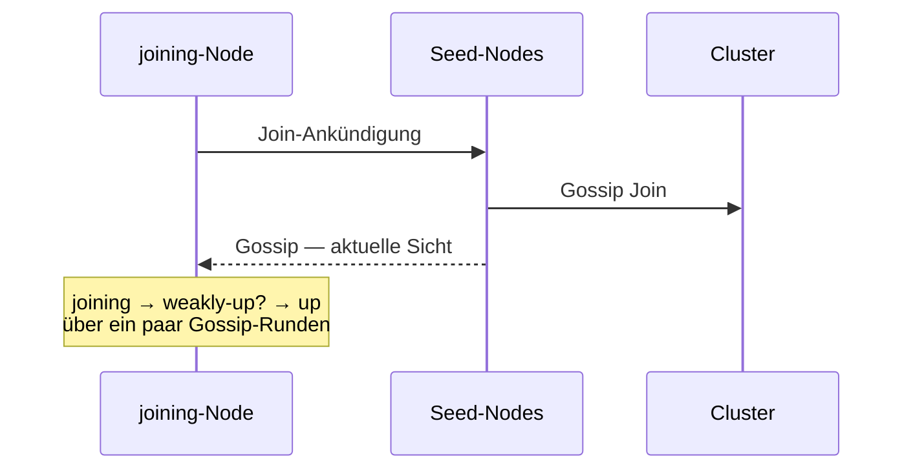
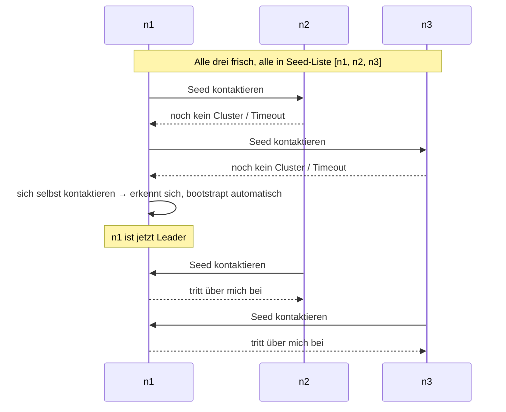

Ein Node tritt einem Cluster bei, indem er **einen Seed-Node
kontaktiert**. Der Seed sendet per Gossip seine aktuelle
Mitgliedschaftssicht zurück; der Joiner wird als `joining`
hinzugefügt, propagiert per Gossip, und sobald der Leader ihn sieht
(plus Konvergenz), wechselt er zu `up`.



Diese Seite behandelt die **Mechanik** dieses Handshakes plus die
Seed-Discovery-Ebene darüber.

## Der einfachste Fall — explizite Seeds

```ts
import { ActorSystem, Cluster, ClusterOptions } from 'actor-ts';

const system = ActorSystem.create('my-app');

const clusterOptions = ClusterOptions.create()
  .withHost('10.0.0.5')
  .withPort(2552)
  .withSeeds(['10.0.0.5:2552', '10.0.0.6:2552', '10.0.0.7:2552']);
const cluster = await Cluster.join(
  system,
  clusterOptions,
);
```

Drei Seeds. Der Joiner kontaktiert sie der Reihe nach, bis einer
antwortet. Sobald irgendein Seed akzeptiert, propagiert der Gossip
des Clusters das neue Mitglied; Konvergenz zu `up` geschieht
innerhalb weniger Sekunden in einem gesunden Netzwerk.

Die Seed-Liste ist nur ein **Bootstrap-Hinweis** — sobald der Node
beigetreten ist, lernt er alle anderen Peers per Gossip kennen.
Seeds müssen nach dem Join nicht mehr besonders sein.

## Konfiguration

```ts
interface ClusterSettings {
  host:                       string;       // Adresse dieses Nodes
  port:                       number;       // TCP-Port dieses Nodes
  seeds?:                     string[];     // Peer-Adressen fürs Bootstrap
  roles?:                     string[];     // Rollen-Tags
  failureDetector?:           Partial<...>;
  transport?:                 Transport;
  gossipIntervalMs?:          number;
  seedRetryIntervalMs?:       number;       // Retry-Intervall, falls kein Seed antwortet
  // ...
}
```

Die seed-bezogenen Knöpfe:

| Einstellung | Standard | Was |
| --- | --- | --- |
| `seeds` | `[]` | Liste von `"host:port"`-Strings. Leer = "ich bin der erste". |
| `seedRetryIntervalMs` | 3000 | Falls kein Seed antwortet, wiederhole die Liste so oft, bis einer antwortet. |

## Der erste Node

```ts
const clusterOptions = ClusterOptions.create()
  .withHost('0.0.0.0')
  .withPort(2552)
  .withSeeds([]);
const cluster = await Cluster.join(
  system,
  clusterOptions,
);
```

Eine leere `seeds`-Liste (oder eine, die komplett unerreichbar ist)
bedeutet, dass **dieser Node den Cluster selbst bootstrapt**. Er
befördert sich automatisch zum Leader; künftige Joiner kontaktieren
*ihn*.

Das macht die Single-Node-Entwicklung trivial — keine zu pflegende
Seed-Liste. Füge später einen zweiten Node hinzu, indem du ihm die
Adresse des ersten als Seed gibst.

**Für Produktion** gib jedem Node dieselbe Seed-Liste (3-5 Adressen,
idealerweise bekannte Nodes, von denen du keinen Wechsel erwartest).
Reihenfolge spielt keine Rolle; der Joiner probiert jeden.

## Selbst-seedende Nodes — das Bootstrap-Rennen



Wenn ein Cluster aus dem Kaltstart hochfährt (alle Nodes kommen
gleichzeitig hoch), liefern sich die Joiner ein Rennen. Die
Seed-Retry-Logik des Frameworks regelt das:

- Jeder Node wiederholt seine Seed-Liste in `seedRetryIntervalMs`.
- Irgendwann kontaktiert ein Node zuerst sich selbst; das ist der
  Bootstrap.
- Der Rest konvergiert auf den jetzt existierenden Cluster.

Der Standard-Retry von 3 Sekunden macht die Kaltstart-Konvergenz in
wenigen Runden zuverlässig.

## Seed-Discovery — jenseits einer statischen Liste

Eine hartcodierte Seed-Liste reicht für Tests und kleine Cluster.
Für Produktion, in der Nodes dynamische IPs haben (Container, K8s
Pods), nutze einen **Seed-Provider**:

| Provider | Wann |
| --- | --- |
| **[Config](/de/discovery/seed-providers/config/)** | Statische Liste (der Fall oben). |
| **[DNS](/de/discovery/seed-providers/dns/)** | Löst `_actor-ts._tcp.example.com` SRV-Records auf. |
| **[Kubernetes API](/de/discovery/seed-providers/kubernetes-api/)** | Listet Pods, die einem Label-Selector entsprechen. |
| **[Aggregate](/de/discovery/seed-providers/aggregate/)** | Fällt durch mehrere Provider durch (z. B. K8s, dann DNS). |

```ts
import { KubernetesApiSeedProvider, KubernetesApiSeedProviderOptions } from 'actor-ts/discovery';

const kubernetesApiSeedProviderOptions = KubernetesApiSeedProviderOptions.create()
  .withNamespace('default')
  .withServiceName('actor-ts')
  .withPort(2552);
const seedProvider = new KubernetesApiSeedProvider(
  kubernetesApiSeedProviderOptions,
);

const seeds = await seedProvider.discover();

const clusterOptions = ClusterOptions.create()
  .withHost(process.env.POD_IP!)
  .withPort(2552)
  .withSeeds(seeds);
const cluster = await Cluster.join(
  system,
  clusterOptions,
);
```

Der Provider liefert eine Momentaufnahme von Seed-Adressen; das
Framework nutzt sie, um den Join zu bootstrappen. Siehe
[Discovery-Überblick](/de/discovery/overview/) für das Seed-Provider-Modell.

## Den Join-Fortschritt beobachten

```ts
import { SelfUp, MemberUp } from 'actor-ts';

cluster.subscribe(SelfUp, (evt) => {
  console.log(`dieser Node ist jetzt Up`);
});

cluster.subscribe(MemberUp, (evt) => {
  console.log(`Peer ${evt.member.address} hat Up erreicht`);
});
```

Zwei zentrale Events:

- **`SelfUp`** feuert einmal, wenn *dieser* Node auf `up`
  übergeht. Nützliches Gate, um Arbeit zu starten, die
  Cluster-Mitgliedschaft erfordert.
- **`MemberUp`** feuert jedes Mal, wenn *irgendein* Mitglied `up`
  erreicht.

Für Startup-Logik, die andere Mitglieder braucht ("warte, bis
mindestens 3 Nodes up sind, bevor Traffic bedient wird"), zähle
`MemberUp`s nach `SelfUp`.

## Was schiefgehen kann

import { Aside } from '@astrojs/starlight/components';

<Aside type="caution" title="Seeds unerreichbar, sich selbst nicht in der Liste">
  ```ts
  // ✗ dieser Node ist kein Seed, kein anderer Seed antwortet
  const clusterOptions = ClusterOptions.create()
    .withHost('n4')
    .withPort(2552)
    .withSeeds(['n1', 'n2', 'n3']);
  Cluster.join(system, clusterOptions);
  ```
  Der Join wiederholt sich unendlich (auf dem Standard-Loglevel
  still). Falls die Seed-Liste tatsächlich unerreichbar ist, tritt
  der Node nie bei. Entweder nimm diesen Node in die Seed-Liste auf
  (jeder ist ein Seed), oder implementiere Health-Checks, die "kein
  Cluster beigetreten" als Alert sichtbar machen.
</Aside>

<Aside type="caution" title="Zwei Cluster bilden sich mit demselben Namen">
  ```ts
  // Netzwerkpartition direkt beim Start:
  // - n1, n2 erreichen sich → bilden Cluster
  // - n3 kann sie nicht erreichen → bootstrapt eigenen Cluster
  // - Partition heilt → zwei Cluster mit demselben Namen existieren
  ```
  Sobald die Partition geheilt ist, *merged* das Gossip-Protokoll
  die beiden Cluster nicht automatisch — sie sind unabhängig.
  Mildere das mit einer Downing-Strategie
  ([Downing-Strategien](/de/cluster/downing-strategies/)) und
  **bootstrappe nach Möglichkeit nicht während einer Partition**
  (nutze eine Seed-Strategie, die fail-fast statt
  selbst-bootstrap-bei-keiner-Antwort verfährt — siehe Weakly-up).
</Aside>

<Aside type="caution" title="Hostname-vs-IP-Mismatch">
  ```ts
  // Joiner sieht Seed als `pod-abc-123.cluster.local`
  // Seed sieht sich selbst als `10.244.1.5`
  // → Gossips Adressvergleich behandelt sie als verschiedene Mitglieder
  ```
  Die Mitglieder-Identität nutzt die **Adresse, die der Node beim
  Join angegeben hat**. Wenn verschiedene Peers verschiedene
  Adressen für denselben Node sehen (typisch in K8s mit
  Hostnames), bildet sich der Cluster zwar, aber jeder Node sieht
  den Peer als Fremden. Verwende den K8s-Seed-Provider, der
  konsistent auf Pod-IPs auflöst, oder setze `host` auf die IP
  statt auf den Hostnamen.
</Aside>

## Wohin als Nächstes

- **[Cluster-Überblick](/de/cluster/overview/)** — das größere
  Bild.
- **[Weakly-up](/de/cluster/weakly-up/)** — Gradual-Join-Semantik
  für langsame Konvergenz.
- **[Failure Detector](/de/cluster/failure-detector/)** — wie
  Heartbeats die Mitgliedschaftssicht nach dem Join frisch halten.
- **[Discovery-Überblick](/de/discovery/overview/)** — Seed-Provider
  für dynamische Umgebungen.
- **[Downing-Strategien](/de/cluster/downing-strategies/)** —
  Split-Brain-Auflösung nach der Cluster-Bildung.
