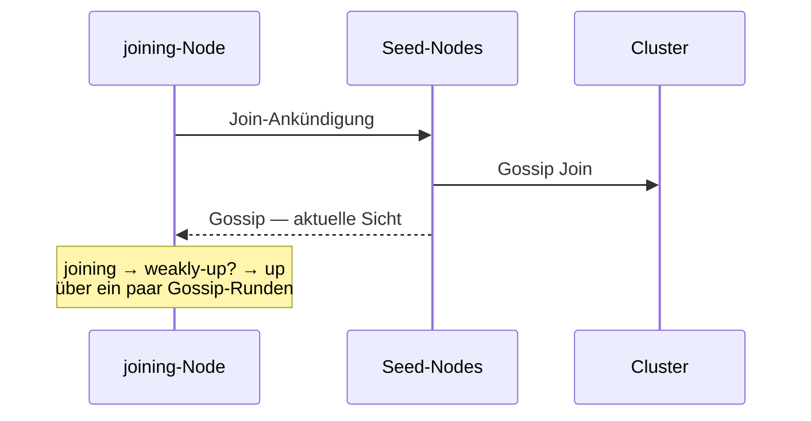
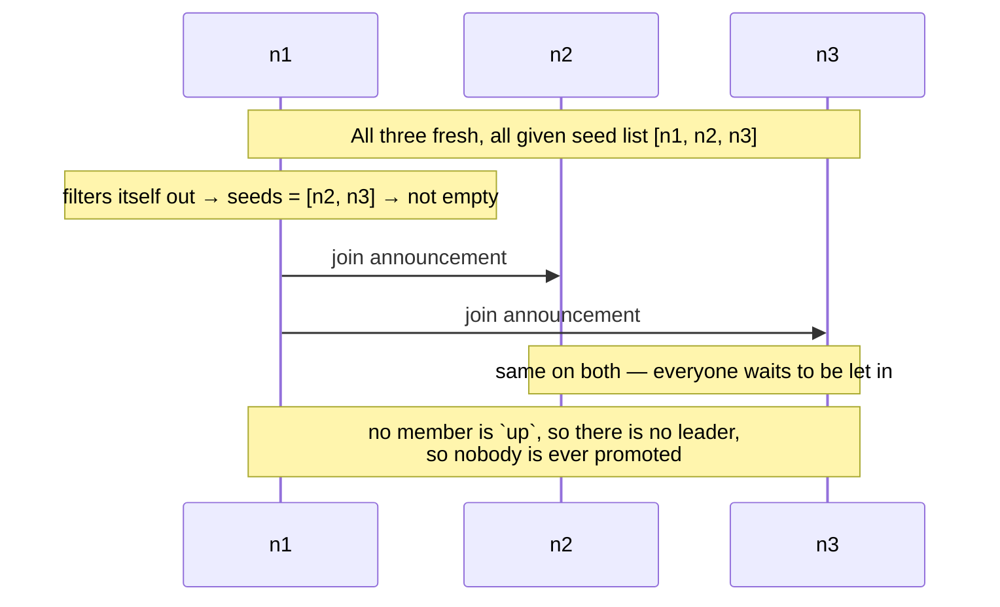

Ein Node tritt einem Cluster bei, indem er **einen Seed-Node
kontaktiert**. Der Seed sendet per Gossip seine aktuelle
Mitgliedschaftssicht zurück; der Joiner wird als `joining`
hinzugefügt, propagiert per Gossip, und sobald der Leader ihn sieht
(plus Konvergenz), wechselt er zu `up`.


```mermaid
sequenceDiagram
  participant J as joining-Node
  participant S as Seed-Nodes
  participant C as Cluster
  J->>S: Join-Ankündigung
  S->>C: Gossip Join
  S-->>J: Gossip — aktuelle Sicht
  Note over J: joining → weakly-up? → up<br/>über ein paar Gossip-Runden
```

Diese Seite behandelt die **Mechanik** dieses Handshakes plus die
Seed-Discovery-Ebene darüber.

## Der einfachste Fall — explizite Seeds

```ts
import { ActorSystem } from 'actor-ts';
import { Cluster, ClusterOptions } from 'actor-ts/cluster';

const system = ActorSystem.create('my-app');

const clusterOptions = ClusterOptions.create()
  .withHost('10.0.0.5')
  .withPort(2552)
  .withSeeds(['10.0.0.5:2552', '10.0.0.6:2552', '10.0.0.7:2552']);
const cluster = await Cluster.join(
  system,
  clusterOptions,
);
```

Drei Seeds. Der Joiner kontaktiert sie der Reihe nach, bis einer
antwortet. Sobald irgendein Seed akzeptiert, propagiert der Gossip
des Clusters das neue Mitglied; Konvergenz zu `up` geschieht
innerhalb weniger Sekunden in einem gesunden Netzwerk.

Die Seed-Liste ist nur ein **Bootstrap-Hinweis** — sobald der Node
beigetreten ist, lernt er alle anderen Peers per Gossip kennen.
Seeds müssen nach dem Join nicht mehr besonders sein.

## Konfiguration

```ts
type ClusterOptionsType = {
  host:                       string;       // Interface zum Binden (Wildcard ok)
  advertisedHost?:            string;       // Adresse, die Peers wählen (nie Wildcard)
  port:                       number;       // Port zum Binden
  advertisedPort?:            number;       // Port, den Peers wählen (default: port)
  seeds?:                     string[];     // Peer-Adressen fürs Bootstrap
  roles?:                     string[];     // Rollen-Tags
  failureDetector?:           Partial<...>;
  transport?:                 Transport;
  gossipIntervalMs?:          number;
  seedRetryIntervalMs?:       number;       // Retry-Intervall, falls kein Seed antwortet
  // ...
};
```

Die seed-bezogenen Knöpfe:

| Einstellung | Standard | Was |
| --- | --- | --- |
| `seeds` | `[]` | Liste von `"host:port"`-Strings. Leer = "ich bin der erste". |
| `seedRetryIntervalMs` | 3000 | Falls kein Seed antwortet, wiederhole die Liste so oft, bis einer antwortet. |
| `selfElection` | `'immediate'` | Wann dieser Node allein einen Cluster bilden darf: `'immediate'` (nur bei leerer Seed-Liste), `'never'`, oder eine Frist in Millisekunden. Wird vom [Cluster-Bootstrap](/de/cluster/cluster-bootstrap/) gesetzt. |

## Der erste Node

```ts
const clusterOptions = ClusterOptions.create()
  .withHost('0.0.0.0')
  .withPort(2552)
  .withSeeds([]);
const cluster = await Cluster.join(
  system,
  clusterOptions,
);
```

`0.0.0.0` ist dort die *Bind*-Adresse. Was dieser Node per Gossip
verteilt, wird getrennt aufgelöst und ist nie eine Wildcard — ohne
weitere Konfiguration verteilt er `127.0.0.1`, was für einen
Single-Node-Entwicklungslauf genau richtig ist und der Grund, warum
das Paar keine Beachtung braucht, solange es keine zweite Maschine
gibt. Siehe [Cluster — Überblick](/de/cluster/overview/).

Eine leere `seeds`-Liste (oder eine, die komplett unerreichbar ist)
bedeutet, dass **dieser Node den Cluster selbst bootstrapt**. Er
befördert sich automatisch zum Leader; künftige Joiner kontaktieren
*ihn*.

Das macht die Single-Node-Entwicklung trivial — keine zu pflegende
Seed-Liste. Füge später einen zweiten Node hinzu, indem du ihm die
Adresse des ersten als Seed gibst.

**Für Produktion** bestimme einen Node mit leerer Seed-Liste und gib
den übrigen dessen Adresse — oder, besser, nutze den
[Cluster-Bootstrap](/de/cluster/cluster-bootstrap/), der einen
festgelegten ersten Node überflüssig macht.

## Die symmetrische Seed-Liste startet nicht kalt

Es liegt nahe, jedem Node dieselbe Liste mit allen Nodes zu geben.
Diese Konfiguration **bildet nie einen Cluster**:


```mermaid
sequenceDiagram
  participant N1 as n1
  participant N2 as n2
  participant N3 as n3
  Note over N1,N3: All three fresh, all given seed list [n1, n2, n3]
  Note over N1: filters itself out → seeds = [n2, n3] → not empty
  N1->>N2: join announcement
  N1->>N3: join announcement
  Note over N2,N3: same on both — everyone waits to be let in
  Note over N1,N3: no member is `up`, so there is no leader,<br/>so nobody is ever promoted
```

`Cluster` entfernt die eigene Adresse aus der Seed-Liste, also bleibt
bei einer symmetrischen Liste **keinem** Node die leere Liste, die
`selfElection: 'immediate'` verlangt. Jeder Node bleibt für immer
`joining`; es gibt keinen Leader, und der Leader ist es, der
`joining → up` befördert.

Zwei Auswege:

- **Ein festgelegter erster Node** mit `seeds: []`, der Rest zeigt auf
  ihn. Einfach, aber dieser Node ist beim Start etwas Besonderes — was
  Container und Autoscaler unhandlich machen.
- **[Cluster-Bootstrap](/de/cluster/cluster-bootstrap/)** — jeder Node
  bekommt dieselbe Konfiguration, und das Framework wählt genau einen
  aus, der den Gleichstand bricht. Das ist die Wahl, sobald Nodes
  gleichzeitig starten.

Die Retry-Schleife über `seedRetryIntervalMs` bleibt wichtig, löst aber
ein anderes Problem: einen Seed, der *irgendwann* erreichbar ist. Ein
erstes Mitglied kann sie nicht herbeizaubern.

Sie trägt aber die Diagnose. Ein Node, der nach ein paar Kontaktrunden
immer noch `joining` ist, kein `up`-Mitglied kennt und auf keine
Selbstwahl mehr wartet, loggt eine WARN-Zeile, die benennt, was er sieht
und was zu ändern ist — die unbeantworteten Seed-Adressen, wenn niemand
geantwortet hat, oder die Kombination aus Seed-Liste und `selfElection`
von oben, wenn alle Peers da sind und alle warten. Sie erscheint einmal,
nicht pro Runde.

Diese Zeile ist deshalb wichtig, weil das *Symptom* weit von der Ursache
entfernt auftritt: einem so blockierten Cluster fehlt jedes `up`-Mitglied,
ein [Cluster-Singleton](/de/cluster/singleton/overview/) wählt seinen Host
aus den `up`-Mitgliedern, und das Erste, was die meisten Anwendungen
bemerken, ist deshalb ein `AskTimeoutError` von einem Singleton-Proxy.

## Seed-Discovery — jenseits einer statischen Liste

Eine hartcodierte Seed-Liste reicht für Tests und kleine Cluster.
Für Produktion, in der Nodes dynamische IPs haben (Container, K8s
Pods), nutze einen **Seed-Provider**:

| Provider | Wann |
| --- | --- |
| **[Config](/de/discovery/seed-providers/config/)** | Statische Liste (der Fall oben). |
| **[DNS](/de/discovery/seed-providers/dns/)** | Löst `_actor-ts._tcp.example.com` SRV-Records auf. |
| **[Kubernetes API](/de/discovery/seed-providers/kubernetes-api/)** | Listet Pods, die einem Label-Selector entsprechen. |
| **[Aggregate](/de/discovery/seed-providers/aggregate/)** | Fällt durch mehrere Provider durch (z. B. K8s, dann DNS). |

```ts
import { KubernetesApiSeedProvider, KubernetesApiSeedProviderOptions } from 'actor-ts/discovery';

const kubernetesApiSeedProviderOptions = KubernetesApiSeedProviderOptions.create()
  .withNamespace('default')
  .withServiceName('actor-ts')
  .withPort(2552);
const seedProvider = new KubernetesApiSeedProvider(
  kubernetesApiSeedProviderOptions,
);

const seeds = await seedProvider.discover();

const clusterOptions = ClusterOptions.create()
  .withHost(process.env.POD_IP!)
  .withPort(2552)
  .withSeeds(seeds);
const cluster = await Cluster.join(
  system,
  clusterOptions,
);
```

Der Provider liefert eine Momentaufnahme von Seed-Adressen; das
Framework nutzt sie, um den Join zu bootstrappen. Siehe
[Discovery-Überblick](/de/discovery/overview/) für das Seed-Provider-Modell.

## Den Join-Fortschritt beobachten

Zuerst das Ein-Aufruf-Gate — `awaitReady` löst auf, sobald dieser Node
`up` ist und, mit `minimumMembers`, sobald das Cluster seine erwartete
Größe erreicht hat; `isReady` ist die synchrone Probe:

```ts
await cluster.awaitReady({ minimumMembers: 3, timeoutMs: 30_000 });
cluster.isReady();     // probe the same predicate without waiting
cluster.selfMember();  // this node's own record — status included
```

Mit gesetztem `timeoutMs` lehnt es mit `ClusterReadyTimeoutError` ab,
statt raten zu lassen; ohne wartet es unbegrenzt. Siehe
[Cluster-Bootstrap → Auf Readiness warten](/de/cluster/cluster-bootstrap/#auf-readiness-warten)
dafür, wie `Cluster.bootstrap` dasselbe Warten standardmäßig anwendet.

Für Logik, die auf *einzelne* Übergänge reagiert, die Events
abonnieren:

```ts
import { SelfUp, MemberUp } from 'actor-ts/cluster';

cluster.subscribe((evt) => {
  if (evt instanceof SelfUp) {
    console.log(`dieser Node ist jetzt Up`);
  } else if (evt instanceof MemberUp) {
    console.log(`Peer ${evt.member.address} hat Up erreicht`);
  }
});
```

Zwei zentrale Events:

- **`SelfUp`** feuert einmal, wenn *dieser* Node auf `up` übergeht.
- **`MemberUp`** feuert jedes Mal, wenn *irgendein* Mitglied `up`
  erreicht.

`MemberUp`s von Hand zu zählen, um "sind mindestens 3 Nodes up?" zu
beantworten, ist genau das, was `awaitReady({ minimumMembers: 3 })`
ersetzt — die Subscription ist zum Reagieren auf Änderungen da, nicht
als Startup-Gate.

## Einstellungen, die übereinstimmen müssen

Ein Node, der mit einem abweichenden Wert für etwas beitritt, das der
Cluster als einheitlich voraussetzt, scheitert nicht.  Er tritt bei, er
läuft, und die Uneinigkeit zeigt sich später als Verhalten, das niemand
erklären kann.  `actor-ts.cluster.configuration-compatibility-check` sorgt
dafür, dass sie stattdessen in dem Moment ausgesprochen wird, in dem sich
die beiden Nodes begegnen.

Jeder Node veröffentlicht den **effektiven** Wert jeder Einstellung aus
`checked-paths` auf der gewöhnlichen Gossip-Bahn und vergleicht ihn mit dem,
was seine Peers zurückveröffentlichen.  *Effektiv*, nicht konfiguriert: die
Präzedenz ist **explizite Optionen > HOCON > eingebaute Defaults**, deshalb
sind zwei Nodes mit identischen Config-Dateien und unterschiedlichen Buildern
trotzdem ungleich — und genau das ist der Fall, auf den es ankommt, denn der
Builder ist der dokumentierte Weg, die meisten dieser Werte zu setzen.

```ts
const clusterOptions = ClusterOptions.create()
  .withHost('n1')
  .withPort(2552)
  .withConfigurationCompatibilityCheckedPaths([
    'actor-ts.remote.max-frame-bytes',
    'actor-ts.cluster.failure-detector.heartbeat-interval',
  ]);
```

Verglichen werden kann nur, was auch jemand veröffentlicht; das Framework
veröffentlicht drei Einstellungen:

| Einstellung | Warum eine Abweichung zählt | Standardmäßig in `checked-paths` |
| --- | --- | --- |
| `actor-ts.remote.max-frame-bytes` | Ein Frame über der niedrigeren Grenze des Peers reißt die ganze Assoziation ab, und der Sender erfährt nie, warum.  Es gibt keine Protokollverhandlung, die das abfängt. | ja |
| `actor-ts.cluster.failure-detector.heartbeat-interval` | Ein Peer, der langsamer schlägt, als das `down-after` dieses Nodes toleriert, wird gedowned, weil er anders konfiguriert ist — nicht, weil er tot ist. | nein |
| `actor-ts.cluster.tombstone.time-to-live` | Eine Seite räumt einen Tombstone weg, den die andere noch durchsetzt, also wird eine entfernte Adresse nur auf einer Seite wieder zugelassen. | nein |

Die letzten beiden sind standardmäßig aus, weil das schrittweise Ausrollen
eines neuen Werts ein gewöhnlicher Vorgang ist und beide Abweichungen von
selbst heilen.  Für die erste gibt es nirgendwo sonst eine Erkennung — das
ist die Messlatte dafür, voreingestellt zu sein.

Veröffentliche eine eigene von überall dort, wo der aufgelöste Wert vorliegt:

```ts
cluster.publishConfigurationFact('acme.orders.partition-count', String(partitions));
```

Sie reist nur, wenn `checked-paths` den Namen führt — diese Liste ist eine
Erlaubnisliste dessen, was den Node *verlässt*, und genau deshalb gibt es
keine zweite Liste von Pfaden zum Schwärzen.

Sind sich zwei Nodes uneinig, loggt jeder eine Zeile, die die Einstellung und
**beide** Werte nennt, und veröffentlicht ein `MemberConfigurationMismatch`
mit demselben Inhalt.  Einmal pro Einstellung pro Peer, nicht einmal pro
Gossip-Runde.  Abwesenheit auf einer der beiden Seiten ist Schweigen: ein
Peer mit älterer Version, oder einer, dessen `checked-paths` diese
Einstellung nicht führt, meldet nichts — statt während eines Rolling
Upgrades alles zu melden.

`enforce = on` fügt genau eine Sache hinzu: der abweichende Peer ist kein
Platzierungskandidat dieses Nodes mehr, ein Cluster-Router routet also nicht
mehr zu ihm.  Es downed oder quarantäniert niemanden, und nichts, das eine
Rolle *wählt*, liest diese Menge: eine falsch konfigurierte Mehrheit würde
sonst die korrekt konfigurierte Minderheit verdrängen, und eine asymmetrische
Kandidatensicht würde zwei Singleton-Hosts wählen statt einem.  Standardmäßig
aus, denn ein durchsetzender Default macht aus jedem Rolling Deploy, der
einen geprüften Wert ändert, einen selbstverschuldeten Ausfall.

`actor-ts.sharding.number-of-shards` ist bewusst **keine** der
veröffentlichten Einstellungen.  Eine Region, deren Shard-Anzahl von der des
Koordinators abweicht, wird bereits rundheraus abgelehnt — mit einem Error,
der den Key nennt, und einem `ShardRegionRegistrationRefused`-Event, siehe
[Sharding-Introspektion](/de/cluster/sharding/introspection/).

## Was schiefgehen kann

import { Aside } from '@astrojs/starlight/components';

<Aside type="caution" title="Seeds unerreichbar, sich selbst nicht in der Liste">
  ```ts
  // ✗ dieser Node ist kein Seed, kein anderer Seed antwortet
  const clusterOptions = ClusterOptions.create()
    .withHost('n4')
    .withPort(2552)
    .withSeeds(['n1', 'n2', 'n3']);
  Cluster.join(system, clusterOptions);
  ```
  Der Join wiederholt sich unendlich (auf dem Standard-Loglevel
  still). Falls die Seed-Liste tatsächlich unerreichbar ist, tritt
  der Node nie bei. Entweder nimm diesen Node in die Seed-Liste auf
  (jeder ist ein Seed), oder implementiere Health-Checks, die "kein
  Cluster beigetreten" als Alert sichtbar machen.
</Aside>

<Aside type="caution" title="Zwei Cluster bilden sich mit demselben Namen">
  ```ts
  // Netzwerkpartition direkt beim Start:
  // - n1, n2 erreichen sich → bilden Cluster
  // - n3 kann sie nicht erreichen → bootstrapt eigenen Cluster
  // - Partition heilt → zwei Cluster mit demselben Namen existieren
  ```
  Sobald die Partition geheilt ist, *merged* das Gossip-Protokoll
  die beiden Cluster nicht automatisch — sie sind unabhängig.
  Mildere das mit einer Downing-Strategie
  ([Downing-Strategien](/de/cluster/downing-strategies/)) und mit dem
  [Cluster-Bootstrap](/de/cluster/cluster-bootstrap/), der genau einen
  Node berechtigt, einen Cluster zu bilden, und gar nicht erst
  entscheidet, solange Discovery ihre Meinung ändert.
</Aside>

<Aside type="caution" title="Hostname-vs-IP-Mismatch">
  ```ts
  // Joiner sieht Seed als `pod-abc-123.cluster.local`
  // Seed sieht sich selbst als `10.244.1.5`
  // → Gossips Adressvergleich behandelt sie als verschiedene Mitglieder
  ```
  Die Mitglieder-Identität nutzt die **Adresse, die der Node beim
  Join angegeben hat**. Wenn verschiedene Peers verschiedene
  Adressen für denselben Node sehen (typisch in K8s mit
  Hostnames), bildet sich der Cluster zwar, aber jeder Node sieht
  den Peer als Fremden. Verwende den K8s-Seed-Provider, der
  konsistent auf Pod-IPs auflöst, oder setze `host` auf die IP
  statt auf den Hostnamen.
</Aside>

## Wohin als Nächstes

- **[Cluster-Überblick](/de/cluster/overview/)** — das größere
  Bild.
- **[Cluster-Bootstrap](/de/cluster/cluster-bootstrap/)** — Stable
  Observation und Initial-Seed-Wahl für gleichzeitige Starts.
- **[Weakly-up](/de/cluster/weakly-up/)** — Gradual-Join-Semantik
  für langsame Konvergenz.
- **[Failure Detector](/de/cluster/failure-detector/)** — wie
  Heartbeats die Mitgliedschaftssicht nach dem Join frisch halten.
- **[Discovery-Überblick](/de/discovery/overview/)** — Seed-Provider
  für dynamische Umgebungen.
- **[Downing-Strategien](/de/cluster/downing-strategies/)** —
  Split-Brain-Auflösung nach der Cluster-Bildung.
