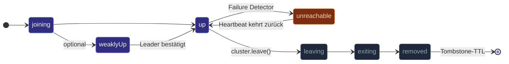

Ein **Cluster** ist eine Gruppe von `ActorSystem`s — typischerweise
eines pro Node — die voneinander wissen. Nodes verteilen ihren
Mitgliedschaftszustand per Gossip, erkennen gegenseitig Ausfälle und
routen Nachrichten über das Netzwerk. Sobald ein Node beigetreten
ist, kann Code auf jedem Node einem Actor auf jedem anderen Node ein
`tell` schicken; der Cluster-Transport versteckt die Leitung.

Zwei Sichtweisen:

- **Aus Sicht der Anwendung**: ein logisches Actor-System,
  verteilt über N Nodes. Ein `ActorRef` kann auf einen Actor auf
  einem beliebigen Node zeigen; derselbe Code, der mit einem Node
  funktioniert hat, funktioniert weiterhin.
- **Aus Sicht der Runtime**: N unabhängige Systeme, die Gossip +
  Heartbeats austauschen, jedes verfolgt, wer am Leben ist, und
  routet Nachrichten über einen gewählten Transport.

## Ein minimales Beispiel

`Cluster.bootstrap` bündelt die vier Schritte, die Du sonst von Hand
verdrahten würdest — das `ActorSystem` erstellen, Seeds auflösen,
`Cluster.join` rufen, `SIGTERM`/`SIGINT` einhängen — in einem
einzigen Aufruf:

```ts
import { Cluster, ClusterBootstrapOptions } from 'actor-ts';

// Lokale Entwicklung — keine Env-Variablen, keine Seeds: Single-Node-Cluster.
const { system, cluster, shutdown } = await Cluster.bootstrap(ClusterBootstrapOptions.create('my-app'));

// Mit expliziten Overrides:
const { system, cluster } = await Cluster.bootstrap(
  ClusterBootstrapOptions.create('my-app')
    .withHost('0.0.0.0')
    .withPort(2552)
    .withSeeds(['node-a:2552', 'node-b:2552'])
    .withRoles(['compute']),
);

// Sobald beigetreten:
cluster.upMembers();                 // → ReadonlyArray<Member> der Up-Nodes
cluster.subscribe((evt) => { /* MemberUp, MemberDown, ... */ });
```

Für volle Kontrolle (eigener Dispatcher, manuelle Signal-Behandlung,
eigene Discovery-Schleife) bleibt das Low-Level-Paar weiter
verfügbar:

```ts
import { ActorSystem, Cluster, ClusterOptions } from 'actor-ts';

const system  = ActorSystem.create('my-app');
const clusterOptions = ClusterOptions.create()
  .withHost('0.0.0.0')
  .withPort(2552)
  .withSeeds(['node-a:2552', 'node-b:2552']);
const cluster = await Cluster.join(
  system,
  clusterOptions,
);
```

Drei Einstellungen leisten die meiste Arbeit:

| Einstellung | Zweck |
| --- | --- |
| `host` + `port` | Die externe Adresse dieses Nodes. Peers kontaktieren ihn hier. |
| `seeds` | Adressen anderer Nodes. Beim Start kontaktiert dieser Node sie, um dem bestehenden Cluster beizutreten. Eine leere Liste = "ich bin der erste" (wird automatisch zum Leader). |
| `roles` | Tags, die dieser Node trägt. Router und Shard-Regionen können danach filtern (`role: 'compute'` überspringt Nodes ohne dieses Tag). |

Nachdem `Cluster.join` aufgelöst ist, befindet sich der Node im
Cluster (möglicherweise aber noch ein paar Sekunden im Zustand
`joining`, bis Konvergenz eintritt).

## Die Mitgliedschaftszustände

Jedes Mitglied durchläuft eine kleine Zustandsmaschine:



- **`joining`** — hat sich gerade angekündigt. Andere Peers wissen
  davon, aber er ist noch nicht routbar.
- **`weakly-up`** *(optional)* — per Gossip sichtbar für Peers, aber
  der Leader hat ihn noch nicht bestätigt. Nützlich für
  partitionstolerante Joins; siehe [Weakly-up](/de/cluster/weakly-up/).
- **`up`** — vollständig im Cluster, routbar. Das ist der
  Normalzustand.
- **`unreachable`** — der Failure Detector hat den Peer als nicht
  heartbeatend markiert. Offiziell weiterhin Mitglied, aber das
  Routing umgeht ihn. Transient; springt zurück auf `reachable`,
  wenn Heartbeats wieder ankommen.
- **`leaving` / `exiting`** — das Mitglied verlässt den Cluster
  geordnet (per `cluster.leave()`).
- **`removed`** — formal aus dem Cluster entfernt. Bleibt für eine
  TTL (Standard 24 h) als Tombstone erhalten, damit veralteter
  Gossip von einem langsamen Peer ihn nicht versehentlich
  wiederbelebt.

Der Event-Stream des Clusters legt jeden Übergang offen — abonniere
`MemberUp` / `MemberRemoved` / `UnreachableMember` etc. und
reagiere.

## Was Gossip macht

Gossip ist der Mechanismus, mit dem sich Mitglieder darauf einigen,
wer im Cluster ist. Alle `gossipIntervalMs` (Standard 500 ms) wählt
jedes Mitglied einen zufälligen erreichbaren Peer und tauscht seine
Sicht auf den Cluster aus. Über ein paar Runden konvergieren alle
Peers auf denselben Zustand — ohne zentralen Koordinator.

Das Protokoll trägt:

- **Mitgliederliste** — Adresse, Status, Rollen und Versionsvektor
  jedes Mitglieds.
- **Erreichbarkeitsbeobachtungen** — "ich habe von X länger nichts
  gehört."

Zwei Peers, die Gossip austauschen, mergen ihre Tabellen, indem sie
die **höhere Version** für jedes Mitglied wählen. Genau das lässt
Konvergenz ohne leader-gewählten Koordinator funktionieren: jedes
parallele Update wird schließlich von jedem Peer gesehen.

Für den tiefen Einstieg siehe
[Joining und Seeds](/de/cluster/joining-and-seeds/).

## Was der Failure Detector macht

Das Framework verwendet einen **Phi-Accrual**-Failure-Detector.
Jedes Mitglied führt eine Heartbeat-Historie pro Peer; wenn die
Heartbeats eines Peers innerhalb eines statistischen Fensters
ausbleiben, markiert der Detector ihn als verdächtig.

- **`unreachableAfterMs`** — sobald der Verdacht den Schwellwert
  diese Zeit lang überschreitet, wird das Mitglied als
  `unreachable` markiert.
- **`downAfterMs`** — bleibt der Verdacht *diese* Zeit lang
  bestehen, wird das Mitglied heruntergefahren (Split-Brain-Auflösung).

Adaptiv — der Detector kommt mit variabler Netzwerklatenz zurecht,
nicht nur mit einem festen Timeout. Siehe
[Failure Detector](/de/cluster/failure-detector/) für die Phi-Mathematik.

## Split-Brain und Downing

Wenn das Netzwerk partitioniert wird, können zwei Hälften des
Clusters beide weiterlaufen und gleichzeitig den Kontakt zueinander
verlieren. Ohne Eingriff laufen beide Seiten weiter und akzeptieren
widersprüchliche Schreiboperationen — das klassische
Split-Brain-Problem.

actor-ts liefert mehrere **Downing-Strategien** mit:

| Strategie | Was sie tut |
| --- | --- |
| `KeepMajority` | Die Seite mit mehr Nodes gewinnt; die kleinere Seite fährt sich selbst herunter. |
| `KeepOldest` | Die Seite mit dem ältesten Mitglied gewinnt. |
| `KeepReferee` | Die Sicht eines bestimmten Schiedsrichter-Nodes gewinnt. |
| `KeepQuorum` | Erfordert eine konfigurierte Quorum-Größe; Ausfälle darunter fahren den Cluster herunter. |

Siehe [Downing-Strategien](/de/cluster/downing-strategies/) für die
vollständige Liste. Wähle bewusst — der Standard (keine
Downing-Strategie) erfordert manuelles Eingreifen während einer
Partition.

## Knotenübergreifende Nachrichten

Sobald zwei Nodes denselben Cluster teilen, **funktioniert**
`ref.tell(msg)` auf einen Foreign-Node-Ref einfach so:

```ts
const remote = await system.actorSelection(
  'actor-ts://my-app@10.0.0.5:2552/user/api/sessions/user-42',
).resolveOne();

remote.tell({ kind: 'whatever' });
// → serialisiert, über den Transport gesendet, in die Mailbox des fremden Actors zugestellt
```

Der Cluster-Transport serialisiert die Nachricht (standardmäßig
JSON), nimmt den Routing-Pfad mit, und der Transport des
Empfängers stellt sie zu. `replyTo`-Refs serialisieren sauber — der
empfangende Node hängt einen remote-routbaren Handle an, sodass
Antworten über denselben Transport zurückfließen.

Siehe [Refs über Nodes hinweg](/de/cluster/refs-across-nodes/) für
die Details des Wire-Formats.

## Was darauf sitzt

Das Cluster-Modul ist das Fundament; alles *Interessante* an
verteilten Actor-Systemen kommt von den Extensions, die darauf
aufbauen:

| Extension | Was sie hinzufügt |
| --- | --- |
| **[Sharding](/de/cluster/sharding/overview/)** | Ein Actor pro "Entity-Key", verteilt über Nodes, mit automatischem Rebalancing bei Mitgliedschaftsänderungen. |
| **[Singleton](/de/cluster/singleton/overview/)** | Ein Actor clusterweit. Wird woanders neu gespawnt, falls der Host-Node geht. |
| **[DistributedPubSub](/de/cluster/pubsub/)** | Themenbasierte Fan-out-Verteilung über den Cluster. |
| **[DistributedData](/de/distributed-data/overview/)** | CRDT-basierter gemeinsamer Zustand mit eventueller Konsistenz. |
| **[Cluster-Router](/de/cluster/cluster-router/)** | Routet Nachrichten über Cluster-Up-Mitglieder an einem bekannten Pfad. |
| **[Receptionist](/de/discovery/receptionist/)** | Service-Registry — Actors registrieren sich, andere suchen sie per Key. |

Du aktivierst diese nicht standardmäßig; du greifst zu ihnen, wenn
du sie brauchst. Diese Seite behandelt das Fundament, das sie alle
teilen — sobald du Mitgliedschaft, Gossip und Failure Detection
verstehst, folgen die Extensions.

## Single-Node-Modus

Ein "Cluster" aus einem Node ist **gültig**. `Cluster.join` ohne
Seeds (oder mit unerreichbaren Seeds) aufzurufen, gibt dir einen
Singleton-Cluster — der lokale Node befördert sich selbst zum
Leader, wird `up`, und jede Extension, die vom Cluster abhängt
(Sharding, Singleton, PubSub), funktioniert, als wäre sie in einem
größeren Cluster.

Das heißt: Cluster-Code kann mit einem einzelnen Node entwickelt
und getestet werden; du brauchst kein Docker-Compose-Setup zum
Loslegen. Füge später mehr Nodes hinzu, indem du ihnen Seeds gibst,
die auf den ersten zeigen.

## Wann den Cluster verwenden

Drei Hauptmotivationen:

1. **Scale-out**: mehr Actors, als der Speicher oder die CPU eines
   einzelnen Nodes verkraften. Sharding verteilt sie.
2. **Fehlertoleranz**: wenn ein Node abstürzt, wandert die Arbeit
   auf einen anderen. Singleton und Sharding übernehmen den
   Failover.
3. **Geografische Verteilung**: Actors nah an ihren Nutzern oder
   Daten, koordiniert mit dem Rest des Clusters über das WAN.

Für eine Single-Process-App brauchst du das Cluster-Modul nicht.
Für eine Multi-Process-App, in der jeder Prozess unabhängigen
Zustand hält, ebenfalls nicht — nutze einfach Prozessgrenzen.
Greife zu, wenn du wirklich **gemeinsamen logischen Zustand über
mehrere Maschinen** brauchst.

import { Aside } from '@astrojs/starlight/components';

<Aside type="caution" title="Cluster-Join ist nicht sofort fertig">
  ```ts
  const cluster = await Cluster.join(system, opts);
  someActor.tell({ kind: 'broadcast' });
  // ↑ broadcast überholt für manche Peers möglicherweise das MemberUp
  ```
  `Cluster.join` löst sich auf, sobald *dieser Node* fertig
  beigetreten ist, aber die Sichten der Peers konvergieren über die
  nächsten Gossip-Runden (einige hundert Millisekunden bei Standardtakt).
  Wenn deine Startlogik darauf angewiesen ist, dass jeder Peer von
  diesem Node weiß, abonniere `SelfUp` und handle in dessen Handler.
</Aside>

<Aside type="caution" title="Lass keine zwei Cluster mit demselben Namen in Konflikt laufen">
  Zwei `ActorSystem`s mit demselben Namen + überlappenden Seeds
  werden sich gegenseitig joinen. Verwende unterschiedliche
  System-Namen für unzusammenhängende Cluster im selben Netzwerk,
  oder fahre separate Transports mit unterschiedlichen Ports.
</Aside>

## Wohin als Nächstes

- **[Joining und Seeds](/de/cluster/joining-and-seeds/)** —
  das Join-Protokoll, die Seed-Node-Konfiguration und was
  passiert, wenn alle Seeds unerreichbar sind.
- **[Sharding-Überblick](/de/cluster/sharding/overview/)** —
  ein Actor pro Entity-Key mit automatischem Rebalancing.
- **[Singleton-Überblick](/de/cluster/singleton/overview/)** —
  genau einer clusterweit.
- **[Distributed-Data-Überblick](/de/distributed-data/overview/)** —
  gemeinsamer Zustand über CRDTs.
- **[Failure Detector](/de/cluster/failure-detector/)** — der
  Phi-Accrual-Mechanismus.
- **[Downing-Strategien](/de/cluster/downing-strategies/)** —
  Split-Brain auflösen.

Die [`Cluster`](/api/classes/cluster/) API-Referenz deckt die
Join/Leave/Subscribe-Oberfläche ab.
