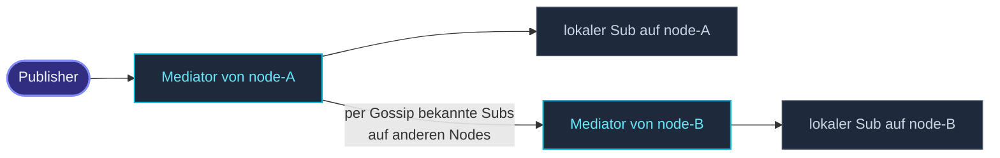

`DistributedPubSub` ist die **clusterweite** Version des lokalen
Event-Streams — Pub/Sub per Topic-Namen, knotenübergreifend.



Jeder Node hostet einen **Mediator** an einem bekannten Pfad
(`/user/pubsub-mediator`). Subscriber registrieren sich bei ihrem
lokalen Mediator; Mediators verteilen die Topic→Node-Karte per
Gossip. Beim Veröffentlichen geht die Nachricht an den lokalen
Mediator, der an jeden Node ausfächert, der Subscriber für dieses
Topic hat.

## Ein minimales Beispiel

```ts
import { ActorSystem, Cluster, ClusterOptions, Props, Actor } from 'actor-ts';
import { DistributedPubSub, type DistributedPubSubMediator, Publish, Subscribe } from 'actor-ts/cluster/pubsub';

class ChatMessage {
  constructor(public readonly user: string, public readonly text: string) {}
}

class ChatRoom extends Actor<ChatMessage> {
  override onReceive(msg: ChatMessage): void {
    this.log.info(`[chat] ${msg.user}: ${msg.text}`);
  }
}

const system  = ActorSystem.create('my-app');
const clusterOptions = ClusterOptions.create()
  .withHost(host)
  .withPort(port)
  .withSeeds(seeds);
const cluster = await Cluster.join(system, clusterOptions);
const ps      = DistributedPubSub.start(cluster);

// Subscribe (typischerweise im preStart eines Actors):
const room = system.spawnAnonymous(Props.create(() => new ChatRoom()));
ps.mediator.tell(new Subscribe('chat.room.general', room));

// Publish (von überall — von jedem Node, in oder außerhalb eines Actors):
ps.mediator.tell(new Publish('chat.room.general', new ChatMessage('alice', 'hi')));
```

Das Publish erreicht jeden Subscriber auf jedem Node — die
Alice-Nachricht kommt bei `room` an, unabhängig davon, welcher
Node den Publisher hostet.

## Die vier Operationen

| Nachricht | Was |
| --- | --- |
| `Subscribe(topic, ref)` | Registriert `ref` als Subscriber auf `topic`. Antwortet mit `SubscribeAck`. |
| `Unsubscribe(topic, ref)` | Entfernt `ref` aus den Subscribern von `topic`. |
| `UnsubscribeAll(ref)` | Entfernt `ref` aus jedem Topic. |
| `Publish(topic, message)` | Schickt `message` an jeden Subscriber von `topic`. |

Schicke diese an `ps.mediator` (ein `ActorRef`). Nutze `ask`, wenn
du das Ack brauchst:

```ts
import {} from 'actor-ts';

await ps.mediator.ask(new Subscribe('chat.room.general', room));
```

## Topics

Topic-Namen sind **beliebige Strings**. Das Framework legt keine
Struktur fest — `chat.room.general`, `user-42.events`,
`metrics-tier-1` funktionieren alle.

Zur Organisation funktioniert eine punkt-segmentierte Konvention
gut (`<domain>.<scope>.<resource>`), aber das Framework
interpretiert die Segmente nicht — es ist nur String-Matching.

## Wie der Fan-out funktioniert

Bei `Publish(topic, msg)`:

1. Der lokale Mediator schlägt das Topic in seiner `Map<topic,
   { local, remoteNodes }>` nach.
2. **Lokale Subscriber** empfangen direkt — `local.values()`, jeder
   bekommt ein `tell`.
3. **Remote-Nodes** mit Subscribern bekommen einen Envelope pro
   Node (nicht pro Subscriber) — der Mediator auf dem Zielnode
   fächert an seine Lokalen aus.

Das ergibt eine **höchstens-ein-Remote-Hop**-Zustellung: ein
Publish kettelt nie über mehrere Nodes, um einen Subscriber zu
erreichen.

## Topic→Node-Gossip

Der Mediator hält seine `Map<topic, SubscriberSet>` lokal, aber
**gossipt Deltas** zu Peers:

- "Node X hat jetzt Subscriber für Topic Y."
- "Node X hat keine Subscriber mehr für Topic Y."

Standard-Gossip-Intervall ist `gossipIntervalMs` des Clusters
(1 Sekunde). Überschreibe pro Mediator:

```ts
const distributedPubSubOptions = DistributedPubSubOptions.create()
  .withGossipIntervalMs(500);
DistributedPubSub.start(cluster, distributedPubSubOptions);
```

Niedrigere Intervalle → schnellere Konvergenz nach Subscribe /
Unsubscribe, mehr Geplapper. 500 ms ist für Chat-artige Anwendungen
vernünftig.

## Wenn Subscriber stoppen

Der Mediator **unsubscribet gestoppte Refs nicht automatisch**.
Wenn ein Subscriber-Actor stoppt, ohne `Unsubscribe` zu senden,
versucht der Mediator weiter `tell` auf ihn — Nachrichten landen
in Dead Letters, das System loggt Warnungen.

Best Practice: im `postStop` des Subscribers `Unsubscribe` oder
`UnsubscribeAll` senden:

```ts
class Subscriber extends Actor<...> {
  override preStart(): void {
    this.system.extension(...).mediator.tell(new Subscribe('topic', this.self));
  }
  override postStop(): void {
    this.system.extension(...).mediator.tell(new UnsubscribeAll(this.self));
  }
}
```

Das Cleanup ist nicht strikt notwendig — Dead-Letter-Routing ist
für die Publisher still — aber es vermeidet Log-Rauschen und
ungenutzten State im Mediator.

## Wann DistributedPubSub einsetzen

Drei gute Anwendungsfälle:

1. **Chat / Notifications** — mehrere Subscriber (oft auf
   verschiedenen Nodes), die sich für dasselbe Topic
   interessieren.
2. **Systemweite Ankündigungen** — ein "schema-updated"-Event, auf
   das jeder Node reagieren soll.
3. **Entkoppelter Fan-out über Nodes** — wenn der Publisher nicht
   wissen sollte, wie viele Subscriber existieren oder wo sie
   leben.

## Wann NICHT

import { Aside } from '@astrojs/starlight/components';

<Aside type="caution" title="Single-Empfänger-Routing">
  ```ts
  ps.mediator.tell(new Publish('one-receiver', msg));
  ```
  Wenn du weißt, dass es genau einen Subscriber gibt, halte
  einfach dessen Ref und mache `tell` direkt. PubSub fügt einen
  zusätzlichen Hop und Gossip-Overhead ohne Nutzen hinzu.
</Aside>

<Aside type="caution" title="Hochfrequente In-Band-Daten">
  ```ts
  // Jeder Metrik-Tick → publish auf "metrics-stream"
  for (const metric of all)
    ps.mediator.tell(new Publish('metrics-stream', metric));
  ```
  PubSub serialisiert die Nachricht in Envelopes und läuft pro
  Publish durch das Subscriber-Set. Bei tausenden pro Sekunde
  dominiert der Overhead. Für Metrik-Streams nutze eine
  spezialisierte Metrik-Pipeline (Prometheus push, OTel) oder
  DistributedData, wenn die Daten in ein CRDT passen.
</Aside>

<Aside type="caution" title="Keine Nicht-lokalen Refs abonnieren">
  ```ts
  ps.mediator.tell(new Subscribe('topic', someRemoteRef));   // ✗
  ```
  Jeder Subscriber sollte auf demselben Node wie der Mediator
  sein, der sein Subscribe verarbeitet. Die lokale Fan-out-Logik
  des Mediators nimmt Lokalität an; Cross-Node-Subscriber gehen
  ohnehin über *einen anderen* Mediator. Subscribe von der Seite
  des Subscribers, nicht zentral.
</Aside>

<Aside type="caution" title="Gossip-Verzögerung lässt Subscriber frühe Nachrichten verpassen">
  ```ts
  ps.mediator.tell(new Subscribe('topic', sub));
  ps.mediator.tell(new Publish('topic', msg));   // ↑ selber Node — sub bekommt es
  // Aber: ein Publish auf einem ANDEREN Node direkt nach Subscribe verpasst `sub`
  ```
  Die Subscription muss erst zum Mediator des Publishers
  gossipen, bevor ein Publish auf diesem Mediator zurück routet.
  Innerhalb von 1-2 Gossip-Intervallen (1-2 s Default) tritt
  Konvergenz ein. Für Muss-Nicht-Verpasst-Werden-Nachrichten warte
  auf `SubscribeAck` und füge eine kleine Verzögerung vor dem
  ersten cross-node Publish ein.
</Aside>

## DistributedPubSub vs. Event-Stream

Zwei Pub/Sub-Bus-Implementierungen; wähle nach Scope:

| Bus | Scope | Topic-Key |
| --- | --- | --- |
| [Event-Stream](/de/fundamentals/event-stream/) | Ein ActorSystem | Klasse (`instanceof`) |
| `DistributedPubSub` | Clusterweit | String-Topic |

Nutze den Event-Stream für In-System-Dispatch; nutze
DistributedPubSub, wenn Topics Node-Grenzen überschreiten. Beide
können koexistieren — viele Apps nutzen beide für verschiedene
Belange.

## Wohin als Nächstes

- **[Cluster-Überblick](/de/cluster/overview/)** — die
  Mitgliedschaft darunter.
- **[Event-Stream](/de/fundamentals/event-stream/)** — das
  Single-System-Pub/Sub zum Vergleich.
- **[Refs über Nodes hinweg](/de/cluster/refs-across-nodes/)** —
  wie die cross-node Zustellungen des Mediators serialisieren.

Die [`DistributedPubSubMediator`](/api/classes/distributedpubsubmediator/)
API-Referenz deckt das vollständige Protokoll ab.
