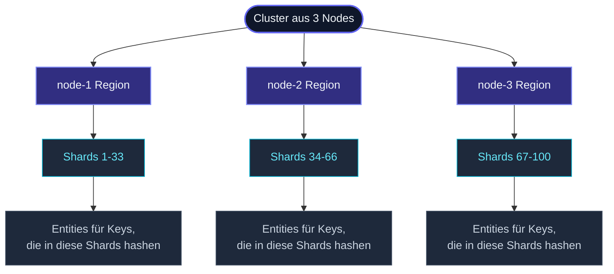

**Cluster-Sharding** ist die Antwort des Frameworks auf "ich habe
ein paar Millionen Entities, jede braucht ihren eigenen Actor,
verteilt über N Nodes." Beispiele: Per-User-Sessions,
Per-IoT-Device-Controller, Per-Order-Koordinatoren,
Per-Game-Room-Actors.

Der Nutzer gibt dem Framework eine Möglichkeit, eine **Entity-ID**
aus jeder Nachricht zu extrahieren; das Framework hasht die ID auf
einen **Shard**; der **Koordinator** entscheidet, welcher Node
diesen Shard hostet; die lokale **Region** des Nodes spawnt den
Entity-Actor bei Bedarf. Wenn Nodes kommen und gehen, rebalanciert
der Koordinator die Shards über die neue Topologie.



Jede Entity ist **ein Actor**, auf **einem Node**, zu einer Zeit —
genauso wie ein Singleton, aber skaliert auf N Entities. Failover
passiert automatisch: wenn ein Node geht, wandern seine Shards
woandershin und die Entities werden dort neu gespawnt.

## Ein minimales Beispiel

```ts
import { Actor, Cluster, ClusterBootstrapOptions, StartShardingOptions } from 'actor-ts';

type CartCmd =
  | { entityId: string; kind: 'add';   sku: string }
  | { entityId: string; kind: 'view';  replyTo: ActorRef<Cart> };

class CartActor extends Actor<CartCmd> {
  private items: string[] = [];

  override onReceive(cmd: CartCmd): void {
    if (cmd.kind === 'add')  this.items.push(cmd.sku);
    if (cmd.kind === 'view') cmd.replyTo.tell({ items: this.items });
  }
}

// Setup — einzeiliger Cluster- + Sharding-Einstieg:
const { system, cluster } = await Cluster.bootstrap(ClusterBootstrapOptions.create('my-app'));

const startShardingOptions = StartShardingOptions.create<CartCmd>().withExtractEntityId((msg) => msg.entityId);
const cartRegion = cluster.sharding.start('cart', CartActor,
  startShardingOptions);

// Verwendung — `tell` an die Region, mit Entity-ID in der Nachricht:
cartRegion.tell({ entityId: 'user-42', kind: 'add', sku: 'book-1' });
cartRegion.tell({ entityId: 'user-42', kind: 'view', replyTo: ... });
//                          ^^^^^^^^^^
// Gleiche ID → gleicher Entity-Actor, jedes Mal, unabhängig vom Node.
```

`cluster.sharding.start()` akzeptiert drei Aufruf-Formen — nimm die,
die zur Entity passt:

```ts
// 1. Klassen-Kurzform (am häufigsten):
const startShardingOptions = StartShardingOptions.create<CartCmd>().withExtractEntityId((m) => m.entityId);
cluster.sharding.start('cart', CartActor, startShardingOptions);

// 2. Factory-Kurzform — wenn die Entity Konstruktor-Argumente braucht:
const startSharding2Options = StartShardingOptions.create<CartCmd>().withExtractEntityId((m) => m.entityId);
cluster.sharding.start('cart', () => new CartActor(deps),
  startSharding2Options);

// 3. Vollform — explizite Props + alle Settings:
const startSharding3Options = StartShardingOptions.create<CartCmd>()
  .withTypeName('cart')
  .withEntityProps(Props.create(() => new CartActor()))
  .withExtractEntityId((m) => m.entityId)
  .withNumShards(16)
  .withRole('cart-host');
cluster.sharding.start(
  startSharding3Options,
);
```

`cluster.sharding` ist eine memoisierte Fassade — wiederholte
Zugriffe liefern dieselbe `ClusterSharding`-Instanz.  Die explizite
Form `ClusterSharding.get(system, cluster)` funktioniert weiter und
liefert dasselbe Objekt; greif dazu nur, wenn Du die Klasse
außerhalb eines Cluster-Handles brauchst.

Aus Sicht des Aufrufers ist die `cartRegion` ein einzelner
`ActorRef`. Hinter den Kulissen:

1. Die Region berechnet aus `entityId` einen Shard (Default: Hash
   auf einen von 100 Shards).
2. Sie fragt den Koordinator "wem gehört dieser Shard?"
3. Wenn der Besitzer *dieser* Node ist, spawnt sie die Entity
   (falls noch nicht vorhanden) und leitet die Nachricht weiter.
4. Wenn der Besitzer *ein anderer* Node ist, leitet sie über den
   Cluster-Transport an dessen Region, die dasselbe macht.

## Die drei Actors im Spiel

| Actor | Rolle |
| --- | --- |
| **Region** | Eine pro Node. Routet Nachrichten an den Besitzer des richtigen Shards, hostet lokale Entities. |
| **Koordinator** | Einer pro Cluster (Singleton, auf dem Leader). Entscheidet, welcher Node welchen Shard besitzt. Behandelt Rebalancing bei Mitgliedschaftsänderungen. |
| **Entity** | Eine pro `entityId`. Hosted auf dem Node, dem aktuell der Shard gehört, in den die ID hasht. |

Jede Ebene hat eine eigene Seite im Cluster-Abschnitt — siehe
[ShardRegion](/de/cluster/sharding/), die
[Allokationsstrategie](/de/cluster/sharding/allocation-strategy/)
und [Rebalance](/de/cluster/sharding/rebalance/) für die
Mechanik.

## Konfiguration

`ShardingOptionsType<TMsg>` — die Felder, die du am häufigsten anfasst:

```ts
interface ShardingOptionsType<TMsg> {
  typeName:               string;
  entityProps:            Props<TMsg>;
  extractEntityId:        (message: TMsg) => string;
  extractEntityMessage?:  (message: TMsg) => unknown;
  numShards?:             number;             // Default 100
  role?:                  string;             // auf Nodes mit dieser Rolle beschränken
  proxy?:                 boolean;            // nur Routing, keine lokalen Entities
  rememberEntities?:      boolean;            // Entities bei Failover neu spawnen (#)
  passivationIdleMs?:     number;             // idle Entities auto-stoppen
  maxEntities?:           number;             // LRU-Cap pro Node
}
```

| Feld | Was es steuert |
| --- | --- |
| `typeName` | Ein String, der diesen sharded Typ identifiziert. Verschiedene Typen können im selben Cluster koexistieren (`cart`, `session`, `order`). |
| `extractEntityId(msg)` | Zieh die Entity-ID aus einer Nachricht. Das ist der Key, der zu einem Shard gehasht wird. |
| `extractEntityMessage(msg)` | *(Optional)* Wenn der Nachrichten-Envelope Routing-Info plus eine Payload enthält, entfernt das den Envelope, bevor die Entity ihn sieht. Default ist die Nachricht unverändert. |
| `numShards` | In wie viele Shards der Entity-Raum aufgeteilt wird. 100 reichen für die meisten Cluster; setze auf 1000 für sehr große Cluster (>50 Nodes). |
| `role` | Nur Mitglieder mit dieser Rolle hosten Shards dieses Typs. Nützlich, um compute-schwere Entities auf dedizierten Nodes zu platzieren. |
| `proxy` | Dieser Node *leitet* Nachrichten an die Region weiter, hostet aber nie lokale Entities. Wird für Client-Nodes in einem asymmetrischen Cluster verwendet. |
| `rememberEntities` | Persistiere die Menge der *aktiven* Entity-IDs. Nach einem Koordinator-Failover (oder vollem Cluster-Neustart) werden diese IDs eager gespawnt, sodass Nachrichten nicht die gesamte Flotte neu erstellen müssen. |
| `passivationIdleMs` | Stoppt eine Entity nach so viel Leerlaufzeit. Befreit Speicher; die nächste Nachricht für dieselbe ID erstellt die Entity neu. |
| `maxEntities` | Per-Node-Cap. Wird er überschritten, wird die LRU-Entity passiviert. |

Die Defaults sind sinnvoll für kleine Cluster. Für Produktion
willst du meistens `rememberEntities: true` und ein
`passivationIdleMs` passend zu deinem Verkehrsmuster.

## Passivierung

```ts
import { Passivate, Actor } from 'actor-ts';

class CartActor extends Actor<CartCmd | Passivate> {
  override onReceive(msg): void {
    if (msg instanceof Passivate) {
      // Optional Shutdown-Arbeit erledigen, dann das Passivate-Ack senden.
      this.context.parent.forEach(p => p.tell({ kind: 'passivate-ack' }));
      return;
    }
    // ...
  }
}
```

Wenn `passivationIdleMs` konfiguriert ist (oder `maxEntities`
erreicht wird), schickt die Region `Passivate` an die Entity. Die
Entity quittiert; die Region stoppt sie und sorgt dafür, dass für
dieselbe ID gepufferte Nachrichten an die nächste Inkarnation
drainen, wenn sie spawnt.

Wenn du voll manuelle Kontrolle willst, schicke dem Parent selbst
eine `{ kind: 'passivate' }`-Nachricht.

## Rebalancing

Wenn sich die Cluster-Topologie ändert (ein Node tritt bei oder
geht), führt der Koordinator einen Rebalance-Lauf durch:

1. Berechne die neue Shard-zu-Node-Zuordnung aus der aktiven
   Allokationsstrategie (Default: Hash modulo Regionen).
2. Sage für jeden bewegten Shard der *alten* Region, sie soll
   den Shard **übergeben**.
3. Die alte Region stoppt ihre Entities (die ihren State
   persistieren können), sagt dem Koordinator
   "Handoff abgeschlossen" und hört auf, für diesen Shard zu
   routen.
4. Die neue Region spawnt Entities für diesen Shard bei Bedarf,
   wenn Nachrichten ankommen.

Der Handoff ist nicht sofort fertig — gepufferte Nachrichten
warten auf das "Handoff abgeschlossen"-Signal, bevor sie an den
neuen Besitzer weitergeleitet werden. Das verhindert, dass
Nachrichten an einer halb-verschobenen Entity vorbeisausen.

Siehe [Rebalance](/de/cluster/sharding/rebalance/) für das
vollständige Protokoll.

## State über Failover

Sharded Entities unterliegen denselben Neustart-Semantiken wie
jeder andere Actor — wenn eine Entity zu einem neuen Node
wandert, startet die neue Instanz mit weißer Weste.

Für State, der überleben soll:

- **`PersistentActor`** — die Entity persistiert Events in einem
  Journal; auf einem frischen Node spielt sie das Journal beim
  Start ab. Siehe
  [PersistentActor](/de/persistence/persistent-actor/).
- **`DurableStateActor`** — einfacher: persistiere den aktuellen
  State-Snapshot; restore beim Neustart. Siehe
  [DurableState](/de/persistence/durable-state/).
- **`DistributedData`** — für State, der von *jedem* Node lesbar
  sein soll (nicht nur vom aktuellen Host der Entity), nutze ein
  CRDT im DD-Replicator stattdessen.

Ohne eine dieser Lösungen gibt dir Sharding Platzierung und
Routing, aber keine Durability.

## Wann zu Sharding greifen

Drei gute Anwendungen:

1. **Per-User-/Per-Tenant-State**, der zu viel für einen Node ist,
   aber nicht von überall gleichzeitig lesbar sein muss.
2. **Per-Entity-Workflows** — Sagas, Order-Processing,
   lange laufende Koordinatoren — die von Per-Key-Serialisierung
   profitieren.
3. **Hotspots, die Keys folgen** — eine Streaming-Pipeline, in der
   die Events jedes Users in Reihenfolge auf einem einzelnen
   Actor verarbeitet werden sollen.

## Wann NICHT Sharding verwenden

import { Aside } from '@astrojs/starlight/components';

<Aside type="caution" title="Kein natürlicher Key">
  ```ts
  extractEntityId: () => 'singleton';   // ← alle Nachrichten gehen an eine Entity
  ```
  Wenn jede Nachricht am Ende an dieselbe Entity geroutet wird,
  hast du einen Singleton, kein Sharding. Verwende stattdessen
  [ClusterSingleton](/de/cluster/singleton/overview/) — das ist
  das richtige Werkzeug für "ein-Actor-clusterweit".
</Aside>

<Aside type="caution" title="Wenige Entities, jede riesig">
  Sharding amortisiert Koordinations-Overhead über viele Entities.
  Für 5-10 fat-state Actors spawn sie einfach mit deterministischen
  Pfaden und nutze `ClusterRouter`, wenn Fan-out wichtig ist; die
  Buchhaltung des Sharding-Koordinators lohnt sich nicht.
</Aside>

<Aside type="caution" title="Reihenfolge-empfindliche Workloads über viele Entities">
  Sharding gibt Per-*Entity*-Reihenfolge, aber keine globale
  Reihenfolge. Wenn Cross-Entity-Reihenfolge wichtig ist (selten),
  brauchst du ein anderes Muster — entweder eine Entity pro
  Reihenfolge-Scope oder einen expliziten Sequencer-Actor.
</Aside>

## Wohin als Nächstes

- **[ShardRegion](/de/cluster/sharding/) ** *(Stub)* — der
  Per-Node-Region-Actor; Konfigurations-Deep-Dive.
- **[Allokationsstrategie](/de/cluster/sharding/allocation-strategy/)** —
  Default Hash-mod-Regions, eigene Strategien.
- **[Rebalance](/de/cluster/sharding/rebalance/)** — das
  Handoff-Protokoll.
- **[Remember Entities](/de/cluster/sharding/remember-entities/)** —
  persistentes Entity-Registry für schnelle Recovery.
- **[Singleton-Überblick](/de/cluster/singleton/overview/)** —
  für ein-Actor-clusterweit.
- **[Sharded Daemon Process](/de/cluster/sharding/sharded-daemon-process/)** —
  Worker in fester Anzahl, verteilt per Sharding.

Die [`ClusterSharding`](/api/classes/clustersharding/) API-Referenz
deckt die vollständige Oberfläche ab.
