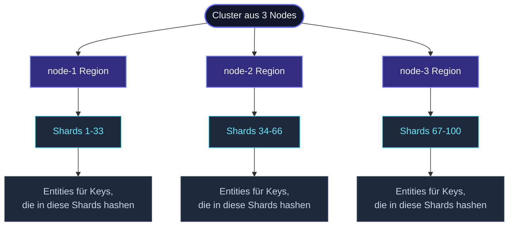

**Cluster-Sharding** ist die Antwort des Frameworks auf "ich habe
ein paar Millionen Entities, jede braucht ihren eigenen Actor,
verteilt über N Nodes." Beispiele: Per-User-Sessions,
Per-IoT-Device-Controller, Per-Order-Koordinatoren,
Per-Game-Room-Actors.

Der Nutzer gibt dem Framework eine Möglichkeit, eine **Entity-ID**
aus jeder Nachricht zu extrahieren; das Framework hasht die ID auf
einen **Shard**; der **Koordinator** entscheidet, welcher Node
diesen Shard hostet; die lokale **Region** des Nodes routet an diesen
**Shard**, der den Entity-Actor bei Bedarf spawnt. Wenn Nodes kommen
und gehen, rebalanciert
der Koordinator die Shards über die neue Topologie.


```mermaid
flowchart TB
  CLUSTER(["Cluster aus 3 Nodes"])
  N1["node-1 Region"]
  N2["node-2 Region"]
  N3["node-3 Region"]
  S1["Shards 1-33"]
  S2["Shards 34-66"]
  S3["Shards 67-100"]
  E1["Entities für Keys,<br/>die in diese Shards hashen"]
  E2["Entities für Keys,<br/>die in diese Shards hashen"]
  E3["Entities für Keys,<br/>die in diese Shards hashen"]
  CLUSTER --> N1
  CLUSTER --> N2
  CLUSTER --> N3
  N1 --> S1 --> E1
  N2 --> S2 --> E2
  N3 --> S3 --> E3
  classDef cluster fill:#0f172a,stroke:#6366f1,stroke-width:2px,color:#f1f5f9;
  classDef region  fill:#312e81,stroke:#818cf8,stroke-width:1.5px,color:#f1f5f9;
  classDef shard   fill:#1e293b,stroke:#06b6d4,color:#67e8f9;
  classDef entity  fill:#1e293b,stroke:#475569,color:#cbd5e1;
  class CLUSTER cluster
  class N1,N2,N3 region
  class S1,S2,S3 shard
  class E1,E2,E3 entity
```

Jede Entity ist **ein Actor**, auf **einem Node**, zu einer Zeit —
genauso wie ein Singleton, aber skaliert auf N Entities. Failover
passiert automatisch: wenn ein Node geht, wandern seine Shards
woandershin und die Entities werden dort neu gespawnt.

## Ein minimales Beispiel

```ts
import { match } from 'ts-pattern';
import { Actor } from 'actor-ts';
import { Cluster, ClusterBootstrapOptions, StartShardingOptions } from 'actor-ts/cluster';

type AddCommand = { entityId: string; kind: 'add'; sku: string };
type ViewCommand = { entityId: string; kind: 'view'; replyTo: ActorRef<Cart> };
type CartCommand = AddCommand | ViewCommand;

class CartActor extends Actor<CartCommand> {
  private items: string[] = [];

  override onReceive(command: CartCommand): void {
    match(command)
      .with({ kind: 'add' }, (c) => this.onAdd(c))
      .with({ kind: 'view' }, (c) => this.onView(c))
      .exhaustive();
  }

  private onAdd(command: AddCommand): void { this.items.push(command.sku); }
  private onView(command: ViewCommand): void { command.replyTo.tell({ items: this.items }); }
}

// Setup — einzeiliger Cluster- + Sharding-Einstieg:
const { system, cluster } = await Cluster.bootstrap(ClusterBootstrapOptions.create('my-app'));

const startShardingOptions = StartShardingOptions.create<CartCommand>().withExtractEntityId((message) => message.entityId);
const cartRegion = cluster.sharding.start('cart', CartActor,
  startShardingOptions);

// Verwendung — `tell` an die Region, mit Entity-ID in der Nachricht:
cartRegion.tell({ entityId: 'user-42', kind: 'add', sku: 'book-1' });
cartRegion.tell({ entityId: 'user-42', kind: 'view', replyTo: ... });
//                          ^^^^^^^^^^
// Gleiche ID → gleicher Entity-Actor, jedes Mal, unabhängig vom Node.
```

`cluster.sharding.start()` akzeptiert mehrere Aufruf-Formen — nimm die,
die zur Entity passt. Die kürzeste lässt die Entity ihre eigene
Identität deklarieren, wodurch weder Type-Name noch Entity-ID-Extractor
am Aufrufort wiederholt werden:

```ts
class CartActor extends Actor<CartCommand> {
  static readonly shard = ShardKey.of<CartCommand>('cart', (command) => command.entityId);
  // ...
}

const cartRegion = cluster.sharding.start(CartActor);
const cart = cluster.sharding.entityRefFor(CartActor, 'user-42');
```

:::caution[Das explizite Typargument ist tragend]
`ShardKey.of('cart', ...)` — ohne `<CartCommand>` — inferiert
`ShardKey<unknown>`, und jeder daraus gewonnene Ref degradiert zu
`ActorRef<unknown>`.
:::

Die Identität eines `ShardKey` ist allein sein `typeName`; der
Extractor reitet mit, damit die deklarierende Klasse die einzige
Wahrheitsquelle ist — ein Node, der Entities nur nachschlägt, kann
denselben Typ mit `ShardKey.of<CartCommand>('cart')` ohne Extractor
benennen. Ein `extractEntityId` in den Options überschreibt den auf
dem Key.

Die übrigen Formen bleiben unverändert:

```ts
// 1. Klassen-Kurzform:
const startShardingOptions = StartShardingOptions.create<CartCommand>().withExtractEntityId((m) => m.entityId);
cluster.sharding.start('cart', CartActor, startShardingOptions);

// 2. Factory-Kurzform — wenn die Entity Konstruktor-Argumente braucht:
const startSharding2Options = StartShardingOptions.create<CartCommand>().withExtractEntityId((m) => m.entityId);
cluster.sharding.start('cart', () => new CartActor(deps),
  startSharding2Options);

// 3. Vollform — alle Settings über den Builder:
const startSharding3Options = StartShardingOptions.create<CartCommand>()
  .withTypeName('cart')
  .withEntityActor(CartActor)
  .withExtractEntityId((m) => m.entityId)
  .withNumShards(16)
  .withRole('cart-host');
cluster.sharding.start(
  startSharding3Options,
);
```

`cluster.sharding` ist eine memoisierte Fassade — wiederholte
Zugriffe liefern dieselbe `ClusterSharding`-Instanz.  Die explizite
Form `ClusterSharding.get(system, cluster)` funktioniert weiter und
liefert dasselbe Objekt; greif dazu nur, wenn Du die Klasse
außerhalb eines Cluster-Handles brauchst.

Aus Sicht des Aufrufers ist die `cartRegion` ein einzelner
`ActorRef`. Hinter den Kulissen:

1. Die Region berechnet aus `entityId` einen Shard (Default: Hash
   auf einen von 64 Shards).
2. Sie fragt den Koordinator "wem gehört dieser Shard?"
3. Wenn der Besitzer *dieser* Node ist, spawnt sie die Entity
   (falls noch nicht vorhanden) und leitet die Nachricht weiter.
4. Wenn der Besitzer *ein anderer* Node ist, leitet sie über den
   Cluster-Transport an dessen Region, die dasselbe macht.

## Die vier Actors im Spiel

| Actor | Rolle |
| --- | --- |
| **Region** | Eine pro Node. Routet Nachrichten an den Besitzer des richtigen Shards und entscheidet, wann lokale Entities — und leer gewordene Shards — passiviert werden. |
| **Shard** | Einer pro hier gehostetem Shard, Kind der Region. Besitzt die Entity-Actors: spawnt sie, stoppt sie, puffert für eine, die gerade geht. Verschwindet selbst, sobald er sein Fenster lang leer stand, und kommt mit der nächsten Nachricht zurück. |
| **Koordinator** | Einer pro Cluster (Singleton, auf dem Leader). Entscheidet, welcher Node welchen Shard besitzt. Behandelt Rebalancing bei Mitgliedschaftsänderungen und beim Herunterfahren einer Region. |
| **Entity** | Eine pro `entityId`. Kind ihres Shards, auf dem Node, dem aktuell der Shard gehört, in den die ID hasht. |

Damit haben Entities einen echten Pfad —
`/system/cluster/sharding/region-counter/shard-7/entity-user-42` — und genau das macht
einen Shard überhaupt adressierbar. Siehe
[Introspektion](/de/cluster/sharding/introspection/) zum Auflisten von
Shards und zum Holen von Refs darauf.

Die Region ist das Thema dieser Seite; die Entscheidungen des
Koordinators haben eigene Seiten — siehe die
[Allokationsstrategie](/de/cluster/sharding/allocation-strategy/)
und [Rebalance](/de/cluster/sharding/rebalance/) für die
Mechanik.

## Wissen, welche Entity man ist

Eine Entity braucht fast immer die ID, über die sie geroutet wurde — für
den Namen ihres Journal-Streams, ihres Pub/Sub-Topics oder einer Zeile in
einer fremden Datenbank. Sie liest sie an sich selbst ab:

```ts
class CartEntity extends Actor<CartCommand> {
  override preStart(): void {
    this.log.info(`cart ${this.entityId} woke up in shard ${this.entity.shardId}`);
  }
}
```

| | |
| --- | --- |
| `this.entityId` | Der Wert, den `extractEntityId` zurückgegeben hat — unverändert. |
| `this.entity` | Dieselbe ID plus `typeName` und `shardId`. |
| `this.context.entity` | Die `Option`-Form — `None`, wenn dieser Actor keine Entity ist. Die beiden Getter darüber werfen stattdessen. |

Der häufigste Fall ist eine `persistenceId` pro Entity — genau das gibt
einem geshardeten [`PersistentActor`](/de/persistence/persistent-actor/)
einen Event-Stream pro Entity statt einen pro Typ:

```ts
class CartEntity extends PersistentActor<CartCommand, CartEvent, CartState> {
  override get persistenceId(): string { return `cart-${this.entityId}`; }
}
```

:::caution[Ein Getter, kein Feld]
Der Actor-Context wird *nach* dem Konstruktor angehängt — ``readonly
persistenceId = `cart-${this.entityId}` `` wirft also. Lies die ID in
einem Getter oder ab `preStart`.
:::

Die Identität sitzt auf der Entity und sonst nirgends — die eigenen
Kinder einer Entity bekommen `None`, `this.context.entity.nonEmpty`
beantwortet also „bin ich die Entity?“. Ein Kind, das die ID braucht,
bekommt sie explizit weitergereicht.

Um eine Entity isoliert zu testen, gibst du ihr die Identität direkt,
statt einen Cluster darum herum hochzufahren:

```ts
import { ActorOptions } from 'actor-ts';

const cartOptions = ActorOptions.create()
  .withEntity({ entityId: 'user-42', typeName: 'cart', shardId: 3 });
const cart = system.spawn(CartEntity, 'cart-under-test', cartOptions);
```

### Warum nicht einfach den Pfad auslesen?

`.../shard-7/entity-user-42` sieht aus, als trüge er die ID, und für
einfache IDs funktioniert das Abschneiden des `entity-`-Präfixes auch.
Es *ist* aber nicht die ID: Actor-Namen haben ein eingeschränktes
Alphabet, deshalb maskiert der Shard beim Benennen des Kindes alles, was
ein Name nicht tragen kann — eine Code-Unit außerhalb von
`[A-Za-z0-9_-.@:+]` wird zu `~` plus vier Hex-Ziffern, `user/42` heißt
also `entity-user~002F42`.

Die Maskierung ist *injektiv*: zwei verschiedene IDs landen nie auf
einem Namen. Das ist eine Korrektheitseigenschaft, keine Feinheit — ein
geteilter Name bedeutet, dass die zweite Entity unter einem schon
vergebenen Namen startet, und der resultierende Fehler reißt den Shard
mitsamt allen anderen Entities darin mit.

Was sie *nicht* ist: eine zweite Schreibweise der ID. Nichts dekodiert
ein Pfadsegment, bewusst, und die Maskierung ist kein Teil der API. Der
Pfad ist ein *Etikett*; `entityId` ist der Wert.

## Konfiguration

`ShardingOptionsType<TMessage>` — die Felder, die du am häufigsten anfasst:

```ts
type ShardingOptionsType<TMessage> = {
  typeName:                string;
  entityActor:             ActorClassOrFactory<TMessage>;
  entityOptions?:          ActorOptions<TMessage>;
  extractEntityId:         (message: TMessage) => string;
  extractEntityMessage?:   (message: TMessage) => unknown;
  numShards?:              number;            // Default 64
  role?:                   string;            // auf Nodes mit dieser Rolle beschränken
  proxy?:                  boolean;           // nur Routing, keine lokalen Entities
  rememberEntities?:       boolean;           // Entities bei Failover neu spawnen (#)
  passivationIdleMs?:      number;            // idle Entities auto-stoppen, Default 5 min
  shardPassivationIdleMs?: number;            // leere Shards auto-stoppen, folgt obigem
  maxEntities?:            number;            // LRU-Cap pro Node
};
```

| Feld | Was es steuert |
| --- | --- |
| `typeName` | Ein String, der diesen sharded Typ identifiziert. Verschiedene Typen können im selben Cluster koexistieren (`cart`, `session`, `order`). |
| `extractEntityId(message)` | Zieh die Entity-ID aus einer Nachricht. Das ist der Key, der zu einem Shard gehasht wird. |
| `extractEntityMessage(message)` | *(Optional)* Wenn der Nachrichten-Envelope Routing-Info plus eine Payload enthält, entfernt das den Envelope, bevor die Entity ihn sieht. Default ist die Nachricht unverändert. |
| `numShards` | In wie viele Shards der Entity-Raum aufgeteilt wird. 64 reichen für die meisten Cluster; setze auf 1000 für sehr große Cluster (>50 Nodes). **Muss auf jedem Node identisch sein, der diesen Typ startet oder proxyt** — siehe unten. |
| `role` | Nur Mitglieder mit dieser Rolle hosten Shards dieses Typs. Nützlich, um compute-schwere Entities auf dedizierten Nodes zu platzieren. Auch node-weit setzbar als `actor-ts.sharding.role` — siehe [Platzierung aus der Config-Datei](#platzierung-aus-der-config-datei). |
| `proxy` | Dieser Node *leitet* Nachrichten an die Region weiter, hostet aber nie lokale Entities. Wird für Client-Nodes in einem asymmetrischen Cluster verwendet. |
| `rememberEntities` | Persistiere die Menge der *aktiven* Entity-IDs. Nach einem Koordinator-Failover (oder vollem Cluster-Neustart) werden diese IDs eager gespawnt, sodass Nachrichten nicht die gesamte Flotte neu erstellen müssen. |
| `passivationIdleMs` | Stoppt eine Entity nach so viel Leerlaufzeit. Befreit Speicher; die nächste Nachricht für dieselbe ID erstellt die Entity neu. Default sind **5 Minuten**; `0` schaltet es ab. |
| `shardPassivationIdleMs` | Stoppt einen Shard, nachdem er so lange leer stand. Ungesetzt folgt er `passivationIdleMs`; `0` hält leere Shards resident, während Entities weiterhin passivieren. |
| `maxEntities` | Per-Node-Cap. Wird er überschritten, wird die LRU-Entity passiviert. |

Die Defaults sind sinnvoll für kleine Cluster. Für Produktion
willst du meistens `rememberEntities: true` und ein
`passivationIdleMs` passend zu deinem Verkehrsmuster.

### Platzierung aus der Config-Datei

`role` ist die einzige Platzierungsoption mit einem HOCON-Key, denn *welche*
Rolle einen Typ hostet, ist über ein Deployment hinweg einheitlich:

```hocon
actor-ts.sharding.role = "backend"
```

Der Key gilt für jeden auf dem Node gestarteten Sharded Type ohne eigenes
`withRole`, und ein explizites `withRole` sticht ihn weiterhin — die übliche
Reihenfolge **explizite Optionen > HOCON > Built-in-Defaults**, pro Feld.

Was er nicht tut: einem Node die Rolle geben. Die *eigenen* Rollen eines Nodes
sind Identität statt Tuning, haben deshalb keinen Config-Key und bleiben auf
jedem hostenden Node im Code:

```ts
const clusterOptions = ClusterOptions.create()
  .withHost('10.0.0.7')
  .withPort(2551)
  .withRoles(['backend']);
```

Konfigurierst du nur den Key und kein Mitglied passt dazu, findet der
Koordinator keinen Kandidaten, es wird nie etwas zugeteilt, und jede Nachricht
für den Typ staut sich im Routing-Puffer der Region. Still ist das nicht — der
Koordinator warnt einmal mit der Rolle und der Zahl der ausgeschlossenen
registrierten Regionen — aber es ist eine Warnung und kein Startfehler, also
lies sie.

`proxy` hat bewusst keinen Key: Es ist Topologie pro Node, ein zweites `start`
mit abweichendem Wert wirft, und ein von allen Nodes geteiltes `proxy = on`
ließe niemanden mehr etwas hosten.

### `numShards` ist eine clusterweite Vereinbarung

Eine Shard-ID ist `hash(entityId) % numShards`, und jeder Node
berechnet sie für sich. Zwei Nodes mit unterschiedlichen Werten legen
dieselbe Entity-ID also in unterschiedliche Shards, jeder besitzt am
Ende den Shard, den seine eigene Rechnung ergeben hat, und beide
betreiben eine lebende Instanz der Entity — unter
`shard-6/entity-user-7` und `shard-50/entity-user-7`, Pfaden, die
niemals kollidieren. Bei einer persistenten Entity heißt das zwei
Schreiber auf einer `persistenceId`.

Deshalb reist der Wert in der Registrierung der Region mit, und der
Koordinator **verweigert** eine Region, die nicht übereinstimmt:

```text
ERROR [sharding] the coordinator refused to register region 'counter':
numShards must match across the cluster, but this node is configured
with 32 and the coordinator governs the type with 64.
```

Eine verweigerte Region bleibt oben und puffert weiter — sie bekommt
nie einen Shard zugewiesen, die Fehlkonfiguration ist also ein
Stillstand mit einem Fehler daneben statt eines stillen Splits.
Korrigiere den Wert und starte den Node neu.

Eine Region, die vorher *schon* Shards gehostet hat, gibt sie auf der
Stelle ab. Dieser Fall ist nicht exotisch: Genau ihn erzeugt ein
Rolling Deploy in dem Moment, in dem die Leader-Rolle einen bereits
aktualisierten Node erreicht. Die Region wurde vom vorherigen Leader
akzeptiert, hält also echte Shards und echte Entities, und der neue
Koordinator verweigert sie. Sie stoppt jeden dieser Shards — ein
richtiger Stopp, damit die Entities darunter ihr `postStop` durchlaufen
und eine persistente flusht — und gibt im selben Schritt den Besitz ab.
Das macht aus der Verweigerung einen Stillstand auf diesem Node statt
einer Hälfte eines Splits. Zurück kommt nichts, bevor die Werte
übereinstimmen; der gepufferte Verkehr wartet.

Das ist naturgemäß asynchron: Eine Region registriert sich, nachdem
`start(...)` zurückgekehrt ist, versucht es erneut, bis der Koordinator
antwortet, und registriert sich bei jedem Leader-Wechsel neu. Es gibt
keinen Aufruf, aus dem geworfen werden könnte — deshalb kommt das
Urteil als Log-Zeile und nicht als Exception.

Zwei Konsequenzen, die man kennen sollte:

- Ein **Proxy**-Node zählt mit. `startProxy` hasht genau wie eine
  hostende Region und braucht deshalb dasselbe `numShards`; wer einen
  aus einem bloßen Key in einem Cluster startet, der nicht den Default
  verwendet, bekommt ihn verweigert.
- `actor-ts.sharding.number-of-shards` in einer von allen Nodes
  geteilten Konfigurationsdatei zu setzen ist der fehlerärmste Weg, sie
  im Gleichschritt zu halten.

Die Verweigerung übersteht auch einen
[`coordinatorStateStore`](/de/cluster/sharding/introspection/). Dieser
Store erlaubt einem neuen Leader, den Reallokations-Sturm zu
überspringen, indem er die Allokationskarte seines Vorgängers übernimmt,
und jede Shard-ID in so einem Snapshot entstand unter dem Wert des
*schreibenden* Koordinators — deshalb trägt ein Snapshot diesen Wert
jetzt als Stempel, und einer, der unter einem anderen (oder, bei einem
vor dem Stempel geschriebenen Snapshot, unter einem ungenannten) Wert
entstand, wird als Ganzes verworfen, mit einem `WARN`, das beide Zahlen
nennt. Eine Region, die der Koordinator bereits verweigert hat, wird
übersprungen, auch wenn der Snapshot sie nennt. Ohne diese beiden
Prüfungen setzte der Ladepfad die verweigerten Regionen direkt zurück in
den Platzierungs-Pool: Ein Rolling Deploy, der den Wert ändert, hätte das
Split-Routing über den Snapshot wiederhergestellt statt über den
Registrierungs-Handshake — die einzige Stelle, an der die Werte
verglichen werden.

Einen Snapshot zu verwerfen kostet einen Reallokationsdurchlauf, also
genau das, was jeder Cluster ohne Store bei einem Leader-Wechsel schon
immer tut — und die nächste Allokationsänderung unter dem neuen Leader
schreibt einen gestempelten Snapshot, es passiert also einmal.

Denselben Typ auf einem Node zweimal zu starten — `start()` nach
`startProxy()` oder umgekehrt — wirft. Der zweite Aufruf gab bisher die
Region des ersten zurück, sodass ein Node, der eine hostende Region
wollte, den Proxy bekam — dessen Platzhalter-Entity-Factory wirft, sobald
lokal ein Shard landet.

Fünf davon sind auch HOCON-Keys — `number-of-shards`,
`remember-entities`, `passivation-idle`, `shard-passivation-idle` und
`max-entities` — ebenso die Koordinator-Keys `rebalance-interval` und
`hand-off-timeout`. Sie setzen die node-weite Grundeinstellung für
jeden sharded Typ und liegen *unter* dem, was `start(...)` explizit
übergibt — ein Per-Typ-Wert im Builder gewinnt also weiterhin. Siehe
[Konfiguration](/de/reference/configuration/#actor-tssharding).

```hocon
actor-ts.sharding {
  number-of-shards = 128
  passivation-idle = 2 minutes
  max-entities     = 50000
}
```

## Passivierung

Passivierung stoppt eine idle Entity, um Speicher freizugeben; die
nächste Nachricht für dieselbe ID erstellt sie neu. Wie auch immer
sie ausgelöst wird — die Region puffert Nachrichten, die eintreffen,
während die Entity stoppt, und spielt sie an die frische Inkarnation
zurück, sodass nichts verloren geht.

Das Standard-Idle-Fenster beträgt **5 Minuten**. Setze
`passivationIdleMs` — im Code oder über
`actor-ts.sharding.passivation-idle` —, um es zu ändern, oder `0`, um es
abzuschalten und jede Entity für die Lebensdauer ihres Nodes resident zu
halten.

:::caution[In-Memory-State übersteht das nicht]
Eine passivierte Entity ist ein gestoppter Actor, alles in ihren Feldern
ist also weg. Ein [`PersistentActor`](/de/persistence/persistent-actor/)
spielt beim Zurückkommen sein Journal ab und merkt nichts davon; ein
einfacher Actor, der seinen Zustand aus empfangenen Nachrichten
aufgebaut hat, fängt von vorn an. Baue ihn entweder in `preStart` wieder
auf, oder setze für diesen Typ `passivationIdleMs: 0`.
:::

**Automatisch** — wenn `passivationIdleMs` ohne Verkehr abläuft oder
`maxEntities` überschritten wird (die LRU-Entity wird verdrängt), wird
die Entity gestoppt. Es wird nichts an die Entity geschickt, und es
gibt keine Quittung. Die *Entscheidung* trifft die Region, weil nur sie
den Verkehr über alle Shards dieses Nodes sieht — deshalb ist
`maxEntities` eine Obergrenze pro Node, nicht pro Shard — und der Shard,
dem die Entity gehört, führt sie aus.

**Manuell (graceful)** — eine Entity bittet darum, passiviert zu
werden, indem sie ein `Passivate` an ihren Parent schickt, also an ihren
Shard. `Passivate` trägt eine *Stop-Nachricht*, die an die Entity
zurückgeleitet wird, sodass die Entity genau entscheidet, wann und wie
sie herunterfährt (laufende Arbeit abschließen, State flushen, dann
terminieren). `PoisonPill` als Stop-Nachricht terminiert die Entity,
sobald sie zurückkommt:

```ts
import { match } from 'ts-pattern';
import { PoisonPill, Actor } from 'actor-ts';
import { Passivate } from 'actor-ts/cluster';

type AddCommand = { entityId: string; kind: 'add'; sku: string };
type CheckoutCommand = { entityId: string; kind: 'checkout' };
type CartCommand = AddCommand | CheckoutCommand;

class CartActor extends Actor<CartCommand> {
  private items: string[] = [];

  override onReceive(command: CartCommand): void {
    match(command)
      .with({ kind: 'add' }, (c) => this.onAdd(c))
      .with({ kind: 'checkout' }, () => this.onCheckout())
      .exhaustive();
  }

  private onAdd(command: AddCommand): void {
    this.items.push(command.sku);
  }

  // Mit dem Warenkorb fertig — die Region bitten, uns zu passivieren.
  private onCheckout(): void {
    this.context.parent.forEach((parent) =>
      parent.tell(new Passivate(PoisonPill.instance, this.self), this.self));
  }
}
```

### Shards passivieren ebenfalls

Alle Entities eines Shards zu passivieren ließ früher den Shard selbst
zurück — einen lebenden Actor mit einer leeren Map. Außer einem
Rebalance stoppte ihn nichts, und da Entity-IDs über den Hash-Raum
streuen, wurde auf einem lang laufenden Node irgendwann jeder Shard
einmal angefasst und blieb dann. Bei `numShards = 64` sind das 64 idle
Actors ohne Inhalt.

Deshalb wird auch ein Shard gestoppt, der `shardPassivationIdleMs` lang
leer stand. Die Region behält die *Ownership* — nur der Actor geht —,
der Shard bleibt also routbar, und die nächste Nachricht für ihn
erstellt Shard und Entity gemeinsam neu, ohne Umweg über den
Koordinator. Ungesetzt folgt das Fenster `passivationIdleMs`, was
meistens genau richtig ist: ein Shard ist leer, gerade weil seine
Entities idle wurden.

```ts
const shardingOptions = StartShardingOptions.create<CartCommand>()
  .withTypeName('cart')
  .withEntityActor(CartActor)
  .withExtractEntityId((command) => command.entityId)
  .withPassivationIdleMs(120_000)
  // Shards sind billig zu halten und kosten einen Respawn, wenn sie gehen —
  // auf einem belebten Node ist es ein guter Handel, sie ihre Entities eine
  // Weile überleben zu lassen.
  .withShardPassivationIdleMs(600_000);
```

Setze `shardPassivationIdleMs: 0`, um leere Shards resident zu halten,
während Entities weiterhin passivieren. Region und Koordinator sind in
beiden Fällen unberührt — sie laufen für die Lebensdauer des Nodes.

Gestoppt wird immer nur ein *leerer* Shard, es steht also kein
Entity-State auf dem Spiel, und Nachrichten, die während des Stoppens
eintreffen, werden genauso gepuffert und nachgespielt wie bei einer
Entity. Auch eine Shard-Ref bleibt über die Lücke hinweg gültig — siehe
[Introspection](/de/cluster/sharding/introspection/), wo `ShardInfo`
zusätzlich ein `resident`-Flag meldet, das einen passivierten Shard von
einem bloß leeren unterscheidet.

## Rebalancing

Wenn sich die Cluster-Topologie ändert (ein Node tritt bei oder
geht) — oder wenn eine Region stoppt und sich dabei beim Koordinator
abmeldet —, führt der Koordinator einen Rebalance-Lauf durch:

1. Berechne die neue Shard-zu-Node-Zuordnung aus der aktiven
   Allokationsstrategie (Default: Hash modulo Regionen).
2. Sage für jeden bewegten Shard der *alten* Region, sie soll
   den Shard **übergeben**.
3. Die alte Region stoppt ihre Entities (die ihren State
   persistieren können), sagt dem Koordinator
   "Handoff abgeschlossen" und hört auf, für diesen Shard zu
   routen.
4. Die neue Region spawnt Entities für diesen Shard bei Bedarf,
   wenn Nachrichten ankommen.

Der Handoff ist nicht sofort fertig — gepufferte Nachrichten
warten auf das "Handoff abgeschlossen"-Signal, bevor sie an den
neuen Besitzer weitergeleitet werden. Das verhindert, dass
Nachrichten an einer halb-verschobenen Entity vorbeisausen.

Siehe [Rebalance](/de/cluster/sharding/rebalance/) für das
vollständige Protokoll.

## State über Failover

Sharded Entities unterliegen denselben Neustart-Semantiken wie
jeder andere Actor — wenn eine Entity zu einem neuen Node
wandert, startet die neue Instanz mit weißer Weste.

Für State, der überleben soll:

- **`PersistentActor`** — die Entity persistiert Events in einem
  Journal; auf einem frischen Node spielt sie das Journal beim
  Start ab. Siehe
  [PersistentActor](/de/persistence/persistent-actor/).
- **`DurableStateActor`** — einfacher: persistiere den aktuellen
  State-Snapshot; restore beim Neustart. Siehe
  [DurableState](/de/persistence/durable-state/).
- **`DistributedData`** — für State, der von *jedem* Node lesbar
  sein soll (nicht nur vom aktuellen Host der Entity), nutze ein
  CRDT im DD-Replicator stattdessen.

Ohne eine dieser Lösungen gibt dir Sharding Platzierung und
Routing, aber keine Durability.

## Wann zu Sharding greifen

Drei gute Anwendungen:

1. **Per-User-/Per-Tenant-State**, der zu viel für einen Node ist,
   aber nicht von überall gleichzeitig lesbar sein muss.
2. **Per-Entity-Workflows** — Sagas, Order-Processing,
   lange laufende Koordinatoren — die von Per-Key-Serialisierung
   profitieren.
3. **Hotspots, die Keys folgen** — eine Streaming-Pipeline, in der
   die Events jedes Users in Reihenfolge auf einem einzelnen
   Actor verarbeitet werden sollen.

## Wann NICHT Sharding verwenden

import { Aside } from '@astrojs/starlight/components';

<Aside type="caution" title="Kein natürlicher Key">
  ```ts
  extractEntityId: () => 'singleton';   // ← alle Nachrichten gehen an eine Entity
  ```
  Wenn jede Nachricht am Ende an dieselbe Entity geroutet wird,
  hast du einen Singleton, kein Sharding. Verwende stattdessen
  [ClusterSingleton](/de/cluster/singleton/overview/) — das ist
  das richtige Werkzeug für "ein-Actor-clusterweit".
</Aside>

<Aside type="caution" title="Wenige Entities, jede riesig">
  Sharding amortisiert Koordinations-Overhead über viele Entities.
  Für 5-10 fat-state Actors spawn sie einfach mit deterministischen
  Pfaden und nutze `ClusterRouter`, wenn Fan-out wichtig ist; die
  Buchhaltung des Sharding-Koordinators lohnt sich nicht.
</Aside>

<Aside type="caution" title="Reihenfolge-empfindliche Workloads über viele Entities">
  Sharding gibt Per-*Entity*-Reihenfolge, aber keine globale
  Reihenfolge. Wenn Cross-Entity-Reihenfolge wichtig ist (selten),
  brauchst du ein anderes Muster — entweder eine Entity pro
  Reihenfolge-Scope oder einen expliziten Sequencer-Actor.
</Aside>

## Wohin als Nächstes

- **[Introspektion](/de/cluster/sharding/introspection/)** — die Shards
  auflisten, eine Ref auf einen Shard oder eine Entity holen, der Karte folgen.
- **[Allokationsstrategie](/de/cluster/sharding/allocation-strategy/)** —
  Default Hash-mod-Regions, eigene Strategien.
- **[Rebalance](/de/cluster/sharding/rebalance/)** — das
  Handoff-Protokoll.
- **[Remember Entities](/de/cluster/sharding/remember-entities/)** —
  persistentes Entity-Registry für schnelle Recovery.
- **[Singleton-Überblick](/de/cluster/singleton/overview/)** —
  für ein-Actor-clusterweit.
- **[Sharded Daemon Process](/de/cluster/sharding/sharded-daemon-process/)** —
  Worker in fester Anzahl, verteilt per Sharding.

Die API-Referenzen [`ClusterSharding`](/api/classes/clustersharding/) und
[`ShardRegion`](/api/classes/shardregion/) decken die vollständige
Oberfläche ab, inklusive des Per-Node-Region-Actors.
