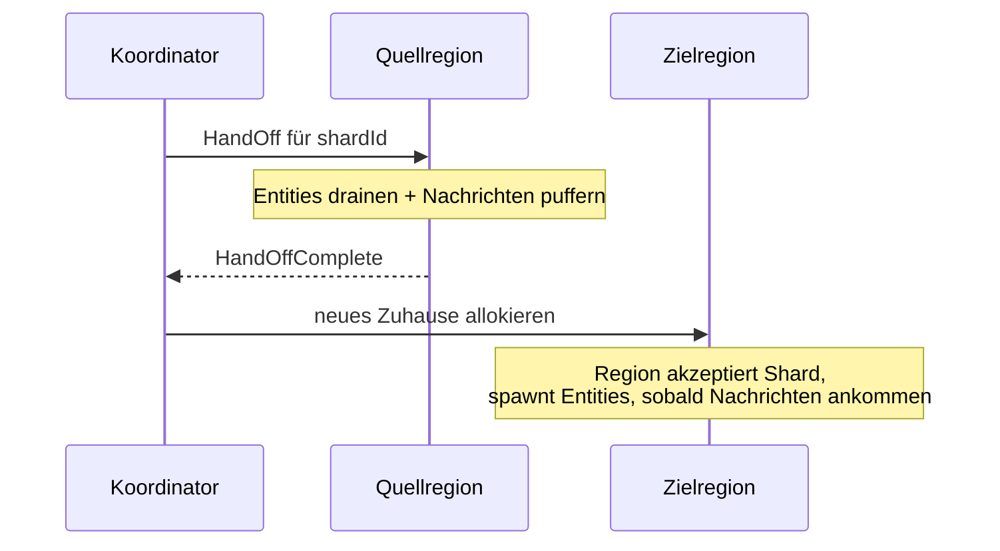

Wenn sich die Mitgliedschaft des Clusters ändert — ein Node tritt
bei oder geht — müssen Shards **wandern**, um die Last verteilt zu
halten. Der Koordinator treibt den Prozess: er wählt Shards aus,
die umziehen, sagt der Quellregion, sie soll übergeben, und wartet
auf Bestätigung, bevor er neu allokiert.



Das ist absichtlich **konservativ** — gepufferte Nachrichten
warten auf `HandOffComplete`, bevor sie an den neuen Besitzer
weitergeleitet werden, damit nichts an einer halb-verschobenen
Entity vorbei rast.

## Was Rebalance auslöst

Zwei Pfade:

1. **Mitgliedschaftsgetrieben** — `MemberUp` (ein neuer Node),
   `MemberRemoved` (ein gehender Node) oder jeder
   Cluster-Übergang, der die Kandidatenmenge ändert. Der
   Koordinator führt die Allokationsstrategie für jeden besessenen
   Shard erneut aus.
2. **Strategiegetrieben** — alle `rebalanceIntervalMs` (Default 2 s)
   fragt der Koordinator die
   [Allokationsstrategie](/de/cluster/sharding/allocation-strategy/)
   nach ihren Rebalance-Empfehlungen.
   `LeastShardAllocationStrategy` gibt Shards zum Drainen von
   beschäftigten Nodes zurück; `HashAllocationStrategy` gibt
   Shards zurück, deren Hash-Ziel gewandert ist.

Beide speisen denselben Handoff-Mechanismus.

## Die Handoff-Sequenz

Wenn der Koordinator entscheidet, dass Shard `X` von Node A zu
Node B wandern soll:

1. **`HandOff(X)`** wird an die Region von Node A geschickt.
2. Die Region von Node A markiert Shard `X` als `handing-off`. Sie
   *empfängt* weiterhin Nachrichten für Entities in `X`, aber
   **puffert** sie, statt sie an Entity-Actors weiterzuleiten.
3. Jede Entity in `X` erhält das Stop-Signal des Frameworks. Sie
   führen `postStop` aus, persistieren etwaigen Final-State und
   sterben.
4. Sobald alle Entities in `X` weg sind, schickt Node A
   **`HandOffComplete(X)`** an den Koordinator.
5. Der Koordinator führt `allocate(X, ...)` aus, um ein neues
   Zuhause zu wählen. Nehmen wir an, er wählt Node B.
6. Der Koordinator veröffentlicht den neuen Besitzer per Gossip.
   Gepufferte Nachrichten auf Node A beginnen, an die Region von
   Node B weiterzuleiten.
7. Die Region von Node B empfängt Nachrichten für Entities in `X`
   und spawnt Entities bei Bedarf (genau wie bei der
   Erst-Allokation).

Das Ganze dauert üblicherweise **sub-Sekunde bis ein paar
Sekunden**, abhängig davon, wie viele Entities im Shard sind und
wie lang ihre `postStop`-Arbeit dauert.

## Konfiguration

```ts
sharding.start(
  StartShardingOptions.create()
    // ...
    .withRebalanceIntervalMs(2_000)   // Strategie-getriebenes Rebalance alle 2s
    .withHandOffTimeoutMs(10_000),    // nach 10s aufgeben + zwangsweise neu allokieren
);
```

| Knopf | Default | Was |
| --- | --- | --- |
| `rebalanceIntervalMs` | 2000 | Wie oft die Strategie nach Rebalance-Empfehlungen befragt wird. |
| `handOffTimeoutMs` | 10_000 | Wenn die Quellregion nicht innerhalb dieses Fensters `HandOffComplete` sendet, gibt der Koordinator das Warten auf und allokiert zwangsweise neu. |

## Was gepufferte Nachrichten bedeuten

Während Shard `X` `handing-off` ist:

- Nachrichten an Entities in `X` kommen bei Node A an.
- Die Region von Node A puffert sie — leitet sie nicht an die
  (jetzt gestoppten) Entity-Actors weiter.
- Sobald der Handoff abgeschlossen ist und `X` einen neuen
  Besitzer hat, leiten gepufferte Nachrichten an die neue Region
  weiter.
- Die neue Region spawnt Entities und verarbeitet die Nachrichten
  in Reihenfolge.

Das bedeutet, dass **eine während des Handoffs gesendete Nachricht
verzögert ist**, nicht verloren. Die Kosten: Latenzspitzen während
Rebalance-Fenstern.

## Wenn Entities State haben

Für persistente Entities ([PersistentActor](/de/persistence/persistent-actor/)):

- `postStop` auf der Quellseite schließt etwaiges ausstehendes
  Persist ab.
- Die neue Entity-Instanz auf dem Ziel spielt das Journal beim
  Start ab.
- Die gepufferte Nachricht kommt bei einer vollständig
  wiederhergestellten Entity an.

Für nicht-persistente Entities ist der State zwischen
Inkarnationen **verloren** — der Rebalance entspricht einem
Restart, bei dem die gepufferte Nachricht als erstes Kommando
wirkt.

Wenn State über Rebalance hinweg zählt, nutze Persistenz. Das ist
nicht optional.

## Zwangsweise Neuallokation

Wenn `HandOffComplete` nicht innerhalb von `handOffTimeoutMs`
eintrifft:

- Der Koordinator loggt eine Warnung ("handoff timed out").
- Er allokiert den Shard zwangsweise auf seinen neuen Besitzer.
- Gepufferte Nachrichten leiten weiter, als wäre der Handoff
  normal abgeschlossen.
- **Die alten Entities sind möglicherweise noch am Leben** auf
  Node A — sie empfangen auch lokal Nachrichten, was zu
  **Split-Brain-Entities** führt, bis die Waisen sterben.

Das ist selten, aber möglich. Ursachen:

- Ein `postStop`, das hängt (langsamer Journal-Write, blockierender
  externer Call).
- Eine Netzwerkpartition während des Handoffs.

Abhilfe:

- Halte `postStop` kurz und nicht-blockierend.
- Tune `handOffTimeoutMs` auf deine Worst-Case-Persist-Zeit + Puffer.
- Für das Split-Brain-Risiko erwäge eine Lease auf dem
  Sharding-Koordinator (siehe
  [Sharding mit Lease](/de/cluster/sharding/with-lease/)).

## Rebalance vs. Skalierung

```
Node hinzugefügt    → Koordinator allokiert ihm einige Shards
Node entfernt       → Koordinator findet neue Heimaten für seine Shards
Node ↑ in Last      → LeastShardAllocationStrategy drainiert Shards weg
Node ↓ in Last      → kein Rebalance (nur die belastete Richtung löst aus)
```

Rebalance ist **Arbeitsabgabe**, nicht Arbeitseinwerbung. Ein
leerlaufender Node bekommt aus Sicht von
`LeastShardAllocationStrategy` neue Shards, sobald sie allokiert
werden, aber er bekommt keine existierenden Shards in sich
*verschoben*, nur weil er ruhig ist.

Für einen "immer-balanciert"-Effekt starte den Koordinator
periodisch neu (was Allokation von Null neu laufen lässt) — oder
konfiguriere `rebalanceThreshold: 1`, um auf jedes Ungleichgewicht
zu reagieren.

import { Aside } from '@astrojs/starlight/components';

<Aside type="caution" title="Gepufferte Nachrichten haben Speicherkosten">
  ```ts
  // Shard X handing off; 10 000 Nachrichten stapeln sich vor Abschluss
  ```
  Der Puffer ist unbegrenzt. In einem beschäftigten Cluster, wo
  ein langsamer Handoff mit hoher Nachrichtenrate zusammenfällt,
  kann der Puffer groß werden. Das ist kein Leak — gepufferte
  Nachrichten drainen bei Abschluss — aber überwache den Speicher
  unter Last.
</Aside>

<Aside type="caution" title="Häufiges Rebalance ist teuer">
  ```ts
  new LeastShardAllocationStrategy(1, 50);   // ✗ aggressiv
  ```
  Jedes Rebalance tötet Entities + spielt Journals auf dem neuen
  Zuhause neu ab. Für Actors mit großem State ist das teuer.
  Bevorzuge bei hohen Handoff-Kosten weniger Bewegungen
  (`rebalanceThreshold` höher, `maxSimultaneousRebalance`
  niedriger).
</Aside>

<Aside type="caution" title="Langes postStop = langer Handoff">
  ```ts
  override async postStop(): Promise<void> {
    await this.flushHugeCache();   // 30 Sekunden
  }
  ```
  Der Koordinator wartet bis zu `handOffTimeoutMs`, bis die
  Quelle fertig ist. Ein langsames `postStop` schießt am
  Default-Timeout von 10s vorbei und löst die zwangsweise
  Neuallokation mit Waisen-Entity-Risiko aus. Entweder
  `postStop` schnell halten oder `handOffTimeoutMs` entsprechend
  erhöhen.
</Aside>

## Wohin als Nächstes

- **[Sharding-Überblick](/de/cluster/sharding/overview/)** —
  das größere Bild.
- **[Allokationsstrategie](/de/cluster/sharding/allocation-strategy/)** —
  was die neuen Heimaten entscheidet.
- **[Remember Entities](/de/cluster/sharding/remember-entities/)** —
  beeinflusst, was nach Handoff neu gespawnt wird.
- **[Sharding mit Lease](/de/cluster/sharding/with-lease/)** —
  Split-Brain-Schutz für den Koordinator.
