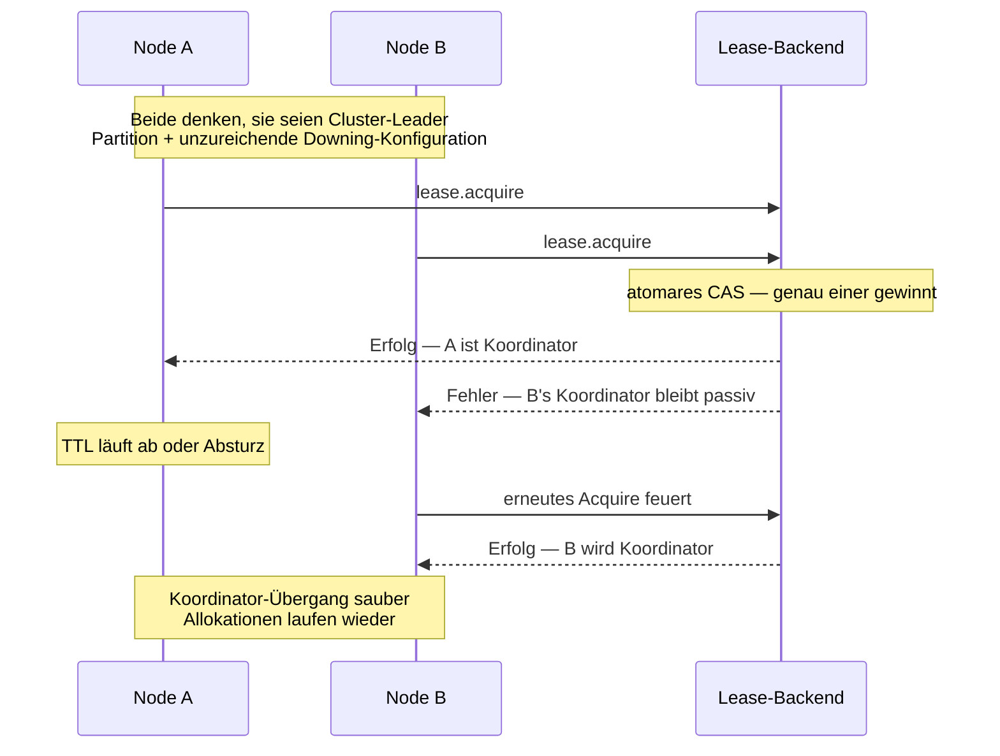

Der Sharding-Koordinator läuft als Cluster-Singleton — nur der
Koordinator des Leaders ist aktiv. Mit einer
[Downing-Strategie](/de/cluster/downing-strategies/) + gesundem
Netzwerk reicht das.

Während einer Netzwerkpartition + fehlerhafter Downing-Konfiguration
könnten **beide Hälften kurz denken, sie seien Leader** → zwei
Koordinatoren → widersprüchliche Shard-Allokationen → Entities
möglicherweise auf beiden Seiten gespawnt.

Die **Single-Writer-Lease** verhindert das:

```ts
import { ClusterSharding, KubernetesLease, KubernetesLeaseOptions, StartShardingOptions } from 'actor-ts';

const kubernetesLeaseOptions = KubernetesLeaseOptions.create()
  .withName('order-sharding-coordinator')
  .withOwner(process.env.POD_NAME!)
  .withTtlMs(30_000)
  .withNamespace(process.env.K8S_NAMESPACE!);
const startShardingOptions = StartShardingOptions.create<Cmd>()
  .withTypeName('order')
  .withEntityProps(Props.create(() => new OrderEntity()))
  .withExtractEntityId((msg) => msg.id)
  .withLease(new KubernetesLease(
    kubernetesLeaseOptions,
  ));
const sharding = cluster.sharding.start(
  startShardingOptions,
);
```

Selbst wenn zwei Nodes beide denken, sie seien Leader, **hält nur
einer die Lease**. Nur der Koordinator des Lease-Halters
verarbeitet Shard-Allokationen.

## Wie es funktioniert



Das Lease-Backend (K8s-API-Server, etcd) liefert die **atomare
Exactly-One-Holder-Garantie** — die Quelle der Wahrheit jenseits
von Gossip.

## Konfiguration

```ts
interface StartShardingOptionsType<TMsg> {
  // ... Basis-Sharding-Settings ...
  lease?:                   Lease;
  acquireRetryIntervalMs?:  number;     // Default 5000
}
```

| Feld | Zweck |
| --- | --- |
| `lease` | Die `Lease`-Instanz — typisch `KubernetesLease`. |
| `acquireRetryIntervalMs` | Retry-Takt nach fehlgeschlagenem Acquire. |

Dieselbe `Lease`-Abstraktion wie bei
[Singleton mit Lease](/de/cluster/singleton/with-lease/) —
siehe [Coordination](/de/coordination/overview/) für die
Schnittstelle.

## Was geschützt wird

Die Lease gated **Schreibvorgänge auf den Koordinator-State**:

- **Shard-Allokationen** — Shards an Regionen zuweisen.
- **Rebalance-Entscheidungen** — Shards zwischen Regionen
  bewegen.
- **Handoff-Koordination** — Shard-Handoffs orchestrieren.

Die Lease **gated nicht**:

- Per-Region-Entity-Hosting (Regionen hängen an tatsächlichen
  Cluster-Mitgliedern, nicht am Koordinator).
- Entity-Messaging (Nachrichten routen über die letzte bekannte
  Allokation des Koordinators; die Lease ist nicht im
  Nachrichten-Pfad).

Im schlimmsten Fall sind während einer Partition also **leicht
veraltete Shard-Zuweisungen** möglich — Entities laufen weiter,
nur keine neuen Allokationen, bis Lease-Besitz sich stabilisiert.

## Wann aktivieren

Drei gute Anwendungen:

1. **Produktions-Multi-Region-Cluster**, in denen Partitionen
   plausibel sind.
2. **Finanz-/Inventar-Entities**, bei denen Doppelallokation
   echten Schaden anrichten würde.
3. **Compliance**, die "keine Möglichkeit eines Split-Brain in
   irgendeinem Single-Tenant-Produktionssystem" verlangt.

Für **typische Single-Region-K8s-Deployments** mit einer
[Downing-Strategie](/de/cluster/downing-strategies/) ist die Lease
**paranoid-sicher** — fügt operative Komplexität für Schutz gegen
seltene Edge Cases hinzu.

## Operative Überlegungen

### Verfügbarkeit des Lease-Backends

```
K8s-API-Server-Ausfall → kein Replica kann acquiren → keine Shard-Allokationen
```

Das Lease-Backend wird zum SPOF. Für die meisten Setups ist die
K8s-API-Verfügbarkeit viel höher als die des Clusters selbst —
aber plane den seltenen Fall ein.

### Failover-Latenz

```
Alter Koordinator verliert die Lease (TTL-Ablauf: 30s)
  → neuer Koordinator acquired (typisch sub-Sekunde nach TTL)
  → neuer Koordinator baut State aus Gossip + Journal wieder auf
```

Das Failover-Fenster ist das **Lease-TTL** — typisch ~30 s.
Während dieses Fensters:

- **Keine neuen Shard-Allokationen** finden statt.
- **Existierende Entities laufen weiter** und empfangen
  Nachrichten.
- **Neue Entity-IDs**, die Allokation brauchen, stauen sich; nach
  Failover verarbeitet.

Für die meisten Workloads akzeptabel.

### Kombination mit regulärem Downing

```ts
{
  downingProvider: new KeepMajority(),
  // + die Sharding-Lease
  lease: ...,
}
```

Beide Schichten aktiv. Downing handhabt normale
Cluster-Konvergenz; die Lease garantiert die
Koordinator-Einzigartigkeits-Invariante.

## Das Schutzniveau lesen

| Setup | Koordinator-Einzigartigkeitsgarantie |
| --- | --- |
| Kein Downing, keine Lease | Best-Effort. Partitionen verursachen doppelte Koordinatoren. |
| Nur Downing-Strategie | Stark in stabilen Netzwerken. |
| Downing + Lease | Paranoid-sicher. Beide Invarianten erzwungen. |

Für Singleton- + Sharding-Produktion-Setups in
kritisch-datenrelevanten Szenarien ist **beides** das empfohlene
Muster.

import { Aside } from '@astrojs/starlight/components';

<Aside type="caution" title="Verfügbarkeit des Lease-Backends">
  ```
  Lease-Backend unten → kein Koordinator → keine neuen Shards
  ```
  K8s-API-Ausfälle stauen neue Allokationen. Existierende
  Entities laufen weiter, aber neue werden in Warteschlange
  gestellt. Plane für K8s-API-Zuverlässigkeit.
</Aside>

<Aside type="caution" title="Lease ohne Downing">
  ```ts
  // Nur die Lease, keine Downing-Strategie
  ```
  Die Lease schützt die Einzigartigkeit des Koordinators, **löst
  aber keine Partitionen auf**. Beide Seiten laufen für immer mit
  ihrem Vor-Partitions-State weiter. Kombiniere mit Downing.
</Aside>

## Wohin als Nächstes

- **[Sharding-Überblick](/de/cluster/sharding/overview/)** —
  das Fundament.
- **[Singleton mit Lease](/de/cluster/singleton/with-lease/)** —
  dasselbe Muster für Singletons.
- **[Coordination-Überblick](/de/coordination/overview/)** —
  die Lease-Abstraktion.
- **[KubernetesLease](/de/coordination/kubernetes-lease/)** —
  das Produktions-Backend.
- **[Downing-Strategien](/de/cluster/downing-strategies/)** —
  der ergänzende Partitions-Auflöser.
