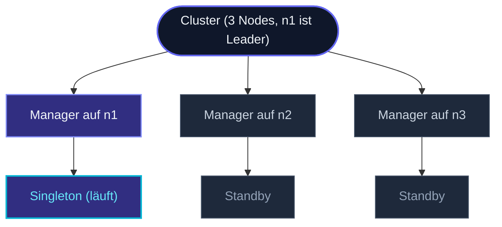
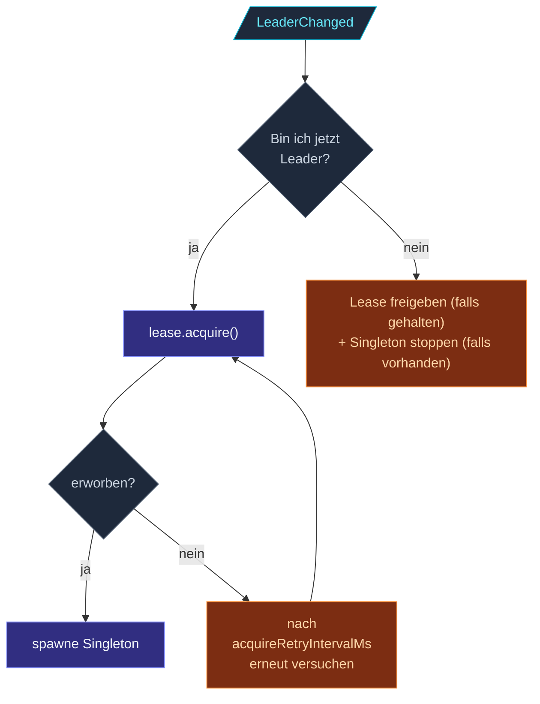

`ClusterSingletonManager` ist der **Per-Node**-Actor, der die
Singleton-Wahl-Logik trägt. Jeder Node fährt einen; nur der
Manager des Leaders hat ein aktives Singleton-Kind. Bei
Leader-Wechseln stoppt der alte Manager sein Kind; der neue
Manager spawnt eins.



Der Proxy auf jedem Node verfolgt "wo ist der Manager des
Leaders?" und routet Nachrichten dorthin. Wenn `n1` geht, wird
der Manager auf `n2` oder `n3` Leader, spawnt den Singleton, und
die Proxies verschieben ihr Ziel.

## Konfiguration

```ts
import { ClusterSingletonManager, ClusterSingletonManagerOptions, Props } from 'actor-ts';

const clusterSingletonManagerOptions = ClusterSingletonManagerOptions.create()
  .withCluster(cluster)
  .withTypeName('job-scheduler')
  .withSingletonProps(Props.create(() => new JobScheduler()))
  .withRole('control-plane')            // optional
  .withLease(leaseImpl)                  // optionaler Split-Brain-Schutz
  .withAcquireRetryIntervalMs(5_000);
system.spawn(
  ClusterSingletonManager.props(
    clusterSingletonManagerOptions,    // wenn Lease-Acquire scheitert
  ),
  'singleton-manager-job-scheduler',
);
```

| Feld | Erforderlich | Was |
| --- | --- | --- |
| `cluster` | Ja | Der Cluster, den der Manager beobachtet. |
| `typeName` | Ja | Logischer Name für diesen Singleton; Name des Kind-Actors. |
| `singletonProps` | Ja | Wie der Singleton konstruiert wird. Wird nur auf dem Leader aufgerufen. |
| `role` | Nein | Auf Nodes mit dieser Rolle beschränken. Manager anderer Nodes bleiben passiv. |
| `lease` | Nein | Falls gesetzt, muss der Leader diese Lease erwerben, bevor er den Singleton spawnt. |
| `acquireRetryIntervalMs` | Nein (Default 5s) | Retry-Takt nach einer fehlgeschlagenen Lease-Akquisition. |

## Die Namenskonvention

Der Manager **muss** an einem Pfad gespawnt werden, der
folgendem entspricht:

```
actor-ts://<system>/user/singleton-manager-<typeName>
```

Daher der Actor-Name `'singleton-manager-job-scheduler'` oben,
wenn `typeName = 'job-scheduler'`. Der
[ClusterSingletonProxy](/de/cluster/singleton/overview/) nutzt
diese Pfad-Konvention, um den Manager auf dem Node zu finden, der
gerade Leader ist.

Wenn du falsch benennst, kann der Proxy nicht routen — stiller
Bruch. Immer:

```ts
import { singletonManagerPath } from 'actor-ts';

const path = singletonManagerPath(system.name, 'job-scheduler');
// "actor-ts://<sysName>/user/singleton-manager-job-scheduler"
```

Du kannst diesen Helper verwenden, wenn du sicherstellen willst,
dass der Pfad passt.

## Die zwei operativen Pfade

### Ohne Lease (Default)

```
LeaderChanged → bin ich jetzt Leader? → ja → spawne Singleton
                                      → nein → stoppe meinen Singleton (falls vorhanden)
```

Synchrone Reconcile. Sobald Gossip sagt, dieser Node sei der
Leader, spawnt der Manager sein Singleton-Kind. Einfach, schnell.

**Nachteil**: während einer **Partition** kann jede Hälfte einen
eigenen Leader haben. Beide Manager spawnen ihren Singleton. Zwei
Singletons existieren — genau der Fall, gegen den Singleton
schützen soll.

### Mit Lease

```ts
const managerOptions = ClusterSingletonManagerOptions.create()
  // ...
  .withLease(someLeaseImpl);
ClusterSingletonManager.props(managerOptions);
```

Fügt ein asynchrones Gate über die Lease hinzu. Der Ablauf:



Der Lease-Provider — typisch eine Kubernetes-Lease-Ressource —
garantiert höchstens einen Halter clusterweit. Selbst wenn zwei
Manager denken, sie seien Leader, kann nur einer die Lease
erwerben, und nur dieser spawnt den Singleton.

Das Framework nutzt **interne Events** (keine inline awaits) für
Zustandsübergänge, sodass parallele Cluster-Events sich nicht mit
einem laufenden Acquire verschränken können.

Siehe [Singleton mit Lease](/de/cluster/singleton/with-lease/)
für die Konfiguration und Lease-Implementierungsoptionen.

### Lease verloren

```
Lease verloren (widerrufen, Renew fehlgeschlagen) → Singleton sofort stoppen
```

Wenn die Lease **widerrufen** wird (jemand anders hat sie
erworben, oder das Renew des Providers ist fehlgeschlagen), stoppt
der Manager den Singleton und wartet. Wenn `LeaderChanged` erneut
feuert (z. B. der Manager bemerkt, dass er per Gossip immer noch
als Leader gesehen wird), versucht er `lease.acquire()` erneut.

## Das Kind beobachten

Der Manager **death-watcht** das Singleton-Kind. Wenn das Kind
abstürzt (ein Uncaught-Error erreicht die Escalate-Direktive
seines Supervisors), greift die normale Supervision des
Frameworks — standardmäßig wird das Kind neu gestartet. Der
Manager greift nicht ein, wenn sich das Leadership nicht auch
geändert hat.

Wenn das Kind sich explizit selbst stoppt (`context.stopSelf()`),
sieht der Manager das Terminated, gibt die Lease frei (falls
gehalten) und **spawnt nicht erneut**. Der Singleton ist weg, bis
der nächste Leader-Wechsel kommt.

Wenn du willst, dass ein sich selbst stoppender Singleton neu
gespawnt wird, ist der Manager nicht der richtige Ort — schreibe
einen Watchdog-Actor auf einer Ebene darüber, oder lass den
Singleton seinen State selbst überwachen und sich nie selbst
stoppen.

## Restart-Semantik

Wenn der Manager selbst ausfällt (was selten ist), startet sein
Supervisor (typisch der User-Guardian) ihn neu. Beim Neustart:

- Cluster-Subscriptions werden neu aufgebaut.
- Der aktuelle Leader wird erneut abgefragt.
- Falls dieser Node immer noch Leader ist, wird Lease-Acquire
  (sofern relevant) erneut versucht, und der Singleton wird frisch
  gespawnt.

Der State des alten Singletons ist **verloren**, es sei denn, er
persistiert sich selbst. Für stateful Singletons nutze
[PersistentActor](/de/persistence/persistent-actor/).

## Wann du direkt mit dem Manager interagieren würdest

Normalerweise gar nicht. Der Proxy ist der Vertrag — `tell` an
den Proxy, Antworten empfangen, den Manager nie anfassen.

Direkter Manager-Kontakt ist nur nützlich für:

- **Tests**, die das Wahl-Protokoll wie erwartet verifizieren.
- **Diagnostik** in Produktion — "ist der Manager auf diesem Node
  aktiv?" über die Management-Endpoints.
- **Eigene Singleton-Muster**, die nicht zur Proxy-Abstraktion
  passen (selten; meist ein Zeichen dafür, dass das
  Singleton-Modell für den Anwendungsfall nicht passt).

## Diagnostik

```ts
import { MemberUp, LeaderChanged } from 'actor-ts';

cluster.subscribe(LeaderChanged, (evt) => {
  console.log(`Leader ist jetzt ${evt.leader}`);
});
```

Das Verhalten des Managers wird vollständig von diesen Events
gesteuert. Wenn du vermutest, dass der Manager sich falsch
verhält, logge `LeaderChanged` + `MemberUp` / `MemberRemoved`, um
zu sehen, was der Manager sieht.

Für den Lease-Pfad logge auch `lease.acquire()`-Rückgaben — der
Manager loggt diese standardmäßig auf Debug-Level.

import { Aside } from '@astrojs/starlight/components';

<Aside type="caution" title="Manager muss auf jedem Node gespawnt werden">
  ```ts
  // Manche Nodes spawnen den Manager, andere nicht
  ```
  Der Proxy erwartet den Manager am bekannten Pfad auf dem Node,
  der gerade Leader ist. Wenn der Leader-Node den Manager nicht
  gespawnt hat, kann der Proxy nicht routen — Nachrichten landen
  in Dead Letters. Spawne den Manager entweder immer, oder
  schränke per Rolle ein, sodass nur Rollen-tragende Nodes
  Leader werden können.
</Aside>

<Aside type="caution" title="Manager-Name muss der Konvention folgen">
  ```ts
  system.spawn(ClusterSingletonManager.props(ClusterSingletonManagerOptions.create()/* ... */), 'whatever');
  // ✗ Proxy sucht `/user/singleton-manager-<typeName>`, nicht /user/whatever
  ```
  Nutze `singletonManagerPath(...)` oder buchstabier die
  Konvention aus. Das Framework erzwingt sie nicht; falsch
  benannte Manager sind für Proxies unsichtbar.
</Aside>

<Aside type="caution" title="Lease-Fehler ohne Retry">
  ```ts
  acquireRetryIntervalMs: 0,
  ```
  Auf 0 setzen deaktiviert Retries — ein einzelnes
  fehlgeschlagenes Acquire lässt den Singleton un-gespawnt, bis
  das nächste `LeaderChanged`-Event kommt. Nutze einen sinnvollen
  Wert (Default 5s ist für die meisten Lease-Provider
  vernünftig).
</Aside>

## Wohin als Nächstes

- **[Singleton-Überblick](/de/cluster/singleton/overview/)** —
  das größere Bild: Proxy + Manager + Singleton.
- **[Singleton mit Lease](/de/cluster/singleton/with-lease/)** —
  Details zum Split-Brain-Schutz.
- **[Coordination](/de/coordination/overview/)** — die
  Lease-Abstraktion.
- **[Cluster-Überblick](/de/cluster/overview/)** — wie
  Leader-Wahl auf Cluster-Ebene funktioniert.

Die [`ClusterSingletonManager`](/api/classes/clustersingletonmanager/)
API-Referenz deckt alle Nachrichten-Typen und Einstellungen ab.
