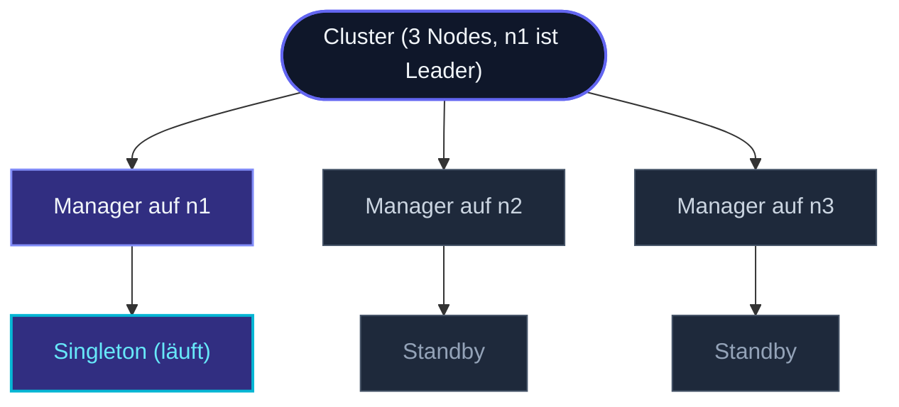
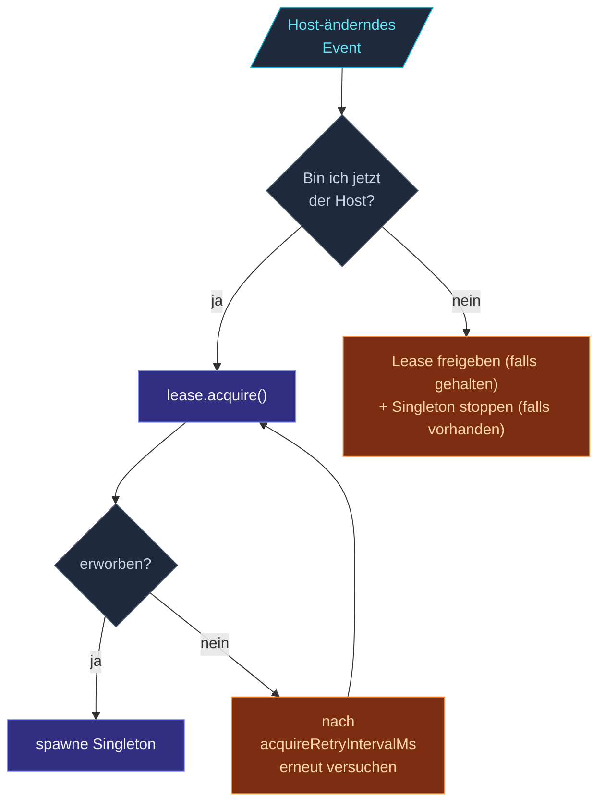

`ClusterSingletonManager` ist der **Per-Node**-Actor, der die
Singleton-Wahl-Logik trägt. Jeder Node fährt einen; nur der
Manager des Leaders hat ein aktives Singleton-Kind. Bei
Leader-Wechseln stoppt der alte Manager sein Kind; der neue
Manager spawnt eins.


```mermaid
flowchart TB
  CLUSTER(["Cluster (3 Nodes, n1 ist Leader)"])
  M1["Manager auf n1"]
  M2["Manager auf n2"]
  M3["Manager auf n3"]
  S["Singleton (läuft)"]
  STB1["Standby"]
  STB2["Standby"]
  CLUSTER --> M1
  CLUSTER --> M2
  CLUSTER --> M3
  M1 --> S
  M2 --> STB1
  M3 --> STB2
  classDef cluster fill:#0f172a,stroke:#6366f1,stroke-width:2px,color:#f1f5f9;
  classDef leader  fill:#312e81,stroke:#818cf8,stroke-width:1.5px,color:#f1f5f9;
  classDef mgr     fill:#1e293b,stroke:#475569,color:#cbd5e1;
  classDef active  fill:#312e81,stroke:#06b6d4,stroke-width:2px,color:#67e8f9;
  classDef passive fill:#1e293b,stroke:#475569,color:#94a3b8;
  class CLUSTER cluster
  class M1 leader
  class M2,M3 mgr
  class S active
  class STB1,STB2 passive
```

Der Proxy auf jedem Node verfolgt "wo ist der Manager des
Leaders?" und routet Nachrichten dorthin. Wenn `n1` geht, wird
der Manager auf `n2` oder `n3` Leader, spawnt den Singleton, und
die Proxies verschieben ihr Ziel.

## Konfiguration

Der Manager wird nicht von Hand gespawnt — `cluster.singleton.start(...)`
tut das, am bekannten Pfad, den Proxies adressieren, und die
Start-Options unten sind das, was dabei konfiguriert wird:

```ts
import { SingletonKey, StartSingletonOptions } from 'actor-ts/cluster';

const singletonOptions = StartSingletonOptions.create<JobCommand>()
  .withRole('control-plane')            // optional
  .withLease(leaseImpl)                 // optionaler Split-Brain-Schutz
  .withAcquireRetryIntervalMs(5_000)    // Retry-Takt, wenn Lease-Acquire scheitert
  .withHandOverTimeoutMs(10_000);       // wie lange auf das Zurücktreten der Peers gewartet wird
cluster.singleton.start(JobScheduler, singletonOptions);
```

Die `ClusterSingletonManagerOptions` des Managers selbst — `cluster`,
`typeName`, `singletonActor` und die vier obigen — setzt die Extension
daraus zusammen. Die Felder stehen hier, weil der Manager auf sie
reagiert, nicht weil du sie konstruierst:

| Feld | Erforderlich | Was |
| --- | --- | --- |
| `cluster` | Ja | Der Cluster, den der Manager beobachtet. |
| `typeName` | Ja | Logischer Name für diesen Singleton; Name des Kind-Actors. |
| `singletonActor` | Ja | Wie der Singleton konstruiert wird. Wird nur auf dem Host aufgerufen. |
| `role` | Nein | Das Hosten auf Nodes mit dieser Rolle beschränken. Manager anderer Nodes bleiben passiv. |
| `lease` | Nein | Falls gesetzt, muss der Host diese Lease erwerben, bevor er den Singleton spawnt. |
| `acquireRetryIntervalMs` | Nein (Default 5s) | Retry-Takt nach einer fehlgeschlagenen Lease-Akquisition. |
| `handOverTimeoutMs` | Nein (Default 10s) | Wie lange gewartet wird, bis jeder berechtigte Peer bestätigt hat, dass er nicht hostet, bevor trotzdem gehostet wird. Siehe [Wenn niemand antwortet](#wenn-niemand-antwortet). |
| `restartOnTermination` | Nein (Default `true`) | Den Singleton nach einem unerwarteten Tod der Instanz neu spawnen. Nur für Actors abschalten, die `stopSelf()` als Endzustand nutzen. |

### Welche Node hostet

Ohne `role` ist der Host der Cluster-Leader.  Mit `role` ist es das
**erste Up-Member, das diese Rolle trägt** — nicht „der Leader, sofern
er die Rolle zufällig trägt“; das würde den Singleton immer dann
nirgends hosten, wenn der gewählte Leader sie nicht trägt.  Beide
Formen lesen dieselbe adressgeordnete Member-Liste, also wählt jede
Node unabhängig dieselbe aus, und der Proxy löst den Host genau so auf
wie die Manager.

Dieselbe Regel — aber jede Node wendet sie auf *ihre eigene* Sicht des
Clusters an.  Diese Sichten stimmen überein, sobald Gossip konvergiert
ist, und genau deshalb funktioniert das; auseinanderfallen können sie
bei Unerreichbarkeit, und die ist
[bewusst davon ausgenommen, was den Host
verschiebt](#unerreichbarkeit-ist-bewusst-kein-trigger).

## Die Namenskonvention

Der Manager **muss** an einem Pfad gespawnt werden, der
folgendem entspricht:

```
actor-ts://<system>/system/cluster/singleton/manager-<typeName>
```

Daher der Actor-Name `'singleton-manager-job-scheduler'` oben,
wenn `typeName = 'job-scheduler'`. Der
[ClusterSingletonProxy](/de/cluster/singleton/overview/) nutzt
diese Pfad-Konvention, um den Manager auf dem Node zu finden, der
gerade Leader ist.

Wenn du falsch benennst, kann der Proxy nicht routen — stiller
Bruch. Immer:

```ts
import { singletonManagerPath } from 'actor-ts/cluster';

const path = singletonManagerPath(system.name, 'job-scheduler');
// "actor-ts://<sysName>/system/cluster/singleton/manager-job-scheduler"
```

Du kannst diesen Helper verwenden, wenn du sicherstellen willst,
dass der Pfad passt.

## Worauf der Manager reagiert

Der Host eines Singletons ist das **erste adressensortierte
Up-Mitglied**: der Cluster-Leader — oder, bei einer Rollen-Einschränkung,
das erste Mitglied, das diese Rolle trägt. Der Host wandert also bei
*jedem* Übergang in den Zustand `up` hinein oder aus ihm heraus, nicht
nur bei einem Leader-Wechsel:

| Event | Warum es den Host verschieben kann |
| --- | --- |
| `LeaderChanged` | Der uneingeschränkte Host **ist** der Leader. |
| `SelfUp` | Dieser Node ist gerade hosting-fähig geworden. |
| `MemberUp` | Ein Mitglied ist der Up-Menge beigetreten — möglicherweise unterhalb des aktuellen Hosts. |
| `MemberDown` / `MemberLeft` / `MemberRemoved` | Der Host ist im Begriff zu gehen. |

`MemberJoined` und `MemberWeaklyUp` fehlen bewusst: Weder `joining`- noch
`weakly-up`-Mitglieder tauchen in `upMembers()` auf, also kann keines von
beiden hosten.

### Unerreichbarkeit ist bewusst kein Trigger

`MemberUnreachable` und `MemberReachable` verschieben den Host
**sehr wohl** — ein unerreichbares Mitglied fällt aus `upMembers()`
heraus, ohne entfernt zu werden — und stehen trotzdem nicht in der
Menge.

Jedes Event, das *in* der Menge steht, benennt eine
Mitgliedschaftstatsache, auf die der ganze Cluster konvergiert; jeder
Node berechnet damit denselben Host. Unerreichbarkeit ist das nicht.
Sie ist die Aussage des Failure Detectors *eines* Nodes: *„ich erreiche
dieses Mitglied nicht"* — und das Mitglied, um das es geht, kann die
Peers, die sich diese Meinung gebildet haben, gar nicht hören; es zu
erreichen ist ja genau das, was fehlgeschlagen ist. Ein Manager, der
darauf reconcilen würde, beförderte sich selbst, während der Amtsinhaber
— dem niemand etwas sagt — sein Kind behält. Kein Leader wandert, also
löst nichts es auf: Der Cluster betreibt für die Dauer des Ausfalls
**zwei lebende Singletons**.

Der Preis des Weglassens ist real und der kleinere. Solange ein
Rollen-Host für seine Peers unerreichbar ist, gilt das Singleton aus
deren Sicht als nirgends gehostet, und ihre Nachrichten
[gehen in die Dead Letters](#nachrichten-während-niemand-hostet), bis
das Mitglied gedownt wird (`downAfterMs`) oder zurückkehrt.
Verfügbarkeit ist wiederherstellbar und durch Downing begrenzt; ein
zweites lebendes Singleton ist beides nicht. Auf dem Pfad ohne Lease
kannst du nicht beides haben — einen unerreichbaren Node kann man nicht
bitten zurückzutreten. Wenn du beides brauchst, ist genau dafür
[der Lease-Pfad](#mit-lease) da: Er wird von einer dritten Instanz
arbitriert, die beide Seiten *erreichen können*, also hält ihn genau
eine von ihnen.

An den Rändern geht nichts verloren. Die Auflösung einer
Unerreichbarkeit kommt so oder so als Event an, das in der Menge steht:
Downing feuert `MemberDown`, und die Erholung feuert `MemberUp` neben
`MemberReachable`.

**Vor v0.17.0 war der Trigger allein `LeaderChanged`.** Ein
rollentragendes Mitglied, das *unterhalb* eines rollenlosen Leaders
beitritt, verschiebt den Rollen-Host und ändert keinen Leader — es feuerte
also nichts. Der beitretende Node spawnte trotzdem (über sein eigenes
`SelfUp`), dem Amtsinhaber wurde nie gesagt, er solle stoppen, und der
Cluster pendelte sich auf **zwei lebende Singletons** ein. Wenn du auf
einer älteren Version bist, ist das die Form, nach der du suchen
solltest.

## Die zwei operativen Pfade

### Ohne Lease (Default)

```
Host-änderndes Event → bin ich jetzt der Host? → ja → bitte jeden berechtigten Peer zurückzutreten
                                                     → alle bestätigt → spawne Singleton
                                               → nein → stoppe meinen Singleton (falls vorhanden)
```

Reconcile direkt aus dem Cluster-Event-Subscriber, ein Host-Wechsel ist
also im Moment des Events sichtbar.

**Der Spawn ist aber keine lokale Entscheidung.** Bevor der Manager hostet,
schickt er ein `singleton.HandOverRequest` an jeden Node, den seine eigene
Sicht als berechtigt führt — jedes `up`-Mitglied, oder jedes
`up`-Mitglied mit der Rolle — und wartet, bis jeder davon mit
`singleton.HandOverAcknowledgment` antwortet. Ein Node antwortet erst,
wenn er keine Instanz hält *und* keine eigene mehr am Stoppen ist — die
Antwort handelt also von einem abgeschlossenen `postStop`, nicht davon,
dass ein `PoisonPill` eingereiht wurde.

Warum er *alle* fragt und nicht den vorherigen Host: ein Node, der gerade
beigetreten ist, hat überhaupt keine Vorstellung von einem vorherigen Host,
und Beitreten ist der häufige Fall (ein Node befördert sich über sein
eigenes `SelfUp`). Jeder berechtigte Node betreibt einen Manager — genau
das bedeutet „rufe `start()` auf jedem Node auf, der Host werden kann“ —
und der abtretende Host ist per Definition das erste Mitglied dieser Menge,
ein Rundruf an alle kann ihn also nicht verpassen. Ein Node, der nur
`ref(...)` aufruft, antwortet ebenfalls, sofort und wahrheitsgemäß: er
betreibt keinen Manager, hostet also sicher nicht.

Nachrichten, die während des Wartens eintreffen, werden **zurückgehalten**
und der Instanz übergeben, sobald sie spawnt. Das Warten ist ein Fenster,
das das Protokoll selbst aufmacht; Einzigartigkeit mit Nachrichtenverlust
bei jedem Host-Wechsel zu bezahlen ist nicht der Tausch, der hier gemacht
wird.

**Nachteil**: während einer **Partition** kann jede Hälfte einen eigenen
Leader haben, und keine kann die andere bitten zurückzutreten — sie zu
erreichen ist genau das, was fehlgeschlagen ist. Nach
`handOverTimeoutMs` hostet jede trotzdem, es existieren also zwei
Singletons. Genau dafür ist der Lease-Pfad da.

### Mit Lease

```ts
const singletonOptions = StartSingletonOptions.create<JobCommand>()
  .withLease(someLeaseImpl);
cluster.singleton.start(JobScheduler, singletonOptions);
```

Fügt ein asynchrones Gate über die Lease hinzu. Der Ablauf:


```mermaid
flowchart TB
  EVT[/"Host-änderndes<br/>Event"/]
  ASK{"Bin ich jetzt<br/>der Host?"}
  ACQ["lease.acquire()"]
  GOT{"erworben?"}
  SPAWN["spawne Singleton"]
  RETRY["nach<br/>acquireRetryIntervalMs<br/>erneut versuchen"]
  RELEASE["Lease freigeben (falls gehalten)<br/>+ Singleton stoppen (falls vorhanden)"]
  EVT --> ASK
  ASK -- "ja" --> ACQ
  ASK -- "nein"  --> RELEASE
  ACQ --> GOT
  GOT -- "ja" --> SPAWN
  GOT -- "nein"  --> RETRY
  RETRY --> ACQ
  classDef evt    fill:#1e293b,stroke:#06b6d4,color:#67e8f9;
  classDef ok     fill:#312e81,stroke:#818cf8,color:#f1f5f9;
  classDef warn   fill:#7c2d12,stroke:#fb923c,color:#fed7aa;
  classDef step   fill:#1e293b,stroke:#475569,color:#cbd5e1;
  class EVT evt
  class ACQ,SPAWN ok
  class RETRY,RELEASE warn
  class ASK,GOT step
```

Der Lease-Provider — typisch eine Kubernetes-Lease-Ressource —
garantiert höchstens einen Halter clusterweit. Selbst wenn zwei
Manager denken, sie seien Leader, kann nur einer die Lease
erwerben, und nur dieser spawnt den Singleton.

Das Framework nutzt **interne Events** (keine inline awaits) für
Zustandsübergänge, sodass parallele Cluster-Events sich nicht mit
einem laufenden Acquire verschränken können.

Siehe [Singleton mit Lease](/de/cluster/singleton/with-lease/)
für die Konfiguration und Lease-Implementierungsoptionen.

### Lease verloren

```
Lease verloren (widerrufen, Renew fehlgeschlagen) → Singleton stoppen → warten, bis er weg ist
                                                  → dann Acquire erneut versuchen
```

Wenn die Lease **widerrufen** wird (jemand anders hat sie erworben, oder
das Renew des Providers ist fehlgeschlagen), stoppt der Manager den
Singleton — mit einem `PoisonPill`, die Instanz drainiert also ihre Mailbox
und führt `postStop` aus — und versucht `lease.acquire()` erst wieder,
wenn das abgeschlossen ist.

**Vor v0.17.0 hat er sofort neu erworben**, und die Folge waren nicht zwei
Instanzen, sondern keine: das Acquire konnte fertig werden, während die
alte Instanz noch in `postStop` war, der Spawn dahinter wurde abgelehnt,
weil noch ein Stop unterwegs war, und die folgende Reconcile las „Lease
gehalten“ als „läuft schon“ und tat nichts. Der Manager erneuerte dann
dauerhaft eine Lease über gar keinen Singleton, und kein anderer Node
konnte übernehmen.

### Mit Lease zurücktreten

```
Host ist weitergewandert → Singleton stoppen → warten, bis er weg ist → Lease freigeben
```

Die Freigabe ist die Erlaubnis für einen Folger zu spawnen, sie passiert
also erst, wenn die Instanz dieses Nodes wirklich terminiert ist. **Vor
v0.17.0 wurde sie freigegeben, sobald das `PoisonPill` eingereiht war** —
was nichts darüber sagt, ob die Instanz weg ist — ein Folger konnte die
Lease also gewinnen und starten, während die vorherige noch drainierte. Das
ist genau die Garantie, für die die Lease da ist, eine Zeile zu früh
verschenkt.

## Wenn niemand antwortet

`handOverTimeoutMs` (Default **10 s**) begrenzt das Warten, und das Warten
endet in jedem Fall mit einem Spawn:

```ts
const singletonOptions = StartSingletonOptions.create<Command>()
  .withTypeName('job-scheduler')
  .withActor(JobScheduler)
  .withHandOverTimeoutMs(30_000);
```

Ein gesunder Hand-over kostet einen Netzwerk-Roundtrip und erreicht den
Timeout nie — die Anfrage wird alle halbe Sekunde erneut gesendet, solange
sie offen ist, denn ein Cluster-Envelope ist Fire-and-forget und ein
einzelner Frame kann hinter einem Handshake verloren gehen. Auf einen Peer,
der **geht**, während die Anfrage offen ist, wird nicht weiter gewartet: er
ist aus der berechtigten Menge herausgefallen, die eigene Sicht dieses Nodes
sagt also schon, dass er nicht hosten kann. Den Timeout zu erreichen
bedeutet, dass ein berechtigter Peer, der noch `up` ist, gar nicht
geantwortet hat: er ist von hier unerreichbar, oder er hält sich weiterhin
für den Host und hat abgelehnt.

Der Manager hostet dann **trotzdem** und sagt das auf `warn`, mit den Namen
der Peers, die stumm geblieben sind. Das ist die bewusste Wahl zwischen
zwei Eigenschaften, die auf dem Pfad ohne Lease nicht beide zu haben sind.
Ewig zu warten würde den Singleton für die Dauer der Störung nirgends
gehostet lassen; zu hosten bedeutet, dass die Einzigartigkeits-Invariante
*nicht bewiesen* wurde — was etwas anderes ist als „eingehalten“, und die
Warnung ist genau so zu lesen.

Wo die Invariante das überleben muss, nimm eine
[Lease](/de/cluster/singleton/with-lease/). Eine dritte Instanz, die beide
Seiten erreichen können, ist der einzige Schiedsrichter, der bleibt, wenn
die beiden einander nicht erreichen können.

Eine Konfiguration bezahlt den Timeout unnötig: ein Node, der `up`-Mitglied
ist, Host werden könnte und den Singleton nie erwähnt — weder `start(...)`
noch `ref(...)`. Er hat nichts registriert, womit er antworten könnte, ist
also von einem unerreichbaren nicht zu unterscheiden. Gib dem Singleton
eine `role` und setze die Rolle nur auf die teilnehmenden Nodes, oder rufe
auf den anderen `ref(...)` auf.

## Wer einen Hand-over verlangen darf

Eine Hand-over-Anfrage stoppt den Singleton, eine unauthentifizierte wäre
also ein Remote-Kill-Switch. Zwei Dinge sichern sie ab, und beide folgen
aus der Wahlregel, die die Manager schon teilen:

- Die Anfrage wird nur von einer Adresse befolgt, die der **Transport**
  verifiziert hat — der Peer, auf dessen Verbindung der Frame ankam, nie
  ein Wert aus dem Payload.
- Ein Node, der sich für den Host hält, tritt nur für einen Peer zurück,
  der **vor** ihm sortiert. Der Host ist das erste adress-sortierte Mitglied
  der berechtigten Menge, ein legitimer eintretender Host sortiert also
  immer vor dem abtretenden — mit oder ohne Rollen-Einschränkung. Ein Node,
  der sich *nicht* für den Host hält, hat keinen Anspruch zu verteidigen
  und tritt für jedes Mitglied zurück — das ist der Fall, in dem der
  vorherige Host gegangen ist und der neue nach ihm sortiert.

Beides ersetzt nicht, das Cluster-Protokoll selbst zu authentifizieren, das
heute kein Credential mitführt. Was sie schließen, ist die Möglichkeit
*jedes anderen* Mitglieds, den Singleton beliebig neu zu starten.

## Das Kind beobachten

Der Manager **death-watcht** das Singleton-Kind. Wenn das Kind
abstürzt (ein Uncaught-Error erreicht die Escalate-Direktive
seines Supervisors), greift die normale Supervision des
Frameworks — standardmäßig wird das Kind neu gestartet. Der
Manager greift nicht ein, wenn sich das Leadership nicht auch
geändert hat.

Wenn das Kind **unerwartet** stirbt — es ruft `context.stopSelf()`,
oder es crasht so lange in Schleife, bis sein Supervisions-Budget
erschöpft ist und sein Supervisor es stoppt — **spawnt der Manager
es nach einer Sekunde Backoff neu**. Die Pause ist wichtig: bei der
zweiten Todesart ist das Restart-Budget des Supervisors bereits
aufgebraucht, und ein sofortiges Neuspawnen würde dieses Budget
ebenfalls zurücksetzen — aus einem crash-loopenden Singleton würde
eine heiße Schleife.

Das ist der Default, weil die Alternative ein stiller, dauerhafter,
clusterweiter Ausfall genau der Komponente ist, deren Zweck
Verfügbarkeit-von-genau-einem ist. Vor v0.17.0 ignorierte der
Manager ein solches `Terminated` vollständig: Er leitete geroutete
Nachrichten weiter an eine tote Referenz, und nichts belebte den
Singleton bis zum nächsten Leader-Wechsel — der in einem stabilen
Cluster nie kommen kann. Mit Lease war es noch schlimmer, denn der
Manager hielt und erneuerte weiterhin eine Lease über ein totes
Kind, sodass auch kein anderer Node übernehmen konnte.

Wenn dein Singleton `stopSelf()` als **Endzustand** nutzt — fertig
heißt fertig — schalte den Restart ab:

```ts
const singletonOptions = StartSingletonOptions.create<Command>()
  .withTypeName('nightly-report')
  .withActor(NightlyReport)
  .withRestartOnTermination(false);
```

Abgeschaltet spawnt der Manager nicht neu, **gibt aber die Lease
frei**, sodass ein anderer Node später hosten könnte. Was er nie
wieder tut: eine Lease über ein Kind halten, das es nicht mehr gibt.

Das Opt-out nimmt diesen **Node** dauerhaft aus der Rotation — bis sein
Manager per `cluster.singleton.stop(...)` und anschließendem frischen
`start(...)` neu gestartet wird. Es muss eine Verriegelung sein statt
bloß fehlender Trigger: Der Manager entscheidet sich zum Spawnen anhand
von „ich bin der Host und habe kein Kind", und das allein kann einen
Endzustand nicht von „nie gestartet" unterscheiden — *jede* spätere
Mitgliedschaftsänderung würde direkt wieder in ein Spawn hineinlaufen.
Andere Nodes sind davon nicht betroffen; genau dafür wird die Lease
freigegeben.

## Nachrichten, während niemand hostet

Ein Proxy löst den Host aus der Sicht *seines eigenen* Nodes auf und
leitet dorthin weiter; der Manager auf der Gegenseite entscheidet aus
*seiner* Sicht, ob er hostet. Diese beiden Sichten stimmen überein,
sobald die Mitgliedschaft es tut — also fast immer — und nicht, solange
ein Mitglied für die eine Seite unerreichbar ist und für die andere
nicht.

Eine Nachricht, die bei einem Manager ankommt, der nicht hostet, geht
in `system.deadLetters`, mit einer einmaligen, verriegelten Warnung, die
das Singleton benennt. Sie wird nicht still verworfen, taucht also dort
auf, wo du Dead Letters ohnehin beobachtest — Metriken, DevTools, eine
`eventStream`-Subscription auf `DeadLetter`:

```ts
import { DeadLetter } from 'actor-ts';

system.eventStream.subscribe(auditRef, DeadLetter);
```

Zwei benachbarte Fälle enden bewusst genauso. Der Proxy puffert,
solange *gar kein* Node das Singleton hostet, und schickt jenseits von
`bufferSize` in die Dead Letters; und er schickt sofort dorthin, wenn
dieser Node der gewählte Host ist, aber nie `start(...)` aufgerufen hat
— ein Deployment-Fehler, der von allein nicht heilt.

**Vor v0.17.0 loggte der Manager pro Nachricht eine Warnung und verwarf
sie.** Nichts erreichte den Dead-Letter-Stream, der Verlust war also für
alles außer dem Log unsichtbar.

## Restart-Semantik

Wenn der Manager selbst ausfällt (was selten ist), startet sein
Supervisor (typisch der User-Guardian) ihn neu. Beim Neustart:

- Cluster-Subscriptions werden neu aufgebaut.
- Der aktuelle Host wird erneut berechnet.
- Falls dieser Node immer noch der Host ist, wird Lease-Acquire
  (sofern relevant) erneut versucht, und der Singleton wird frisch
  gespawnt.
- Ein `restartOnTermination: false`-Opt-out wird aufgehoben — die
  Verriegelung lebt auf der Manager-Instanz, ein neu gestarteter
  Manager darf also wieder hosten.

Der State des alten Singletons ist **verloren**, es sei denn, er
persistiert sich selbst. Für stateful Singletons nutze
[PersistentActor](/de/persistence/persistent-actor/).

## Wann du direkt mit dem Manager interagieren würdest

Normalerweise gar nicht. Der Proxy ist der Vertrag — `tell` an
den Proxy, Antworten empfangen, den Manager nie anfassen.

Direkter Manager-Kontakt ist nur nützlich für:

- **Tests**, die das Wahl-Protokoll wie erwartet verifizieren.
- **Diagnostik** in Produktion — "ist der Manager auf diesem Node
  aktiv?" über die Management-Endpoints.
- **Eigene Singleton-Muster**, die nicht zur Proxy-Abstraktion
  passen (selten; meist ein Zeichen dafür, dass das
  Singleton-Modell für den Anwendungsfall nicht passt).

## Diagnostik

```ts
import { MemberUp, LeaderChanged } from 'actor-ts/cluster';

cluster.subscribe((evt) => {
  if (evt instanceof LeaderChanged) {
    console.log(`Leader ist jetzt ${evt.leader.map((m) => m.address).getOrElse('<none>')}`);
  }
});
```

Das Verhalten des Managers wird vollständig von diesen Events
gesteuert. Wenn du vermutest, dass der Manager sich falsch verhält,
logge die vollständige Trigger-Menge aus [Worauf der Manager
reagiert](#worauf-der-manager-reagiert) — nicht nur `LeaderChanged`.
Gerade ein rollenbeschränktes Singleton wechselt den Host bei
`MemberUp` / `MemberDown`, während der Leader stillsteht; wer nur auf
das Leadership schaut, sieht dann schlicht nichts passieren.

Wenn das Symptom eher *verschwindende Nachrichten* als ein falscher
Host-Node ist, beobachte zusätzlich `MemberUnreachable` — nicht weil
der Manager darauf reagiert ([das tut er bewusst
nicht](#unerreichbarkeit-ist-bewusst-kein-trigger)), sondern weil es
die Bedingung ist, unter der Sender und Host sich darüber uneinig sind,
wer hostet. Kombiniere das mit einer `DeadLetter`-Subscription; dorthin
gehen diese Nachrichten.

Für den Lease-Pfad logge auch `lease.acquire()`-Rückgaben — der
Manager loggt diese standardmäßig auf Debug-Level.

import { Aside } from '@astrojs/starlight/components';

<Aside type="caution" title="start() auf jedem Node rufen, der Leader werden kann">
  ```ts
  cluster.singleton.ref(JobScheduler);    // adressiert es, hostet es nie
  cluster.singleton.start(JobScheduler);  // nimmt diesen Node in die Rotation auf
  ```
  Ein Proxy routet zu dem Node, der gerade Leader ist, und erwartet dort
  einen Manager. Ein Node, der nur `ref` gerufen hat, betreibt keinen —
  wird er Leader, hostet nirgends etwas das Singleton und Nachrichten
  landen mit einer Warnung, die den Typ nennt, in den Dead Letters. Rufe
  `start` also überall, oder schränke per Rolle auf die startenden Nodes ein.
</Aside>

<Aside type="caution" title="Rolle auf dem Key deklarieren, nicht nur in den Options">
  ```ts
  class Ingress extends Actor<IngressCommand> {
    static readonly singleton = SingletonKey.of<IngressCommand>('ingress', 'edge');
  }
  ```
  Ein Node, der nur `ref` aufruft, hat kein Options-Objekt — er hat den
  Key, und sonst nichts. Eine Rolle, die *ausschließlich* über
  `StartSingletonOptions.withRole` gesetzt wird, ist für ihn also
  unsichtbar, und sein Proxy löst einen anderen Host auf als die
  Manager. Steht die Rolle auf dem Key, sind sich alle Nodes
  konstruktionsbedingt einig; `withRole` überschreibt sie weiterhin,
  wo du eine Antwort pro Deployment brauchst.
</Aside>

<Aside type="caution" title="acquireRetryIntervalMs muss positiv sein">
  ```ts
  acquireRetryIntervalMs: 0,   // ✗ deaktiviert keine Retries
  ```
  `0` deaktiviert keine Retries — es gibt keinen Abschalt-Schalter.
  Der Wert wird beim Starten des Singletons als positive Zahl
  validiert, sodass ein nicht-positiver Wert vorab mit einem
  `OptionsError` abgelehnt wird. Und `0` bedeutet intern nie "nicht
  mehr versuchen": der 5s-Default gilt nur für einen *nicht gesetzten*
  Wert, also würde `0` einfach sofort erneut versuchen. Nutze ein
  positives Intervall; der 5s-Default passt für die meisten
  Lease-Provider.
</Aside>

## Wohin als Nächstes

- **[Singleton-Überblick](/de/cluster/singleton/overview/)** —
  das größere Bild: Proxy + Manager + Singleton.
- **[Singleton mit Lease](/de/cluster/singleton/with-lease/)** —
  Details zum Split-Brain-Schutz.
- **[Coordination](/de/coordination/overview/)** — die
  Lease-Abstraktion.
- **[Cluster-Überblick](/de/cluster/overview/)** — wie
  Leader-Wahl auf Cluster-Ebene funktioniert.

Die [`ClusterSingletonManager`](/api/classes/clustersingletonmanager/)
API-Referenz deckt alle Nachrichten-Typen und Einstellungen ab.
