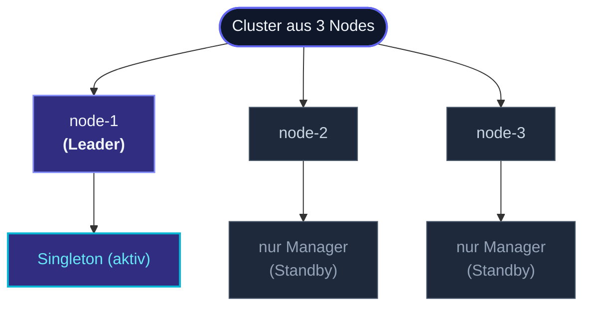

Ein **Cluster-Singleton** ist ein Actor, der *genau einmal* im
gesamten Cluster existiert. Er läuft auf dem Leader-Node; wenn
dieser Node geht, spawnt der nächst-gewählte Leader ihn neu.
Aufrufer auf jedem Node schicken Nachrichten über einen
**Proxy**, der dorthin routet, wo der Singleton aktuell lebt.



Drei Actors pro Node lassen das funktionieren:

- **ClusterSingletonManager** — auf jedem Node. Beobachtet
  Cluster-Events; spawnt den Singleton, wenn dieser Node Leader
  wird, und stoppt ihn, wenn er aufhört, Leader zu sein.
- **ClusterSingletonProxy** — auf jedem Node, der mit dem Singleton
  *spricht*. Hält einen Forwarding-Ref, der immer auf den Manager
  des aktuellen Leaders zeigt.
- **Der Singleton-Actor selbst** — der Actor des Nutzers, immer nur
  auf dem Leader instanziiert.

## Wann einen Singleton verwenden

Die klassischen Anwendungsfälle:

- **Ein Koordinator** — ein Job-Scheduler, ein Saga-Orchestrator,
  ein Rate-Limit-Budget-Tracker — der **eine konsistente Sicht**
  für den ganzen Cluster produzieren muss.
- **Ein Owner einer externen Ressource** — der Actor, der eine
  Verbindung zu einem einzelnen externen System hält (ein
  Lizenzserver, eine Legacy-DB mit Einzelverbindungslizenz).
- **Ein Leader-gewählter Service** — deine eigene gewählte Rolle
  für eine clusterweite Verantwortung.

Wenn du `if (!alreadyExists) spawn(...)` schreiben würdest, ist
ein Singleton vermutlich das Richtige.

## Ein minimales Beispiel

```ts
import { Actor, ActorSystem, Cluster, Props } from 'actor-ts';
import { ClusterSingletonManager, ClusterSingletonProxy } from 'actor-ts';

class JobScheduler extends Actor<JobCmd> {
  override onReceive(msg: JobCmd): void { /* ... */ }
}

const system  = ActorSystem.create('my-app');
const cluster = await Cluster.join(system, { host, port, seeds });

// Auf jedem Node: starte den Manager.
system.spawn(
  ClusterSingletonManager.props({
    cluster,
    typeName:        'job-scheduler',
    singletonProps:  Props.create(() => new JobScheduler()),
    role:            'control-plane',   // optional: nur diese Nodes können hosten
  }),
  'singleton-manager-job-scheduler',
);

// Auf jedem Node: ein Proxy, um mit ihm zu reden.
const proxy = system.spawn(
  ClusterSingletonProxy.props({
    cluster,
    typeName: 'job-scheduler',
  }),
  'singleton-proxy-job-scheduler',
);

// Irgendwo in der App — derselbe Aufruf auf jedem Node:
proxy.tell({ kind: 'schedule', jobId: '42' });
```

Der Proxy sieht aus wie ein einzelner `ActorRef`. Hinter den
Kulissen findet er den Manager des aktuellen Leaders über den
bekannten Pfad `/user/singleton-manager-<typeName>` und leitet
Nachrichten dorthin. Bei Leader-Wechseln verschiebt sich das Ziel
des Proxys automatisch innerhalb einer Gossip-Runde.

## Failover

Wenn der Host-Node den Cluster verlässt:

1. **Erkennung**: Cluster-Gossip propagiert `MemberLeft` /
   `MemberRemoved` für den gehenden Node.
2. **Wahl**: der Cluster wählt einen neuen Leader (deterministisch
   basierend auf der Mitglieder-Sortierreihenfolge).
3. **Spawn**: der Manager des neuen Leaders spawnt den Singleton.
4. **Routing-Verschiebung**: Proxies auf jedem Node sehen den
   Leader-Wechsel und aktualisieren ihr Forwarding-Ziel.

In-Flight-Nachrichten während des Übergangs landen in Dead
Letters, es sei denn, du hast Durability konfiguriert — siehe
"State über Failover" weiter unten.

Das Übergangsfenster wird vom Timeout des Failure Detectors
begrenzt (typisch ein paar Sekunden für Unreachable-Erkennung).
Singletons sind kein Low-Latency-Failover-Werkzeug; sie tauschen
etwas Unverfügbarkeit beim Failover gegen die starke Invariante
"genau eine Instanz".

## State über Failover

Die neue Instanz startet mit weißer Weste — so wie ein neu
gestarteter Actor auf einem einzelnen Node. Für State, der
überleben soll:

- **`PersistentActor`** — der Singleton persistiert Events; die
  neue Instanz spielt sie aus dem Journal ab. Die meisten
  Produktions-Singletons nutzen das. Siehe
  [PersistentActor](/de/persistence/persistent-actor/).
- **`DurableState`** — einfacher: snapshotte den aktuellen State;
  restore beim Neustart. Siehe [DurableState](/de/persistence/durable-state/).
- **`DistributedData`** — für State, der *vor* dem Neustart des
  Singletons lesbar sein soll. Die meisten Singletons brauchen das
  nicht; ihr State ist privat zum Singleton.

Ohne eine dieser Lösungen ist jedes Failover ein Frischstart. Für
einen kurzlebigen Koordinator, der nur eingehende Arbeit routet,
ist das oft in Ordnung; für stateful Workflows persistiere.

## Split-Brain und die optionale Lease

Wenn der Cluster partitioniert wird, könnten zwei Hälften jeweils
einen eigenen Leader wählen — und beide würden den Singleton
spawnen. Genau der Fall, gegen den Singletons existieren.

Drei Verteidigungen, in der Reihenfolge der Komplexität:

1. **Eine Downing-Strategie**, die während einer Partition eine
   Gewinnerseite wählt (Standardoption, keine Lease nötig). Die
   Verliererseite fährt sich selbst herunter; nur eine Hälfte
   bleibt aktiv. Siehe
   [Downing-Strategien](/de/cluster/downing-strategies/).
2. **Eine Lease**, die an den Manager übergeben wird:
   ```ts
   ClusterSingletonManager.props({
     cluster,
     typeName: '...',
     singletonProps: ...,
     lease: someLeaseImpl,   // z. B. K8s-Lease oder In-Memory für Tests
   });
   ```
   Der Manager muss die Lease erfolgreich erwerben, bevor er den
   Singleton spawnen darf. Nur eine Seite einer Partition kann die
   Lease halten, sodass selbst bei zwei Leadern nur ein Singleton
   existiert. Siehe
   [Singleton mit Lease](/de/cluster/singleton/with-lease/).

Die Kombination aus "Downing-Strategie + Lease" ist paranoid-sicher;
jeder allein reicht meist.

## Kosten

Ein Singleton hat Overhead jenseits eines normalen Actors:

- **Jeder Node fährt einen Manager** — sie sind leichtgewichtig
  (eine Zustandsmaschine, die Cluster-Events beobachtet), aber sie
  existieren auf jedem Node.
- **Jeder Node, der den Singleton aufruft, fährt einen Proxy** —
  ebenfalls leichtgewichtig, aber pro `tell` ein zusätzlicher Hop.
- **Leader-Wechsel ist die Kosten des Failovers** — ein Singleton
  ist die paar Sekunden lang unverfügbar, die der Cluster für die
  Konvergenz auf einen neuen Leader braucht.

Wenn Exaktheit nicht erforderlich ist (dir würden N Replicas
genügen), nutze einen [Cluster-Router](/de/cluster/cluster-router/)
oder [Sharding](/de/cluster/sharding/overview/) — beide skalieren
horizontal ohne Leader-Flaschenhals.

## Wann NICHT verwenden

import { Aside } from '@astrojs/starlight/components';

<Aside type="caution" title="Hochdurchsatz-Workloads">
  Ein Singleton ist ein **Skalar** — der gesamte Traffic
  trichtert durch einen Actor. Der Durchsatz ist auf den
  Durchsatz eines Actors begrenzt, egal wie viele Nodes im
  Cluster sind. Für hohen Durchsatz shardiere die Arbeit nach
  irgendeinem Key; jedes Shard skaliert unabhängig.
</Aside>

<Aside type="caution" title="Per-Key-State, der skaliert">
  ```ts
  // ✗ falsche Form — nutzt eine Map innerhalb eines Singletons
  class SessionRegistry extends Actor<...> {
    private sessions = new Map<string, SessionState>();
  }
  ```
  Wenn du Per-Key-State verfolgst und der Key-Raum groß ist, ist
  das ein Sharding-Problem. Nutze stattdessen
  [ClusterSharding](/de/cluster/sharding/overview/) — ein Actor
  *pro Key*, verteilt über Nodes.
</Aside>

<Aside type="caution" title="Kein spezifischer Bedarf an Exactly-One-Semantik">
  Singletons existieren, weil manche Invarianten eine einzige
  Quelle der Wahrheit brauchen. Wenn dein Grund für einen
  Singleton "ich konnte damit leichter mit N=1 denken" ist, prüfe,
  ob die Kosten (Single-Point-Flaschenhals, Failover-Lücke) das
  wert sind. Oft ist ein Router-Pool + ein bisschen Koordination
  besser.
</Aside>

## Wohin als Nächstes

- **[ClusterSingletonManager](/de/cluster/singleton/manager/)** —
  der Per-Node-Manager, der den Singleton wählt + spawnt.
- **[Singleton mit Lease](/de/cluster/singleton/with-lease/)** —
  Split-Brain-Schutz über eine Koordinations-Lease.
- **[Coordination](/de/coordination/overview/)** — die
  Lease-Abstraktion selbst.
- **[Sharding-Überblick](/de/cluster/sharding/overview/)** —
  für das Per-Key-Actor-Muster.
- **[Cluster-Überblick](/de/cluster/overview/)** — die
  Mitgliedschafts- und Leader-Wahl-Maschinerie darunter.

Die [`ClusterSingletonManager`](/api/classes/clustersingletonmanager/)-
und [`ClusterSingletonProxy`](/api/classes/clustersingletonproxy/)-
API-Referenzen decken die vollständige Konfigurationsoberfläche
ab.
